## Whisper-studio-java-to-python-tech-spec, generated by Blitzy.

# Technical Specification

# 1. Introduction

## 1.1 Executive Summary

### 1.1.1 Project Overview

This Technical Specification documents the **Whisper ONNX Java Inference Engine**, a Java-based speech-to-text transcription system that leverages OpenAI's Whisper models through ONNX Runtime inference — without relying on HuggingFace pipeline wrappers. The project delivers both a command-line interface (CLI) for batch transcription and benchmarking, and a desktop graphical user interface branded as **Whisper Studio** for interactive transcription workflows.

The system is published under the Maven coordinates `com.whisper:whisper-onnx-cli:0.1.0`, targets **Java 11+**, and is built with **Maven 3.8+**. It comprises approximately **3,626 lines** of Java source across seven files, with the monolithic `WhisperInferWithoutPipeline.java` (3,054 lines) serving as the primary entry point housing 20 inner classes that collectively implement the full inference pipeline, GUI, and supporting infrastructure.

This document serves as the **definitive technical reference** for a planned **Java-to-Python migration** — converting the entire Java codebase back to Python to achieve ecosystem alignment, reduced complexity, and improved maintainability.

### 1.1.2 Core Business Problem

The Whisper ONNX Inference Engine was originally ported **from a Python script** (`whisper_infer_without_pipeline.py`) to Java, as documented in `plan.md`. Over time, the Java implementation evolved significantly beyond the original Python baseline, adding a full desktop GUI (Whisper Studio), cross-platform audio playback with OS-specific fallback chains, HuggingFace model download/conversion tooling, and rich benchmarking capabilities. However, maintaining this feature-rich system in Java introduces friction in several areas:

| Challenge | Description |
|---|---|
| **Ecosystem Mismatch** | The ML/AI ecosystem is Python-native; ONNX Runtime, audio processing, and model tooling are first-class citizens in Python |
| **Monolithic Architecture** | The 3,054-line monolith with 20 inner classes resists modular maintenance and extension |
| **Dependency Overhead** | Java requires external SPI libraries (mp3spi, jflac-codec, tritonus-share) for audio codecs that Python handles natively via `soundfile` or `librosa` |
| **No Test Suite** | As noted in `AGENTS.md`: *"There is no test suite checked into this repository yet"*, making regression verification during migration challenging |

### 1.1.3 Key Stakeholders and Users

| Stakeholder | Role | Primary Interest |
|---|---|---|
| **Development Team** | Migration engineers | Accurate technical specification for faithful Java-to-Python conversion |
| **End Users (CLI)** | Data engineers, ML practitioners | Batch transcription, benchmark generation, automation |
| **End Users (GUI)** | Non-technical users, transcriptionists | Interactive transcription via Whisper Studio desktop application |
| **DevOps / Infrastructure** | Build and deployment teams | Simplified build pipeline, dependency management, deployment |

### 1.1.4 Expected Business Impact and Value Proposition

The Java-to-Python conversion is expected to yield the following measurable benefits:

- **Reduced Complexity**: Decompose the monolithic `WhisperInferWithoutPipeline.java` into well-structured Python modules with clear separation of concerns.
- **Ecosystem Alignment**: Leverage Python-native libraries (`onnxruntime`, `numpy`, `soundfile`, `argparse`, `json`) that are simpler, more widely supported, and better documented than their Java counterparts.
- **Accelerated Development**: Python's dynamic typing, REPL-driven development, and rich ML tooling ecosystem enable faster iteration and feature development.
- **Broader Contributor Access**: Python's lower barrier to entry in the ML community expands the potential contributor pool.
- **Foundation for Testing**: Establish a proper test suite during migration — something that does not exist in the current Java codebase.

---

## 1.2 System Overview

### 1.2.1 Project Context

#### Business Context and Migration History

The project has a unique bidirectional migration history. The original implementation was a Python script (`whisper_infer_without_pipeline.py`) that performed Whisper ONNX inference without HuggingFace pipeline abstractions. As documented in `plan.md`, a five-phase **Python-to-Java conversion** was executed:

| Phase | Scope |
|---|---|
| **Phase 1** | Baseline parity — CLI flags, output formats, timing metrics |
| **Phase 2** | Java architecture — ONNX sessions, audio loading, feature extraction, tokenizer |
| **Phase 3** | Core inference pipeline — encoder/decoder loop, prompt tokens, timing |
| **Phase 4** | Outputs and validation — CSV/JSON, transcripts, comparison against Python |
| **Phase 5** | Follow-up improvements — decoder-with-past, timestamps, codecs |

The Java version significantly exceeded the original Python scope by adding the Whisper Studio GUI, cross-platform audio playback (`AudioPlaybackController.java`), and HuggingFace model management tooling (`ModelTooling.java`). The original Python script remains available and is invoked via `run.sh` using the `uv` package runner, providing a known reference baseline for validation.

#### Current System Limitations

The following limitations in the Java implementation motivate the reverse migration:

- **Monolithic Design**: Nearly all logic resides in a single 3,054-line file (`WhisperInferWithoutPipeline.java`) with 20 inner classes, making the codebase difficult to navigate, test, and maintain.
- **Default Package Usage**: As stated in `README.md`: *"This project currently uses the default package (src/main/java without package declarations)"*, meaning no Java `package` statements exist — a significant deviation from Java best practices that complicates modularization.
- **No Automated Tests**: Per `AGENTS.md`, there is no test suite, leaving functional correctness unverifiable during changes.
- **Heavy Audio Codec Dependencies**: Three separate libraries (`mp3spi`, `tritonus-share`, `jflac-codec`) are required for basic audio format support that Python handles with single-library solutions.

### 1.2.2 High-Level Description

#### Primary System Capabilities

The Whisper ONNX Inference Engine provides the following core capabilities:

1. **Batch Audio Transcription**: Processes directories of audio files (WAV, FLAC, MP3) through the Whisper ONNX inference pipeline to produce text transcriptions.
2. **Benchmark Artifact Generation**: Produces detailed performance metrics in CSV, JSON, and summary JSON formats including statistical blocks (min, median, p90, p95, max, mean) for latency, real-time factor (RTF), and timing breakdowns.
3. **Interactive Desktop GUI (Whisper Studio)**: A Swing-based application with configuration panels, live transcript updates, audio playback, and model management.
4. **Model Tooling Integration**: Downloads models from HuggingFace and converts them to ONNX format via external CLI tools (`huggingface-cli`, `optimum-cli`).
5. **Longform Transcription**: Handles audio longer than 30 seconds via timestamp-based segmented chunking with 480,000-sample windows.

#### Major System Components

```mermaid
flowchart TD
    subgraph EntryPoints["Entry Points"]
        CLI["CLI Mode<br/>(run_java.sh)"]
        GUI["GUI Mode<br/>(Whisper Studio)"]
    end

    subgraph CorePipeline["Core Inference Pipeline"]
        ArgParse["Args Parsing<br/>(Commons CLI)"]
        ConfigLoad["Config Loading<br/>(discovery_best.json)"]
        AudioLoad["Audio Loading<br/>(AudioData)"]
        FeatureExt["Feature Extraction<br/>(WhisperFeatureExtractor)"]
        Inference["ONNX Inference<br/>(WhisperOnnxModel)"]
        TokenDecode["Token Decoding<br/>(Tokenizer)"]
    end

    subgraph SupportServices["Support Services"]
        Playback["Audio Playback<br/>(AudioPlaybackController)"]
        ModelTool["Model Tooling<br/>(ModelTooling)"]
        ResultsOut["Results I/O<br/>(ResultsIO)"]
    end

    subgraph ExternalDeps["External Dependencies"]
        ONNXRT["ONNX Runtime 1.20.0"]
        HFHub["HuggingFace Hub CLI"]
        OptimumCLI["Optimum CLI"]
    end

    CLI --> ArgParse
    GUI --> ArgParse
    ArgParse --> ConfigLoad
    ConfigLoad --> AudioLoad
    AudioLoad --> FeatureExt
    FeatureExt --> Inference
    Inference --> TokenDecode
    TokenDecode --> ResultsOut
    GUI --> Playback
    GUI --> ModelTool
    Inference --> ONNXRT
    ModelTool --> HFHub
    ModelTool --> OptimumCLI
end
```

The system is organized into seven Java source files under `src/main/java/`:

| Component | File | Lines | Responsibility |
|---|---|---|---|
| **Main Application** | `WhisperInferWithoutPipeline.java` | 3,054 | Entry point, CLI/GUI, full inference pipeline, 20 inner classes |
| **Audio Playback** | `AudioPlaybackController.java` | 253 | Cross-platform playback with OS-specific fallbacks |
| **Model Tooling** | `ModelTooling.java` | 155 | HuggingFace download and ONNX conversion orchestration |
| **Results I/O** | `ResultsIO.java` | 92 | CSV and JSON read/write utilities |
| **Gradient Panel** | `GradientPanel.java` | 31 | Swing gradient background component |
| **GUI Help** | `GuiHelp.java` | 26 | Centralized help text content |
| **Result Row** | `ResultRow.java` | 15 | Immutable data transfer object for per-file results |

#### Core Technical Approach

The inference pipeline operates without HuggingFace pipeline abstractions by directly managing ONNX Runtime sessions for the Whisper encoder and decoder models. The core technical flow is:

1. **Audio Preprocessing**: Load audio via Java Sound API (with SPI providers for MP3/FLAC), convert to mono PCM, and resample to 16 kHz using linear interpolation (`Resampler` class).
2. **Feature Extraction**: Compute 80-bin log-Mel spectrograms using FFT with a Hann window (`N_FFT=400`, `HOP_LENGTH=160`, `WIN_LENGTH=400`, `N_MELS=80`), producing 3,000 frames per 30-second chunk.
3. **Greedy Decoding**: Feed spectrograms through the ONNX encoder, then execute an autoregressive greedy decoder loop with language/task prompt tokens and optional decoder-with-past acceleration.
4. **Token-to-Text Conversion**: Map output token IDs to text using vocabulary files (`tokenizer.json` / `vocab.json`) with special token filtering and Unicode byte decoding (`ByteEncoder`).

### 1.2.3 Success Criteria

The following criteria define a successful Java-to-Python migration:

| Category | Criterion | Measurement |
|---|---|---|
| **Functional Parity** | All CLI features produce identical outputs | Byte-level comparison of CSV, JSON, and transcript outputs against Java baseline |
| **Transcription Accuracy** | Identical decoded text for same audio inputs | Diff comparison against Java transcription results |
| **Performance Baseline** | Python RTF within 1.5× of Java RTF | Benchmark summary JSON comparison (latency, RTF, p90, p95) |
| **Code Quality** | Modular Python architecture | No single file exceeds 500 lines; all modules have docstrings |
| **Test Coverage** | Comprehensive test suite established | Unit tests for all pipeline stages; integration tests for end-to-end flow |
| **GUI Equivalence** | Interactive transcription available | Functional Python GUI with equivalent capabilities to Whisper Studio |

---

## 1.3 Scope

### 1.3.1 In-Scope

#### Core Features and Functionalities

The following capabilities constitute the **must-have** deliverables for the Python conversion:

**Must-Have Capabilities**

| ID | Capability | Source Reference |
|---|---|---|
| F-01 | CLI batch transcription with 18 argument options | `WhisperInferWithoutPipeline.java`, `Args` inner class (line 1492) |
| F-02 | ONNX Runtime encoder/decoder inference (greedy decoding) | `WhisperOnnxModel` inner class (line 1987) |
| F-03 | Audio loading for WAV, FLAC, MP3 with 16 kHz mono resampling | `AudioData` inner class (line 1712) |
| F-04 | 80-bin log-Mel spectrogram feature extraction | `WhisperFeatureExtractor` inner class (line 1794) |
| F-05 | Tokenizer with vocab loading, encoding, decoding, prompt building | `Tokenizer` inner class (line 2547) |
| F-06 | Longform transcription via 30-second segmented chunking | `generateSegmentedLongform()` method |
| F-07 | Decoder-with-past model support for optimized generation | `WhisperOnnxModel` (optional `decoder_with_past_model.onnx`) |
| F-08 | Benchmark artifact generation (CSV + JSON + summary JSON) | `ResultsIO.java` |
| F-09 | Statistical metrics (min, median, p90, p95, max, mean) | `StatBlock` inner class (line 3000) |
| F-10 | ONNX session configuration via `discovery_best.json` | `Config` inner class (line 1591) |
| F-11 | Desktop GUI (Whisper Studio equivalent) | `WhisperInferWithoutPipeline.java`, lines 274–400+ |
| F-12 | Cross-platform audio playback with fallback chains | `AudioPlaybackController.java` |
| F-13 | HuggingFace model download integration | `ModelTooling.java` |
| F-14 | ONNX model conversion via `optimum-cli` | `ModelTooling.java` |

**Primary User Workflows**

1. **CLI Batch Transcription**: User provides audio directory and ONNX model directory → system processes all audio files → produces transcriptions and benchmark artifacts.
2. **GUI Interactive Transcription**: User launches Whisper Studio → configures directories and ONNX runtime settings → runs transcription → reviews live results → plays back audio → exports transcripts.
3. **Model Acquisition**: User triggers model download from HuggingFace → system converts to ONNX format → model is ready for inference.

**Essential Integrations**

| Integration Point | Java Implementation | Python Target |
|---|---|---|
| ONNX Runtime | `com.microsoft.onnxruntime` v1.20.0 | `onnxruntime` Python package |
| JSON Serialization | Jackson Databind 2.17.0 | Python `json` standard library |
| CLI Argument Parsing | Commons CLI 1.6.0 | Python `argparse` standard library |
| Audio Decoding (MP3) | `mp3spi` 1.9.5.4 + `tritonus-share` 0.3.7.4 | `soundfile` or `pydub` |
| Audio Decoding (FLAC) | `jflac-codec` 1.5.2 | `soundfile` (native FLAC support) |
| FFT Computation | Custom Java implementation | `numpy.fft` |
| Desktop GUI | Java Swing (`javax.swing.*`) | `tkinter`, PyQt, or Streamlit (to be determined) |
| Audio Playback | Java Sound API + OS fallbacks | `sounddevice`, `pygame`, or OS fallbacks |

#### Implementation Boundaries

| Boundary | Coverage |
|---|---|
| **System Boundaries** | Standalone desktop application (CLI + GUI); no server/cloud components |
| **User Groups** | All current Java application users (CLI power users and GUI end users) |
| **Platform Coverage** | macOS, Windows, Linux/Unix (matching current cross-platform support in `AudioPlaybackController.java`) |
| **Audio Formats** | WAV, FLAC, MP3 (as specified in `README.md`) |
| **Model Compatibility** | OpenAI Whisper ONNX models (encoder + decoder + optional decoder-with-past) |
| **Data Domains** | Audio files, ONNX model artifacts, tokenizer configuration files, benchmark results |

### 1.3.2 Out-of-Scope

The following items are **explicitly excluded** from the current migration effort:

| Exclusion | Rationale |
|---|---|
| **HuggingFace Pipeline Integration** | The system is architecturally designed to operate *without* pipeline wrappers; this is a core design principle, not a limitation |
| **Streaming / Real-Time Transcription** | Not implemented in Java; not targeted for Python migration |
| **GPU / CUDA Acceleration** | Current Java implementation uses CPU-only ONNX Runtime; GPU support deferred to future phase |
| **Web-Based UI** | Whisper Studio is a desktop GUI; web deployment (e.g., Flask, FastAPI, Streamlit server) is a future consideration |
| **Multi-Language Model Training** | The system performs inference only; model training is out of scope |
| **Cloud Deployment / Containerization** | Docker, Kubernetes, or cloud service packaging is deferred |
| **Backward Compatibility with Java Version** | The Python version is a replacement, not a parallel deployment; Java API compatibility is not maintained |
| **Advanced Decoding Strategies** | Beam search, temperature sampling, and other non-greedy decoding methods are not in the Java codebase and will not be added |

#### Future Phase Considerations

The following items are candidates for post-migration enhancement:

- **GPU Inference**: ONNX Runtime CUDA/TensorRT execution provider support in Python.
- **Web Interface**: Streamlit or Gradio-based web UI as an alternative to the desktop GUI.
- **Async/Streaming Pipeline**: Real-time transcription using chunked audio streams.
- **Comprehensive Test Suite**: Unit, integration, and end-to-end tests (to be initiated during migration as a first-class deliverable).
- **Package Distribution**: PyPI packaging with `setup.py` / `pyproject.toml` for easy installation.
- **Whisper Model Variants**: Support for `whisper-tiny`, `whisper-small`, `whisper-medium`, and `whisper-large` beyond the current default `whisper-base`.

---

## 1.4 Document Conventions

### 1.4.1 Terminology

| Term | Definition |
|---|---|
| **ONNX** | Open Neural Network Exchange — an open format for representing machine learning models |
| **RTF** | Real-Time Factor — ratio of processing time to audio duration (lower is faster) |
| **Decoder-with-past** | An optimized ONNX decoder model that caches key/value attention states for faster autoregressive generation |
| **Log-Mel Spectrogram** | A time-frequency representation of audio computed via FFT with Mel-scale frequency binning |
| **Greedy Decoding** | Token generation strategy that selects the highest-probability token at each step |
| **SPI** | Service Provider Interface — Java's plugin mechanism used for audio codec extensions |

### 1.4.2 References

- `README.md` — Project overview, requirements, feature descriptions, CLI argument documentation
- `pom.xml` — Maven configuration, dependency declarations (lines 34–65), build settings
- `plan.md` — Original Python-to-Java conversion plan (5 phases)
- `AGENTS.md` — Repository guidelines, coding standards, project structure constraints
- `discovery_best.json` — ONNX Runtime session configuration (best-performing settings)
- `run.sh` — Original Python script invocation via `uv` runner
- `run_java.sh` — Java dual-mode launcher (CLI/GUI), Maven build orchestration
- `run_gui.sh` — GUI-mode launcher wrapper
- `src/main/java/WhisperInferWithoutPipeline.java` — Main application entry point (3,054 lines, 20 inner classes)
- `src/main/java/AudioPlaybackController.java` — Cross-platform audio playback engine (253 lines)
- `src/main/java/ModelTooling.java` — HuggingFace download and ONNX conversion orchestration (155 lines)
- `src/main/java/ResultsIO.java` — CSV and JSON I/O utilities (92 lines)
- `src/main/java/ResultRow.java` — Immutable per-file result data transfer object (15 lines)
- `src/main/java/GradientPanel.java` — Swing gradient panel component (31 lines)
- `src/main/java/GuiHelp.java` — Centralized GUI help text (26 lines)

# 2. Product Requirements

This section defines the complete set of product requirements for the Whisper ONNX Inference Engine and its planned Java-to-Python migration. Every feature, functional requirement, and implementation consideration documented here is grounded in the existing Java codebase and aligned with the migration objectives established in Section 1.

---

## 2.1 Feature Catalog

### 2.1.1 Feature Summary Matrix

The following table provides a consolidated view of all fourteen features identified in the system. Each feature has been assigned a unique identifier, category, priority level, and dual status reflecting both the current Java implementation state and the planned Python migration state.

| Feature ID | Feature Name | Category |
|---|---|---|
| F-001 | CLI Batch Transcription | User Interface |
| F-002 | ONNX Runtime Encoder/Decoder Inference | Core Pipeline |
| F-003 | Audio Loading & Preprocessing | Core Pipeline |
| F-004 | Log-Mel Spectrogram Feature Extraction | Core Pipeline |
| F-005 | Tokenizer | Core Pipeline |
| F-006 | Longform Transcription | Core Pipeline |
| F-007 | Decoder-with-Past Optimization | Core Pipeline |
| F-008 | Benchmark Artifact Generation | Output & Reporting |
| F-009 | Statistical Metrics Computation | Output & Reporting |
| F-010 | ONNX Session Configuration | Configuration |
| F-011 | Desktop GUI (Whisper Studio) | User Interface |
| F-012 | Cross-Platform Audio Playback | Support Tooling |
| F-013 | HuggingFace Model Download | Support Tooling |
| F-014 | ONNX Model Conversion | Support Tooling |

| Feature ID | Priority | Java Status | Python Status |
|---|---|---|---|
| F-001 | Critical | Completed | Proposed |
| F-002 | Critical | Completed | Proposed |
| F-003 | Critical | Completed | Proposed |
| F-004 | Critical | Completed | Proposed |
| F-005 | Critical | Completed | Proposed |
| F-006 | High | Completed | Proposed |
| F-007 | High | Completed | Proposed |
| F-008 | High | Completed | Proposed |
| F-009 | High | Completed | Proposed |
| F-010 | High | Completed | Proposed |
| F-011 | High | Completed | Proposed |
| F-012 | Medium | Completed | Proposed |
| F-013 | Medium | Completed | Proposed |
| F-014 | Medium | Completed | Proposed |

### 2.1.2 Core Inference Pipeline Features

#### Feature F-001: CLI Batch Transcription

| Attribute | Detail |
|---|---|
| **Feature ID** | F-001 |
| **Category** | User Interface |
| **Priority** | Critical |
| **Status** | Completed (Java) / Proposed (Python) |

**Overview:** The CLI provides the primary batch-mode entry point for the system, accepting 18 command-line arguments parsed via Apache Commons CLI 1.6.0. It orchestrates the end-to-end transcription pipeline: enumerating audio files from a directory, running each through the inference pipeline, and producing transcription outputs alongside benchmark artifacts. The CLI is implemented in the `main()` method and `Args` inner class (lines 120–263, 1492–1588) of `WhisperInferWithoutPipeline.java`.

**Business Value:** Enables automated batch transcription workflows for data engineering and ML practitioner use cases, supporting integration with shell scripts and CI/CD pipelines via `run_java.sh`.

**User Benefits:** Non-interactive, scriptable transcription of entire audio directories with configurable parameters for language, task type, token limits, output formats, and comparison-based validation.

**Technical Context (Java):** Arguments are parsed into an `Args` record-like class with defaults: `--audio_dir` (default: `"audio"`), `--model_id` (default: `"openai/whisper-base"`), `--onnx_dir` (default: `"whisper-base-with-past"`), `--language` (default: `"en"`), `--task` (default: `"transcribe"`), `--max_new_tokens` (default: 128), and 12 additional flags. The `--gui` flag switches to GUI mode. The Python migration target replaces Commons CLI 1.6.0 with Python's `argparse` standard library module.

**Dependencies:**

| Dependency Type | Details |
|---|---|
| Prerequisite Features | None (entry point) |
| System Dependencies | Apache Commons CLI 1.6.0 → Python `argparse` |
| External Dependencies | `run_java.sh` shell launcher |
| Integration Requirements | F-003, F-010, F-008 (invokes pipeline) |

---

#### Feature F-002: ONNX Runtime Encoder/Decoder Inference

| Attribute | Detail |
|---|---|
| **Feature ID** | F-002 |
| **Category** | Core Pipeline |
| **Priority** | Critical |
| **Status** | Completed (Java) / Proposed (Python) |

**Overview:** The core inference engine loads and executes Whisper ONNX models through the `WhisperOnnxModel` inner class (lines 1987–2545 of `WhisperInferWithoutPipeline.java`). It loads `encoder_model.onnx`, `decoder_model.onnx`, and an optional `decoder_with_past_model.onnx`, managing separate ONNX Runtime sessions for each.

**Business Value:** Delivers the fundamental speech-to-text capability by executing the Whisper encoder-decoder architecture directly through ONNX Runtime, without any HuggingFace pipeline wrapper dependencies.

**User Benefits:** Produces accurate transcriptions using OpenAI Whisper models with configurable session parameters for performance tuning.

**Technical Context (Java):** The `encode()` method (line 2230) creates a 3D input tensor of shape `[1][N_MELS][frames]` and runs the encoder session. Two greedy decoding strategies are implemented: `generateGreedyNoPast()` (line 2080) uses the full decoder in an autoregressive loop, while `generateGreedyWithPast()` (line 2137) employs KV-cache via past state tensors for accelerated generation. The `DecoderSpec` inner class (line 2348) introspects session inputs/outputs and detects past key-value tensor names. An automatic fallback mechanism (lines 2032–2041) disables decoder-with-past if it fails, reverting to the no-past decoder. The Java `com.microsoft.onnxruntime` v1.20.0 maps directly to the Python `onnxruntime` package, where `InferenceSession` is the main class.

**Dependencies:**

| Dependency Type | Details |
|---|---|
| Prerequisite Features | F-004 (feature input), F-005 (prompt tokens) |
| System Dependencies | ONNX Runtime 1.20.0 → Python `onnxruntime` |
| External Dependencies | ONNX model files on disk |
| Integration Requirements | F-007 (optional acceleration), F-010 (session config) |

---

#### Feature F-003: Audio Loading & Preprocessing

| Attribute | Detail |
|---|---|
| **Feature ID** | F-003 |
| **Category** | Core Pipeline |
| **Priority** | Critical |
| **Status** | Completed (Java) / Proposed (Python) |

**Overview:** Handles loading of audio files in WAV, FLAC, and MP3 formats, converting them to mono 16 kHz PCM float arrays suitable for spectrogram computation. Implemented via the `AudioData` inner class (lines 1712–1771) and `Resampler` class (lines 1774–1791) in `WhisperInferWithoutPipeline.java`.

**Business Value:** Provides universal audio ingestion for the three most common speech audio formats, abstracting codec complexity from the transcription pipeline.

**User Benefits:** Users can supply audio in any supported format without manual preprocessing, with automatic resampling to the required 16 kHz sample rate.

**Technical Context (Java):** The `load16kMono()` method loads audio via Java Sound API (`AudioSystem.getAudioInputStream`), converts to PCM_SIGNED 16-bit format, then decodes to a mono float array via `decodeToMono()` which performs per-frame channel averaging with little-endian 16-bit decoding. The `Resampler.resampleLinear()` applies linear interpolation resampling to 16 kHz. MP3 support requires `mp3spi` 1.9.5.4 + `tritonus-share` 0.3.7.4, and FLAC support requires `jflac-codec` 1.5.2 — all detected at runtime via `Class.forName()` (lines 1130–1145). The `listAudioFiles()` method (line 1298) enumerates `.wav`, `.flac`, `.mp3` files case-insensitively. The Python migration replaces these three SPI libraries with `soundfile` (native WAV/FLAC) and optionally `pydub` for MP3.

**Dependencies:**

| Dependency Type | Details |
|---|---|
| Prerequisite Features | None |
| System Dependencies | Java Sound API, mp3spi, tritonus-share, jflac-codec → Python `soundfile` |
| External Dependencies | Audio files on disk |
| Integration Requirements | F-004 (feeds spectrograms) |

---

#### Feature F-004: Log-Mel Spectrogram Feature Extraction

| Attribute | Detail |
|---|---|
| **Feature ID** | F-004 |
| **Category** | Core Pipeline |
| **Priority** | Critical |
| **Status** | Completed (Java) / Proposed (Python) |

**Overview:** Computes 80-bin log-Mel spectrograms from raw audio, producing the feature representation consumed by the Whisper encoder. Implemented in the `WhisperFeatureExtractor` inner class (lines 1794–1985 of `WhisperInferWithoutPipeline.java`).

**Business Value:** Converts raw audio signals into the precise frequency-domain representation required by the Whisper model, ensuring transcription accuracy through faithful feature reproduction.

**User Benefits:** Transparent to end users; ensures that audio of varying quality and format is consistently transformed into model-compatible features.

**Technical Context (Java):** The extraction pipeline operates with the following constants: `SAMPLE_RATE=16000`, `N_FFT=400`, `HOP_LENGTH=160`, `WIN_LENGTH=400`, `N_MELS=80`, `N_FRAMES=3000` (for 30-second chunks). Processing stages include: `padAudio()` for reflect padding (matching librosa `center=True`) with `N_FFT/2` pad; `hannWindow()` for standard Hann window computation; `powerSpectrum()` using a naive DFT implementation (not FFT); `melFilterBank()` constructing a Slaney-style mel filter bank with 80 bins over 0–8000 Hz; and log-Mel computation via `log10(max(value, 1e-10))` with dynamic range normalization `(v + 4.0) / 4.0`. The `trimOrPadFrames()` method ensures output is exactly `N_FRAMES` (3000) columns. The Python migration replaces the custom naive DFT with `numpy.fft` for both correctness and performance gains.

**Dependencies:**

| Dependency Type | Details |
|---|---|
| Prerequisite Features | F-003 (audio input) |
| System Dependencies | Custom Java DFT → Python `numpy.fft` |
| External Dependencies | None |
| Integration Requirements | F-002 (feeds encoder input) |

---

#### Feature F-005: Tokenizer

| Attribute | Detail |
|---|---|
| **Feature ID** | F-005 |
| **Category** | Core Pipeline |
| **Priority** | Critical |
| **Status** | Completed (Java) / Proposed (Python) |

**Overview:** Manages vocabulary loading, decoder prompt construction, and token-to-text conversion for the Whisper model. Implemented in the `Tokenizer` inner class (lines 2547–2846) and `ByteEncoder` class (lines 2848–2888) of `WhisperInferWithoutPipeline.java`.

**Business Value:** Bridges the gap between model output (token IDs) and human-readable text, implementing the exact tokenization protocol required by OpenAI Whisper models.

**User Benefits:** Produces clean, readable transcription text with proper handling of special tokens, timestamps, and Unicode characters.

**Technical Context (Java):** The tokenizer loads vocabulary from `tokenizer.json` (preferred) with `vocab.json` (fallback) and `added_tokens.json`. Configuration is read from `tokenizer_config.json` (providing `eos_token_id`, `decoder_start_token_id`, `timestamp_begin`, `lang_to_id`, `task_to_id`) and `special_tokens_map.json`. The `buildPrompt()` method constructs decoder prompts as `[decoder_start_token, language_token, task_token, optional notimestamps_token]`. The `decode()` method converts token IDs to text by filtering special and timestamp tokens, using the `ByteEncoder` for GPT-2 style byte-to-Unicode mapping. The `maxTimestampSeconds()` method calculates maximum timestamp using `TIMESTAMP_PRECISION_S = 0.02` with a default `timestampBegin = 50364`. The Python migration can leverage the `json` standard library for vocabulary loading and native string handling for byte decoding.

**Dependencies:**

| Dependency Type | Details |
|---|---|
| Prerequisite Features | None |
| System Dependencies | Jackson Databind 2.17.0 → Python `json` |
| External Dependencies | Tokenizer config files on disk |
| Integration Requirements | F-002 (prompt tokens + decode output) |

---

#### Feature F-006: Longform Transcription

| Attribute | Detail |
|---|---|
| **Feature ID** | F-006 |
| **Category** | Core Pipeline |
| **Priority** | High |
| **Status** | Completed (Java) / Proposed (Python) |

**Overview:** Enables transcription of audio files longer than 30 seconds by segmenting them into 30-second chunks and aggregating results. Implemented via `generateLongformFull()` and `generateSegmentedLongform()` methods (lines 1147–1211 of `WhisperInferWithoutPipeline.java`).

**Business Value:** Removes the 30-second limitation of the base Whisper model, enabling transcription of full-length interviews, meetings, podcasts, and other long audio content.

**User Benefits:** Users can transcribe audio of any length without manual segmentation, with transparent chunking and reassembly.

**Technical Context (Java):** The `generateLongformFull()` method determines whether audio is ≤480,000 samples (30 seconds at 16 kHz) for single-segment processing, otherwise delegating to `generateSegmentedLongform()`. The segmented approach iterates through audio in 30-second chunks, using timestamp-based advancement: each segment advances by `maxTimestampSeconds` from the decoder output. A fallback heuristic uses actual segment duration if the decoded timestamp is ≤0.1s or >30s. Maximum segments are calculated as `(audio.length / CHUNK_SAMPLES) + 2`. Timing metrics (preprocess, modelOnly, decode) are aggregated across segments. Cancellation is supported via the `StopSignal` interface.

**Dependencies:**

| Dependency Type | Details |
|---|---|
| Prerequisite Features | F-002, F-004, F-005 |
| System Dependencies | None beyond pipeline dependencies |
| External Dependencies | None |
| Integration Requirements | F-002 (inference per chunk), F-005 (timestamp extraction) |

---

#### Feature F-007: Decoder-with-Past Optimization

| Attribute | Detail |
|---|---|
| **Feature ID** | F-007 |
| **Category** | Core Pipeline |
| **Priority** | High |
| **Status** | Completed (Java) / Proposed (Python) |

**Overview:** Provides an optimized decoder path that caches key/value attention states across autoregressive decoding steps, reducing redundant computation. Implemented as part of the `WhisperOnnxModel` inner class, specifically the `generateGreedyWithPast()` method (line 2137) and `decoder_with_past_model.onnx` session loading.

**Business Value:** Significantly reduces inference latency for each decoded token by avoiding re-computation of cached attention states, directly improving real-time factor (RTF) performance.

**User Benefits:** Faster transcription with no impact on accuracy, automatically enabled when the model includes a `decoder_with_past_model.onnx` file.

**Technical Context (Java):** The `WhisperOnnxModel` constructor optionally loads `decoder_with_past_model.onnx` alongside the required encoder and decoder models. The `DecoderSpec` class (line 2348) introspects the decoder-with-past session to identify past key-value tensor names, validate input/output types, and determine the correct feed/fetch names. The fallback mechanism (lines 2032–2041) detects failures during decoder-with-past execution and automatically disables this path, reverting to `generateGreedyNoPast()` for the remainder of the session. This ensures robustness when models lack proper past-state support.

**Dependencies:**

| Dependency Type | Details |
|---|---|
| Prerequisite Features | F-002 (extends decoder) |
| System Dependencies | ONNX Runtime 1.20.0 → Python `onnxruntime` |
| External Dependencies | Optional `decoder_with_past_model.onnx` file |
| Integration Requirements | F-010 (session configuration) |

---

### 2.1.3 Output and Reporting Features

#### Feature F-008: Benchmark Artifact Generation

| Attribute | Detail |
|---|---|
| **Feature ID** | F-008 |
| **Category** | Output & Reporting |
| **Priority** | High |
| **Status** | Completed (Java) / Proposed (Python) |

**Overview:** Produces structured benchmark output in three formats: per-file CSV, per-file JSON, and summary JSON. Implemented across `ResultsIO.java` (92 lines) and `ResultRow.java` (15 lines), with summary generation in the `Summary` and `StatBlock` inner classes (lines 2936–3054 of `WhisperInferWithoutPipeline.java`).

**Business Value:** Enables rigorous performance comparison between Java and Python implementations and provides production-grade audit trails for transcription workflows. Byte-level comparison of these artifacts is a primary success criterion for the migration.

**User Benefits:** Comprehensive performance reports for every transcription run, enabling users to identify bottlenecks and validate consistency across environments.

**Technical Context (Java):** `ResultsIO` handles CSV output with the header `"file,duration_s,end_to_end_s,rtf,text"` including proper escaping for quotes, newlines, and commas. JSON output uses Jackson's pretty printer to emit per-file result arrays. Summary JSON includes config metadata, file count, latency statistics, breakdown statistics (load_s, preprocess_s, decode_s, latencyModelOnlyS, latencyEndToEndS), RTF statistics, and model metadata. The `ResultRow` record is an immutable DTO with fields: `file`, `durationS`, `endToEndS`, `rtf`, `text`. Default CLI output paths are `results/benchmarks/inference_per_file.csv`, `results/benchmarks/inference_per_file.json`, and `results/benchmarks/inference_summary.json`. GUI mode uses `.gui.` suffixed filenames.

**Dependencies:**

| Dependency Type | Details |
|---|---|
| Prerequisite Features | F-009 (statistical computation) |
| System Dependencies | Jackson Databind 2.17.0 → Python `json` |
| External Dependencies | Output filesystem paths |
| Integration Requirements | F-001 (CLI output), F-011 (GUI output) |

---

#### Feature F-009: Statistical Metrics Computation

| Attribute | Detail |
|---|---|
| **Feature ID** | F-009 |
| **Category** | Output & Reporting |
| **Priority** | High |
| **Status** | Completed (Java) / Proposed (Python) |

**Overview:** Computes statistical aggregations over per-file timing measurements to produce summary benchmarks. Implemented in the `StatBlock` inner class (lines 3000–3054 of `WhisperInferWithoutPipeline.java`).

**Business Value:** Provides quantitative performance baselines essential for validating the Python migration target of RTF within 1.5× of Java RTF, as defined in the success criteria.

**User Benefits:** Delivers at-a-glance performance summaries with industry-standard percentile metrics.

**Technical Context (Java):** `StatBlock` computes six metrics: min, median, p90, p95, max, and mean. Percentile calculation uses sorted-list interpolation. These metrics are computed for three measurement categories: latency (end-to-end timing), breakdown (preprocessing, model inference, decoding), and RTF (real-time factor). The RTF for each file is computed as `endToEndS / durationS`.

**Dependencies:**

| Dependency Type | Details |
|---|---|
| Prerequisite Features | None |
| System Dependencies | None (pure computation) |
| External Dependencies | None |
| Integration Requirements | F-008 (feeds summary generation) |

---

### 2.1.4 User Interface Features

#### Feature F-011: Desktop GUI (Whisper Studio)

| Attribute | Detail |
|---|---|
| **Feature ID** | F-011 |
| **Category** | User Interface |
| **Priority** | High |
| **Status** | Completed (Java) / Proposed (Python) |

**Overview:** Provides an interactive desktop application branded as "Whisper Studio" for configuring, executing, and reviewing transcription workflows. Implemented in the `launchGui()` method (lines 274–1058 of `WhisperInferWithoutPipeline.java`) with supporting components `GradientPanel.java` (31 lines) and `GuiHelp.java` (26 lines).

**Business Value:** Extends the system's accessibility to non-technical users who require transcription capabilities without command-line proficiency. Critical for the Python migration to demonstrate GUI equivalence as specified in the success criteria.

**User Benefits:** Visual configuration of all transcription parameters, live result updates, integrated audio playback, and one-click model download and conversion — all within a single desktop window.

**Technical Context (Java):** Built with Java Swing (`javax.swing.*`), the GUI comprises: a gradient header panel with "Whisper Studio" title and "JAVA · ONNX" badge; a configuration form with Browse buttons for audio file/directory, ONNX directory, model directory, output directory, config JSON, language, task, max tokens, and HF model ID; a runtime config panel for all seven ONNX session parameters (intra_op, inter_op, execution_mode, graph_opt, cpu_mem_arena, mem_pattern, allow_spinning) with Load/Save Config; a model operations panel with Download Model and Convert to ONNX buttons; a flags panel for disable timestamps, write .txt transcripts, benchmark mode, and transcription-only mode (mutually exclusive); a tabbed output area with Transcript (split pane: file list + detail), Logs, and Summary tabs; action buttons for Run, Stop Run, and Help; transcript actions for Play, Stop, Copy, and Download; and a status bar with progress indicator. Preferred window size is 1080×720. Background transcription and model download use `SwingWorker` with real-time per-file result updates via `ResultSink`. The Python migration target for the GUI framework is to be determined among `tkinter`, PyQt, or Streamlit.

**Dependencies:**

| Dependency Type | Details |
|---|---|
| Prerequisite Features | F-001 (uses `runOnce()` internally) |
| System Dependencies | Java Swing → Python `tkinter`/PyQt/Streamlit (TBD) |
| External Dependencies | None |
| Integration Requirements | F-012 (playback), F-013 (download), F-014 (conversion) |

---

### 2.1.5 Configuration and Tooling Features

#### Feature F-010: ONNX Session Configuration

| Attribute | Detail |
|---|---|
| **Feature ID** | F-010 |
| **Category** | Configuration |
| **Priority** | High |
| **Status** | Completed (Java) / Proposed (Python) |

**Overview:** Manages ONNX Runtime session parameters, loading them from a JSON configuration file or applying sensible defaults. Implemented in the `Config` inner class (lines 1591–1710 of `WhisperInferWithoutPipeline.java`) and the `discovery_best.json` configuration file.

**Business Value:** Enables performance tuning of the ONNX Runtime inference engine without code changes, allowing users to optimize for their specific hardware configuration.

**User Benefits:** Configurable threading, execution mode, graph optimization, and memory management settings that can be loaded, saved, and shared across environments.

**Technical Context (Java):** Seven configurable parameters are exposed: `intra_op` (default: min of CPU count and 16), `inter_op` (default: 1), `execution_mode` (`"SEQUENTIAL"` or `"PARALLEL"`), `graph_opt` (`"ENABLE_ALL"` or `"ENABLE_EXTENDED"`), `cpu_mem_arena` (boolean), `mem_pattern` (boolean), and `allow_spinning` (boolean). Configuration is loaded from the `best` object in `discovery_best.json`, with fallback to suggested defaults. The `toSessionOptions()` method converts these parameters to `OrtSession.SessionOptions` with the corresponding Java API calls. Jackson handles JSON parsing with support for comments and single quotes. In the Python ONNX Runtime API, these map directly to `onnxruntime.SessionOptions` properties: `intra_op_num_threads`, `inter_op_num_threads`, `execution_mode`, `graph_optimization_level`, `enable_cpu_mem_arena`, and `enable_mem_pattern`.

**Dependencies:**

| Dependency Type | Details |
|---|---|
| Prerequisite Features | None |
| System Dependencies | Jackson Databind 2.17.0 → Python `json` |
| External Dependencies | `discovery_best.json` config file |
| Integration Requirements | F-002 (session creation), F-007 (session creation) |

---

#### Feature F-012: Cross-Platform Audio Playback

| Attribute | Detail |
|---|---|
| **Feature ID** | F-012 |
| **Category** | Support Tooling |
| **Priority** | Medium |
| **Status** | Completed (Java) / Proposed (Python) |

**Overview:** Provides audio playback capability within the GUI with cross-platform support and intelligent fallback chains. Implemented in `AudioPlaybackController.java` (253 lines).

**Business Value:** Enables users to listen to audio files alongside their transcriptions for quality review and verification without leaving the application.

**User Benefits:** One-click audio playback with automatic detection of the best available playback mechanism for the user's operating system.

**Technical Context (Java):** The controller implements a two-tier playback strategy. First, it attempts Java Sound API playback using a daemon thread with a 4 KB buffer drain loop, supporting stereo/mono at 44.1/48 kHz with fallback formats. If Java playback fails, it falls back to external process execution with OS-specific commands: macOS uses `afplay` or `ffplay`; Windows uses PowerShell `SoundPlayer`; Linux/other uses `ffplay`, `mpv`, `cvlc`, `paplay`, or `aplay`. The API exposes `play(Path)` returning a `Handle` and `stop(AtomicReference<Handle>)` with atomic stop semantics. An `IllegalStateException` is thrown only if all fallback paths fail. The Python migration targets `sounddevice` or `pygame` with similar OS-level fallback chains.

**Dependencies:**

| Dependency Type | Details |
|---|---|
| Prerequisite Features | None |
| System Dependencies | Java Sound API → Python `sounddevice`/`pygame` |
| External Dependencies | OS audio players (afplay, ffplay, mpv, etc.) |
| Integration Requirements | F-011 (GUI playback buttons) |

---

#### Feature F-013: HuggingFace Model Download

| Attribute | Detail |
|---|---|
| **Feature ID** | F-013 |
| **Category** | Support Tooling |
| **Priority** | Medium |
| **Status** | Completed (Java) / Proposed (Python) |

**Overview:** Automates the download of Whisper models from HuggingFace Hub using a prioritized chain of external CLI tools. Implemented in `ModelTooling.java` (lines 16–56).

**Business Value:** Simplifies model acquisition by abstracting the complexity of HuggingFace Hub interactions behind a single action, reducing setup friction for new users.

**User Benefits:** One-click model download from the GUI or a single CLI invocation, with automatic fallback across multiple tool options.

**Technical Context (Java):** Three download commands are attempted in priority order: (1) `huggingface-cli download <model_id> --local-dir <target>`; (2) `python3 -m huggingface_hub.commands.huggingface_cli download <model_id> --local-dir <target>`; (3) `uvx --from huggingface_hub huggingface-cli download <model_id> --local-dir <target>`. The `runFirstSuccessful()` pattern executes each command sequentially, stopping at the first success. Progress and errors are reported via a `Consumer<String> logSink` callback. The Python migration can invoke these same external CLI commands via `subprocess`, or directly use the `huggingface_hub` Python library API for in-process downloads.

**Dependencies:**

| Dependency Type | Details |
|---|---|
| Prerequisite Features | None |
| System Dependencies | External CLI tools |
| External Dependencies | `huggingface-cli`, `python3`, or `uvx` |
| Integration Requirements | F-011 (GUI button), F-014 (download feeds conversion) |

---

#### Feature F-014: ONNX Model Conversion

| Attribute | Detail |
|---|---|
| **Feature ID** | F-014 |
| **Category** | Support Tooling |
| **Priority** | Medium |
| **Status** | Completed (Java) / Proposed (Python) |

**Overview:** Converts downloaded HuggingFace Whisper models to ONNX format using the Optimum library's export tools. Implemented in `ModelTooling.java` (lines 58–112).

**Business Value:** Completes the model acquisition pipeline by converting transformer checkpoints to the ONNX format required by the inference engine, enabling end-to-end self-service model management.

**User Benefits:** Automated conversion with verification — users do not need to understand ONNX export configurations or task specifications.

**Technical Context (Java):** Three conversion commands are attempted in priority order: (1) `optimum-cli export onnx --model <source> --task automatic-speech-recognition-with-past <outDir>`; (2) `python3 -m optimum.exporters.onnx --model <source> --task automatic-speech-recognition-with-past <outDir>`; (3) `uvx --from optimum[onnxruntime] optimum-cli export onnx ...`. The task is always `automatic-speech-recognition-with-past` to ensure both decoder and decoder-with-past models are exported. Post-conversion verification checks for the existence of `encoder_model.onnx` and `decoder_model.onnx` in the output directory. The Python migration can invoke these same CLI commands via `subprocess` or directly use the `optimum.exporters.onnx` Python module API.

**Dependencies:**

| Dependency Type | Details |
|---|---|
| Prerequisite Features | F-013 (model must be downloaded first) |
| System Dependencies | External CLI tools |
| External Dependencies | `optimum-cli`, `python3`, or `uvx` |
| Integration Requirements | F-011 (GUI button), F-002 (produces model artifacts) |

---

## 2.2 Functional Requirements

### 2.2.1 Core Inference Pipeline Requirements

#### F-002: ONNX Runtime Inference Requirements

| Requirement ID | Description | Priority |
|---|---|---|
| F-002-RQ-001 | Load `encoder_model.onnx` into an ONNX Runtime session and execute encoding on a 3D input tensor of shape `[1][80][frames]` | Must-Have |
| F-002-RQ-002 | Load `decoder_model.onnx` and execute autoregressive greedy decoding loop selecting highest-probability token at each step | Must-Have |
| F-002-RQ-003 | Optionally load `decoder_with_past_model.onnx` and execute accelerated decoding with KV-cache past state tensors | Must-Have |
| F-002-RQ-004 | Automatically fall back to no-past decoder if decoder-with-past execution fails | Must-Have |
| F-002-RQ-005 | Introspect decoder session inputs/outputs via `DecoderSpec` to detect past key-value names and validate tensor types | Should-Have |

| Requirement ID | Acceptance Criteria | Complexity |
|---|---|---|
| F-002-RQ-001 | Encoder produces hidden state tensor matching Java output for identical input within floating-point tolerance | High |
| F-002-RQ-002 | Decoded token sequences are identical to Java for same model and input | High |
| F-002-RQ-003 | KV-cache decoding produces identical tokens to non-cached decoding | High |
| F-002-RQ-004 | System continues transcribing without error when past model is absent or invalid | Medium |
| F-002-RQ-005 | Session introspection correctly identifies all input/output tensor names and types | Medium |

**Technical Specifications:**

| Requirement ID | Input Parameters | Output/Response |
|---|---|---|
| F-002-RQ-001 | Float array `[1][80][frames]` | Encoder hidden states tensor |
| F-002-RQ-002 | Encoder output + prompt token IDs | Array of decoded token IDs |
| F-002-RQ-003 | Encoder output + prompt tokens + past KV tensors | Token IDs + updated KV cache |
| F-002-RQ-004 | N/A (triggered on exception) | Boolean flag disabling past model |
| F-002-RQ-005 | ONNX session metadata | DecoderSpec with input/output maps |

**Validation Rules:**

| Requirement ID | Business Rule | Data Validation |
|---|---|---|
| F-002-RQ-001 | Encoder input must be exactly 80 mel bins | Tensor shape must match `[1][N_MELS][frames]` |
| F-002-RQ-002 | Decoding terminates on EOS token or max_new_tokens limit | Token IDs must be valid vocabulary indices |
| F-002-RQ-003 | Past tensors must match decoder spec dimensions | KV-cache tensor shapes validated per DecoderSpec |
| F-002-RQ-004 | Fallback is permanent for the session | Error logged before fallback activation |
| F-002-RQ-005 | All expected input/output names must be present | Type must be float32 for all tensors |

---

#### F-003: Audio Loading Requirements

| Requirement ID | Description | Priority |
|---|---|---|
| F-003-RQ-001 | Load WAV audio files and convert to mono PCM 16-bit float arrays | Must-Have |
| F-003-RQ-002 | Load FLAC audio files via codec library and convert to mono float arrays | Must-Have |
| F-003-RQ-003 | Load MP3 audio files via codec library and convert to mono float arrays | Must-Have |
| F-003-RQ-004 | Resample all audio to 16 kHz using linear interpolation | Must-Have |
| F-003-RQ-005 | Enumerate audio files from a directory, filtering by supported extensions (case-insensitive) | Must-Have |

| Requirement ID | Acceptance Criteria | Complexity |
|---|---|---|
| F-003-RQ-001 | WAV output float array matches Java output byte-for-byte | Medium |
| F-003-RQ-002 | FLAC output float array matches Java output within tolerance | Medium |
| F-003-RQ-003 | MP3 output float array matches Java output within tolerance | Medium |
| F-003-RQ-004 | Resampled audio at 16 kHz matches Java linear interpolation output | Low |
| F-003-RQ-005 | File enumeration matches Java's `listAudioFiles()` for same directory | Low |

**Validation Rules:**

| Requirement ID | Business Rule | Data Validation |
|---|---|---|
| F-003-RQ-001 | Output must be mono (single channel) | Sample values must be in float range [-1.0, 1.0] |
| F-003-RQ-002 | FLAC codec availability checked at startup | SPI detection reported in runtime diagnostics |
| F-003-RQ-003 | MP3 codec availability checked at startup | SPI detection reported in runtime diagnostics |
| F-003-RQ-004 | Target sample rate is exactly 16,000 Hz | Resampled length = `original_length × 16000 / original_rate` |
| F-003-RQ-005 | Extensions: `.wav`, `.flac`, `.mp3` | Case-insensitive matching |

---

#### F-004: Feature Extraction Requirements

| Requirement ID | Description | Priority |
|---|---|---|
| F-004-RQ-001 | Apply reflect padding to audio with `N_FFT/2` (200 samples) on each side | Must-Have |
| F-004-RQ-002 | Compute power spectrum using Hann window with N_FFT=400, HOP_LENGTH=160, WIN_LENGTH=400 | Must-Have |
| F-004-RQ-003 | Apply 80-bin Slaney-style mel filter bank over frequency range 0–8000 Hz | Must-Have |
| F-004-RQ-004 | Compute log-Mel: `log10(max(value, 1e-10))`, normalize with dynamic range `(v + 4.0) / 4.0` | Must-Have |
| F-004-RQ-005 | Trim or pad output frames to exactly N_FRAMES=3000 columns | Must-Have |

| Requirement ID | Acceptance Criteria | Complexity |
|---|---|---|
| F-004-RQ-001 | Padded audio length matches `original_length + N_FFT` | Low |
| F-004-RQ-002 | Power spectrum values match Java output within 1e-6 tolerance | High |
| F-004-RQ-003 | Mel filter bank weights match Slaney reference implementation | Medium |
| F-004-RQ-004 | Log-Mel values match Java output within 1e-6 tolerance | Medium |
| F-004-RQ-005 | Output shape is exactly `[80][3000]` for 30-second chunks | Low |

---

#### F-005: Tokenizer Requirements

| Requirement ID | Description | Priority |
|---|---|---|
| F-005-RQ-001 | Load vocabulary from `tokenizer.json` (preferred) or `vocab.json` + `added_tokens.json` (fallback) | Must-Have |
| F-005-RQ-002 | Load configuration from `tokenizer_config.json` and `special_tokens_map.json` | Must-Have |
| F-005-RQ-003 | Build decoder prompt as `[decoder_start_token, language_token, task_token, optional notimestamps_token]` | Must-Have |
| F-005-RQ-004 | Decode token IDs to text, filtering special and timestamp tokens, using GPT-2 byte decoding | Must-Have |
| F-005-RQ-005 | Calculate maximum timestamp in seconds using `TIMESTAMP_PRECISION_S = 0.02` and `timestampBegin = 50364` | Must-Have |

| Requirement ID | Acceptance Criteria | Complexity |
|---|---|---|
| F-005-RQ-001 | Vocabulary size and mapping identical to Java tokenizer | Medium |
| F-005-RQ-002 | All config values (eos, start, timestamp_begin, lang_to_id, task_to_id) match Java | Low |
| F-005-RQ-003 | Prompt token sequence identical to Java for same language/task/flag combination | Low |
| F-005-RQ-004 | Decoded text identical to Java for same token ID sequence | Medium |
| F-005-RQ-005 | Timestamp seconds calculation matches Java within floating-point tolerance | Low |

---

#### F-006: Longform Transcription Requirements

| Requirement ID | Description | Priority |
|---|---|---|
| F-006-RQ-001 | Process audio ≤480,000 samples (30s) as single segment | Must-Have |
| F-006-RQ-002 | Segment audio >30s into 30-second chunks with timestamp-based advancement | Must-Have |
| F-006-RQ-003 | Apply fallback advancement (actual segment duration) when timestamp is ≤0.1s or >30s | Must-Have |
| F-006-RQ-004 | Aggregate timing metrics (preprocess, modelOnly, decode) across all segments | Should-Have |
| F-006-RQ-005 | Support cancellation via `StopSignal` interface during segmented processing | Should-Have |

| Requirement ID | Acceptance Criteria | Complexity |
|---|---|---|
| F-006-RQ-001 | Single-segment output identical to Java for ≤30s audio | Medium |
| F-006-RQ-002 | Multi-segment transcription text identical to Java for same audio | High |
| F-006-RQ-003 | Fallback triggers for edge-case timestamps; text remains correct | Medium |
| F-006-RQ-004 | Aggregated timing matches Java within tolerance | Low |
| F-006-RQ-005 | Cancellation halts processing within one segment boundary | Low |

---

### 2.2.2 User Interface Requirements

#### F-001: CLI Batch Transcription Requirements

| Requirement ID | Description | Priority |
|---|---|---|
| F-001-RQ-001 | Parse 18 CLI arguments with defaults matching Java `Args` class exactly | Must-Have |
| F-001-RQ-002 | Enumerate audio files from `--audio_dir`, applying `--limit_files` cap when set | Must-Have |
| F-001-RQ-003 | Execute inference pipeline for each file, collecting per-file `ResultRow` data | Must-Have |
| F-001-RQ-004 | Write output artifacts to `--out_csv`, `--out_json`, `--out_summary_json` paths | Must-Have |
| F-001-RQ-005 | Support `--compare_with` reference JSON comparison and `--force_match` flag | Should-Have |
| F-001-RQ-006 | Support `--debug_tokens` flag printing feature stats and token diagnostics | Should-Have |
| F-001-RQ-007 | Support `--write_txt` flag for per-file transcript text output | Should-Have |
| F-001-RQ-008 | Support `--warmup` iterations before timed inference | Should-Have |

| Requirement ID | Acceptance Criteria | Complexity |
|---|---|---|
| F-001-RQ-001 | All 18 arguments parsed identically to Java; `--help` produces equivalent help text | Medium |
| F-001-RQ-002 | File enumeration order and count match Java for same directory | Low |
| F-001-RQ-003 | Per-file text and timing match Java within tolerance | High |
| F-001-RQ-004 | CSV, JSON, summary JSON byte-level identical to Java output | Medium |
| F-001-RQ-005 | Mismatch count reported identically; forced match behavior identical | Low |
| F-001-RQ-006 | Debug output includes feature min/max/mean, token counts, first 24 token IDs | Low |
| F-001-RQ-007 | `.txt` files written with correct content for each audio file | Low |
| F-001-RQ-008 | Warmup iterations excluded from timed results | Low |

**CLI Argument Specification:**

| Argument | Default | Type |
|---|---|---|
| `--audio_dir` | `"audio"` | String (path) |
| `--model_id` | `"openai/whisper-base"` | String |
| `--onnx_dir` | `"whisper-base-with-past"` | String (path) |
| `--language` | `"en"` | String |
| `--task` | `"transcribe"` | String |
| `--max_new_tokens` | `128` | Integer |
| `--warmup` | `0` | Integer |
| `--limit_files` | `0` (no limit) | Integer |

| Argument | Default | Type |
|---|---|---|
| `--discovery_best_json` | — | String (path) |
| `--out_csv` | `"results/benchmarks/inference_per_file.csv"` | String (path) |
| `--out_json` | `"results/benchmarks/inference_per_file.json"` | String (path) |
| `--out_summary_json` | `"results/benchmarks/inference_summary.json"` | String (path) |
| `--write_txt` | `false` | Boolean flag |
| `--compare_with` | — | String (path) |
| `--force_match` | `false` | Boolean flag |
| `--debug_tokens` | `false` | Boolean flag |
| `--no_timestamps_token` | `false` | Boolean flag |
| `--gui` | `false` | Boolean flag |

---

#### F-011: Desktop GUI Requirements

| Requirement ID | Description | Priority |
|---|---|---|
| F-011-RQ-001 | Render configuration form with fields for all transcription parameters and Browse buttons | Must-Have |
| F-011-RQ-002 | Provide runtime config panel for all 7 ONNX session parameters with Load/Save Config | Must-Have |
| F-011-RQ-003 | Execute transcription in a background thread with real-time per-file result updates | Must-Have |
| F-011-RQ-004 | Display tabbed output with Transcript (split pane), Logs, and Summary views | Must-Have |
| F-011-RQ-005 | Support Stop Run cancellation during active transcription | Must-Have |
| F-011-RQ-006 | Provide Download Model and Convert to ONNX buttons invoking F-013 and F-014 | Should-Have |
| F-011-RQ-007 | Provide Play, Stop, Copy, Download actions for transcript review | Should-Have |
| F-011-RQ-008 | Display status bar with label and progress indicator | Should-Have |
| F-011-RQ-009 | Support mutually exclusive Benchmark mode and Transcription-only mode flags | Should-Have |

| Requirement ID | Acceptance Criteria | Complexity |
|---|---|---|
| F-011-RQ-001 | All configuration fields map to corresponding `Args` class properties | Medium |
| F-011-RQ-002 | Config load/save round-trips without data loss | Medium |
| F-011-RQ-003 | GUI remains responsive during transcription; results appear per-file | High |
| F-011-RQ-004 | All three tabs populated with correct content after run | Medium |
| F-011-RQ-005 | Stop halts within one segment boundary; partial results retained | Medium |
| F-011-RQ-006 | Model download and conversion succeed via GUI buttons | Medium |
| F-011-RQ-007 | Playback starts/stops correctly; text copied to clipboard | Medium |
| F-011-RQ-008 | Progress bar animates during active operations | Low |
| F-011-RQ-009 | Selecting one mode deselects the other | Low |

---

### 2.2.3 Output and Reporting Requirements

#### F-008: Benchmark Artifact Requirements

| Requirement ID | Description | Priority |
|---|---|---|
| F-008-RQ-001 | Write CSV with header `"file,duration_s,end_to_end_s,rtf,text"` and proper field escaping | Must-Have |
| F-008-RQ-002 | Write JSON array of per-file results with pretty printing | Must-Have |
| F-008-RQ-003 | Write summary JSON with config, file count, latency stats, breakdown stats, RTF stats, model metadata | Must-Have |
| F-008-RQ-004 | Support `.gui.` suffixed filenames for GUI mode output | Should-Have |

| Requirement ID | Acceptance Criteria | Complexity |
|---|---|---|
| F-008-RQ-001 | CSV parseable by standard CSV parsers; handles embedded quotes/newlines/commas | Medium |
| F-008-RQ-002 | JSON validates against schema; values match Java output | Medium |
| F-008-RQ-003 | Summary JSON includes all StatBlock metrics for each category | Medium |
| F-008-RQ-004 | GUI output files use correct suffixed names and contain valid data | Low |

**Timing Breakdown Fields:**

| Metric | Description |
|---|---|
| `load_s` | Audio file loading time |
| `preprocess_s` | Feature extraction time |
| `decode_s` | Token decoding time |
| `latencyModelOnlyS` | ONNX model inference time |
| `latencyEndToEndS` | Total pipeline latency |

---

#### F-009: Statistical Metrics Requirements

| Requirement ID | Description | Priority |
|---|---|---|
| F-009-RQ-001 | Compute min, max, and mean over a collection of timing measurements | Must-Have |
| F-009-RQ-002 | Compute median (p50) using sorted-list interpolation | Must-Have |
| F-009-RQ-003 | Compute p90 and p95 percentiles using sorted-list interpolation | Must-Have |

| Requirement ID | Acceptance Criteria | Complexity |
|---|---|---|
| F-009-RQ-001 | Min/max/mean values match Java within floating-point tolerance | Low |
| F-009-RQ-002 | Median matches Java interpolation algorithm output | Low |
| F-009-RQ-003 | p90/p95 match Java interpolation algorithm output | Low |

---

### 2.2.4 Configuration and Tooling Requirements

#### F-010: ONNX Session Configuration Requirements

| Requirement ID | Description | Priority |
|---|---|---|
| F-010-RQ-001 | Load configuration from the `best` object in `discovery_best.json` | Must-Have |
| F-010-RQ-002 | Apply suggested defaults when config file is absent or incomplete | Must-Have |
| F-010-RQ-003 | Convert configuration to ONNX Runtime `SessionOptions` with all 7 parameters | Must-Have |
| F-010-RQ-004 | Support JSON files with comments and single quotes | Should-Have |

| Requirement ID | Acceptance Criteria | Complexity |
|---|---|---|
| F-010-RQ-001 | All 7 parameters correctly parsed from JSON | Low |
| F-010-RQ-002 | Default `intra_op` = min(CPU count, 16); `inter_op` = 1 | Low |
| F-010-RQ-003 | Python `SessionOptions` matches Java session behavior | Medium |
| F-010-RQ-004 | Tolerant JSON parser handles non-standard JSON features | Low |

**Configuration Parameter Mapping (Java → Python):**

| Java Config Key | Python SessionOptions Property |
|---|---|
| `intra_op` | `intra_op_num_threads` |
| `inter_op` | `inter_op_num_threads` |
| `execution_mode` | `execution_mode` |
| `graph_opt` | `graph_optimization_level` |
| `cpu_mem_arena` | `enable_cpu_mem_arena` |
| `mem_pattern` | `enable_mem_pattern` |
| `allow_spinning` | Via `add_session_config_entry()` |

---

#### F-012: Audio Playback Requirements

| Requirement ID | Description | Priority |
|---|---|---|
| F-012-RQ-001 | Attempt playback via primary audio API (Java Sound → Python `sounddevice`/`pygame`) | Must-Have |
| F-012-RQ-002 | Fall back to OS-specific external player commands on primary failure | Must-Have |
| F-012-RQ-003 | Support atomic play/stop semantics with handle-based lifecycle | Must-Have |
| F-012-RQ-004 | Support macOS (`afplay`, `ffplay`), Windows (PowerShell), Linux (`ffplay`, `mpv`, `cvlc`, `paplay`, `aplay`) fallbacks | Should-Have |

| Requirement ID | Acceptance Criteria | Complexity |
|---|---|---|
| F-012-RQ-001 | Audio plays correctly on supported platforms | Medium |
| F-012-RQ-002 | Fallback activates transparently without user intervention | Medium |
| F-012-RQ-003 | Stop immediately halts playback; no orphan processes | Medium |
| F-012-RQ-004 | At least one fallback succeeds on each supported OS | Medium |

---

#### F-013: HuggingFace Model Download Requirements

| Requirement ID | Description | Priority |
|---|---|---|
| F-013-RQ-001 | Attempt download via `huggingface-cli download` command first | Must-Have |
| F-013-RQ-002 | Fall back to `python3 -m huggingface_hub` then `uvx` on failure | Must-Have |
| F-013-RQ-003 | Stream progress/error output to provided log sink callback | Should-Have |

| Requirement ID | Acceptance Criteria | Complexity |
|---|---|---|
| F-013-RQ-001 | Model files downloaded to target directory | Medium |
| F-013-RQ-002 | At least one of three commands succeeds when tool is available | Medium |
| F-013-RQ-003 | Download progress visible in GUI logs tab | Low |

---

#### F-014: ONNX Model Conversion Requirements

| Requirement ID | Description | Priority |
|---|---|---|
| F-014-RQ-001 | Attempt conversion via `optimum-cli export onnx` with task `automatic-speech-recognition-with-past` | Must-Have |
| F-014-RQ-002 | Fall back to `python3 -m optimum.exporters.onnx` then `uvx` on failure | Must-Have |
| F-014-RQ-003 | Verify existence of `encoder_model.onnx` and `decoder_model.onnx` after conversion | Must-Have |

| Requirement ID | Acceptance Criteria | Complexity |
|---|---|---|
| F-014-RQ-001 | ONNX files produced in target directory | Medium |
| F-014-RQ-002 | At least one of three commands succeeds when tool is available | Medium |
| F-014-RQ-003 | Conversion fails with clear error if output files are missing | Low |

---

## 2.3 Feature Relationships

### 2.3.1 Feature Dependency Map

The following diagram illustrates the dependency relationships between all fourteen features, organized by architectural layer. Solid arrows indicate hard dependencies (feature cannot function without the target), while dashed arrows indicate optional or soft dependencies.

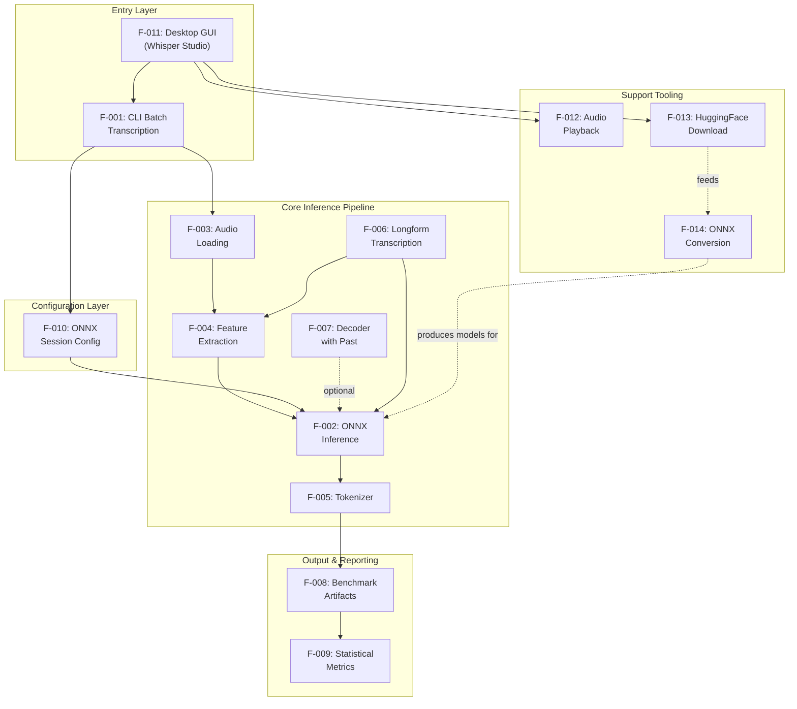

### 2.3.2 Integration Points

The system has clearly defined integration points between features, organized by the data and control flow that connects them.

| Integration Point | Source Feature | Target Feature | Data Exchanged |
|---|---|---|---|
| Audio-to-Features | F-003 | F-004 | Mono 16 kHz float array |
| Features-to-Encoder | F-004 | F-002 | `[80][3000]` mel spectrogram |
| Decoder-to-Text | F-002 | F-005 | Integer token ID array |
| Config-to-Session | F-010 | F-002 | `SessionOptions` object |
| Results-to-Stats | F-008 | F-009 | Timing measurement arrays |
| GUI-to-Pipeline | F-011 | F-001 | Constructed `Args` object |
| GUI-to-Playback | F-011 | F-012 | Audio file `Path` |
| GUI-to-Download | F-011 | F-013 | Model ID + target directory |
| GUI-to-Convert | F-011 | F-014 | Source + output directories |
| Download-to-Convert | F-013 | F-014 | Downloaded model directory |

| Integration Point | Direction | Protocol |
|---|---|---|
| Audio-to-Features | Unidirectional | Method return value |
| Features-to-Encoder | Unidirectional | Method parameter |
| Decoder-to-Text | Unidirectional | Method return value |
| Config-to-Session | Unidirectional | Object passed to constructor |
| Results-to-Stats | Unidirectional | Collection passed to `StatBlock` |
| GUI-to-Pipeline | Unidirectional | `runOnce()` invocation via SwingWorker |
| GUI-to-Playback | Bidirectional | Play → Handle; Stop → Handle reference |
| GUI-to-Download | Unidirectional | Process execution via `ModelTooling` |
| GUI-to-Convert | Unidirectional | Process execution via `ModelTooling` |
| Download-to-Convert | Sequential | Filesystem (model directory on disk) |

### 2.3.3 Shared Components and Common Services

Several components serve multiple features and represent cross-cutting concerns that must be preserved during the Python migration.

| Shared Component | Java Location | Used By | Migration Note |
|---|---|---|---|
| `Config` class | Inner class, line 1591 | F-001, F-002, F-007, F-010, F-011 | Separate Python module |
| `ResultRow` DTO | `ResultRow.java` | F-001, F-008, F-011 | Python dataclass |
| `ResultsIO` utilities | `ResultsIO.java` | F-001, F-008, F-011 | Python I/O module |
| `Args` class | Inner class, line 1492 | F-001, F-011 | Python `argparse` namespace |
| `runOnce()` method | Main class, line 113 | F-001, F-011 | Shared pipeline function |
| `listAudioFiles()` | Main class, line 1298 | F-001, F-011 | Shared utility function |
| `LogSink` interface | Inner class, line 96 | F-001, F-011, F-013, F-014 | Python callback/logging |
| `ResultSink` interface | Inner class, line 100 | F-001, F-011 | Python callback function |
| `StopSignal` interface | Inner class, line 104 | F-006, F-011 | Python threading event |

**Common Services:**

| Service | Purpose | Consumers |
|---|---|---|
| JSON Parsing | Config and results I/O | F-005, F-008, F-010 |
| File Enumeration | Audio file discovery | F-001, F-011 |
| Process Execution | External tool invocation | F-012, F-013, F-014 |
| Timing Collection | Performance measurement | F-002, F-006, F-008 |

---

## 2.4 Implementation Considerations

### 2.4.1 Technical Constraints

The following constraints apply to the Python migration and must be observed across all feature implementations.

| Constraint | Description | Impact |
|---|---|---|
| **Python Version** | Target Python 3.8+ for broad compatibility | Limits use of newer syntax features |
| **CPU-Only Inference** | ONNX Runtime uses CPU execution provider only | GPU/CUDA out of scope for initial migration |
| **Standalone Application** | No server, cloud, or container deployment | Must package as desktop application |
| **No HuggingFace Pipelines** | Core architectural decision to avoid pipeline wrappers | All inference logic must be explicit |
| **Modular Architecture** | No single Python file may exceed 500 lines | Forces decomposition of the 3,054-line Java monolith |
| **Functional Parity** | Outputs must be byte-level identical to Java | Constrains algorithm implementation choices |

#### Java Monolith Decomposition Targets

The 20 inner classes in `WhisperInferWithoutPipeline.java` must be decomposed into separate Python modules during migration. The following table maps the primary inner classes to their proposed Python module boundaries.

| Java Inner Class | Lines | Proposed Python Module |
|---|---|---|
| `Args` | 1492–1588 | `cli.py` (argparse definitions) |
| `Config` | 1591–1710 | `config.py` |
| `AudioData` + `Resampler` | 1712–1791 | `audio.py` |
| `WhisperFeatureExtractor` | 1794–1985 | `features.py` |
| `WhisperOnnxModel` + `DecoderSpec` + `EncoderOutput` | 1987–2545 | `model.py` |
| `Tokenizer` + `ByteEncoder` | 2547–2888 | `tokenizer.py` |
| `Summary` + `StatBlock` | 2936–3054 | `stats.py` |
| Data classes (`SegmentInput`, `SegmentResult`, `Timings`, `TranscriptionResult`) | 2890–2935 | `types.py` |
| GUI (`launchGui`) | 274–1058 | `gui.py` |

### 2.4.2 Performance Requirements

Performance is a primary success criterion for the migration, with the target of Python RTF within 1.5× of Java RTF.

| Performance Area | Java Baseline | Python Target | Measurement |
|---|---|---|---|
| **RTF (Real-Time Factor)** | Baseline value from Java benchmarks | ≤1.5× Java RTF | `endToEndS / durationS` per file |
| **Latency p90** | From Java summary JSON | Within 1.5× Java p90 | 90th percentile of per-file latency |
| **Latency p95** | From Java summary JSON | Within 1.5× Java p95 | 95th percentile of per-file latency |
| **Feature Extraction** | Naive DFT implementation | Expected improvement with `numpy.fft` | Preprocess timing |
| **Encoder Inference** | ONNX Runtime Java API | Expected parity (same C++ backend) | Model-only timing |
| **Decoder Inference** | With/without past KV-cache | Expected parity (same C++ backend) | Model-only timing |

**Critical Performance Parameters:**

| Parameter | Value | Source |
|---|---|---|
| Sample Rate | 16,000 Hz | `WhisperFeatureExtractor` constant |
| Chunk Duration | 30 seconds (480,000 samples) | `generateLongformFull()` threshold |
| Timestamp Precision | 0.02 seconds | `Tokenizer.TIMESTAMP_PRECISION_S` |
| N_FFT | 400 | Feature extraction constant |
| HOP_LENGTH | 160 | Feature extraction constant |
| N_MELS | 80 | Feature extraction constant |
| N_FRAMES | 3000 | Feature extraction constant |
| Playback Buffer | 4,096 bytes | `AudioPlaybackController` constant |

### 2.4.3 Scalability Considerations

| Consideration | Current State | Migration Impact |
|---|---|---|
| **File Volume** | Batch processes directory of files sequentially | Python can maintain sequential processing; optional future parallelism via `concurrent.futures` |
| **Audio Length** | Longform segmentation handles unlimited length | Must preserve segment-based chunking with max segments = `(length / CHUNK_SAMPLES) + 2` |
| **Model Variants** | Default `whisper-base`; extensible to other sizes | Python architecture must support any Whisper model variant without code changes |
| **Thread Configuration** | `intra_op` defaults to min(CPU count, 16) | Python ONNX Runtime threading maps directly; GIL does not affect C++ inference threads |
| **Memory Management** | Java GC handles ONNX tensor lifecycle | Python must explicitly manage tensor allocation via numpy arrays and ONNX Runtime's memory management |

### 2.4.4 Security and Maintenance Implications

**Security Considerations:**

| Area | Concern | Mitigation |
|---|---|---|
| **External Process Execution** | F-012, F-013, F-014 invoke external commands | Validate all command arguments; no shell injection vectors (commands are hardcoded, only paths are user-supplied) |
| **File System Access** | Audio input, model loading, result output | Validate paths; no arbitrary file access beyond configured directories |
| **Model Integrity** | Downloaded models from HuggingFace | Rely on HuggingFace Hub's integrity verification |
| **JSON Parsing** | Config files with comments/single quotes | Use safe parsing; no `eval()` on config content |

**Maintenance Requirements:**

| Area | Requirement | Rationale |
|---|---|---|
| **Test Suite** | Comprehensive unit and integration tests | No tests exist in Java codebase; must be established during migration |
| **Documentation** | Docstrings for all public functions and classes | Success criterion: all modules have docstrings |
| **Module Size** | No single file exceeds 500 lines | Enforces maintainability over time |
| **Dependency Pinning** | Pin all Python dependency versions | Ensures reproducible builds across environments |

---

## 2.5 Traceability Matrix

The following matrix maps features to their source files, functional requirements, migration targets, and validation methods, providing end-to-end traceability for the Java-to-Python conversion.

| Feature ID | Java Source File | Requirements |
|---|---|---|
| F-001 | `WhisperInferWithoutPipeline.java` (lines 120–263, 1492–1588) | F-001-RQ-001 through F-001-RQ-008 |
| F-002 | `WhisperInferWithoutPipeline.java` (lines 1987–2545) | F-002-RQ-001 through F-002-RQ-005 |
| F-003 | `WhisperInferWithoutPipeline.java` (lines 1712–1791) | F-003-RQ-001 through F-003-RQ-005 |
| F-004 | `WhisperInferWithoutPipeline.java` (lines 1794–1985) | F-004-RQ-001 through F-004-RQ-005 |
| F-005 | `WhisperInferWithoutPipeline.java` (lines 2547–2888) | F-005-RQ-001 through F-005-RQ-005 |
| F-006 | `WhisperInferWithoutPipeline.java` (lines 1147–1211) | F-006-RQ-001 through F-006-RQ-005 |
| F-007 | `WhisperInferWithoutPipeline.java` (lines 2032–2041, 2137+) | F-002-RQ-003, F-002-RQ-004 |
| F-008 | `ResultsIO.java`, `ResultRow.java` | F-008-RQ-001 through F-008-RQ-004 |
| F-009 | `WhisperInferWithoutPipeline.java` (lines 2936–3054) | F-009-RQ-001 through F-009-RQ-003 |
| F-010 | `WhisperInferWithoutPipeline.java` (lines 1591–1710) | F-010-RQ-001 through F-010-RQ-004 |
| F-011 | `WhisperInferWithoutPipeline.java` (lines 274–1058), `GradientPanel.java`, `GuiHelp.java` | F-011-RQ-001 through F-011-RQ-009 |
| F-012 | `AudioPlaybackController.java` | F-012-RQ-001 through F-012-RQ-004 |
| F-013 | `ModelTooling.java` (lines 16–56) | F-013-RQ-001 through F-013-RQ-003 |
| F-014 | `ModelTooling.java` (lines 58–112) | F-014-RQ-001 through F-014-RQ-003 |

| Feature ID | Python Target Module | Validation Method |
|---|---|---|
| F-001 | `cli.py` | Byte-level comparison of CLI outputs |
| F-002 | `model.py` | Token sequence comparison vs. Java |
| F-003 | `audio.py` | Float array comparison vs. Java |
| F-004 | `features.py` | Spectrogram value comparison within tolerance |
| F-005 | `tokenizer.py` | Text output comparison vs. Java |
| F-006 | `model.py` / `pipeline.py` | Full transcript comparison for long audio |
| F-007 | `model.py` | Covered by F-002 validation |
| F-008 | `results.py` | Byte-level comparison of CSV/JSON outputs |
| F-009 | `stats.py` | Statistical value comparison within tolerance |
| F-010 | `config.py` | Session behavior comparison |
| F-011 | `gui.py` | Manual functional testing + screenshot comparison |
| F-012 | `playback.py` | Manual playback testing per platform |
| F-013 | `model_tooling.py` | Model download verification |
| F-014 | `model_tooling.py` | ONNX file existence verification |

---

## 2.6 Assumptions and Constraints

### 2.6.1 Assumptions

| ID | Assumption | Rationale |
|---|---|---|
| A-001 | The Java codebase at current state represents the complete feature set for migration | All 14 features are documented from source code analysis |
| A-002 | Python `onnxruntime` produces identical inference results to Java `com.microsoft.onnxruntime` for same models and inputs | Both wrap the same C++ ONNX Runtime core |
| A-003 | `numpy.fft` will produce numerically equivalent results to the custom Java DFT implementation | Both implement the same mathematical operation; numpy may have higher precision |
| A-004 | External tool commands (`huggingface-cli`, `optimum-cli`) behave identically when invoked from Python `subprocess` vs. Java `ProcessBuilder` | Both execute the same system commands |
| A-005 | The original Python script (`whisper_infer_without_pipeline.py`) serves as a reference baseline available via `run.sh` | Documented in `plan.md` and Section 1.2.1 |

### 2.6.2 Constraints

| ID | Constraint | Source |
|---|---|---|
| C-001 | No single Python file may exceed 500 lines | Section 1.2.3 success criteria |
| C-002 | All modules must have docstrings | Section 1.2.3 success criteria |
| C-003 | Python RTF must be within 1.5× of Java RTF | Section 1.2.3 success criteria |
| C-004 | Functional parity validated via byte-level output comparison | Section 1.2.3 success criteria |
| C-005 | Comprehensive test suite must be established during migration | Section 1.2.3 success criteria; no tests exist in Java |
| C-006 | CPU-only ONNX inference; no GPU/CUDA support | Section 1.3.2 out-of-scope |
| C-007 | Desktop application only; no server/cloud/web deployment | Section 1.3.2 out-of-scope |
| C-008 | Greedy decoding only; no beam search or sampling | Section 1.3.2 out-of-scope |

---

## 2.7 References

#### Source Files Examined

- `src/main/java/WhisperInferWithoutPipeline.java` — Main application entry point (3,054 lines), CLI/GUI implementation, all 20 inner classes including `Args`, `Config`, `AudioData`, `Resampler`, `WhisperFeatureExtractor`, `WhisperOnnxModel`, `DecoderSpec`, `EncoderOutput`, `Tokenizer`, `ByteEncoder`, `SegmentInput`, `SegmentResult`, `Timings`, `TranscriptionResult`, `Summary`, `StatBlock`, `LogSink`, `ResultSink`, `StopSignal`
- `src/main/java/AudioPlaybackController.java` — Cross-platform audio playback with Java Sound API and OS-specific fallback chains (253 lines)
- `src/main/java/ModelTooling.java` — HuggingFace model download and ONNX conversion orchestration with prioritized command chains (155 lines)
- `src/main/java/ResultsIO.java` — CSV and JSON I/O utilities for benchmark artifact generation (92 lines)
- `src/main/java/ResultRow.java` — Immutable data transfer object for per-file transcription results (15 lines)
- `src/main/java/GradientPanel.java` — Swing gradient panel GUI component (31 lines)
- `src/main/java/GuiHelp.java` — Centralized GUI help text content (26 lines)

#### Configuration Files

- `pom.xml` — Maven project configuration with all Java dependency declarations and versions
- `discovery_best.json` — ONNX Runtime session configuration defaults and best-performing settings
- `run_java.sh` — Shell launcher with environment variable handling and mode switching

#### Technical Specification Sections Referenced

- Section 1.1 — Executive Summary: project overview, business problem, stakeholders, value proposition
- Section 1.2 — System Overview: project context, migration history, system capabilities, component map, success criteria
- Section 1.3 — Scope: in-scope features (F-01 through F-14), out-of-scope items, future phases, integration mapping
- Section 1.4 — Document Conventions: terminology definitions, reference document listing

#### External References

- [ONNX Runtime Python API Documentation](https://onnxruntime.ai/docs/api/python/api_summary.html) — `SessionOptions` property mapping for Java-to-Python configuration migration

# 3. Technology Stack

This section documents the complete technology stack for the Whisper ONNX Inference Engine, covering both the **current Java implementation** (source baseline) and the **target Python implementation** (migration target). The stack is organized to provide clear traceability between Java components being retired and their Python replacements, supporting the Java-to-Python migration defined in Section 1.1.

> **Applicability Note:** This system is a **standalone desktop application** (CLI + GUI) that performs local ONNX model inference on audio files. It involves no cloud services, no web servers, no databases, no containerization, and no authentication services. Accordingly, those categories from the default technology stack template have been omitted as they are not applicable to this architecture. The technology choices documented below are exclusively those evidenced in the codebase and the planned migration.

## 3.1 Programming Languages

### 3.1.1 Source Language: Java 11+

The current implementation is written entirely in Java, targeting the Java 11 language level as configured in `pom.xml` (lines 10–13) with `maven.compiler.source=11` and `maven.compiler.target=11`. The project is published under the Maven coordinates `com.whisper:whisper-onnx-cli:0.1.0`.

| Attribute | Detail |
|---|---|
| **Language** | Java |
| **Minimum Version** | 11 (LTS) |
| **Build Tool** | Apache Maven 3.8+ |
| **Codebase Size** | ~3,626 lines across 7 source files |
| **Package Structure** | Default package (no `package` declarations) |
| **Primary Artifact** | `whisper-onnx-cli-0.1.0.jar` |

**Selection Rationale (Original):** Java was selected for the original Python-to-Java conversion (documented in `plan.md`) to explore JVM-based ONNX Runtime performance and leverage Java Swing for desktop GUI development. However, as documented in Section 1.1.2, ecosystem friction—including dependency overhead, monolithic architecture, and lack of native ML tooling—now motivates the reverse migration.

**Constraints:**
- The monolithic `WhisperInferWithoutPipeline.java` (3,054 lines, 20 inner classes) uses the default package, a significant deviation from Java best practices noted in `README.md`.
- Java Sound API requires three external SPI libraries (`mp3spi`, `tritonus-share`, `jflac-codec`) for basic audio codec support that Python handles natively.

### 3.1.2 Target Language: Python 3.8+

The migration targets Python 3.8+ as specified in Section 2.4.1, prioritizing broad compatibility across deployment environments while accepting the trade-off of limiting access to newer syntax features (e.g., structural pattern matching from 3.10, `tomllib` from 3.11).

| Attribute | Detail |
|---|---|
| **Language** | Python |
| **Minimum Version** | 3.8 |
| **Package Registry** | PyPI |
| **Type Hints** | Required via `typing` module |
| **Module Constraint** | No single file may exceed 500 lines (Constraint C-001) |
| **Documentation** | All modules must have docstrings (Constraint C-002) |

**Selection Rationale:**
- **Ecosystem Alignment:** The ML/AI ecosystem is Python-native; `onnxruntime`, `numpy`, and audio processing libraries are first-class citizens in Python, as identified in Section 1.1.2.
- **Reduced Dependency Count:** Python's standard library provides `argparse`, `json`, `dataclasses`, `statistics`, `pathlib`, and `subprocess`, replacing four external Java dependencies (Commons CLI, Jackson Databind, and custom implementations).
- **Broader Contributor Access:** Python's lower barrier to entry in the ML community expands the potential contributor pool, as noted in Section 1.1.4.
- **Improved Maintainability:** The forced modular decomposition from the 500-line constraint (C-001) produces a well-structured codebase compared to the current 3,054-line Java monolith.

**Compatibility Note:** While Python 3.8 is the minimum floor, the ONNX Runtime build ecosystem has been shifting toward Python 3.10+ for source builds. Pre-built `onnxruntime` 1.20.0 wheels remain available for Python 3.8 on PyPI, ensuring compatibility for the initial migration. Future upgrades to newer ONNX Runtime versions may require raising the minimum Python version.

### 3.1.3 Shell Scripts (Bash)

Three shell scripts orchestrate build and execution workflows, using Bash with strict error handling:

| Script | Purpose | Key Behavior |
|---|---|---|
| `run_java.sh` | Primary launcher for Java CLI/GUI modes | Sets environment variables, invokes Maven build, constructs classpath, dispatches `--cli` or `--gui` mode |
| `run_gui.sh` | Shortcut for GUI-only launch | Wraps `run_java.sh --gui` |
| `run.sh` | Reference Python script execution | Invokes `uv run whisper_infer_without_pipeline.py` for baseline validation |

All scripts employ `set -euo pipefail` or equivalent strict mode directives to fail fast on errors, ensuring reliable orchestration.

## 3.2 Frameworks & Libraries

### 3.2.1 Current Java Dependencies

The Java implementation depends on six external libraries managed via Maven Central. All versions are explicitly declared in `pom.xml`:

| Library | Group ID | Version | Purpose | License |
|---|---|---|---|---|
| **ONNX Runtime** | `com.microsoft.onnxruntime` | **1.20.0** | Core ML inference engine for Whisper encoder/decoder ONNX models | MIT |
| **Jackson Databind** | `com.fasterxml.jackson.core` | **2.17.0** | JSON serialization/deserialization for config files and benchmark results | Apache 2.0 |
| **Commons CLI** | `commons-cli` | **1.6.0** | Command-line argument parsing supporting 18 CLI flags | Apache 2.0 |
| **MP3 SPI** | `com.googlecode.soundlibs` | **1.9.5.4** | Java Sound SPI provider enabling MP3 audio decoding | LGPL |
| **Tritonus Share** | `com.googlecode.soundlibs` | **0.3.7.4** | Shared audio framework required by mp3spi | LGPL |
| **jFLAC Codec** | `org.jflac` | **1.5.2** | FLAC audio codec for Java Sound API | LGPL |

**Build Plugin:** Maven Dependency Plugin **3.6.1** — copies all dependency JARs to `target/dependency/` during the `package` phase, enabling flat classpath execution.

### 3.2.2 Java Standard Library APIs

The Java implementation makes extensive use of standard library APIs that require equivalent Python replacements:

| Java API | Purpose | Source Evidence |
|---|---|---|
| `javax.swing.*` | Desktop GUI (Whisper Studio): JFrame, JPanel, JButton, JTextArea, JTabbedPane, SwingWorker | `WhisperInferWithoutPipeline.java` lines 17–36 |
| `javax.sound.sampled.*` | Audio I/O: loading WAV/FLAC/MP3, playback | `WhisperInferWithoutPipeline.java` lines 37–42, `AudioPlaybackController.java` lines 1–6 |
| `java.awt.*` | GUI layout, graphics, clipboard operations | `WhisperInferWithoutPipeline.java` lines 43–57, `GradientPanel.java` |
| `java.nio.*` | ByteBuffer, FloatBuffer, LongBuffer for ONNX tensor creation | Used throughout for ONNX Runtime tensor operations |
| `java.util.concurrent.atomic.AtomicReference` | Thread-safe handle management for audio playback stop semantics | `AudioPlaybackController.java` |

### 3.2.3 Target Python Library Mapping

The following table maps each Java dependency to its Python replacement, with justification for each choice:

| Java Library | Python Replacement | Justification |
|---|---|---|
| `com.microsoft.onnxruntime` 1.20.0 | `onnxruntime` ≥1.20.0 | Same underlying C++ ONNX Runtime core; `InferenceSession` replaces `OrtSession`; identical inference results expected (Assumption A-002) |
| Jackson Databind 2.17.0 | `json` (standard library) | Built-in JSON handling eliminates external dependency; handles all config and results I/O |
| Commons CLI 1.6.0 | `argparse` (standard library) | Built-in CLI parsing with equivalent functionality; native Python solution |
| mp3spi 1.9.5.4 + tritonus-share 0.3.7.4 | `soundfile` + `pydub` (optional) | Single library replaces two Java dependencies; `soundfile` provides native WAV/FLAC support via libsndfile, while `pydub` serves as MP3 fallback |
| jflac-codec 1.5.2 | `soundfile` | Native FLAC support through libsndfile; no separate dependency needed |
| Custom Java DFT (`WhisperFeatureExtractor`) | `numpy.fft` | Replaces naive DFT with optimized FFT implementation; mathematically equivalent (Assumption A-003) with expected performance improvement |
| Java Swing (`javax.swing.*`) | `tkinter`, PyQt, or Streamlit (TBD) | GUI framework selection pending evaluation; `tkinter` ships with Python standard library |
| Java Sound API (`javax.sound.sampled.*`) | `sounddevice` or `pygame` | Cross-platform audio playback; combined with OS-specific fallback chains |
| `SwingWorker` | `threading.Thread` / `concurrent.futures` | Background task execution for GUI responsiveness |
| `AtomicReference` | `threading.Event` / `threading.Lock` | Thread-safe cancellation and stop signal semantics |

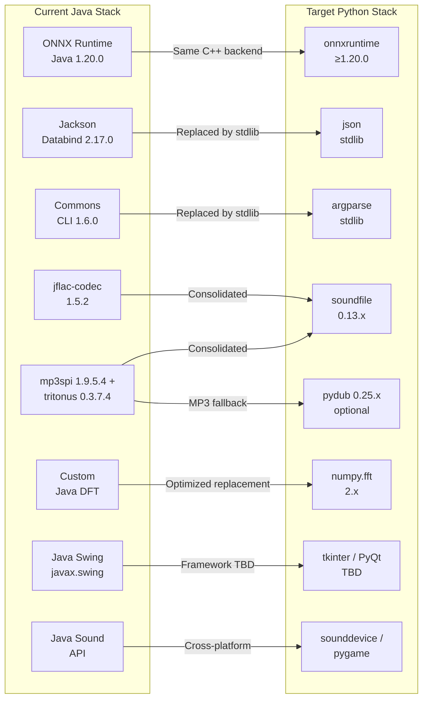

### 3.2.4 Integration Requirements Between Components

The technology stack components interact through well-defined integration points that must be preserved during migration:

| Integration | Source Component | Target Component | Data Format |
|---|---|---|---|
| Audio → Features | `soundfile` / `pydub` | `numpy` | Mono 16 kHz float32 array |
| Features → Encoder | `numpy` (mel spectrogram) | `onnxruntime` (InferenceSession) | `numpy.ndarray` shape `[1, 80, 3000]` |
| Decoder → Text | `onnxruntime` (token IDs) | `json` (vocabulary lookup) | Integer array → string |
| Config → Session | `json` (config loading) | `onnxruntime` (SessionOptions) | 7 configuration parameters |
| Results → Output | Python `dataclasses` | `json` / CSV writer | Structured benchmark data |
| GUI → Pipeline | `tkinter` / PyQt (TBD) | Core inference modules | Thread-based invocation |

## 3.3 Open Source Dependencies

### 3.3.1 Maven Dependencies (Current Java)

All current Java dependencies are sourced from **Maven Central** repository. The complete dependency declaration from `pom.xml`:

| Dependency | Maven Coordinates | Version | Scope | Transitive Dependencies |
|---|---|---|---|---|
| ONNX Runtime | `com.microsoft.onnxruntime:onnxruntime` | 1.20.0 | compile | Native C++ shared libraries (platform-specific) |
| Jackson Databind | `com.fasterxml.jackson.core:jackson-databind` | 2.17.0 | compile | jackson-core, jackson-annotations |
| Commons CLI | `commons-cli:commons-cli` | 1.6.0 | compile | None |
| MP3 SPI | `com.googlecode.soundlibs:mp3spi` | 1.9.5.4 | compile | Requires tritonus-share at runtime |
| Tritonus Share | `com.googlecode.soundlibs:tritonus-share` | 0.3.7.4 | compile | None |
| jFLAC Codec | `org.jflac:jflac-codec` | 1.5.2 | compile | None |

### 3.3.2 PyPI Dependencies (Target Python)

The target Python implementation will source all external packages from **PyPI** (Python Package Index). Dependency pinning is required per Section 2.4.4 constraint to ensure reproducible builds.

#### Core Dependencies (Required)

| Package | Pinned Version | Purpose | Replaces |
|---|---|---|---|
| `onnxruntime` | `==1.20.0` | ONNX model inference (CPU execution provider) | `com.microsoft.onnxruntime` 1.20.0 |
| `numpy` | `>=1.24.0,<3.0.0` | FFT computation (`numpy.fft`), array operations, tensor creation | Custom Java DFT in `WhisperFeatureExtractor` |
| `soundfile` | `>=0.12.0` | WAV and FLAC audio loading via libsndfile | `mp3spi` + `tritonus-share` + `jflac-codec` |

#### Optional Dependencies

| Package | Pinned Version | Purpose | Condition |
|---|---|---|---|
| `pydub` | `>=0.25.0` | MP3 audio loading (requires `ffmpeg` system binary) | Required only if `soundfile` lacks MP3 support for target files |
| `sounddevice` | `>=0.4.0` | Cross-platform audio playback in GUI mode | Alternative to `pygame`; selection TBD |
| `pygame` | `>=2.5.0` | Cross-platform audio playback in GUI mode | Alternative to `sounddevice`; selection TBD |

**Version Pinning Rationale:**

- **`onnxruntime==1.20.0`**: Pinned to exact version matching the Java implementation to guarantee inference parity (Assumption A-002). Both the Java and Python ONNX Runtime packages wrap the same C++ backend at this version, ensuring identical model execution. Upgrade path to newer versions (up to 1.24.1 currently available on PyPI) can be evaluated post-migration after parity is validated.
- **`numpy>=1.24.0,<3.0.0`**: Floor version ensures Python 3.8 compatibility; ceiling allows use of NumPy 2.x series on newer Python versions. The `numpy.fft` module API has been stable across major versions.
- **`soundfile>=0.12.0`**: Version 0.12.0+ bundles platform-specific `libsndfile` binaries in wheels, eliminating manual system library installation on Windows, macOS (Intel/ARM), and Linux 64-bit.

### 3.3.3 Python Standard Library Modules

A significant advantage of the Python migration is the replacement of external Java dependencies with standard library modules, reducing third-party dependency surface area:

| Module | Purpose | Replaces |
|---|---|---|
| `argparse` | CLI argument parsing (18 flags) | Commons CLI 1.6.0 |
| `json` | JSON serialization/deserialization for configs and results | Jackson Databind 2.17.0 |
| `dataclasses` | Data transfer objects (ResultRow, Config, SegmentResult, etc.) | Java inner classes / records |
| `statistics` | Statistical computations (median, percentiles) | Custom `StatBlock` inner class |
| `typing` | Type hints for all public APIs | N/A (new requirement) |
| `pathlib` / `os` | Cross-platform file system operations | `java.io.File`, `java.nio.file.Path` |
| `subprocess` | External process execution for model tooling and audio fallbacks | `java.lang.ProcessBuilder` |
| `threading` | Background task execution, cancellation signals | `SwingWorker`, `AtomicReference` |
| `tkinter` | Desktop GUI framework (if selected) | Java Swing (`javax.swing.*`) |
| `logging` | Application logging | Custom `LogSink` interface |

### 3.3.4 Security Considerations for Dependencies

| Concern | Mitigation |
|---|---|
| **Supply Chain Risk** | Pin all dependencies to exact or bounded versions; verify package integrity via pip hash checking |
| **ONNX Runtime Native Code** | The `onnxruntime` package includes platform-specific native libraries (C++ shared objects); sourced from Microsoft's verified PyPI publisher |
| **External Process Execution** | F-012, F-013, F-014 invoke external commands (`huggingface-cli`, `optimum-cli`, OS audio players); all command strings are hardcoded with only file paths as user-supplied arguments — no shell injection vectors |
| **JSON Parsing** | Use Python's safe `json` module; no `eval()` on config content per Section 2.4.4 security requirements |
| **File System Access** | Validate all paths; restrict file access to configured audio, model, and output directories |
| **Model Integrity** | Downloaded models from HuggingFace rely on HuggingFace Hub's built-in integrity verification |

## 3.4 Third-Party Services & External Tooling

### 3.4.1 HuggingFace Hub Integration

The system integrates with **HuggingFace Hub** for model acquisition and ONNX conversion, implemented in `ModelTooling.java` (155 lines) and preserved in the Python migration. All interactions occur via external CLI tool invocation rather than direct API calls.

#### Model Download (F-013)

Three download commands are attempted in priority order, as implemented in `ModelTooling.java` lines 24–55:

| Priority | Command | Tool Required |
|---|---|---|
| 1 | `huggingface-cli download <model_id> --local-dir <target>` | `huggingface_hub[cli]` |
| 2 | `python3 -m huggingface_hub.commands.huggingface_cli download <model_id> --local-dir <target>` | `huggingface_hub` Python package |
| 3 | `uvx --from huggingface_hub huggingface-cli download <model_id> --local-dir <target>` | `uv` package manager |

#### ONNX Model Conversion (F-014)

Three conversion commands are attempted in priority order, as implemented in `ModelTooling.java` lines 58–112:

| Priority | Command | Tool Required |
|---|---|---|
| 1 | `optimum-cli export onnx --model <source> --task automatic-speech-recognition-with-past <outDir>` | `optimum[onnxruntime]` |
| 2 | `python3 -m optimum.exporters.onnx --model <source> --task automatic-speech-recognition-with-past <outDir>` | `optimum` Python package |
| 3 | `uvx --from optimum[onnxruntime] optimum-cli export onnx --model <source> --task automatic-speech-recognition-with-past <outDir>` | `uv` package manager |

**Required Python Packages for Tooling** (from `README.md` line 81):

```
pip install "huggingface_hub[cli]" "optimum[onnxruntime]"
```

**Migration Note:** In the Python target, these external CLI invocations via `subprocess` can optionally be replaced with direct Python API calls to `huggingface_hub.hf_hub_download()` and `optimum.exporters.onnx`, eliminating the need for external process orchestration. However, the `subprocess` approach is retained initially to maintain behavioral parity with the Java implementation.

### 3.4.2 External Audio Players

Cross-platform audio playback (F-012) uses a tiered fallback chain of OS-specific external audio players, as implemented in `AudioPlaybackController.java` lines 112–133. This pattern must be preserved in the Python migration:

| Platform | Primary Fallback | Secondary Fallbacks |
|---|---|---|
| **macOS** | `afplay` | `ffplay` |
| **Windows** | PowerShell `SoundPlayer` (`(New-Object Media.SoundPlayer '<file>').PlaySync()`) | — |
| **Linux / Other** | `ffplay` | `mpv`, `cvlc`, `paplay`, `aplay` |

These OS-level players are invoked only when the primary audio API (`sounddevice` or `pygame` in Python; Java Sound API in Java) fails to play a file. All process invocations use the `subprocess` module with hardcoded command templates.

### 3.4.3 Package Managers & Runners

| Tool | Version | Purpose | Evidence |
|---|---|---|---|
| **`uv`** | Latest | Python package runner for reference script execution and HuggingFace tool fallback | `run.sh` invokes `uv run whisper_infer_without_pipeline.py`; `uvx` used as third-priority fallback in `ModelTooling.java` |
| **`pip`** | Standard | Primary Python package installation | Used for installing `huggingface_hub[cli]` and `optimum[onnxruntime]` per `README.md` |
| **Maven** | 3.8+ | Java build and dependency management (current) | `pom.xml`, `run_java.sh` invokes `mvn -q -DskipTests package` |

## 3.5 Data Storage & Persistence

This system uses **no databases**. All data persistence is file-system based, operating on local storage for input, configuration, and output artifacts. This design is consistent with the standalone desktop application architecture (Constraint C-007).

### 3.5.1 Input Data Files

| Category | File Types | Location | Description |
|---|---|---|---|
| **Audio Files** | `.wav`, `.flac`, `.mp3` | Configurable via `--audio_dir` (default: `audio/`) | Source audio for transcription; enumerated case-insensitively by `listAudioFiles()` |
| **ONNX Model Files** | `encoder_model.onnx`, `decoder_model.onnx`, `decoder_with_past_model.onnx` (optional) | Configurable via `--onnx_dir` (default: `whisper-base-with-past/`) | Pre-converted Whisper model binaries for inference |
| **Tokenizer Files** | `tokenizer.json` (preferred), `vocab.json`, `added_tokens.json`, `tokenizer_config.json`, `special_tokens_map.json` | Alongside ONNX models in model directory | Vocabulary and configuration for token-to-text conversion |

### 3.5.2 Configuration Files

| File | Format | Purpose | Schema |
|---|---|---|---|
| `discovery_best.json` | JSON (with comment/single-quote tolerance) | ONNX Runtime session configuration | Contains `best` object with 7 parameters: `intra_op`, `inter_op`, `execution_mode`, `graph_opt`, `cpu_mem_arena`, `mem_pattern`, `allow_spinning` |

The configuration loading supports non-standard JSON features (comments, single quotes) via tolerant parsing, as specified in F-010-RQ-004. Default values are applied when the config file is absent or incomplete, with `intra_op` defaulting to `min(CPU_count, 16)` and `inter_op` defaulting to `1`.

### 3.5.3 Output Artifacts

| Artifact | Format | Default Path | Description |
|---|---|---|---|
| **Per-File CSV** | CSV | `results/benchmarks/inference_per_file.csv` | Header: `file,duration_s,end_to_end_s,rtf,text`; proper field escaping for embedded quotes/newlines |
| **Per-File JSON** | JSON | `results/benchmarks/inference_per_file.json` | Pretty-printed array of per-file result objects |
| **Summary JSON** | JSON | `results/benchmarks/inference_summary.json` | Config metadata, file count, latency stats (min, median, p90, p95, max, mean), RTF stats, model metadata |
| **Transcript Text** | Plain text | `<audio_filename>.transcript.txt` | Optional per-file transcript output (enabled via `--write_txt` flag) |
| **GUI Variants** | Same formats | `.gui.` suffixed filenames | GUI mode produces separate output files to avoid overwriting CLI results |

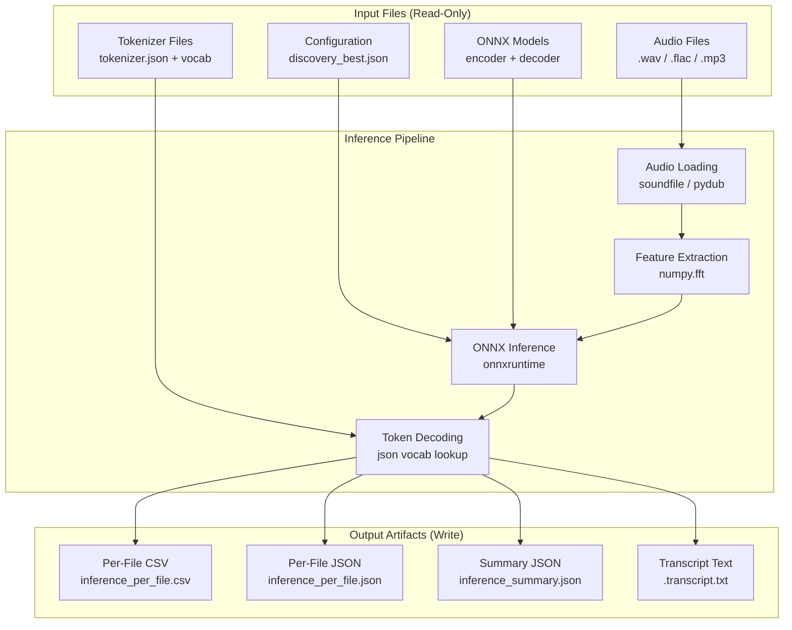

## 3.6 Development & Deployment

### 3.6.1 Current Java Build System

The Java codebase uses **Apache Maven 3.8+** as its build and dependency management tool:

| Aspect | Detail |
|---|---|
| **Build Command** | `mvn -q -DskipTests package` (from `README.md` line 34) |
| **Output JAR** | `target/whisper-onnx-cli-0.1.0.jar` |
| **Dependency Directory** | `target/dependency/*` (copied via maven-dependency-plugin 3.6.1) |
| **Execution Classpath** | `java -cp target/whisper-onnx-cli-0.1.0.jar:target/dependency/* WhisperInferWithoutPipeline` |
| **CLI Invocation** | `./run_java.sh --cli` |
| **GUI Invocation** | `./run_java.sh --gui` or `./run_gui.sh` |

The build process compiles all seven Java source files from `src/main/java/`, packages them into a single JAR, and copies all six Maven dependencies into the `target/dependency/` directory for flat classpath resolution.

### 3.6.2 Target Python Build & Package Management

The Python migration will adopt modern Python packaging conventions:

| Aspect | Planned Approach |
|---|---|
| **Package Format** | `pyproject.toml` (PEP 621) for project metadata and dependency declaration |
| **Dependency Pinning** | All versions pinned per Constraint C-004 from Section 2.4.4; reproducible via `requirements.txt` or `pyproject.toml` constraints |
| **Virtual Environments** | Standard `venv` or `uv`-managed environments |
| **Installation** | `pip install -e .` for development; future `pip install whisper-onnx-cli` from PyPI (Section 1.3.2 future phase) |
| **Entry Points** | Console script entry points for CLI and GUI modes |

**Module Structure (from Section 2.4.1 decomposition targets):**

| Target Module | Source Inner Class(es) | Max Lines |
|---|---|---|
| `cli.py` | `Args` (lines 1492–1588) | ≤500 |
| `config.py` | `Config` (lines 1591–1710) | ≤500 |
| `audio.py` | `AudioData` + `Resampler` (lines 1712–1791) | ≤500 |
| `features.py` | `WhisperFeatureExtractor` (lines 1794–1985) | ≤500 |
| `model.py` | `WhisperOnnxModel` + `DecoderSpec` + `EncoderOutput` (lines 1987–2545) | ≤500 |
| `tokenizer.py` | `Tokenizer` + `ByteEncoder` (lines 2547–2888) | ≤500 |
| `stats.py` | `Summary` + `StatBlock` (lines 2936–3054) | ≤500 |
| `types.py` | DTOs: `SegmentInput`, `SegmentResult`, `Timings`, `TranscriptionResult` (lines 2890–2935) | ≤500 |
| `gui.py` | `launchGui` method (lines 274–1058) | ≤500 |

### 3.6.3 Deployment Model

The system is deployed exclusively as a **standalone desktop application** — no servers, containers, or cloud infrastructure are involved (Constraint C-007):

| Aspect | Detail |
|---|---|
| **Deployment Target** | Local workstation (macOS, Windows, Linux/Unix) |
| **Distribution** | Python package (source or wheel) |
| **Runtime Requirement** | Python 3.8+ interpreter with virtual environment |
| **External Requirements** | `ffmpeg` (optional, for MP3 via `pydub`); OS audio players (optional fallback) |
| **Containerization** | Explicitly out of scope per Section 1.3.2 |
| **Cloud Deployment** | Explicitly out of scope per Section 1.3.2 |
| **CI/CD Pipeline** | Not currently implemented; no CI/CD configuration exists in the Java codebase |

### 3.6.4 Testing Strategy

| Aspect | Current State (Java) | Target State (Python) |
|---|---|---|
| **Test Suite** | None — per `AGENTS.md`: "There is no test suite checked into this repository yet" | Comprehensive test suite required during migration (Constraint C-005) |
| **Unit Tests** | Not present | Required for all pipeline stages (audio, features, model, tokenizer, stats) |
| **Integration Tests** | Not present | End-to-end flow validation with known audio inputs |
| **Parity Validation** | Manual comparison | Byte-level comparison of outputs against Java baseline (Constraint C-004) |
| **Performance Tests** | Benchmark artifacts produced manually | Automated RTF comparison: Python must be within 1.5× of Java RTF (Constraint C-003) |
| **Testing Framework** | N/A | `pytest` (de facto standard for Python testing) |

### 3.6.5 Performance Constraints on Technology Choices

The technology stack selection is constrained by specific performance requirements documented in Section 2.4.2:

| Constraint | Impact on Technology Choice |
|---|---|
| **CPU-Only Inference** (C-006) | Use `onnxruntime` CPU package only; do not install `onnxruntime-gpu` |
| **RTF ≤ 1.5× Java** (C-003) | ONNX Runtime's shared C++ backend ensures inference parity; `numpy.fft` expected to outperform Java's naive DFT |
| **GIL Transparency** | Python's Global Interpreter Lock does not affect ONNX Runtime's C++ inference threads, as these release the GIL during execution (Section 2.4.3) |
| **Thread Configuration** | Default `intra_op` threading: `min(CPU_count, 16)` — maps directly between Java and Python `SessionOptions` |
| **Greedy Decoding Only** (C-008) | No beam search or sampling strategies; reduces complexity of decoder implementation |

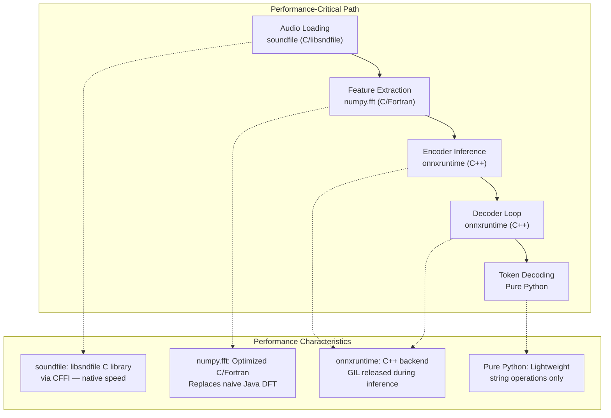

## 3.7 Technology Stack Summary

The following table provides a consolidated view of the complete technology transition:

| Category | Current (Java) | Target (Python) | Change Type |
|---|---|---|---|
| **Primary Language** | Java 11+ | Python 3.8+ | Platform migration |
| **Build Tool** | Maven 3.8+ | pip / pyproject.toml | Ecosystem change |
| **ML Inference** | ONNX Runtime Java 1.20.0 | `onnxruntime` Python 1.20.0 | API mapping (same C++ core) |
| **FFT / Numerics** | Custom naive DFT (Java) | `numpy` ≥1.24.0 | Performance upgrade |
| **Audio Loading** | Java Sound + 3 SPI libs | `soundfile` ≥0.12.0 | Dependency consolidation |
| **JSON I/O** | Jackson Databind 2.17.0 | `json` (stdlib) | Dependency elimination |
| **CLI Parsing** | Commons CLI 1.6.0 | `argparse` (stdlib) | Dependency elimination |
| **Desktop GUI** | Java Swing | `tkinter` / PyQt (TBD) | Framework migration |
| **Audio Playback** | Java Sound API + OS fallbacks | `sounddevice` / `pygame` + OS fallbacks | API migration |
| **Data Classes** | Java inner classes | `dataclasses` (stdlib) | Language feature |
| **Statistics** | Custom `StatBlock` | `statistics` (stdlib) | Dependency elimination |
| **Model Tooling** | `ProcessBuilder` → CLI tools | `subprocess` → CLI tools | Direct mapping |
| **Package Registry** | Maven Central | PyPI | Ecosystem change |

**Net Dependency Impact:**
- **Java External Dependencies:** 6 libraries from Maven Central
- **Python External Dependencies:** 1–3 libraries from PyPI (`onnxruntime`, `numpy`, `soundfile`; plus optional `pydub`, `sounddevice`/`pygame`)
- **Reduction:** Up to 50% fewer external dependencies through Python standard library utilization

#### References

#### Source Files Examined

- `pom.xml` — Maven project configuration with all Java dependency declarations, versions, and build plugin configuration
- `src/main/java/WhisperInferWithoutPipeline.java` — 3,054-line monolith containing 20 inner classes, all imports, constants, and architecturally critical patterns
- `src/main/java/AudioPlaybackController.java` — Cross-platform audio playback with Java Sound API and OS-specific fallback chains (253 lines)
- `src/main/java/ModelTooling.java` — HuggingFace download and ONNX conversion orchestration with 3-tier command fallback (155 lines)
- `src/main/java/ResultsIO.java` — CSV/JSON I/O with Jackson usage (92 lines)
- `src/main/java/ResultRow.java` — Immutable DTO for per-file results (15 lines)
- `src/main/java/GradientPanel.java` — Swing GUI gradient component (31 lines)
- `src/main/java/GuiHelp.java` — Help text utility (26 lines)
- `run_java.sh` — Shell launcher with environment variable handling and mode switching
- `run.sh` — Python reference script invocation via `uv run`
- `run_gui.sh` — GUI launch shortcut script
- `discovery_best.json` — ONNX Runtime session configuration file
- `README.md` — Project documentation with build instructions and dependency notes

#### Folders Examined

- `src/main/java/` — All 7 Java source files
- `docs/` — Manual pages and documentation

#### Technical Specification Sections Referenced

- Section 1.1 — Executive Summary: project overview, business problem, value proposition
- Section 1.2 — System Overview: migration history, system capabilities, success criteria
- Section 1.3 — Scope: in-scope features (F-01 through F-14), out-of-scope items, integration mapping
- Section 2.1 — Feature Catalog: complete feature descriptions with dependency details
- Section 2.2 — Functional Requirements: detailed technical specifications per feature
- Section 2.3 — Feature Relationships: integration points and shared components
- Section 2.4 — Implementation Considerations: technical constraints, performance requirements, security
- Section 2.5 — Traceability Matrix: Java-to-Python module mapping
- Section 2.6 — Assumptions and Constraints: A-001 through A-005, C-001 through C-008
- Section 2.7 — References: source files and external references

#### External References

- [ONNX Runtime Python API Documentation](https://onnxruntime.ai/docs/api/python/api_summary.html) — `SessionOptions` property mapping
- [ONNX Runtime Releases (PyPI)](https://pypi.org/project/onnxruntime/) — Version 1.20.0 through 1.24.1 available
- [NumPy Releases](https://numpy.org/news/) — Latest stable release 2.4.2 (Feb 2026)
- [soundfile (PyPI)](https://pypi.org/project/soundfile/) — Latest version 0.13.1; BSD 3-Clause licensed
- [pydub (PyPI)](https://pypi.org/project/pydub/) — Latest version 0.25.1; MIT licensed

# 4. Process Flowchart

This section provides comprehensive process flow documentation for the Whisper ONNX Inference Engine ("Whisper Studio"), capturing all system workflows, decision points, error handling paths, and state transitions. Each flow is documented to serve as the authoritative reference for the planned Java-to-Python migration, ensuring that every process path, validation rule, and integration behavior is faithfully preserved in the target Python implementation.

## 4.1 System Workflows Overview

### 4.1.1 Application Entry Point and Routing

The system provides two distinct operational modes — a CLI batch transcription pipeline and an interactive GUI desktop application — both sharing a common inference core. The entry point is the `main()` method in `WhisperInferWithoutPipeline.java` (line 120), which parses 18 CLI arguments via the `Args` inner class and routes execution based on the `--gui` flag.

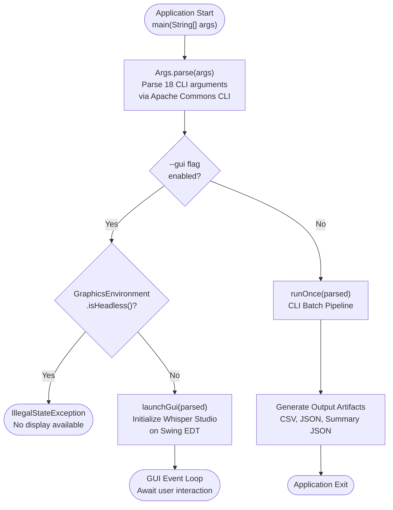

The routing decision at the entry point is a single binary fork: the `--gui` flag (default `false`) determines whether the application enters the non-interactive batch pipeline via `runOnce()` or the interactive GUI via `launchGui()`. In the Python migration, this maps to a similar `argparse` flag check with the GUI framework (to be determined among `tkinter`, PyQt, or Streamlit) replacing Java Swing.

### 4.1.2 Primary User Journeys

Three primary user journeys are supported by the system, as defined in Section 1.3 (Scope):

| Journey | Entry Point | Key Process Steps | Output |
|---|---|---|---|
| **CLI Batch Transcription** | `run_java.sh` → `main()` → `runOnce()` | Parse args → Load config → Load models → Enumerate audio → Process each file → Generate artifacts | CSV, JSON, Summary JSON, optional `.txt` transcripts |
| **GUI Interactive Transcription** | `run_gui.sh` → `main(--gui)` → `launchGui()` | Configure settings → Click Run → Background `runOnce()` → Live result updates → Review/play/export | GUI tabs: Transcript, Logs, Summary |
| **Model Acquisition** | GUI buttons or scripted commands | Download from HuggingFace → Convert to ONNX → Verify output files | ONNX model files on disk |

Each journey shares the core inference pipeline implemented in `WhisperInferWithoutPipeline.java`, with the GUI journey wrapping the same `runOnce()` invocation inside a `SwingWorker` for background execution. The Python migration must preserve this shared-pipeline architecture, mapping `runOnce()` to a reusable Python function invocable from both `cli.py` and `gui.py`.

### 4.1.3 System Boundaries and Interaction Touchpoints

The following table maps each system boundary to its user touchpoints, validation rules, and authorization checkpoints:

| Boundary | User Touchpoint | Validation Rule | Python Migration Target |
|---|---|---|---|
| **CLI Entry** | Shell invocation via `run_java.sh` | 18 arguments validated by `Args.parse()` | `argparse` in `cli.py` |
| **GUI Entry** | Desktop application launch | Headless display check; input field validation | `tkinter`/PyQt in `gui.py` |
| **File System** | Audio directory, model directory, output paths | Path existence checks; file extension filtering (`.wav`, `.flac`, `.mp3`) | `pathlib` / `os.path` |
| **ONNX Runtime** | Session creation and inference execution | Model file existence; tensor shape validation; type matching | `onnxruntime.InferenceSession` |
| **External CLI Tools** | HuggingFace/Optimum tool invocation | Exit code validation; output file verification | `subprocess.run()` |
| **Audio Subsystem** | Java Sound API / OS audio players | Format negotiation; codec availability detection | `sounddevice`/`pygame` + OS fallbacks |

---

## 4.2 Core Business Process Flows

### 4.2.1 CLI Batch Transcription Pipeline

The CLI batch transcription pipeline, implemented in `runOnce()` (line 129 of `WhisperInferWithoutPipeline.java`), is the system's primary end-to-end workflow. It proceeds through five distinct phases: initialization, ONNX session setup, audio enumeration with optional warmup, the main per-file processing loop, and output generation.

```mermaid
flowchart TD
    CLIStart(["runOnce() Start"])

    subgraph Init["Phase 1: Initialization"]
        EnsureDirs["ensureParentDir()<br/>Create CSV, JSON,<br/>Summary output dirs"]
        ResolveConfig["resolveConfig()<br/>Load discovery_best.json"]
        ResolveModelDir["resolveModelDir()<br/>Try modelId path<br/>then onnxDir path"]
        ModelDirCheck{"Model directory<br/>found?"}
        ModelDirError(["throw<br/>IllegalStateException"])
        LoadTokenizer["Tokenizer.load(modelDir, cfg)<br/>Load vocab + config files"]
        LoadCompare["Load comparison texts<br/>via ResultsIO.loadCompareMap()<br/>if --compare_with set"]
        EnsureDirs --> ResolveConfig
        ResolveConfig --> ResolveModelDir
        ResolveModelDir --> ModelDirCheck
        ModelDirCheck -->|No| ModelDirError
        ModelDirCheck -->|Yes| LoadTokenizer
        LoadTokenizer --> LoadCompare
    end

    subgraph SessionSetup["Phase 2: ONNX Session Setup"]
        CreateEnv["OrtEnvironment<br/>.getEnvironment()"]
        SessionOpts["Config.toSessionOptions()<br/>Map 7 ONNX parameters"]
        LoadOnnxModel["WhisperOnnxModel.load()<br/>encoder + decoder<br/>+ optional past decoder"]
        RuntimeInfo["Print runtime info:<br/>decoder-with-past status,<br/>MP3/FLAC SPI availability"]
        CreateEnv --> SessionOpts
        SessionOpts --> LoadOnnxModel
        LoadOnnxModel --> RuntimeInfo
    end

    subgraph AudioEnum["Phase 3: Audio Enumeration and Warmup"]
        ListAudioFiles["listAudioFiles()<br/>Enumerate .wav/.flac/.mp3<br/>sorted, limited by --limit_files"]
        AudioFilesCheck{"Audio files<br/>found?"}
        AudioFilesError(["throw<br/>IllegalStateException"])
        WarmupDecision{"warmup > 0?"}
        WarmupExec["Run N warmup iterations<br/>on first audio file"]
        ListAudioFiles --> AudioFilesCheck
        AudioFilesCheck -->|No| AudioFilesError
        AudioFilesCheck -->|Yes| WarmupDecision
        WarmupDecision -->|Yes| WarmupExec
    end

    subgraph MainLoop["Phase 4: Main Processing Loop"]
        FileLoop{"More files<br/>AND not stopped?"}
        AudioLoad["AudioData.load16kMono(path)<br/>Timed: loadS"]
        InferenceCall["generateLongformFull()<br/>Timed: model + preprocess"]
        MetricsCalc["Calculate endToEndS,<br/>rtfModel, rtfEndToEnd"]
        RefCompare["Compare with reference<br/>Apply force_match if set"]
        ResultBuild["Build ResultRow<br/>Report via resultSink"]
        TxtWrite["Write .txt transcript<br/>if --write_txt enabled"]
        FileLoop -->|Yes| AudioLoad
        AudioLoad --> InferenceCall
        InferenceCall --> MetricsCalc
        MetricsCalc --> RefCompare
        RefCompare --> ResultBuild
        ResultBuild --> TxtWrite
        TxtWrite --> FileLoop
    end

    subgraph OutputGen["Phase 5: Output Generation"]
        BenchCheck{"Benchmark<br/>mode?"}
        CsvWrite["ResultsIO.writeCsv()<br/>Header: file,duration_s,<br/>end_to_end_s,rtf,text"]
        JsonWrite["ResultsIO.writeJson()<br/>Per-file results array"]
        SummaryBuild["Summary.build()<br/>StatBlock: min, median,<br/>p90, p95, max, mean"]
        SummaryWrite["Write summary JSON"]
        CompletionLog["Log completion,<br/>config, output paths"]
        MismatchReport["Report comparison<br/>mismatches"]
        BenchCheck -->|Yes| CsvWrite
        CsvWrite --> JsonWrite
        JsonWrite --> SummaryBuild
        SummaryBuild --> SummaryWrite
        SummaryWrite --> CompletionLog
        BenchCheck -->|No| CompletionLog
        CompletionLog --> MismatchReport
    end

    CLIEnd(["runOnce() Complete"])

    CLIStart --> EnsureDirs
    LoadCompare --> CreateEnv
    RuntimeInfo --> ListAudioFiles
    WarmupDecision -->|No| FileLoop
    WarmupExec --> FileLoop
    FileLoop -->|No| BenchCheck
    MismatchReport --> CLIEnd
```

#### Validation Rules Per Phase

| Phase | Business Rule | Data Validation |
|---|---|---|
| **Initialization** | Model directory must exist with valid ONNX files | `resolveModelDir()` checks `modelId` path then `onnxDir`; throws `IllegalStateException` if neither found |
| **ONNX Setup** | All 7 config parameters must map to valid `SessionOptions` | `toSessionOptions()` validates `execution_mode` ("SEQUENTIAL"/"PARALLEL") and `graph_opt` ("ENABLE_ALL"/"ENABLE_EXTENDED") |
| **Audio Enumeration** | At least one audio file must exist | `listAudioFiles()` throws `IllegalStateException` if directory is empty; extensions matched case-insensitively |
| **Processing Loop** | Stop signal checked before each file | `shouldStop(stopSignal)` evaluates `AtomicBoolean` for cancellation |
| **Output Generation** | CSV fields must be properly escaped | `ResultsIO.writeCsv()` handles embedded quotes, newlines, and commas |

#### Python Migration Notes for CLI Pipeline

In the Python migration, this pipeline maps to the proposed `cli.py` module using `argparse` for argument parsing and `json` standard library for configuration loading. The `runOnce()` function should be extracted as a reusable function (e.g., in a `pipeline.py` module) callable from both the CLI entry point and the GUI, preserving the shared-pipeline architecture. ONNX session management transitions from Java's `try-with-resources` to Python's context managers (`with` statements) for deterministic resource cleanup. The `Config.toSessionOptions()` method maps directly to `onnxruntime.SessionOptions` properties as documented in Section 2.2 (F-010-RQ-003).

### 4.2.2 Core Inference Pipeline — Single Segment

The single-segment inference pipeline, implemented in `generateSegment()` (line 1213), processes one 30-second audio chunk through three timed stages: preprocessing, model inference, and token decoding.

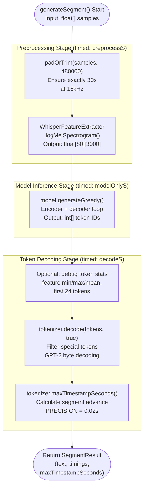

The three timing measurements (`preprocessS`, `modelOnlyS`, `decodeS`) are collected via `System.nanoTime()` deltas and aggregated for benchmark reporting. In the Python migration, these map to `time.perf_counter()` calls within the `features.py`, `model.py`, and `tokenizer.py` modules respectively.

### 4.2.3 Greedy Decoding Engine

The greedy decoding engine implements the core autoregressive generation loop with an automatic fallback mechanism between two decoder strategies. The entry point is `generateGreedy()` (line 2031 of `WhisperInferWithoutPipeline.java`).

#### Decision Flow — Decoder Strategy Selection

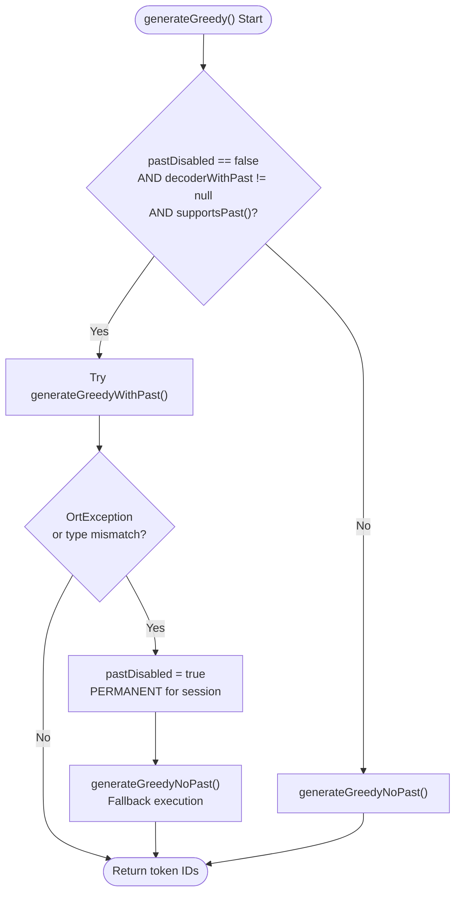

This decision flow implements requirement F-002-RQ-004: the system automatically falls back to the no-past decoder if decoder-with-past execution fails, and this fallback is permanent for the lifetime of the session. The `pastDisabled` boolean transitions from `false` to `true` and never reverts.

#### Standard Decoder Loop (No Past KV-Cache)

The `generateGreedyNoPast()` method (line 2080) implements the simpler decoding path, recomputing all attention at each step:

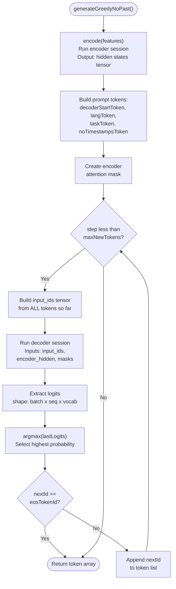

#### Accelerated Decoder Loop (With Past KV-Cache)

The `generateGreedyWithPast()` method (line 2137) implements KV-cache optimization, processing only the most recent token after the initial prompt:

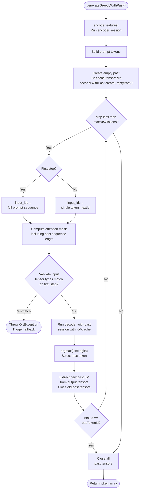

The critical difference between the two strategies is resource management: the with-past decoder must explicitly create, update, and close KV-cache tensors at each step. In the Python migration (`model.py`), this maps to numpy array management with ONNX Runtime's Python bindings. The tensor lifecycle must be carefully managed to prevent memory leaks — Java's garbage collection provides implicit safety that Python's reference counting should approximate, but explicit cleanup (via `del` or context managers) is recommended for large tensor allocations.

### 4.2.4 Longform Transcription Segmentation

Audio files exceeding 30 seconds (480,000 samples at 16 kHz) are processed through the segmented longform pipeline, implemented in `generateLongformFull()` (line 1147) and `generateSegmentedLongform()` (line 1164). This flow implements requirements F-006-RQ-001 through F-006-RQ-005.

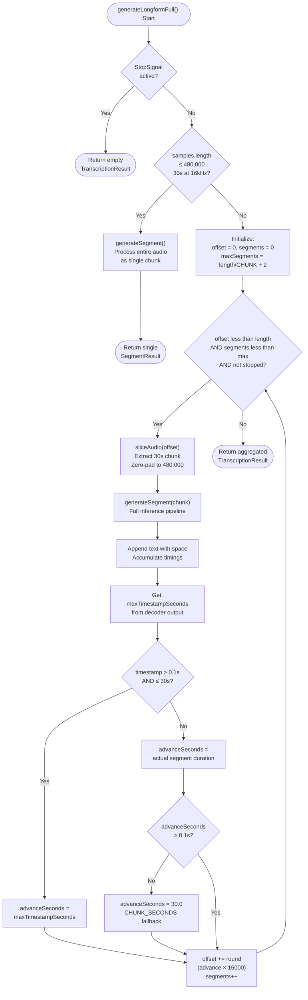

#### Timestamp Advancement Logic

The timestamp-based advancement is the critical heuristic for longform transcription accuracy. It uses a three-tier fallback chain:

| Priority | Condition | Advance Value | Rationale |
|---|---|---|---|
| **Primary** | `0.1s < maxTimestampSeconds ≤ 30s` | Decoder's reported timestamp | Model-predicted segment boundary |
| **Fallback 1** | Timestamp ≤ 0.1s or > 30s, but duration > 0.1s | Actual segment duration | Handles degenerate timestamps |
| **Fallback 2** | Both timestamp and duration ≤ 0.1s | 30.0 seconds (full chunk) | Prevents infinite loops |

This logic must be precisely replicated in the Python migration to ensure identical longform transcription segmentation behavior, as specified by acceptance criterion F-006-RQ-002 (multi-segment text must be identical to Java output).

### 4.2.5 GUI Interactive Transcription Workflow

The Whisper Studio GUI, initialized via `launchGui()` (line 274), provides an interactive wrapper around the batch pipeline. The GUI lifecycle encompasses initialization, user configuration, background transcription execution, and result presentation.

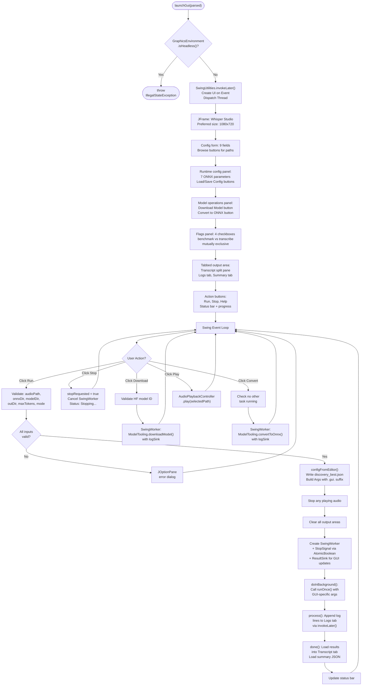

The GUI workflow's distinguishing characteristic is its use of `SwingWorker` for all long-running operations — transcription, model download, and ONNX conversion — ensuring the UI remains responsive. The `ResultSink` callback updates the GUI per-file via `SwingUtilities.invokeLater()`, enabling live result streaming to the Transcript tab.

In the Python migration (`gui.py`), the `SwingWorker` pattern maps to either `threading.Thread` with queue-based UI updates (for `tkinter`) or `QThread` with signal/slot communication (for PyQt). The `stopRequested` `AtomicBoolean` maps to a `threading.Event` object, and the `ResultSink` callback maps to a Python callable or observer pattern.

---

## 4.3 Detailed Component Process Flows

### 4.3.1 Audio Loading and Preprocessing

The audio loading pipeline, implemented in `AudioData.load16kMono()` (line 1723 of `WhisperInferWithoutPipeline.java`) and `Resampler.resampleLinear()` (line 1774), transforms input audio files into the normalized mono 16 kHz float arrays required by the feature extractor.

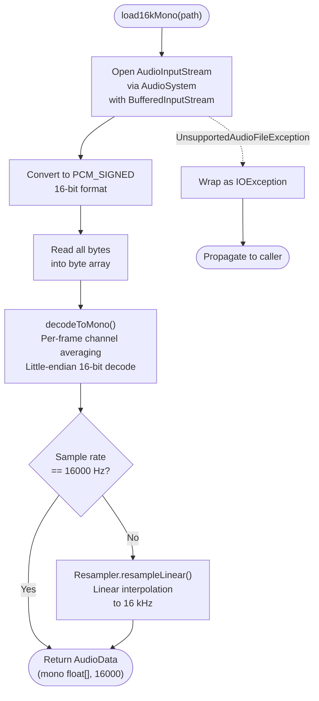

#### Codec Detection and SPI Dependencies

Audio format support depends on Java Sound SPI providers detected at runtime via `Class.forName()` (lines 1130–1145):

| Format | SPI Library | Detection Class | Python Replacement |
|---|---|---|---|
| WAV | Built-in Java Sound | Always available | `soundfile` (native) |
| MP3 | `mp3spi` 1.9.5.4 + `tritonus-share` 0.3.7.4 | `javazoom.spi.mpeg.sampled.MpegAudioFileReader` | `soundfile` or `pydub` |
| FLAC | `jflac-codec` 1.5.2 | `org.kc7bfi.jflac.sound.spi.FlacAudioFileReader` | `soundfile` (native FLAC) |

In the Python migration (`audio.py`), the `soundfile` library provides native WAV and FLAC support, consolidating three Java dependencies into one. The linear interpolation resampling can be implemented with `numpy` array operations for functional parity.

### 4.3.2 Log-Mel Feature Extraction Pipeline

The feature extraction pipeline, implemented in `WhisperFeatureExtractor.logMelSpectrogram()` (line 1802), converts raw audio samples into the `[80][3000]` log-Mel spectrogram features consumed by the Whisper encoder.

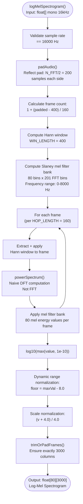

#### Feature Extraction Constants

| Constant | Value | Purpose |
|---|---|---|
| `SAMPLE_RATE` | 16,000 Hz | Required input sample rate |
| `N_FFT` | 400 | FFT window size (25 ms) |
| `HOP_LENGTH` | 160 | Frame advance (10 ms) |
| `WIN_LENGTH` | 400 | Hann window length |
| `N_MELS` | 80 | Mel frequency bins |
| `N_FRAMES` | 3,000 | Output frame count (30s / 10ms) |

The Python migration (`features.py`) replaces the custom naive DFT implementation with `numpy.fft`, which provides both correctness validation and significant performance improvement. The Slaney-style mel filter bank and log-normalization must produce values matching the Java output within 1e-6 tolerance (requirement F-004-RQ-002). The reflect padding matches `librosa`'s `center=True` behavior.

### 4.3.3 Tokenizer Configuration and Loading

The tokenizer loading flow, implemented in `Tokenizer.load()` (line 2575), follows a multi-tier fallback strategy for vocabulary and configuration sources:

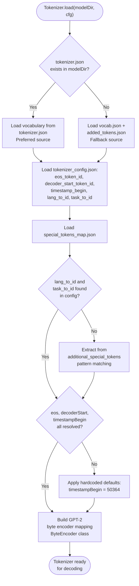

The tokenizer's multi-level fallback chain ensures compatibility across different Whisper model distributions. In the Python migration (`tokenizer.py`), vocabulary loading uses the `json` standard library, and the GPT-2 byte encoder can leverage Python's native Unicode string handling for simplified implementation.

### 4.3.4 ONNX Session Configuration Resolution

The configuration resolution flow, implemented in `resolveConfig()` within the `Config` inner class (line 1591), determines ONNX session parameters through a three-tier priority chain:

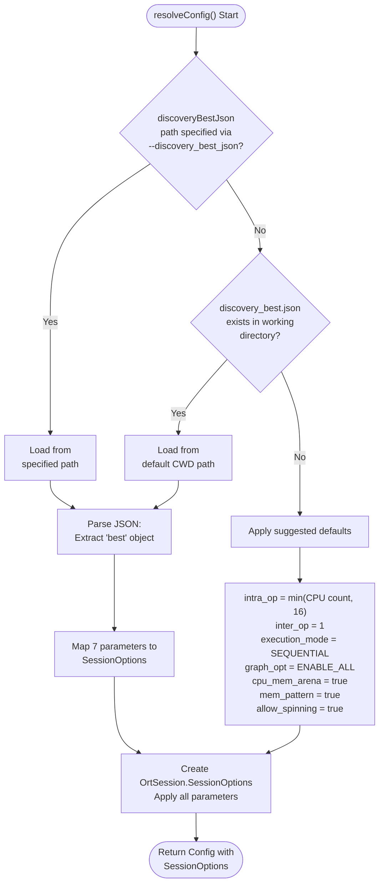

#### Configuration Parameter Mapping (Java → Python)

| Java Config Key | Java API Call | Python API Property |
|---|---|---|
| `intra_op` | `setIntraOpNumThreads()` | `sess_options.intra_op_num_threads` |
| `inter_op` | `setInterOpNumThreads()` | `sess_options.inter_op_num_threads` |
| `execution_mode` | `setExecutionMode()` | `sess_options.execution_mode` |
| `graph_opt` | `setOptimizationLevel()` | `sess_options.graph_optimization_level` |
| `cpu_mem_arena` | `setCPUArenaAllocator()` | `sess_options.enable_cpu_mem_arena` |
| `mem_pattern` | `setMemoryPatternOptimization()` | `sess_options.enable_mem_pattern` |
| `allow_spinning` | Custom mapping | `sess_options.add_session_config_entry()` |

---

## 4.4 Integration Workflows

### 4.4.1 End-to-End Pipeline Data Flow Sequence

The following sequence diagram illustrates the complete data flow through the inference pipeline, showing all participant interactions from user input to output artifact generation:

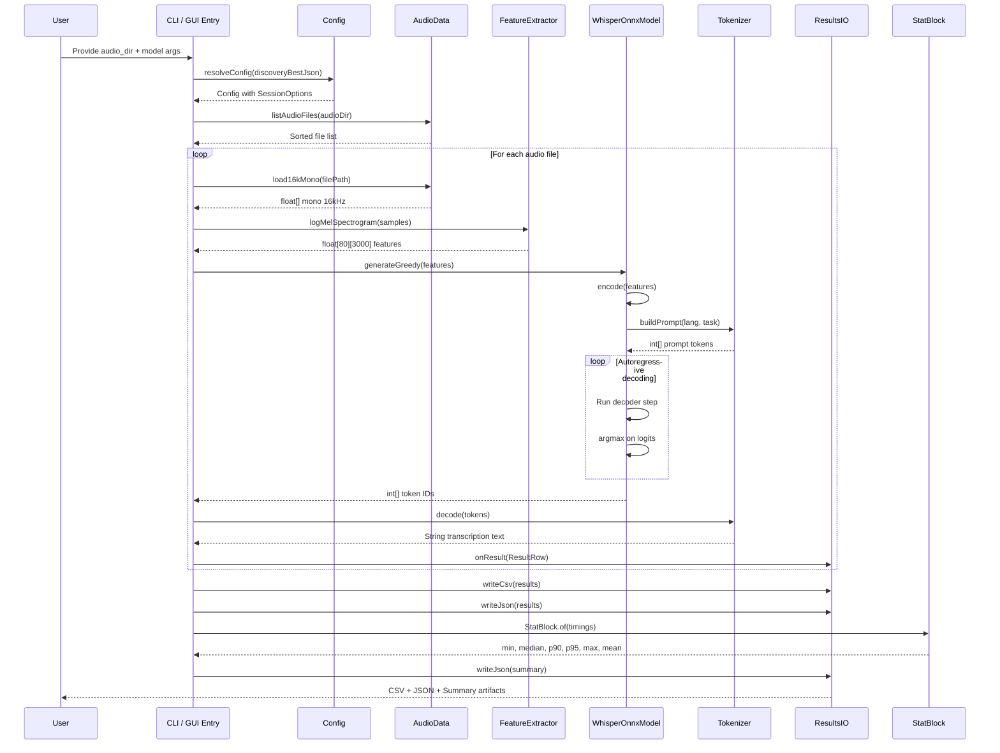

#### Integration Points Data Exchange Summary

| Integration Point | Source | Target | Data Format | Direction |
|---|---|---|---|---|
| Audio → Features | `AudioData.load16kMono()` | `logMelSpectrogram()` | `float[]` mono 16 kHz | Unidirectional |
| Features → Encoder | `logMelSpectrogram()` | `encode()` | `float[80][3000]` | Unidirectional |
| Encoder → Decoder | `encode()` | `generateGreedy*()` | `float[1][seq][hidden]` | Unidirectional |
| Decoder → Text | `generateGreedy()` | `tokenizer.decode()` | `int[]` token IDs | Unidirectional |
| Results → CSV/JSON | `ResultRow` list | `ResultsIO.writeCsv/writeJson()` | `List<ResultRow>` | Unidirectional |
| Stats → Summary | Timing lists | `StatBlock.of()` | `List<Double>` | Unidirectional |
| GUI → Pipeline | Run button action | `runOnce()` via `SwingWorker` | `Args` object | Unidirectional |
| GUI → Playback | Play button | `AudioPlaybackController.play()` | `Path` | Bidirectional (Handle) |

### 4.4.2 Model Acquisition and Conversion Pipeline

Model acquisition is a two-phase process coordinated through `ModelTooling.java` (155 lines). Each phase uses a prioritized external tool fallback chain executed via `ProcessBuilder`:

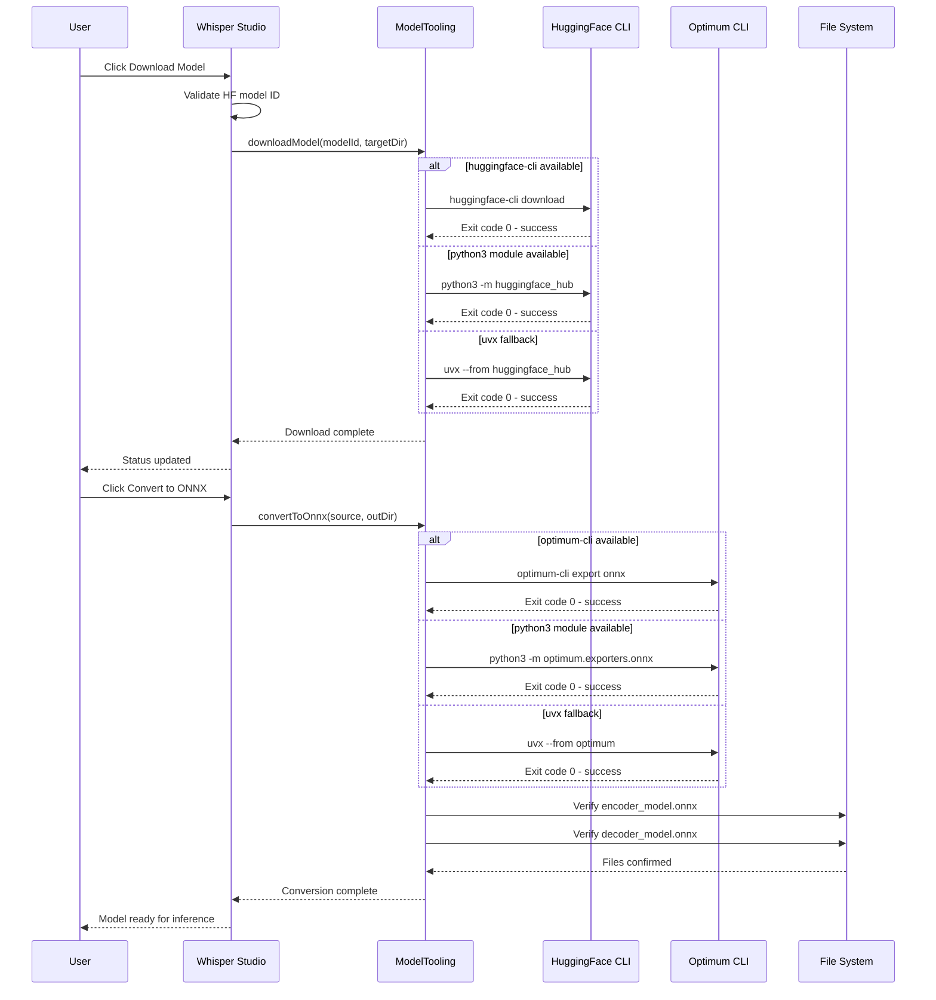

Both download and conversion use the `runFirstSuccessful()` pattern: commands are attempted sequentially, and execution stops at the first command returning exit code 0. If all three commands fail, an `IllegalStateException` is thrown. The ONNX conversion always specifies the task `automatic-speech-recognition-with-past` to ensure both decoder and decoder-with-past models are exported.

In the Python migration (`model_tooling.py`), `ProcessBuilder` maps directly to `subprocess.run()`. Additionally, the Python implementation may optionally use the `huggingface_hub` Python library API for in-process downloads, eliminating the need for external CLI tool availability.

### 4.4.3 Audio Playback Integration

The audio playback system, implemented in `AudioPlaybackController.java` (253 lines), uses a two-tier strategy with OS-specific fallback chains:

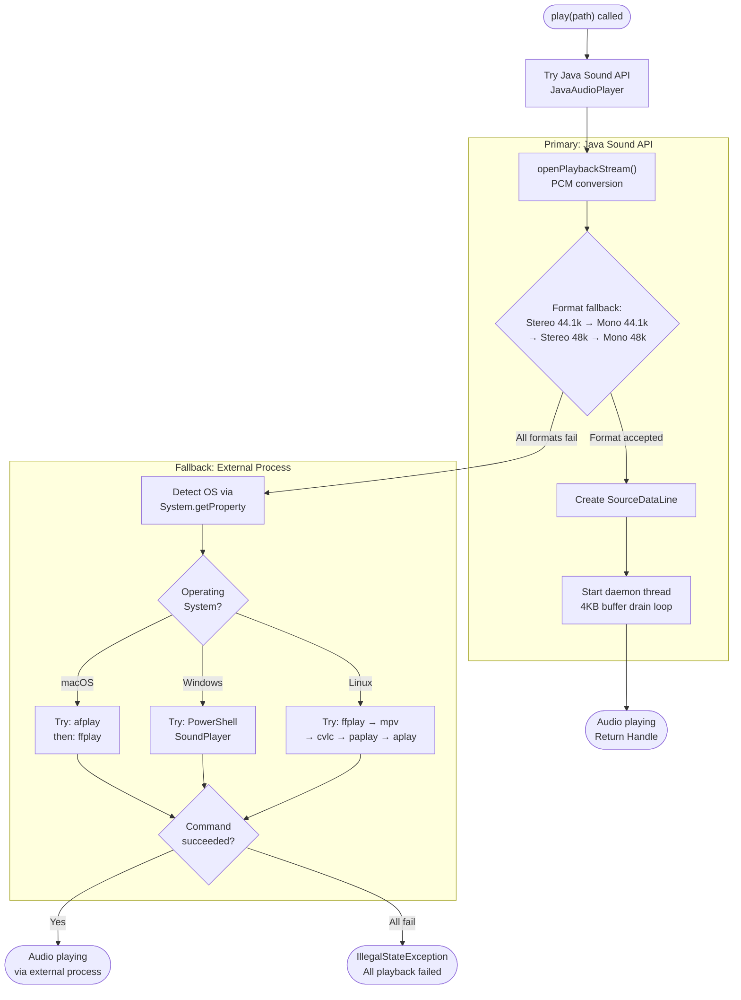

#### Stop Semantics

Audio playback stop is atomic, implemented through an `AtomicReference<Handle>`:
1. For Java Sound: `stop()` on `SourceDataLine`, then `close()` on both line and stream
2. For external process: `process.destroy()`, then `wait` with timeout, then `process.destroyForcibly()` if still alive

In the Python migration (`playback.py`), the primary playback mechanism shifts to `sounddevice` or `pygame`, with the same OS-specific external process fallback chains preserved via `subprocess`. The `Handle` pattern maps to a Python class with `stop()` method wrapping either the audio library's stop API or `process.terminate()`/`process.kill()`.

---

## 4.5 State Management and Transitions

### 4.5.1 ONNX Decoder State Machine

The ONNX model maintains decoder strategy state through a `pastDisabled` boolean flag that governs whether the accelerated decoder-with-past path is attempted. This state machine is critical for system robustness.

```mermaid
stateDiagram-v2
    [*] --> ModelLoading: WhisperOnnxModel.load()

    ModelLoading --> WithPastAvailable: decoder_with_past_model.onnx found
    ModelLoading --> NoPastOnly: decoder_with_past not found

    state WithPastAvailable {
        [*] --> TryPast: generateGreedy() called
        TryPast --> PastActive: Execution succeeds
        PastActive --> TryPast: Next generateGreedy() call
        TryPast --> PermanentDisable: OrtException caught
        TryPast --> PermanentDisable: Input type mismatch
    }

    PermanentDisable --> NoPastOnly: pastDisabled = true

    state NoPastOnly {
        [*] --> NoPastExec: generateGreedyNoPast()
        NoPastExec --> [*]: Decoding complete
    }

    NoPastOnly --> [*]: Session closed
```

#### Key State Properties

| State Variable | Type | Initial Value | Transition Trigger | Reversible |
|---|---|---|---|---|
| `pastDisabled` | `boolean` | `false` | `OrtException` or type mismatch in with-past decoder | **No** (permanent) |
| Past KV-cache | `OnnxTensor[]` | Empty (via `createEmptyPast()`) | Updated each decoding step | Yes (per-segment) |

The permanent nature of the `pastDisabled` transition is a deliberate design decision: once the decoder-with-past fails, the system assumes the model is incompatible and avoids repeated failure attempts. In the Python migration, this maps to a simple boolean attribute on the model class.

### 4.5.2 GUI Application State Machine

The GUI maintains multiple concurrent state variables tracked via `AtomicReference` and `AtomicBoolean` objects, governing the lifecycle of background operations:

```mermaid
stateDiagram-v2
    [*] --> Idle: GUI initialized

    Idle --> Validating: Run button clicked
    Validating --> Idle: Validation failed (dialog shown)
    Validating --> Transcribing: All inputs valid

    Transcribing --> Stopping: Stop button clicked
    Transcribing --> ResultsReady: SwingWorker completes
    Transcribing --> ErrorState: Exception in doInBackground()

    Stopping --> ResultsReady: Worker cancelled gracefully

    ResultsReady --> Idle: Ready for next run
    ErrorState --> Idle: Error logged to Logs tab

    Idle --> Downloading: Download Model clicked
    Downloading --> Idle: Download complete or failed

    Idle --> Converting: Convert to ONNX clicked
    Converting --> Idle: Conversion complete or failed

    Idle --> AudioPlaying: Play button clicked
    AudioPlaying --> Idle: Stop audio or playback ends
```

#### GUI State Variables

| Variable | Java Type | Purpose | Python Equivalent |
|---|---|---|---|
| `stopRequested` | `AtomicBoolean` | Cancellation signal for transcription | `threading.Event` |
| `workerRef` | `AtomicReference<SwingWorker>` | Active transcription worker reference | `threading.Thread` reference |
| `modelTaskRef` | `AtomicReference<SwingWorker>` | Active download/conversion worker | `threading.Thread` reference |
| `transcriptRef` | `AtomicReference<Map<String,ResultRow>>` | Live results for display | `dict` with lock or queue |
| `audioRef` | `AtomicReference<Handle>` | Active audio playback handle | Object reference with lock |

### 4.5.3 Processing Lifecycle States

Each audio file progresses through a deterministic state sequence during processing:

| State | Action | Timing Metric | Persistence Point |
|---|---|---|---|
| **Loading** | `AudioData.load16kMono()` | `loadS` | Audio samples in memory |
| **Preprocessing** | `logMelSpectrogram()` | `preprocessS` | Feature matrix in memory |
| **Encoding** | `encode(features)` | Part of `modelOnlyS` | Encoder hidden states |
| **Decoding** | `generateGreedy*()` loop | Part of `modelOnlyS` | Token IDs in list |
| **Text Conversion** | `tokenizer.decode()` | `decodeS` | String text |
| **Result Reporting** | `resultSink.onResult()` | N/A | ResultRow to collection and GUI |
| **Persistence** | CSV/JSON/TXT write | N/A | Files on disk |

Transaction boundaries are implicit: each file is processed atomically (no partial results are persisted), and the processing loop supports cancellation between files via the `StopSignal` interface but not within a single file's inference.

---

## 4.6 Error Handling and Recovery Flows

### 4.6.1 Error Classification and Handling Strategy

The system implements a comprehensive error handling strategy with distinct patterns for each error category:

```mermaid
flowchart TD
    subgraph DecoderRecovery["Decoder Error Recovery"]
        DErr_Check{"OrtException in<br/>decoder-with-past?"}
        DErr_Check -->|Yes| DErr_Disable["Set pastDisabled = true<br/>Log fallback activation"]
        DErr_Disable --> DErr_Fallback["Execute<br/>generateGreedyNoPast()"]
        DErr_Fallback --> DErr_Continue["Continue normal<br/>transcription"]
    end

    subgraph AudioRecovery["Audio Loading Recovery"]
        AErr_Type{"Exception type?"}
        AErr_Type -->|UnsupportedAudio| AErr_Wrap["Wrap as IOException"]
        AErr_Type -->|IOException| AErr_Propagate["Propagate to caller"]
        AErr_Wrap --> AErr_Propagate
        AErr_Propagate --> AErr_Skip["File skipped<br/>in processing loop"]
    end

    subgraph ToolRecovery["External Tool Recovery"]
        TErr_Cmd1{"Command 1<br/>exit code 0?"}
        TErr_Cmd1 -->|Yes| TErr_Done["Operation complete"]
        TErr_Cmd1 -->|No| TErr_Cmd2{"Command 2<br/>exit code 0?"}
        TErr_Cmd2 -->|Yes| TErr_Done
        TErr_Cmd2 -->|No| TErr_Cmd3{"Command 3<br/>exit code 0?"}
        TErr_Cmd3 -->|Yes| TErr_Done
        TErr_Cmd3 -->|No| TErr_Fail["IllegalStateException<br/>All commands failed"]
    end

    subgraph GUIRecovery["GUI Error Recovery"]
        GErr_Source{"Error source?"}
        GErr_Source -->|"Validation"| GErr_Dialog["JOptionPane<br/>error dialog"]
        GErr_Source -->|"SwingWorker"| GErr_Log["Publish ERROR:<br/>message to Logs tab"]
        GErr_Source -->|"Playback"| GErr_Status["Update status bar<br/>with error"]
        GErr_Dialog --> GErr_Return["Return to<br/>Idle state"]
        GErr_Log --> GErr_Return
        GErr_Status --> GErr_Return
    end
```

### 4.6.2 Decoder-with-Past Fallback Mechanism

The decoder fallback (lines 2032–2041) is the system's most critical error recovery path, implementing a permanent one-way state transition:

| Step | Action | Evidence |
|---|---|---|
| 1 | `generateGreedyWithPast()` throws `OrtException` | Caught at line 2036 |
| 2 | `pastDisabled` set to `true` | Permanent flag, never reset |
| 3 | Error logged for diagnostics | Before fallback execution |
| 4 | `generateGreedyNoPast()` invoked as fallback | Same features and prompt |
| 5 | All subsequent calls skip with-past path | `pastDisabled` checked at entry |

Additionally, input type validation on the first decoding step can detect incompatible past KV-cache tensor types, triggering the same fallback without waiting for an `OrtException`. This proactive validation prevents silent data corruption.

**Python Migration Consideration:** In the Python `onnxruntime` API, `OrtException` equivalent exceptions are `onnxruntime.capi.onnxruntime_pybind11_state.RuntimeException` or standard Python exceptions. The fallback mechanism should catch these exceptions with equivalent try/except blocks in `model.py`.

### 4.6.3 External Tool Fallback Chains

Both `ModelTooling.downloadModel()` (line 16) and `ModelTooling.convertToOnnx()` (line 58) implement the `runFirstSuccessful()` pattern:

| Feature | Command Priority 1 | Command Priority 2 | Command Priority 3 |
|---|---|---|---|
| **F-013: Download** | `huggingface-cli download` | `python3 -m huggingface_hub` | `uvx --from huggingface_hub` |
| **F-014: Convert** | `optimum-cli export onnx` | `python3 -m optimum.exporters.onnx` | `uvx --from optimum[onnxruntime]` |

Each command is executed via `ProcessBuilder`, with output streamed to a `Consumer<String> logSink` callback. `IOException` per attempt is caught and the next command is tried. Only if all three commands fail does the method throw `IllegalStateException`.

Post-conversion verification (F-014) explicitly checks for the existence of `encoder_model.onnx` and `decoder_model.onnx` in the output directory, throwing `IllegalStateException` if either is missing — preventing silent conversion failures from propagating to the inference pipeline.

### 4.6.4 Error Notification Flows

| Error Context | Notification Mechanism | Recovery Action |
|---|---|---|
| CLI — model directory not found | `IllegalStateException` with message | Application exits with error |
| CLI — no audio files found | `IllegalStateException` with message | Application exits with error |
| CLI — audio load failure | `IOException` propagated | File skipped, next file processed |
| GUI — input validation failure | `JOptionPane.showMessageDialog()` | User corrects input, retries |
| GUI — worker exception | `"ERROR: ..."` published to Logs tab | Status bar updated, returns to Idle |
| GUI — playback failure | Fallback chain attempted | `IllegalStateException` if all fail |
| JSON parsing — missing values | Graceful defaults applied | Processing continues with defaults |
| Tokenizer — missing config files | Fallback to hardcoded values | `timestampBegin = 50364` etc. |

---

## 4.7 Timing, Measurement, and SLA

### 4.7.1 Performance Measurement Points

The system collects granular timing measurements at five points per file, using `System.nanoTime()` deltas:

```mermaid
flowchart LR
    subgraph TimingPoints["Per-File Timing Collection"]
        T1["loadS<br/>Audio file loading"]
        T2["preprocessS<br/>Feature extraction"]
        T3["modelOnlyS<br/>ONNX inference"]
        T4["decodeS<br/>Token-to-text"]
        T5["endToEndS<br/>Total pipeline"]
    end

    subgraph DerivedMetrics["Derived Metrics"]
        R1["rtfModel =<br/>modelOnlyS / durationS"]
        R2["rtfEndToEnd =<br/>endToEndS / durationS"]
    end

    subgraph Aggregation["Statistical Aggregation"]
        S1["StatBlock.of()<br/>min, median, p90,<br/>p95, max, mean"]
    end

    T1 --> T5
    T2 --> T5
    T3 --> T5
    T4 --> T5
    T3 --> R1
    T5 --> R2
    R1 --> S1
    R2 --> S1
```

### 4.7.2 Statistical Aggregation Flow

After all files are processed, the `Summary.build()` method (line 2936) computes `StatBlock` metrics across three categories:

| Category | Metrics Computed | Input Data |
|---|---|---|
| **Latency** | min, median, p90, p95, max, mean | `endToEndS` per file |
| **Breakdown** | min, median, p90, p95, max, mean | `loadS`, `preprocessS`, `decodeS`, `modelOnlyS` per file |
| **RTF** | min, median, p90, p95, max, mean | `rtfEndToEnd` per file |

Percentile calculation uses sorted-list interpolation in the `StatBlock` inner class (lines 3000–3054). In the Python migration (`stats.py`), this can leverage the `statistics` standard library module for simplified implementation while maintaining identical computational results.

### 4.7.3 SLA and Performance Targets

Per Section 2.4 (Implementation Considerations), the following performance targets apply to the Python migration:

| Metric | Java Baseline | Python Target | Tolerance |
|---|---|---|---|
| RTF (Real-Time Factor) | From benchmark JSON | ≤ 1.5× Java RTF | 50% overhead |
| Latency p90 | From summary JSON | ≤ 1.5× Java p90 | 50% overhead |
| Latency p95 | From summary JSON | ≤ 1.5× Java p95 | 50% overhead |
| Feature Extraction | Naive DFT baseline | Expected improvement | Faster via `numpy.fft` |
| ONNX Inference | Java API baseline | Expected parity | Same C++ backend |

The ONNX Runtime inference latency is expected to be nearly identical between Java and Python because both use the same underlying C++ execution engine. Feature extraction is expected to improve due to the replacement of the naive DFT implementation with `numpy.fft`. The overall 1.5× tolerance accounts for Python interpreter overhead in non-C-extension code paths.

---

## 4.8 Python Migration Process Mapping

### 4.8.1 Workflow Preservation Requirements

Every process flow documented in this section must be faithfully reproduced in the Python implementation. The following table maps each major workflow to its preservation requirements:

| Workflow | Java Source | Python Target Module | Parity Requirement |
|---|---|---|---|
| Entry point routing | `main()` line 120 | `cli.py` + `gui.py` | Identical argument parsing and mode switching |
| CLI batch pipeline | `runOnce()` line 129 | `pipeline.py` (shared) | Byte-level identical CSV/JSON output |
| Single segment inference | `generateSegment()` line 1213 | `model.py` | Identical token sequences |
| Greedy decoding (no-past) | `generateGreedyNoPast()` line 2080 | `model.py` | Identical token sequences |
| Greedy decoding (with-past) | `generateGreedyWithPast()` line 2137 | `model.py` | Identical token sequences with KV-cache |
| Longform segmentation | `generateSegmentedLongform()` line 1164 | `model.py` | Identical chunk boundaries and text |
| Feature extraction | `logMelSpectrogram()` line 1802 | `features.py` | Values within 1e-6 tolerance |
| Audio loading | `load16kMono()` line 1723 | `audio.py` | Float array match within tolerance |
| Tokenizer loading | `Tokenizer.load()` line 2575 | `tokenizer.py` | Identical vocabulary and config |
| Config resolution | `resolveConfig()` line 1591 | `config.py` | Identical parameter values |
| GUI lifecycle | `launchGui()` line 274 | `gui.py` | Functional equivalence |
| Model tooling | `ModelTooling` methods | `model_tooling.py` | Same command chains |
| Audio playback | `AudioPlaybackController` | `playback.py` | Same fallback strategy |
| Results I/O | `ResultsIO.java` | `results.py` | Byte-level CSV/JSON match |
| Statistics | `StatBlock` class | `stats.py` | Values within float tolerance |

### 4.8.2 Module Boundary Alignment with Process Flows

The Java monolith decomposition (defined in Section 2.4) aligns directly with the process flow boundaries documented in this section:

| Process Flow Boundary | Java Inner Class | Lines | Python Module | Max Lines |
|---|---|---|---|---|
| CLI argument parsing | `Args` | 1492–1588 | `cli.py` | 500 |
| Configuration management | `Config` | 1591–1710 | `config.py` | 500 |
| Audio loading + resampling | `AudioData` + `Resampler` | 1712–1791 | `audio.py` | 500 |
| Feature extraction | `WhisperFeatureExtractor` | 1794–1985 | `features.py` | 500 |
| ONNX model + decoding | `WhisperOnnxModel` + `DecoderSpec` | 1987–2545 | `model.py` | 500 |
| Tokenizer + byte encoding | `Tokenizer` + `ByteEncoder` | 2547–2888 | `tokenizer.py` | 500 |
| Statistical computation | `Summary` + `StatBlock` | 2936–3054 | `stats.py` | 500 |
| Data transfer types | `SegmentInput`, `SegmentResult`, `Timings`, `TranscriptionResult` | 2890–2935 | `types.py` | 500 |
| GUI interface | `launchGui()` + support | 274–1058 | `gui.py` | 500 |
| Results I/O | `ResultsIO.java` | Full file | `results.py` | 500 |

Each Python module encapsulates one or more complete process flows, ensuring that the flow boundaries documented in Sections 4.2–4.4 align with the module boundaries in the migrated codebase. The 500-line maximum per module (Section 2.4 constraint C-005) is achievable because the Java inner classes already represent natural decomposition points.

### 4.8.3 Critical Decision Points for Migration

The following decision points in the documented process flows require special attention during the Python migration:

| Decision Point | Location | Migration Risk | Mitigation Strategy |
|---|---|---|---|
| Decoder-with-past fallback | `generateGreedy()` line 2032 | Python ONNX exception types differ | Map Java `OrtException` to Python `RuntimeException` variants |
| Timestamp advancement heuristic | `generateSegmentedLongform()` line 1164 | Floating-point precision differences | Use identical arithmetic; validate against Java reference output |
| Audio SPI detection | Lines 1130–1145 | No SPI concept in Python | Replace with `soundfile` import check; graceful fallback |
| KV-cache tensor lifecycle | `generateGreedyWithPast()` line 2137 | No Java GC equivalent | Explicit `del` statements or context managers for tensor cleanup |
| Config JSON with comments | `Config` parser | Python `json` rejects comments | Use `json5` library or strip comments before parsing |
| Mel filter bank precision | `melFilterBank()` method | Slaney-style calculation must match | Validate against Java output within 1e-6 tolerance |
| CSV field escaping | `ResultsIO.writeCsv()` | Python `csv` module escaping differs | Use Python `csv.writer` with matching quoting rules |
| GUI thread safety | `SwingUtilities.invokeLater()` | `tkinter` is not thread-safe | Use `root.after()` for cross-thread UI updates |

---

#### References

#### Source Files Examined

- `src/main/java/WhisperInferWithoutPipeline.java` — Primary application file (3,054 lines): entry point (`main()` line 120), CLI pipeline (`runOnce()` line 129), GUI (`launchGui()` line 274), inference engine (`generateGreedy*()` lines 2031–2230), feature extraction (`logMelSpectrogram()` line 1802), tokenizer (`Tokenizer.load()` line 2575), configuration (`Config` line 1591), longform processing (`generateLongformFull()` line 1147), statistics (`StatBlock` line 3000), and 20 inner classes
- `src/main/java/AudioPlaybackController.java` — Cross-platform audio playback with two-tier strategy and OS-specific fallback chains (253 lines)
- `src/main/java/ModelTooling.java` — HuggingFace download (`downloadModel()` line 16) and ONNX conversion (`convertToOnnx()` line 58) with 3-tier command fallback pattern (155 lines)
- `src/main/java/ResultsIO.java` — CSV and JSON serialization/deserialization with proper escaping (92 lines)
- `src/main/java/ResultRow.java` — Immutable data transfer object for per-file results (15 lines)
- `src/main/java/GradientPanel.java` — Swing GUI gradient background component (31 lines)
- `src/main/java/GuiHelp.java` — Centralized help text content (26 lines)
- `discovery_best.json` — ONNX Runtime session configuration (7 parameters)
- `run_java.sh` — Shell launcher with environment variables and mode switching (126 lines)

#### Folders Examined

- `src/main/java/` — All 7 Java source files comprising the complete application
- Project root — Build files, scripts, and configuration

#### Technical Specification Sections Referenced

- Section 1.1 — Executive Summary: project overview, migration rationale, stakeholder interests
- Section 1.2 — System Overview: migration history, major system components, success criteria
- Section 1.3 — Scope: in-scope features (F-001 through F-014), user workflows, integration mapping
- Section 2.1 — Feature Catalog: all 14 features with technical context and dependency details
- Section 2.2 — Functional Requirements: requirements per feature with acceptance criteria and validation rules
- Section 2.3 — Feature Relationships: dependency map, integration points, shared components
- Section 2.4 — Implementation Considerations: technical constraints, performance requirements, module decomposition targets
- Section 2.5 — Traceability Matrix: Java source to Python module mapping with validation methods
- Section 3.7 — Technology Stack Summary: complete Java-to-Python technology mapping

# 5. System Architecture

This section provides the definitive architectural reference for the Whisper ONNX Inference Engine ("Whisper Studio"), documenting its structural design, component interactions, technical decisions, and cross-cutting concerns. The architecture is presented first through the lens of the current Java implementation and then mapped to the target Python module structure, serving as the authoritative guide for the Java-to-Python migration effort.

---

## 5.1 High-Level Architecture

### 5.1.1 System Overview

#### Architecture Style and Rationale

The Whisper ONNX Inference Engine follows a **monolithic, pipeline-oriented architecture** implemented as a single-process desktop application. The system's core is a sequential data-processing pipeline — audio in, text out — with two entry-point modes (CLI and GUI) converging on a shared inference pipeline. All application logic resides in seven Java source files totaling approximately 3,626 lines, with the dominant `WhisperInferWithoutPipeline.java` containing 3,054 lines organized into 20 inner classes.

This architecture was shaped by the project's bidirectional migration history: the original Python script was ported to Java in five phases (as documented in `plan.md`), with scope expanding organically to include a Swing-based GUI, cross-platform audio playback, and HuggingFace model management tooling. The monolithic structure — while a recognized limitation motivating the reverse migration — ensures tight coupling between pipeline stages for deterministic, reproducible inference results.

#### Key Architectural Principles

1. **No HuggingFace Pipeline Abstractions**: The system explicitly avoids HuggingFace pipeline wrappers, implementing all inference stages (audio loading, feature extraction, encoding, decoding, tokenization) manually for full control over inference behavior. This is a core design principle, not a limitation.
2. **Dual Entry Points with Shared Pipeline**: A single main class supports both CLI batch processing (`runOnce()`) and Swing GUI (`launchGui()`) through the `--gui` flag, with both modes exercising the same inference pipeline.
3. **Sequential, Deterministic Processing**: Audio files are processed one at a time through a fixed pipeline with timing instrumentation at each stage, ensuring reproducible results and measurable performance.
4. **Graceful Degradation via Fallback Chains**: Multiple fallback mechanisms ensure robustness — decoder strategy (with-past → no-past), external tool invocation (3-tier priority chains), audio playback (Java Sound → OS-specific external players), and tokenizer vocabulary loading (multi-source resolution).
5. **File-System Data Persistence**: No databases; all I/O is file-system based (audio inputs, ONNX models, tokenizer configs, CSV/JSON/TXT outputs), consistent with the standalone desktop application constraint (C-007).

#### System Boundaries

- **Standalone Desktop Application**: No server, cloud, or container components (constraint C-007)
- **CPU-Only ONNX Inference**: No GPU/CUDA support (constraint C-006)
- **Greedy Decoding Only**: No beam search or sampling strategies (constraint C-008)
- **Supported Platforms**: macOS, Windows, Linux/Unix (cross-platform audio playback fallbacks in `AudioPlaybackController.java`)
- **Supported Audio Formats**: WAV, FLAC, MP3 (via Java Sound SPI providers)
- **Target Model**: OpenAI Whisper ONNX models (encoder + decoder + optional decoder-with-past)

```mermaid
flowchart TD
    subgraph EntryPoints["Entry Points"]
        CLI["CLI Mode<br/>(run_java.sh --cli)"]
        GUI["GUI Mode<br/>(Whisper Studio)"]
    end

    subgraph CorePipeline["Core Inference Pipeline"]
        ArgParse["Args Parsing<br/>(Commons CLI)"]
        ConfigLoad["Config Loading<br/>(discovery_best.json)"]
        AudioLoad["Audio Loading<br/>(AudioData + Resampler)"]
        FeatureExt["Feature Extraction<br/>(WhisperFeatureExtractor)"]
        Inference["ONNX Inference<br/>(WhisperOnnxModel)"]
        TokenDecode["Token Decoding<br/>(Tokenizer + ByteEncoder)"]
        ResultsOut["Results Output<br/>(ResultsIO + Summary)"]
    end

    subgraph SupportServices["Support Services"]
        Playback["Audio Playback<br/>(AudioPlaybackController)"]
        ModelTool["Model Tooling<br/>(ModelTooling)"]
    end

    subgraph ExternalDeps["External Dependencies"]
        ONNXRT["ONNX Runtime 1.20.0"]
        HFHub["HuggingFace Hub CLI"]
        OptimumCLI["Optimum CLI"]
        OSAudio["OS Audio Players"]
    end

    CLI --> ArgParse
    GUI --> ArgParse
    ArgParse --> ConfigLoad
    ConfigLoad --> AudioLoad
    AudioLoad --> FeatureExt
    FeatureExt --> Inference
    Inference --> TokenDecode
    TokenDecode --> ResultsOut
    GUI --> Playback
    GUI --> ModelTool
    Inference --> ONNXRT
    ModelTool --> HFHub
    ModelTool --> OptimumCLI
    Playback --> OSAudio
```

### 5.1.2 Core Components

The system comprises thirteen distinct components distributed across seven Java source files and supporting configuration files. The following table summarizes each component's role, dependencies, and migration considerations.

| Component | Primary Responsibility | Key Dependencies |
|---|---|---|
| **WhisperInferWithoutPipeline** (main class, 3,054 lines) | Application entry point, CLI/GUI dispatch, pipeline orchestration, 20 inner classes | Commons CLI 1.6.0, ONNX Runtime 1.20.0, Jackson 2.17.0, Java Swing |
| **Args** (inner class, lines 1492–1588) | CLI argument parsing (18 options) with defaults | Commons CLI 1.6.0 |
| **Config** (inner class, lines 1591–1710) | ONNX session configuration (7 parameters) from `discovery_best.json` | Jackson (tolerant JSON), ONNX Runtime |
| **AudioData + Resampler** (inner classes, lines 1712–1791) | Audio loading, PCM conversion, mono channel, 16 kHz resampling | Java Sound API, mp3spi, jflac-codec |
| **WhisperFeatureExtractor** (inner class, lines 1794–1985) | 80-bin log-Mel spectrogram computation from raw audio | None (custom naive DFT) |
| **WhisperOnnxModel + DecoderSpec + EncoderOutput** (inner classes, lines 1987–2545) | Encoder/decoder ONNX session management, greedy decoding loop | ONNX Runtime 1.20.0 |
| **Tokenizer + ByteEncoder** (inner classes, lines 2547–2888) | Vocabulary loading, prompt construction, token-to-text decoding | Jackson (JSON parsing) |
| **Summary + StatBlock** (inner classes, lines 2936–3054) | Statistical aggregation: min, median, p90, p95, max, mean | None (custom percentile) |
| **ResultsIO** (standalone, 92 lines) | CSV/JSON serialization and deserialization | Jackson 2.17.0 |
| **ResultRow** (standalone, 15 lines) | Immutable data transfer object for per-file results | None |
| **AudioPlaybackController** (standalone, 253 lines) | Cross-platform audio playback with OS fallbacks | Java Sound API |
| **ModelTooling** (standalone, 155 lines) | HuggingFace download and ONNX conversion | External CLI tools (ProcessBuilder) |
| **GradientPanel + GuiHelp** (standalone, 57 lines total) | Swing gradient UI component and help text | Java Swing |

Each component maps to a proposed Python module target as defined in Section 2.4.1, with a strict 500-line maximum per file (constraint C-001).

### 5.1.3 Data Flow Description

#### Primary CLI Pipeline Data Flow

The primary data flow follows a strict unidirectional, sequential path through the `runOnce()` method (line 129 of `WhisperInferWithoutPipeline.java`). The pipeline executes five deterministic phases:

**Phase 1 — Initialization**: `Args.parse()` consumes command-line arguments via Commons CLI into an immutable `Args` object. `resolveConfig()` loads ONNX session parameters from `discovery_best.json` through a 3-tier priority chain (explicit path → CWD default → calculated defaults based on CPU count). `resolveModelDir()` resolves the model directory. `Tokenizer.load()` reads vocabulary from `tokenizer.json` (preferred) or `vocab.json` + `added_tokens.json` (fallback), plus `tokenizer_config.json` and `special_tokens_map.json`.

**Phase 2 — ONNX Session Setup**: `OrtEnvironment.getEnvironment()` initializes the ONNX Runtime environment. `Config.toSessionOptions()` maps seven configuration parameters to `OrtSession.SessionOptions`. `WhisperOnnxModel.load()` creates sessions for `encoder_model.onnx`, `decoder_model.onnx`, and optional `decoder_with_past_model.onnx`. `DecoderSpec.fromSession()` introspects session metadata for input/output tensor names.

**Phase 3 — Audio Enumeration**: `listAudioFiles()` enumerates `.wav`, `.flac`, and `.mp3` files (case-insensitive), sorts them, and applies the optional `--limit_files` cap. Optional warmup iterations execute on the first audio file before timed runs begin.

**Phase 4 — Per-File Processing Loop**: For each audio file, the pipeline executes: `AudioData.load16kMono()` → Java Sound API decode → PCM 16-bit → mono float array → linear resampling to 16 kHz. Then `WhisperFeatureExtractor.logMelSpectrogram()` → reflect pad → Hann window → naive DFT → Slaney mel filter bank → log10 → dynamic range normalization → trim/pad to `float[80][3000]`. Then `WhisperOnnxModel.generateGreedy()` → encode features → autoregressive decoder loop with greedy argmax → token IDs. Then `Tokenizer.decode()` → filter special/timestamp tokens → GPT-2 byte decoding → final text string. Results are packaged into `ResultRow` objects and reported via the `ResultSink` callback.

**Phase 5 — Output Generation**: In benchmark mode, `ResultsIO.writeCsv()` produces a CSV with header `file,duration_s,end_to_end_s,rtf,text`. `ResultsIO.writeJson()` writes a pretty-printed JSON array. `Summary.build()` computes `StatBlock` metrics (min, median, p90, p95, max, mean) across latency, RTF, and timing breakdown categories, written as `inference_summary.json`.

#### Longform Transcription Flow

Audio files exceeding 30 seconds (480,000 samples) enter the `generateSegmentedLongform()` path, which splits audio into 30-second chunks with a timestamp-based advancement heuristic. The advancement uses a 3-tier fallback: model-predicted timestamp (primary, valid if 0.1s < value ≤ 30s) → actual segment duration (fallback 1) → 30.0s fixed advance (fallback 2, prevents infinite loops). Maximum segments are capped at `(samples.length / CHUNK_SAMPLES) + 2`.

#### GUI Data Flow

User interactions dispatch `SwingWorker` background tasks. `doInBackground()` calls `runOnce()` with a `ResultSink` callback that invokes `SwingUtilities.invokeLater()` for thread-safe GUI updates. `StopSignal` (backed by `AtomicBoolean`) enables cancellation between files. Model download/conversion runs via separate `SwingWorker` instances calling `ModelTooling` methods. Audio playback uses the `Handle` pattern with `AtomicReference` for thread-safe stop semantics.

### 5.1.4 External Integration Points

The system integrates exclusively with local file-system resources and external CLI tools invoked via process execution. No network APIs, web services, or databases are used.

| System Name | Integration Type | Data Exchange Pattern |
|---|---|---|
| **ONNX Runtime 1.20.0** | In-process native library via JNI | Direct API calls: `OrtSession`, `OnnxTensor`, `OrtResult` |
| **HuggingFace Hub CLI** | External process (ProcessBuilder) | CLI stdout stream with exit code 0 = success |
| **Optimum ONNX Exporter** | External process (ProcessBuilder) | CLI stdout stream with exit code 0 = success |
| **OS Audio Players** | External process (ProcessBuilder) | Platform-specific commands (afplay, ffplay, etc.) |
| **File System (Audio)** | File I/O (read-only) | `AudioSystem.getAudioInputStream()` for WAV/FLAC/MP3 |
| **File System (Models)** | File I/O (read-only) | ONNX Runtime session load of `.onnx` binaries + JSON configs |
| **File System (Output)** | File I/O (write) | PrintWriter (CSV/TXT) + Jackson ObjectMapper (JSON), UTF-8 |

---

## 5.2 Component Details

### 5.2.1 Inference Pipeline Core

#### WhisperOnnxModel — ONNX Inference Engine

**Purpose and Responsibilities**: Manages the ONNX Runtime encoder and decoder sessions and executes the greedy decoding loop that forms the computational core of the system. Defined as an inner class within `WhisperInferWithoutPipeline.java` (lines 1987–2545), it encompasses the `WhisperOnnxModel`, `DecoderSpec`, and `EncoderOutput` inner classes.

**Technologies**: ONNX Runtime Java 1.20.0 (`com.microsoft.onnxruntime`), interfacing with the C++ ONNX Runtime core via JNI.

**Key Interfaces**:
- `load(env, modelDir, opts)` — Creates encoder, decoder, and optional decoder-with-past sessions
- `generateGreedy(features, prompt, maxTokens, eosId)` — Entry point for greedy decoding with automatic decoder strategy selection
- `encode(features)` — Runs the encoder session, producing hidden states
- `close()` — Implements `AutoCloseable` for deterministic resource cleanup

**State Management**: The critical `pastDisabled` boolean implements a permanent one-way state transition (`false` → `true`). When the decoder-with-past session throws an `OrtException` or detects an input tensor type mismatch, the flag is set permanently, and all subsequent decoding falls back to the no-past path. This proactive design prevents repeated failure attempts.

**Two Decoder Strategies**:
- `generateGreedyNoPast()` (line 2080): Recomputes full attention at each step; simpler but slower. Input consists of all accumulated tokens at each step.
- `generateGreedyWithPast()` (line 2137): Leverages KV-cache tensors for incremental decoding; processes only the most recent token after the initial prompt. Requires explicit tensor lifecycle management (create, update, close per step).

**Python Migration Target**: `model.py` — Uses `onnxruntime.InferenceSession` with identical session options mapping. Tensor lifecycle shifts from Java GC to explicit numpy array management with recommended `del` statements for large allocations.

```mermaid
stateDiagram-v2
    [*] --> ModelLoading: WhisperOnnxModel.load()

    ModelLoading --> WithPastAvailable: decoder_with_past_model.onnx found
    ModelLoading --> NoPastOnly: decoder_with_past not found

    state WithPastAvailable {
        [*] --> TryPast: generateGreedy() called
        TryPast --> PastActive: Execution succeeds
        PastActive --> TryPast: Next generateGreedy() call
        TryPast --> PermanentDisable: OrtException caught
        TryPast --> PermanentDisable: Input type mismatch
    }

    PermanentDisable --> NoPastOnly: pastDisabled = true

    state NoPastOnly {
        [*] --> NoPastExec: generateGreedyNoPast()
        NoPastExec --> [*]: Decoding complete
    }

    NoPastOnly --> [*]: Session closed
```

#### WhisperFeatureExtractor — Log-Mel Spectrogram Computation

**Purpose and Responsibilities**: Transforms raw mono 16 kHz audio into the `float[80][3000]` log-Mel spectrogram feature matrix consumed by the Whisper encoder. Defined as an inner class (lines 1794–1985).

**Technologies**: Pure Java with no external dependencies. Implements a custom naive DFT (not FFT) for power spectrum computation, and a Slaney-style mel filter bank.

**Processing Pipeline**:
1. Validate sample rate is 16,000 Hz
2. Reflect-pad audio by `N_FFT/2 = 200` samples on each side
3. Compute Hann window (`WIN_LENGTH = 400`)
4. Build Slaney mel filter bank: 80 bins × 201 FFT bins, frequency range 0–8000 Hz
5. For each frame (stride `HOP_LENGTH = 160`): extract window → apply Hann → compute power spectrum via naive DFT → apply mel filter bank
6. Apply `log10(max(value, 1e-10))`
7. Dynamic range normalization: `floor = maxVal - 8.0`
8. Scale normalization: `(v + 4.0) / 4.0`
9. Trim or pad to exactly 3,000 frames

**Critical Constants**:

| Constant | Value | Purpose |
|---|---|---|
| `SAMPLE_RATE` | 16,000 Hz | Required input sample rate |
| `N_FFT` | 400 | FFT window size (25 ms) |
| `HOP_LENGTH` | 160 | Frame stride (10 ms) |
| `WIN_LENGTH` | 400 | Hann window length |
| `N_MELS` | 80 | Mel frequency bins |
| `N_FRAMES` | 3,000 | Output frame count (30s ÷ 10ms) |

**Python Migration Target**: `features.py` — Replaces the naive DFT with `numpy.fft` for both correctness and significant performance improvement. The Slaney mel filter bank and log-normalization must produce values matching Java output within 1e-6 tolerance (requirement F-004-RQ-002). The reflect padding matches `librosa`'s `center=True` behavior.

#### Tokenizer + ByteEncoder — Vocabulary and Decoding

**Purpose and Responsibilities**: Loads vocabulary from model distribution files, constructs decoder prompts with language/task tokens, and decodes output token IDs to text strings using GPT-2 byte encoding. Defined as inner classes (lines 2547–2888).

**Multi-Source Vocabulary Loading**:
- Primary: `tokenizer.json` (preferred, single-source vocabulary)
- Fallback: `vocab.json` + `added_tokens.json` (two-file approach)
- Configuration: `tokenizer_config.json` (eos/start/timestamp token IDs, language-to-ID map, task-to-ID map)
- Special tokens: `special_tokens_map.json`

**Prompt Construction**: Builds `[decoder_start_token, lang_token, task_token, optional notimestamps_token]` as the initial decoder input sequence.

**Decoding Pipeline**: Filter special tokens → filter timestamp tokens → concatenate token strings → GPT-2 `ByteEncoder` decode (maps Unicode code points back to bytes). Default `timestampBegin = 50364` serves as a hardcoded fallback when not found in configuration.

**Python Migration Target**: `tokenizer.py` — Uses `json` standard library for vocabulary loading. GPT-2 byte encoding can leverage Python's native Unicode string handling for simplified implementation.

### 5.2.2 Audio Subsystem

#### AudioData + Resampler — Audio Loading Pipeline

**Purpose**: Load audio files in WAV, FLAC, or MP3 format and convert to normalized mono 16 kHz float arrays.

**Technologies**: Java Sound API as the primary audio framework, with three SPI provider libraries for extended format support:
- `mp3spi` 1.9.5.4 + `tritonus-share` 0.3.7.4 for MP3 decoding
- `jflac-codec` 1.5.2 for FLAC decoding

**Processing Steps**: Open `AudioInputStream` → convert to PCM_SIGNED 16-bit → read all bytes → `decodeToMono()` (per-frame channel averaging with little-endian 16-bit decode) → check sample rate → if not 16 kHz, apply `Resampler.resampleLinear()` (linear interpolation).

**Runtime Detection**: SPI availability is detected via `Class.forName()` calls at startup (lines 1130–1145), with status reported to the log sink. This runtime detection pattern ensures the application starts even without optional codec libraries.

**Python Migration Target**: `audio.py` — The `soundfile` library consolidates all three Java SPI dependencies into a single package with native WAV and FLAC support. Linear interpolation resampling is implemented with `numpy` array operations.

#### AudioPlaybackController — Cross-Platform Playback

**Purpose**: Provides audio preview in the GUI with cross-platform compatibility through a two-tier fallback strategy.

**Primary Tier — Java Sound API**: Opens an `AudioInputStream`, converts to a supported PCM format via a format fallback chain (stereo 44.1 kHz → mono 44.1 kHz → stereo 48 kHz → mono 48 kHz), creates a `SourceDataLine`, and drains audio on a daemon thread with a 4,096-byte buffer.

**Fallback Tier — OS-Specific External Players**:
- macOS: `afplay` → `ffplay`
- Windows: PowerShell `SoundPlayer`
- Linux: `ffplay` → `mpv` → `cvlc` → `paplay` → `aplay`

**Stop Semantics**: Uses the `Handle` pattern with `AtomicReference` for atomic stop operations. For Java Sound: `stop()` → `close()` on both line and stream. For external processes: `destroy()` → `waitFor()` with timeout → `destroyForcibly()`.

**Python Migration Target**: `playback.py` — Primary playback shifts to `sounddevice` or `pygame`, with OS-specific external process fallback chains preserved via `subprocess`.

```mermaid
flowchart TD
    PlayRequest(["play(path) invoked"])
    PlayRequest --> TryPrimary["Attempt Primary:<br/>Java Sound API"]

    TryPrimary --> FormatChain{"Format fallback:<br/>Stereo 44.1k → Mono 44.1k<br/>→ Stereo 48k → Mono 48k"}
    FormatChain -->|"Format accepted"| DaemonThread["Start daemon thread<br/>4KB buffer drain loop"]
    DaemonThread --> PlayingHandle(["Return Handle<br/>for stop control"])

    FormatChain -->|"All formats fail"| OSDetect{"Detect OS"}
    OSDetect -->|"macOS"| MacChain["afplay → ffplay"]
    OSDetect -->|"Windows"| WinChain["PowerShell SoundPlayer"]
    OSDetect -->|"Linux"| LinuxChain["ffplay → mpv → cvlc<br/>→ paplay → aplay"]

    MacChain --> ExtResult{"Command<br/>succeeded?"}
    WinChain --> ExtResult
    LinuxChain --> ExtResult
    ExtResult -->|"Yes"| ExtHandle(["Return Handle<br/>wrapping Process"])
    ExtResult -->|"All fail"| PlayError(["IllegalStateException"])
```

### 5.2.3 Configuration and I/O

#### Config — ONNX Session Configuration

**Purpose**: Resolves ONNX Runtime session parameters from `discovery_best.json` through a three-tier priority chain: explicit `--discovery_best_json` path → `discovery_best.json` in CWD → calculated suggested defaults.

**Seven Configuration Parameters**:

| Parameter | Default (Suggested) | Session API |
|---|---|---|
| `intra_op` | `min(CPU count, 16)` | `setIntraOpNumThreads()` |
| `inter_op` | `1` | `setInterOpNumThreads()` |
| `execution_mode` | `SEQUENTIAL` | `setExecutionMode()` |
| `graph_opt` | `ENABLE_ALL` | `setOptimizationLevel()` |
| `cpu_mem_arena` | `true` | `setCPUArenaAllocator()` |
| `mem_pattern` | `true` | `setMemoryPatternOptimization()` |
| `allow_spinning` | `true` | Custom session config entry |

**Tolerant Parsing**: Jackson is configured to accept comments and single-quoted strings in JSON, enabling user-friendly configuration editing. The `best` object is extracted from the root of the JSON document and mapped to `OrtSession.SessionOptions`.

**Python Migration Target**: `config.py` — Maps to `onnxruntime.SessionOptions` properties. Non-standard JSON features require `json5` library or a comment-stripping preprocessor since Python's `json` module rejects comments.

#### ResultsIO — Output Serialization

**Purpose**: Provides CSV and JSON serialization/deserialization for benchmark results with proper escaping.

**CSV Format**: Header `file,duration_s,end_to_end_s,rtf,text` with quote/newline/comma escaping for the text field. **JSON Format**: Pretty-printed arrays via Jackson `ObjectMapper`. **Parsing**: `loadCompareMap()` and `loadResultRows()` return graceful empty results on missing files. `LinkedHashMap` preserves deterministic key ordering.

**Python Migration Target**: `results.py` — Uses Python `csv.writer` with matching quoting rules and `json` standard library. CSV field escaping behavior must be validated against Java output for byte-level parity (constraint C-004).

#### ModelTooling — Model Acquisition

**Purpose**: Orchestrates HuggingFace model downloading and ONNX format conversion through external CLI tools.

**Download Chain**: `huggingface-cli download` → `python3 -m huggingface_hub` → `uvx --from huggingface_hub`
**Convert Chain**: `optimum-cli export onnx` → `python3 -m optimum.exporters.onnx` → `uvx --from optimum[onnxruntime]`

Both operations use the `runFirstSuccessful()` pattern: commands are tried sequentially, stopping at the first exit code 0. Each command's stdout/stderr is streamed to a `Consumer<String> logSink` callback for live GUI updates. Post-conversion verification checks for `encoder_model.onnx` and `decoder_model.onnx` in the output directory. The ONNX conversion always specifies the task `automatic-speech-recognition-with-past`.

**Python Migration Target**: `model_tooling.py` — `ProcessBuilder` maps directly to `subprocess.run()`. The Python implementation may optionally use the `huggingface_hub` Python library API for in-process downloads.

### 5.2.4 Component Interaction — End-to-End Pipeline Sequence

The following sequence diagram illustrates the complete data flow through the inference pipeline, showing all participant interactions from user input to output artifact generation.

```mermaid
sequenceDiagram
    participant User
    participant CLI as CLI / GUI Entry
    participant Cfg as Config
    participant Audio as AudioData
    participant FE as FeatureExtractor
    participant Model as WhisperOnnxModel
    participant Tok as Tokenizer
    participant IO as ResultsIO
    participant Stats as StatBlock

    User->>CLI: Provide audio_dir + model args
    CLI->>Cfg: resolveConfig(discoveryBestJson)
    Cfg-->>CLI: Config with SessionOptions

    CLI->>Audio: listAudioFiles(audioDir)
    Audio-->>CLI: Sorted file list

    loop For each audio file
        CLI->>Audio: load16kMono(filePath)
        Audio-->>CLI: float[] mono 16kHz

        CLI->>FE: logMelSpectrogram(samples)
        FE-->>CLI: float[80][3000] features

        CLI->>Model: generateGreedy(features)
        Model->>Model: encode(features)
        Model->>Tok: buildPrompt(lang, task)
        Tok-->>Model: int[] prompt tokens

        loop Autoregressive decoding
            Model->>Model: Run decoder step
            Model->>Model: argmax on logits
        end

        Model-->>CLI: int[] token IDs
        CLI->>Tok: decode(tokens)
        Tok-->>CLI: String transcription text

        CLI->>IO: onResult(ResultRow)
    end

    CLI->>IO: writeCsv(results)
    CLI->>IO: writeJson(results)
    CLI->>Stats: StatBlock.of(timings)
    Stats-->>CLI: min, median, p90, p95, max, mean
    CLI->>IO: writeJson(summary)
    IO-->>User: CSV + JSON + Summary artifacts
```

### 5.2.5 Greedy Decoding Strategy — Detailed Interaction

The decoder strategy selection and execution represents the most complex component interaction in the system. The following diagram illustrates both the no-past and with-past paths including the automatic fallback mechanism.

```mermaid
flowchart TD
    DecodeEntry(["generateGreedy() called"])
    DecodeEntry --> StrategyCheck{"pastDisabled == false<br/>AND decoderWithPast != null<br/>AND supportsPast()?"}

    StrategyCheck -->|"Yes"| WithPastPath
    StrategyCheck -->|"No"| NoPastPath

    subgraph WithPastPath["Accelerated: With Past KV-Cache"]
        WP_Encode["encode(features)<br/>→ hidden states"]
        WP_Prompt["Build prompt tokens"]
        WP_InitCache["createEmptyPast()<br/>Initialize KV-cache tensors"]
        WP_Loop{"step < maxTokens?"}
        WP_FirstStep{"First step?"}
        WP_FullInput["input_ids =<br/>full prompt sequence"]
        WP_SingleInput["input_ids =<br/>single token: nextId"]
        WP_Validate{"Validate input<br/>tensor types?"}
        WP_TypeFail["Type mismatch detected"]
        WP_RunDecoder["Run decoder-with-past<br/>session + KV-cache"]
        WP_Argmax["argmax(lastLogits)"]
        WP_UpdateCache["Extract new past KV<br/>Close old tensors"]
        WP_EOS{"nextId == eosTokenId?"}
        WP_Cleanup["Close all past tensors"]
        WP_Encode --> WP_Prompt
        WP_Prompt --> WP_InitCache
        WP_InitCache --> WP_Loop
        WP_Loop -->|"Yes"| WP_FirstStep
        WP_FirstStep -->|"Yes"| WP_FullInput
        WP_FirstStep -->|"No"| WP_SingleInput
        WP_FullInput --> WP_Validate
        WP_SingleInput --> WP_Validate
        WP_Validate -->|"Mismatch"| WP_TypeFail
        WP_Validate -->|"OK"| WP_RunDecoder
        WP_RunDecoder --> WP_Argmax
        WP_Argmax --> WP_UpdateCache
        WP_UpdateCache --> WP_EOS
        WP_EOS -->|"No"| WP_Loop
        WP_EOS -->|"Yes"| WP_Cleanup
        WP_Loop -->|"No"| WP_Cleanup
    end

    WP_TypeFail --> DisablePast["pastDisabled = true<br/>PERMANENT"]
    DisablePast --> NoPastPath

    subgraph NoPastPath["Standard: No Past KV-Cache"]
        NP_Encode["encode(features)<br/>→ hidden states"]
        NP_Prompt["Build prompt tokens +<br/>attention mask"]
        NP_Loop{"step < maxTokens?"}
        NP_BuildInputs["Build input_ids tensor<br/>from ALL tokens so far"]
        NP_RunDecoder["Run decoder session"]
        NP_Argmax["argmax(lastLogits)"]
        NP_EOS{"nextId == eosTokenId?"}
        NP_Append["Append token to list"]
        NP_Encode --> NP_Prompt
        NP_Prompt --> NP_Loop
        NP_Loop -->|"Yes"| NP_BuildInputs
        NP_BuildInputs --> NP_RunDecoder
        NP_RunDecoder --> NP_Argmax
        NP_Argmax --> NP_EOS
        NP_EOS -->|"No"| NP_Append
        NP_Append --> NP_Loop
    end

    WP_Cleanup --> ReturnTokens(["Return int[] token IDs"])
    NP_EOS -->|"Yes"| ReturnTokens
    NP_Loop -->|"No"| ReturnTokens
```

---

## 5.3 Technical Decisions

### 5.3.1 Architecture Style Decisions

The following table documents the key architectural decisions, their rationale, and implications for the Python migration.

| Decision | Choice Made | Rationale |
|---|---|---|
| **No HuggingFace Pipeline** | Direct ONNX Runtime session management | Core design principle; provides full control over inference behavior and deterministic results |
| **Monolithic File Structure** | Single 3,054-line file with 20 inner classes | Evolved organically from Python script port; recognized as technical debt motivating the migration |
| **Default Java Package** | No package declarations in any source file | Stated as current limitation in `README.md`; simplifies initial porting but complicates modularization |
| **Greedy Decoding Only** | argmax on logits without beam search or sampling | Simplicity and functional parity with the original Python reference script |
| **Naive DFT Implementation** | Custom power spectrum computation (not FFT) | Direct, straightforward Java implementation; Python migration upgrades to `numpy.fft` for performance |
| **Linear Resampling** | Simple interpolation (not sinc or polyphase) | Functional parity with original Python; simple and correct implementation |
| **File-Based Persistence** | CSV/JSON/TXT on local filesystem with no database | Natural fit for desktop application pattern; no query or relational needs |
| **Tolerant JSON Parsing** | Jackson with comments and single quotes enabled | User-friendly configuration editing for `discovery_best.json` |

#### Python Migration Architecture Decision

The most significant architectural decision for the migration is the **decomposition of the Java monolith into modular Python files**, each limited to 500 lines (constraint C-001). This decomposition follows the natural inner-class boundaries already present in the Java code:

| Java Inner Class(es) | Python Module | Responsibility Boundary |
|---|---|---|
| `Args` | `cli.py` | CLI argument parsing via `argparse` |
| `Config` | `config.py` | ONNX session configuration management |
| `AudioData` + `Resampler` | `audio.py` | Audio loading and resampling |
| `WhisperFeatureExtractor` | `features.py` | Log-Mel spectrogram computation |
| `WhisperOnnxModel` + `DecoderSpec` + `EncoderOutput` | `model.py` | ONNX inference and greedy decoding |
| `Tokenizer` + `ByteEncoder` | `tokenizer.py` | Vocabulary loading and token decoding |
| `Summary` + `StatBlock` | `stats.py` | Statistical aggregation |
| Data classes | `types.py` | Shared data transfer objects (`dataclasses`) |
| `launchGui()` + support | `gui.py` | Desktop GUI |
| `ResultsIO` | `results.py` | CSV/JSON serialization |
| `AudioPlaybackController` | `playback.py` | Audio playback with fallbacks |
| `ModelTooling` | `model_tooling.py` | Model download and conversion |

### 5.3.2 Communication Pattern Choices

| Pattern | Java Implementation | Python Equivalent | Usage |
|---|---|---|---|
| **Callback Interfaces** | `LogSink`, `ResultSink`, `StopSignal` (functional interfaces) | Python callable / observer pattern | Pipeline-to-UI communication |
| **SwingWorker** | `doInBackground()` → `process()` → `done()` | `threading.Thread` + queue / `root.after()` | GUI background task execution |
| **AtomicReference** | `AtomicReference<Handle>` for audio, worker refs | Object reference with `threading.Lock` | Thread-safe handle management |
| **AtomicBoolean** | `AtomicBoolean` for `stopRequested` | `threading.Event` | Cancellation signaling |
| **Handle Pattern** | `Handle` class with `stop()` method | Python class with `stop()` wrapping process or audio API | Atomic resource lifecycle control |

```mermaid
flowchart LR
    subgraph GUIThread["GUI Thread (EDT / Main)"]
        RunBtn["Run Button"]
        StopBtn["Stop Button"]
        UIUpdate["UI Update<br/>(invokeLater / after)"]
    end

    subgraph WorkerThread["Background Worker Thread"]
        Pipeline["runOnce() Pipeline"]
        LogCallback["LogSink.log()"]
        ResultCallback["ResultSink.onResult()"]
        StopCheck["StopSignal.shouldStop()"]
    end

    RunBtn -->|"Create SwingWorker"| Pipeline
    StopBtn -->|"stopRequested = true"| StopCheck
    LogCallback -->|"invokeLater()"| UIUpdate
    ResultCallback -->|"invokeLater()"| UIUpdate
    StopCheck -->|"Checked per file"| Pipeline
```

### 5.3.3 Data Storage Rationale

All data persistence is file-system based, reflecting the standalone desktop application constraint (C-007). No databases, caches, or remote storage are used.

**Input Data**: Audio files (`.wav`, `.flac`, `.mp3`) read from a configurable `--audio_dir` directory. ONNX model files (`encoder_model.onnx`, `decoder_model.onnx`, optional `decoder_with_past_model.onnx`) read from `--onnx_dir`. Tokenizer configuration files read from the model directory.

**Configuration Data**: `discovery_best.json` stores 7 ONNX session parameters. The file supports comments and single quotes for user-friendliness. Three-tier resolution: explicit path → CWD → calculated defaults.

**Output Artifacts**: Per-file CSV (`inference_per_file.csv`), per-file JSON (`inference_per_file.json`), summary JSON (`inference_summary.json`), and optional per-file transcript text files (`.transcript.txt`). GUI mode produces `.gui.`-suffixed filenames to avoid overwriting CLI results.

### 5.3.4 Caching Strategy

| Caching Level | Implementation | Scope |
|---|---|---|
| **KV-Cache (Decoder-with-Past)** | ONNX model caches key/value attention states across decoder steps | Per-segment; rebuilt for each 30-second chunk |
| **Mel Filter Bank** | Computed fresh per `logMelSpectrogram()` call | Per-file; potential optimization target for Python migration |
| **No Application-Level Caching** | Audio, features, and results computed fresh each run | N/A; no persistence between runs |

The decoder KV-cache is the only performance-critical caching mechanism. In the Python migration, KV-cache tensors are managed as `numpy` arrays passed between ONNX Runtime inference calls, with explicit cleanup to prevent memory accumulation.

### 5.3.5 Security Mechanism Selection

| Security Area | Mechanism | Rationale |
|---|---|---|
| **External Process Execution** | All commands hardcoded; only file paths user-supplied | Prevents shell injection; no `eval()` or dynamic command construction |
| **JSON Parsing** | Jackson with safe parsing (no `eval()`) | Prevents arbitrary code execution from config files |
| **File System Access** | Scoped to configured audio, model, and output directories | No arbitrary filesystem traversal |
| **Model Integrity** | Relies on HuggingFace Hub's integrity verification | External trust boundary; no local checksum validation |
| **No Authentication** | Standalone desktop application | No network services exposed; no multi-user access |

---

## 5.4 Cross-Cutting Concerns

### 5.4.1 Logging and Observability

#### Logging Strategy

The system implements a lightweight, callback-based logging strategy through the `LogSink` functional interface (line 96 of `WhisperInferWithoutPipeline.java`).

| Mode | LogSink Implementation | Target |
|---|---|---|
| **CLI Mode** | `System.out::println` | Standard output |
| **GUI Mode** | `SwingWorker.publish()` → Logs tab | GUI text area via `invokeLater()` |
| **Debug Mode** | `--debug_tokens` flag → stderr | Feature stats and token-level debug output |

There is no structured logging framework (e.g., Log4j, SLF4J). All logging passes through a single `LogSink.log(String)` method, enabling clean mode-specific routing. In the Python migration, this pattern maps to either Python's `logging` module or a simple callable interface for GUI compatibility.

#### Runtime Detection Reporting

At startup, the system reports audio codec SPI availability via `detectMp3Spi()` and `detectFlacSpi()` (lines 1130–1145). These use `Class.forName()` to detect the presence of optional codec libraries and log the results. In Python, this maps to `import` checks with `try/except ImportError`.

#### Performance Measurement

Five timing measurement points are collected per file using `System.nanoTime()` deltas: `loadS` (audio loading), `preprocessS` (feature extraction), `modelOnlyS` (ONNX inference), `decodeS` (token-to-text), and `endToEndS` (total pipeline). Two derived metrics are computed: `rtfModel = modelOnlyS / durationS` and `rtfEndToEnd = endToEndS / durationS`. In Python, these map to `time.perf_counter()` calls.

### 5.4.2 Error Handling Patterns

The system implements six distinct error handling patterns, each designed for a specific failure domain. The overall strategy favors graceful degradation over hard failure, using fallback chains to maintain service continuity wherever possible.

```mermaid
flowchart TD
    subgraph DecoderRecovery["1. Decoder Error Recovery"]
        DR_Check{"OrtException in<br/>decoder-with-past?"}
        DR_Check -->|"Yes"| DR_Disable["Set pastDisabled = true<br/>(PERMANENT)"]
        DR_Disable --> DR_Fallback["Execute<br/>generateGreedyNoPast()"]
        DR_Fallback --> DR_Continue["Continue normal<br/>transcription"]
    end

    subgraph ToolRecovery["2. External Tool Recovery"]
        TR_Cmd1{"Command 1<br/>exit code 0?"}
        TR_Cmd1 -->|"Yes"| TR_Done["Operation complete"]
        TR_Cmd1 -->|"No"| TR_Cmd2{"Command 2<br/>exit code 0?"}
        TR_Cmd2 -->|"Yes"| TR_Done
        TR_Cmd2 -->|"No"| TR_Cmd3{"Command 3<br/>exit code 0?"}
        TR_Cmd3 -->|"Yes"| TR_Done
        TR_Cmd3 -->|"No"| TR_Fail["IllegalStateException<br/>All commands failed"]
    end

    subgraph AudioRecovery["3. Audio Loading Recovery"]
        AR_Type{"Exception type?"}
        AR_Type -->|"UnsupportedAudio"| AR_Wrap["Wrap as IOException"]
        AR_Type -->|"IOException"| AR_Propagate["Propagate to caller"]
        AR_Wrap --> AR_Propagate
        AR_Propagate --> AR_Skip["File skipped<br/>in processing loop"]
    end

    subgraph ConfigRecovery["4. Configuration Recovery"]
        CR_Explicit{"Explicit path<br/>specified?"}
        CR_Explicit -->|"Yes"| CR_Load["Load from path"]
        CR_Explicit -->|"No"| CR_CWD{"CWD default<br/>exists?"}
        CR_CWD -->|"Yes"| CR_LoadCWD["Load from CWD"]
        CR_CWD -->|"No"| CR_Suggested["Apply calculated<br/>defaults"]
    end
```

#### Error Pattern Summary

| Pattern | Trigger | Recovery Action | Reversible |
|---|---|---|---|
| **Decoder Fallback** | `OrtException` or tensor type mismatch | `pastDisabled = true` → no-past decoder | **No** (permanent) |
| **Tool Fallback** | Non-zero exit code per command | Try next command in 3-tier chain | Yes (per invocation) |
| **Audio Skip** | `IOException` / `UnsupportedAudioFileException` | Skip file, continue batch | Yes (next file) |
| **Config Fallback** | Missing config file | Fall through 3-tier resolution chain | Yes (per startup) |
| **Tokenizer Fallback** | Missing vocab/config files | Hardcoded defaults (`timestampBegin = 50364`) | Yes (per load) |
| **GUI Notification** | Validation failure or worker exception | `JOptionPane` dialog or `"ERROR:"` in Logs tab | Yes (return to Idle) |

#### Python Migration Error Mapping

| Java Exception | Python Equivalent | Module |
|---|---|---|
| `OrtException` | `onnxruntime.capi.onnxruntime_pybind11_state.RuntimeException` | `model.py` |
| `IllegalStateException` | `RuntimeError` | Multiple |
| `IOException` | `IOError` / `OSError` | `audio.py`, `results.py` |
| `UnsupportedAudioFileException` | `soundfile.LibsndfileError` or `ImportError` | `audio.py` |

### 5.4.3 Performance Requirements and SLAs

The Python migration targets functional parity with the Java implementation while accepting a bounded performance overhead.

| Metric | Java Baseline | Python Target | Tolerance |
|---|---|---|---|
| RTF (Real-Time Factor) | From benchmark JSON | ≤ 1.5× Java RTF | 50% overhead |
| Latency p90 | From summary JSON | ≤ 1.5× Java p90 | 50% overhead |
| Latency p95 | From summary JSON | ≤ 1.5× Java p95 | 50% overhead |
| Feature Extraction | Naive DFT baseline | Expected improvement | Faster via `numpy.fft` |
| ONNX Inference | Java API baseline | Expected parity | Same C++ backend |

The ONNX Runtime inference latency is expected to be nearly identical between Java and Python because both wrap the same underlying C++ execution engine. Feature extraction is expected to improve due to the replacement of the naive DFT with `numpy.fft`. The overall 1.5× tolerance accounts for Python interpreter overhead in non-C-extension code paths. The GIL does not affect ONNX Runtime C++ inference threads.

**Default ONNX Threading Configuration**: `intra_op_num_threads = min(CPU_count, 16)`, `inter_op_num_threads = 1`, `execution_mode = SEQUENTIAL`. These defaults are calculated by `Config.suggested()` when no `discovery_best.json` is available and are designed to maximize single-session throughput on modern multi-core systems.

### 5.4.4 GUI State and Thread Safety

The GUI maintains multiple concurrent state variables that govern the lifecycle of background operations. Thread safety is ensured through Java's atomic types and Swing's `invokeLater()` dispatch.

```mermaid
stateDiagram-v2
    [*] --> Idle: GUI initialized

    Idle --> Validating: Run button clicked
    Validating --> Idle: Validation failed
    Validating --> Transcribing: All inputs valid

    Transcribing --> Stopping: Stop button clicked
    Transcribing --> ResultsReady: SwingWorker completes
    Transcribing --> ErrorState: Exception in worker

    Stopping --> ResultsReady: Worker cancelled

    ResultsReady --> Idle: Ready for next run
    ErrorState --> Idle: Error logged

    Idle --> Downloading: Download Model clicked
    Downloading --> Idle: Complete or failed

    Idle --> Converting: Convert to ONNX clicked
    Converting --> Idle: Complete or failed

    Idle --> AudioPlaying: Play button clicked
    AudioPlaying --> Idle: Stop or playback ends
```

| Java State Variable | Type | Python Equivalent | Purpose |
|---|---|---|---|
| `stopRequested` | `AtomicBoolean` | `threading.Event` | Cancellation signal for transcription |
| `workerRef` | `AtomicReference<SwingWorker>` | `threading.Thread` reference | Active transcription worker |
| `modelTaskRef` | `AtomicReference<SwingWorker>` | `threading.Thread` reference | Active download/conversion worker |
| `transcriptRef` | `AtomicReference<Map>` | `dict` with lock or queue | Live results for display |
| `audioRef` | `AtomicReference<Handle>` | Object reference with lock | Active audio playback handle |

Each file is processed atomically — no partial results are persisted — and the processing loop supports cancellation between files via the `StopSignal` interface but not within a single file's inference.

In the Python migration (`gui.py`), `SwingWorker` maps to `threading.Thread` with queue-based UI updates (for `tkinter`) or `QThread` with signal/slot communication (for PyQt). Cross-thread UI updates use `root.after()` (tkinter) rather than direct widget access, as `tkinter` is not thread-safe.

---

## 5.5 Python Migration Architecture Summary

### 5.5.1 Target Module Architecture

The following diagram illustrates the proposed Python module structure and inter-module dependencies, derived from the decomposition of the Java monolith.

```mermaid
flowchart TD
    subgraph EntryPoints["Entry Points"]
        CLIEntry["cli.py<br/>(argparse)"]
        GUIEntry["gui.py<br/>(tkinter / PyQt TBD)"]
    end

    subgraph CoreModules["Core Pipeline Modules"]
        ConfigMod["config.py<br/>(JSON + SessionOptions)"]
        AudioMod["audio.py<br/>(soundfile + numpy)"]
        FeaturesMod["features.py<br/>(numpy.fft)"]
        ModelMod["model.py<br/>(onnxruntime)"]
        TokenizerMod["tokenizer.py<br/>(json stdlib)"]
        TypesMod["types.py<br/>(dataclasses)"]
    end

    subgraph OutputModules["Output Modules"]
        ResultsMod["results.py<br/>(csv + json)"]
        StatsMod["stats.py<br/>(statistics)"]
    end

    subgraph SupportModules["Support Modules"]
        PlaybackMod["playback.py<br/>(sounddevice + subprocess)"]
        ToolingMod["model_tooling.py<br/>(subprocess)"]
    end

    CLIEntry --> ConfigMod
    GUIEntry --> ConfigMod
    CLIEntry --> AudioMod
    CLIEntry --> ModelMod
    GUIEntry --> PlaybackMod
    GUIEntry --> ToolingMod
    AudioMod --> FeaturesMod
    FeaturesMod --> ModelMod
    ModelMod --> TokenizerMod
    ModelMod --> TypesMod
    TokenizerMod --> TypesMod
    CLIEntry --> ResultsMod
    CLIEntry --> StatsMod
    ResultsMod --> TypesMod
    StatsMod --> TypesMod
```

### 5.5.2 Technology Stack Transition

| Category | Current (Java) | Target (Python) |
|---|---|---|
| **Primary Language** | Java 11+ | Python 3.8+ |
| **Build Tool** | Maven 3.8+ | pip / `pyproject.toml` |
| **ML Inference** | ONNX Runtime Java 1.20.0 | `onnxruntime` ≥1.20.0 (same C++ core) |
| **FFT / Numerics** | Custom naive DFT | `numpy` ≥1.24.0 (`numpy.fft`) |
| **Audio Loading** | Java Sound + 3 SPI libs | `soundfile` ≥0.12.0 |
| **JSON I/O** | Jackson Databind 2.17.0 | `json` (stdlib) |
| **CLI Parsing** | Commons CLI 1.6.0 | `argparse` (stdlib) |
| **Desktop GUI** | Java Swing | `tkinter` / PyQt (TBD) |
| **Audio Playback** | Java Sound + OS fallbacks | `sounddevice` / `pygame` + OS fallbacks |
| **Data Classes** | Java inner classes | `dataclasses` (stdlib) |
| **Statistics** | Custom `StatBlock` | `statistics` (stdlib) |
| **External Tools** | `ProcessBuilder` | `subprocess` |

**Net Dependency Impact**: Java requires 6 external libraries from Maven Central. Python requires 1–3 external libraries from PyPI (`onnxruntime`, `numpy`, `soundfile`), achieving up to 50% fewer external dependencies through Python standard library utilization.

### 5.5.3 Critical Migration Decision Points

The following decision points require special attention during the Python migration to ensure functional and output parity.

| Decision Point | Risk | Mitigation Strategy |
|---|---|---|
| Decoder-with-past fallback | Python ONNX exception types differ from Java | Map `OrtException` to `RuntimeException` variants in `model.py` |
| Timestamp advancement heuristic | Floating-point precision differences | Use identical arithmetic; validate against Java reference output |
| Audio SPI detection | No SPI concept in Python | Replace with `import` check for `soundfile`; graceful fallback |
| KV-cache tensor lifecycle | No Java GC equivalent | Explicit `del` statements or context managers for tensor cleanup |
| Config JSON with comments | Python `json` rejects comments | Use `json5` library or strip comments before parsing |
| Mel filter bank precision | Slaney-style calculation must match Java | Validate against Java output within 1e-6 tolerance |
| CSV field escaping | Python `csv` module quoting differs | Use `csv.writer` with matching quoting rules; byte-level validation |
| GUI thread safety | `tkinter` is not thread-safe | Use `root.after()` for cross-thread UI updates |

---

#### References

#### Source Files Examined

- `src/main/java/WhisperInferWithoutPipeline.java` — Primary application file (3,054 lines): entry point, CLI pipeline, GUI, inference engine, feature extraction, tokenizer, configuration, longform processing, statistics, and 20 inner classes
- `src/main/java/AudioPlaybackController.java` — Cross-platform audio playback with two-tier strategy and OS-specific fallback chains (253 lines)
- `src/main/java/ModelTooling.java` — HuggingFace download and ONNX conversion with 3-tier command fallback pattern (155 lines)
- `src/main/java/ResultsIO.java` — CSV and JSON serialization/deserialization with proper escaping (92 lines)
- `src/main/java/ResultRow.java` — Immutable data transfer object for per-file results (15 lines)
- `src/main/java/GradientPanel.java` — Swing GUI gradient background component (31 lines)
- `src/main/java/GuiHelp.java` — Centralized help text content (26 lines)
- `pom.xml` — Maven project configuration with all dependency declarations and build plugin configuration
- `discovery_best.json` — ONNX Runtime session configuration (7 parameters)
- `run_java.sh` — Shell launcher with environment variables, mode switching, and classpath construction
- `run_gui.sh` — GUI launch shortcut script
- `run.sh` — Python reference script invocation via `uv run`
- `plan.md` — Original Python-to-Java conversion plan documenting migration phases
- `README.md` — Project documentation with build instructions and dependency notes

#### Folders Examined

- `src/main/java/` — All 7 Java source files comprising the complete application
- Project root — Build files, scripts, and configuration

#### Technical Specification Sections Referenced

- Section 1.2 — System Overview: migration history, major components, success criteria
- Section 1.3 — Scope: in-scope features (F-01 through F-14), exclusions, integration mapping
- Section 2.4 — Implementation Considerations: technical constraints, performance requirements, module decomposition targets
- Section 2.6 — Assumptions and Constraints: A-001 through A-005, C-001 through C-008
- Section 3.2 — Frameworks & Libraries: Java dependency inventory and Python replacement mapping
- Section 3.5 — Data Storage & Persistence: file-system I/O patterns for inputs, configs, and outputs
- Section 3.7 — Technology Stack Summary: consolidated Java-to-Python technology transition table
- Section 4.2 — Core Business Process Flows: CLI pipeline, single-segment inference, greedy decoding, longform segmentation, GUI workflow
- Section 4.3 — Detailed Component Process Flows: audio loading, feature extraction, tokenizer loading, config resolution
- Section 4.4 — Integration Workflows: end-to-end pipeline sequence, model acquisition, audio playback
- Section 4.5 — State Management and Transitions: ONNX decoder state machine, GUI state machine, processing lifecycle
- Section 4.6 — Error Handling and Recovery Flows: error classification, decoder fallback, tool fallback chains, notification flows
- Section 4.7 — Timing, Measurement, and SLA: performance measurement points, statistical aggregation, performance targets
- Section 4.8 — Python Migration Process Mapping: workflow preservation, module boundary alignment, critical migration decision points

# 6. SYSTEM COMPONENTS DESIGN

## 6.1 Core Services Architecture

# 6. SYSTEM COMPONENTS DESIGN

## 6.1 Core Services Architecture

### 6.1.1 Applicability Assessment

**Core Services Architecture is not applicable for the Whisper ONNX Inference Engine.** The system is a monolithic, pipeline-oriented standalone desktop application that processes audio files locally through a sequential inference pipeline. It contains no microservices, distributed components, network services, API endpoints, message queues, or cloud deployment targets. Both the current Java implementation and the planned Python migration operate exclusively as single-process, single-JVM (or single-interpreter) desktop applications with no service-oriented architecture patterns.

The following subsections provide a detailed evidence-based justification for this determination, document the actual in-process component interaction patterns that exist in place of service architecture, and identify future scenarios where service patterns could potentially be introduced.

---

### 6.1.2 Architectural Evidence

#### 6.1.2.1 System Classification

The Whisper ONNX Inference Engine is classified as a **monolithic, pipeline-oriented architecture implemented as a single-process desktop application**. The system's core is a sequential data-processing pipeline — audio in, text out — with two entry-point modes (CLI and GUI) converging on a shared inference pipeline. All application logic resides in seven Java source files totaling approximately 3,626 lines, with the dominant `WhisperInferWithoutPipeline.java` containing 3,054 lines organized into 20 inner classes (as documented in Section 5.1.1).

The system boundary is explicitly defined as a **Standalone Desktop Application** with no server, cloud, or container components (Section 5.1.1). The system integrates exclusively with local file-system resources and external CLI tools invoked via process execution — no network APIs, web services, or databases are used (Section 5.1.4).

#### 6.1.2.2 Governing Constraints

The following formal constraints eliminate any possibility of service-oriented architecture:

| Constraint ID | Statement | Source |
|---|---|---|
| C-007 | Desktop application only; no server/cloud/web deployment | Section 2.6.2 |
| C-006 | CPU-only ONNX inference; no GPU/CUDA support | Section 2.6.2 |
| C-008 | Greedy decoding only; no beam search or sampling | Section 2.6.2 |

Constraint **C-007** is the primary governing constraint. It explicitly prohibits server deployment, cloud infrastructure, and web-based interfaces, which are prerequisites for any service-oriented architecture. This constraint applies to both the current Java implementation and the target Python migration.

#### 6.1.2.3 Dependency Verification

The Maven `pom.xml` declares exactly six external dependencies. None are service frameworks, networking libraries, or distributed system components:

| Dependency | Version | Purpose |
|---|---|---|
| `onnxruntime` | 1.20.0 | ML inference via JNI to C++ core |
| `mp3spi` | 1.9.5.4 | MP3 audio codec SPI |
| `tritonus-share` | 0.3.7.4 | Audio codec support library |
| `jflac-codec` | 1.5.2 | FLAC audio codec SPI |
| `jackson-databind` | 2.17.0 | JSON serialization for local files |
| `commons-cli` | 1.6.0 | CLI argument parsing |

**Notably absent** from the dependency tree: Spring Boot, Spring Cloud, Netty, gRPC, Tomcat, Jetty, Kafka, RabbitMQ, Eureka, Consul, Resilience4j, Hystrix, or any other service framework, message broker, service discovery mechanism, or API gateway library.

The target Python stack similarly contains no service-oriented dependencies — requiring only `onnxruntime`, `numpy`, and `soundfile` from PyPI, with all other functionality provided by the Python standard library (Section 3.7).

#### 6.1.2.4 Codebase Verification

A comprehensive search across all seven Java source files for service-related constructs (`http`, `REST`, `api`, `server`, `endpoint`, `socket`, `grpc`, `websocket`, `microservice`, `spring`, `servlet`) returned **zero matches**. Similarly, all three shell scripts (`run_java.sh`, `run.sh`, `run_gui.sh`) contain no references to ports, network listeners, Docker, containers, Kubernetes, or service deployment.

---

### 6.1.3 In-Process Component Architecture

While the system does not implement service-oriented architecture, it does contain a well-defined internal component structure with established communication patterns, all executing within a single process. These patterns serve the same organizational purpose as service boundaries but operate through direct in-process method invocation rather than network communication.

#### 6.1.3.1 Component Boundary Map

The system comprises 13 logical components organized across 7 Java source files, each with distinct responsibilities:

```mermaid
flowchart TD
    subgraph EntryLayer["Entry Layer"]
        CLI["CLI Mode<br/>(Args → runOnce)"]
        GUI["GUI Mode<br/>(Swing → launchGui)"]
    end

    subgraph PipelineCore["Pipeline Core (In-Process)"]
        Config["Config<br/>Session Parameters"]
        AudioLoad["AudioData + Resampler<br/>16kHz Mono Conversion"]
        Features["WhisperFeatureExtractor<br/>Log-Mel Spectrogram"]
        Model["WhisperOnnxModel<br/>Encoder + Decoder"]
        Tokenizer["Tokenizer + ByteEncoder<br/>Vocab + Decoding"]
    end

    subgraph OutputLayer["Output Layer"]
        ResultsIO["ResultsIO<br/>CSV + JSON"]
        Summary["Summary + StatBlock<br/>Statistical Metrics"]
        ResultRow["ResultRow<br/>Immutable DTO"]
    end

    subgraph SupportLayer["Support Utilities"]
        Playback["AudioPlaybackController<br/>Cross-Platform"]
        ModelTool["ModelTooling<br/>HuggingFace CLI"]
        GradPanel["GradientPanel + GuiHelp<br/>Swing UI"]
    end

    CLI --> Config
    GUI --> Config
    Config --> AudioLoad
    AudioLoad --> Features
    Features --> Model
    Model --> Tokenizer
    Tokenizer --> ResultRow
    ResultRow --> ResultsIO
    ResultRow --> Summary
    GUI --> Playback
    GUI --> ModelTool
    GUI --> GradPanel
```

| Component | Source File | Lines | Boundary |
|---|---|---|---|
| Main class + 20 inner classes | `WhisperInferWithoutPipeline.java` | 3,054 | Pipeline orchestration |
| AudioPlaybackController | `AudioPlaybackController.java` | 253 | Audio playback |
| ModelTooling | `ModelTooling.java` | 155 | External tool orchestration |
| ResultsIO | `ResultsIO.java` | 92 | File I/O serialization |
| ResultRow | `ResultRow.java` | 15 | Data transfer object |
| GradientPanel | `GradientPanel.java` | 31 | GUI rendering |
| GuiHelp | `GuiHelp.java` | 26 | Static help content |

#### 6.1.3.2 In-Process Communication Patterns

All inter-component communication is performed through direct method calls, callback interfaces, and thread-safe atomic references — entirely within a single JVM process. No inter-process communication (IPC), remote procedure calls (RPC), message queues, or HTTP-based interaction exists.

| Pattern | Java Implementation | Mechanism |
|---|---|---|
| Callback Interfaces | `LogSink`, `ResultSink`, `StopSignal` | In-JVM functional interfaces |
| Background Task Dispatch | `SwingWorker` subclasses | In-JVM thread pool |
| Thread-Safe References | `AtomicReference<Handle>` | In-JVM atomic operations |
| Cancellation Signaling | `AtomicBoolean` | In-JVM boolean flag |
| Resource Lifecycle | `Handle` pattern with `stop()` | In-JVM object lifecycle |

```mermaid
flowchart LR
    subgraph GUIThread["GUI Thread (EDT)"]
        RunBtn["Run Button"]
        StopBtn["Stop Button"]
        UIUpdate["UI Update<br/>(invokeLater)"]
    end

    subgraph WorkerThread["Background Worker Thread"]
        Pipeline["runOnce() Pipeline"]
        LogCB["LogSink.log()"]
        ResultCB["ResultSink.onResult()"]
        StopCK["StopSignal.shouldStop()"]
    end

    RunBtn -->|"Creates SwingWorker"| Pipeline
    StopBtn -->|"stopRequested.set(true)"| StopCK
    LogCB -->|"invokeLater()"| UIUpdate
    ResultCB -->|"invokeLater()"| UIUpdate
    StopCK -->|"Checked per-file"| Pipeline
```

The Python migration preserves these exact communication patterns, mapping them to Python equivalents as documented in Section 5.3.2:

| Java Pattern | Python Equivalent | Module |
|---|---|---|
| `LogSink` / `ResultSink` | Python callable / observer | `gui.py` |
| `SwingWorker` | `threading.Thread` + queue | `gui.py` |
| `AtomicReference<Handle>` | Object ref with `threading.Lock` | `playback.py` |
| `AtomicBoolean` | `threading.Event` | `gui.py` |

#### 6.1.3.3 External Integration Points

All external integrations are local to the machine. No network APIs, remote services, or cloud endpoints are involved:

| Integration | Type | Mechanism |
|---|---|---|
| ONNX Runtime 1.20.0 | In-process native library | JNI calls (Java) / C extension (Python) |
| HuggingFace Hub CLI | Local external process | `ProcessBuilder` / `subprocess` |
| Optimum ONNX Exporter | Local external process | `ProcessBuilder` / `subprocess` |
| OS Audio Players | Local external process | `ProcessBuilder` / `subprocess` |
| File System | Local file I/O | Java NIO / Python `pathlib` |

---

### 6.1.4 Application-Level Resilience Patterns

While the system does not implement distributed resilience patterns (circuit breakers, service mesh, bulkheads, or distributed retries), it does contain six application-level error recovery mechanisms that operate entirely within the single process. These patterns ensure graceful degradation during local failures.

#### 6.1.4.1 Fallback Chain Summary

```mermaid
flowchart TD
    subgraph DecoderFallback["1. Decoder Strategy Fallback"]
        DF_Try{{"Try decoder-with-past?"}}
        DF_Try -->|"OrtException"| DF_Disable["pastDisabled = true<br/>(PERMANENT)"]
        DF_Disable --> DF_NoPast["generateGreedyNoPast()"]
        DF_Try -->|"Success"| DF_WithPast["generateGreedyWithPast()"]
    end

    subgraph ToolFallback["2. External Tool Fallback"]
        TF_Cmd1{{"Command 1<br/>exit code?"}}
        TF_Cmd1 -->|"≠ 0"| TF_Cmd2{{"Command 2<br/>exit code?"}}
        TF_Cmd2 -->|"≠ 0"| TF_Cmd3{{"Command 3<br/>exit code?"}}
        TF_Cmd3 -->|"≠ 0"| TF_Fail["IllegalStateException"]
        TF_Cmd1 -->|"0"| TF_Done["Operation complete"]
        TF_Cmd2 -->|"0"| TF_Done
        TF_Cmd3 -->|"0"| TF_Done
    end

    subgraph AudioFallback["3. Audio Playback Fallback"]
        AF_Java{{"Java Sound API<br/>Format chain?"}}
        AF_Java -->|"All fail"| AF_OS{{"OS-specific<br/>external player?"}}
        AF_OS -->|"All fail"| AF_Error["IllegalStateException"]
        AF_Java -->|"Accepted"| AF_Play["Daemon thread playback"]
        AF_OS -->|"Found"| AF_Ext["External process playback"]
    end

    subgraph ConfigFallback["4. Configuration Fallback"]
        CF_Path{{"Explicit path<br/>provided?"}}
        CF_Path -->|"No"| CF_CWD{{"CWD default<br/>exists?"}}
        CF_CWD -->|"No"| CF_Calc["Calculated defaults<br/>based on CPU count"]
        CF_Path -->|"Yes"| CF_Load["Load from path"]
        CF_CWD -->|"Yes"| CF_LoadCWD["Load from CWD"]
    end
```

| Pattern | Trigger Condition | Recovery Action | Reversible |
|---|---|---|---|
| Decoder Fallback | `OrtException` or tensor type mismatch | `pastDisabled = true` → no-past decoder | No (permanent) |
| Tool Fallback | Non-zero exit code per command | Try next command in 3-tier chain | Yes (per invocation) |
| Audio Playback Fallback | Format rejection or player unavailable | Java Sound format chain → OS-specific players | Yes (per playback) |
| Config Resolution | Missing config file | 3-tier: explicit path → CWD → calculated defaults | Yes (per startup) |
| Tokenizer Fallback | Missing vocabulary files | `tokenizer.json` → `vocab.json` + `added_tokens.json` → hardcoded defaults | Yes (per load) |
| Audio File Skip | `IOException` / `UnsupportedAudioFileException` | Skip file, continue batch processing | Yes (next file) |

#### 6.1.4.2 Distinction from Distributed Resilience

It is important to distinguish these application-level fallback patterns from distributed resilience mechanisms commonly found in service-oriented architectures:

| Service Architecture Pattern | Application-Level Equivalent | Present in System |
|---|---|---|
| Circuit Breaker | Decoder `pastDisabled` flag (permanent one-way transition) | Analogous, not equivalent |
| Retry with Backoff | Tool fallback chain (sequential, no backoff) | Analogous, not equivalent |
| Service Discovery | Config resolution chain (local filesystem only) | Not applicable |
| Load Balancing | N/A (single-process) | Not applicable |
| Bulkhead Isolation | N/A (shared JVM) | Not applicable |
| Health Checks | N/A (desktop process) | Not applicable |

The decoder `pastDisabled` flag bears a superficial resemblance to a circuit breaker pattern — it permanently disables a failing code path — but it operates within a single process on a per-session basis without the monitoring, thresholds, half-open states, or distributed coordination that define a true circuit breaker.

---

### 6.1.5 Service Architecture Non-Applicability for Python Migration

The planned Java-to-Python migration explicitly maintains the same monolithic, single-process architecture. The decomposition from the Java monolith into approximately 12 Python modules is a code-organization improvement, not an architectural shift toward services.

#### 6.1.5.1 Python Module Decomposition (Non-Service)

The Python migration decomposes the Java monolith into well-structured modules while preserving in-process communication:

| Python Module | Responsibility | Communication |
|---|---|---|
| `cli.py` | CLI argument parsing | Direct function calls |
| `gui.py` | Desktop GUI (tkinter/PyQt) | Thread + queue callbacks |
| `config.py` | ONNX session configuration | Direct function calls |
| `audio.py` | Audio loading/resampling | Direct function calls |
| `features.py` | Log-Mel spectrogram | Direct function calls |
| `model.py` | ONNX inference engine | Direct function calls |
| `tokenizer.py` | Vocabulary/decoding | Direct function calls |
| `types.py` | Shared data classes | Import references |
| `results.py` | CSV/JSON I/O | Direct function calls |
| `stats.py` | Statistical aggregation | Direct function calls |
| `playback.py` | Audio playback | Thread + subprocess |
| `model_tooling.py` | Model download/conversion | Subprocess calls |

```mermaid
flowchart TD
    subgraph PythonApp["Python Single-Process Application"]
        subgraph EntryPts["Entry Points"]
            PyCLI["cli.py<br/>(argparse)"]
            PyGUI["gui.py<br/>(tkinter / PyQt)"]
        end

        subgraph CorePipeline["Core Pipeline Modules"]
            PyCfg["config.py"]
            PyAudio["audio.py<br/>(soundfile + numpy)"]
            PyFeat["features.py<br/>(numpy.fft)"]
            PyModel["model.py<br/>(onnxruntime)"]
            PyTok["tokenizer.py"]
            PyTypes["types.py<br/>(dataclasses)"]
        end

        subgraph OutputMods["Output Modules"]
            PyResults["results.py"]
            PyStats["stats.py"]
        end

        subgraph SupportMods["Support Modules"]
            PyPlay["playback.py"]
            PyTool["model_tooling.py<br/>(subprocess)"]
        end
    end

    subgraph LocalDeps["Local External Dependencies"]
        ONNXRT["ONNX Runtime<br/>(C++ via Python binding)"]
        HFCLI["HuggingFace Hub CLI"]
        OptCLI["Optimum CLI"]
        FSys["Local File System"]
    end

    PyCLI --> PyCfg
    PyGUI --> PyCfg
    PyCfg --> PyAudio
    PyAudio --> PyFeat
    PyFeat --> PyModel
    PyModel --> PyTok
    PyTok --> PyTypes
    PyCLI --> PyResults
    PyCLI --> PyStats
    PyResults --> PyTypes
    PyStats --> PyTypes
    PyGUI --> PyPlay
    PyGUI --> PyTool

    PyModel --> ONNXRT
    PyTool --> HFCLI
    PyTool --> OptCLI
    PyResults --> FSys
```

All inter-module communication remains in-process through direct Python function calls and `import` statements. No HTTP endpoints, message queues, or service registries are introduced. The `gui.py` module uses `threading.Thread` with `root.after()` (tkinter) or `QThread` with signals/slots (PyQt) for GUI background task dispatch — the direct Python equivalent of the Java `SwingWorker` pattern.

#### 6.1.5.2 Explicit Out-of-Scope Service Patterns

The following service-oriented capabilities are explicitly excluded from both the current system and the Python migration (Section 1.3.2):

| Excluded Capability | Rationale |
|---|---|
| Web-Based UI (Flask, FastAPI, Streamlit server) | Desktop GUI only; web deployment is a future consideration |
| Cloud Deployment / Containerization (Docker, Kubernetes) | Standalone desktop application; deferred to future phase |
| Streaming / Real-Time Transcription | Not implemented in Java; not targeted for Python migration |
| GPU / CUDA Acceleration | CPU-only inference; deferred to future phase |
| Multi-User / Authentication | Single-user desktop application; no network services exposed |

---

### 6.1.6 Future Service Architecture Considerations

While service-oriented architecture is not applicable to the current system, Section 1.3.2 identifies several future phase candidates that could introduce service patterns if pursued:

| Future Enhancement | Potential Service Pattern | Impact |
|---|---|---|
| Web Interface (Streamlit/Gradio) | HTTP API server, request routing | Would require REST/WebSocket endpoints |
| GPU Inference (CUDA/TensorRT) | Inference service with resource pooling | Could benefit from dedicated inference server |
| Async/Streaming Pipeline | Event-driven architecture, message queue | Would require pub/sub or streaming protocol |
| Package Distribution (PyPI) | N/A (library, not service) | No service implications |

These enhancements remain explicitly out of scope for the current migration effort and would require a separate architectural assessment before implementation.

---

### 6.1.7 Summary

The Whisper ONNX Inference Engine operates as a standalone desktop application with a monolithic, pipeline-oriented architecture. Core Services Architecture — including service boundaries, inter-service communication, service discovery, load balancing, circuit breakers, horizontal scaling, auto-scaling, distributed resilience, and disaster recovery — is not applicable. The system's internal component interactions are entirely in-process, mediated by callback interfaces (`LogSink`, `ResultSink`, `StopSignal`), atomic thread-safety primitives (`AtomicBoolean`, `AtomicReference`), and direct method calls. Application-level fallback chains (decoder, tool, audio, config, tokenizer) provide graceful degradation within the single process but do not constitute distributed resilience patterns. The Python migration preserves this non-distributed architecture, decomposing the Java monolith into ~12 well-structured Python modules while maintaining all communication as in-process function calls.

---

#### References

#### Source Files Examined

- `pom.xml` — Maven project configuration confirming 6 external dependencies; no service frameworks present
- `src/main/java/WhisperInferWithoutPipeline.java` — Monolithic entry point (3,054 lines, 20 inner classes) with single `main()` method dispatching to CLI or GUI; contains all callback interface definitions (`LogSink`, `ResultSink`, `StopSignal`)
- `src/main/java/AudioPlaybackController.java` — Cross-platform audio playback with in-process Handle pattern and OS-specific fallback chains (253 lines)
- `src/main/java/ModelTooling.java` — Local external process orchestration for HuggingFace CLI tools via `ProcessBuilder` (155 lines)
- `src/main/java/ResultsIO.java` — File-system-only CSV/JSON serialization (92 lines)
- `src/main/java/ResultRow.java` — Immutable in-process data transfer object (15 lines)
- `src/main/java/GradientPanel.java` — Swing UI component (31 lines)
- `src/main/java/GuiHelp.java` — Static help text utility (26 lines)
- `discovery_best.json` — Local ONNX session configuration file (7 parameters); not a service discovery mechanism
- `run_java.sh`, `run.sh`, `run_gui.sh` — Shell launch scripts with no network, service, or deployment references

#### Folders Examined

- `src/main/java/` — All 7 Java source files in flat package structure; no service-oriented sub-packages
- Project root — Build configuration, scripts, and local configuration files only

#### Technical Specification Sections Referenced

- Section 1.1 — Executive Summary: confirmed monolithic architecture and Java-to-Python migration context
- Section 1.3 — Scope: confirmed system boundaries (standalone desktop), explicit exclusions (no web/cloud/containers)
- Section 2.6 — Assumptions and Constraints: confirmed C-007 (desktop only) and all 8 formal constraints
- Section 3.7 — Technology Stack Summary: confirmed no service technologies in either Java or Python stacks
- Section 5.1 — High-Level Architecture: confirmed monolithic, pipeline-oriented architecture classification and all system boundaries
- Section 5.2 — Component Details: confirmed 13 in-process components with sequential pipeline data flow
- Section 5.3 — Technical Decisions: confirmed all communication patterns are in-process (callback interfaces, SwingWorker, atomic references)
- Section 5.4 — Cross-Cutting Concerns: confirmed application-level error handling patterns are not distributed resilience mechanisms
- Section 5.5 — Python Migration Architecture Summary: confirmed Python maintains same non-distributed, single-process architecture

## 6.2 Database Design

### 6.2.1 Applicability Assessment

#### 6.2.1.1 Determination

**Database Design is not applicable to this system.** The Whisper ONNX Inference Engine is a standalone desktop application that uses exclusively file-system-based data persistence. No databases of any kind — relational (MySQL, PostgreSQL, H2), document (MongoDB), key-value (Redis), embedded (SQLite), or in-memory — are present in the current Java implementation or planned for the Python migration.

As stated definitively in Section 3.5 of this specification, the system uses no databases. All data persistence is file-system based, operating on local storage for input, configuration, and output artifacts. This design is consistent with the standalone desktop application architecture governed by Constraint C-007, which explicitly prohibits server, cloud, and web deployment.

The remainder of this section provides evidence-based justification for this determination, documents the file-system data persistence model that serves in place of a database layer, and identifies the specific database design patterns that are inapplicable and why.

#### 6.2.1.2 Governing Constraints

Three formal constraints collectively eliminate the need for any database infrastructure:

| Constraint ID | Statement | Impact on Database |
|---|---|---|
| C-007 | Desktop application only; no server/cloud/web deployment | Eliminates need for shared or networked data stores |
| C-006 | CPU-only ONNX inference; no GPU/CUDA support | No model caching infrastructure required |
| C-008 | Greedy decoding only; no beam search or sampling | No complex state requiring persistent storage |

Constraint **C-007** is the primary governing constraint. It explicitly prohibits server deployment, cloud infrastructure, and web-based interfaces — all of which are typical prerequisites for database-backed architectures. The system's scope as a single-user, single-process desktop application means there are no concurrent users, no shared state across sessions, and no need for transactional data integrity beyond simple file writes.

#### 6.2.1.3 Dependency Verification

The Maven `pom.xml` declares exactly six external dependencies. None are database drivers, ORM frameworks, or data persistence libraries:

| Dependency | Version | Purpose |
|---|---|---|
| `onnxruntime` | 1.20.0 | ML inference via JNI |
| `mp3spi` | 1.9.5.4 | MP3 audio codec SPI |
| `tritonus-share` | 0.3.7.4 | Audio codec support |
| `jflac-codec` | 1.5.2 | FLAC audio codec SPI |
| `jackson-databind` | 2.17.0 | JSON serialization (files) |
| `commons-cli` | 1.6.0 | CLI argument parsing |

**Notably absent** from the dependency tree: JDBC, Hibernate, JPA, Spring Data, H2, SQLite, MongoDB drivers, Redis clients, or any database driver/ORM/persistence framework. The `jackson-databind` library — while commonly used in database-backed applications for entity serialization — is used here exclusively for reading local JSON configuration files and writing JSON output artifacts to the file system (in `ResultsIO.java` and the `Config` inner class).

The target Python stack similarly contains zero database-related packages, requiring only `onnxruntime`, `numpy`, and `soundfile` from PyPI, with JSON and CSV handled by the Python standard library's `json` and `csv` modules respectively.

#### 6.2.1.4 Codebase Verification

A comprehensive search of all seven Java source files (totaling approximately 3,626 lines) for database-related constructs — including `database`, `jdbc`, `sql`, `hibernate`, `jpa`, `entity`, `repository`, `dao`, `datasource`, `h2`, `mysql`, `postgres`, `mongo`, `redis`, `sqlite`, `persistence`, and `transaction` — returned **zero genuine matches**. The only false positives detected were substring matches for `jpa` within `JPanel` references in Swing UI code.

Furthermore, no `.sql` migration files, `.db` database files, `.sqlite` files, `persistence.xml`, `hibernate.cfg.xml`, or database-related `.properties` configuration files exist anywhere in the repository.

---

### 6.2.2 File-System Data Persistence Model

While the system does not employ any database, it implements a well-defined file-system data persistence model. This subsection documents the actual data storage architecture that fulfills the role typically served by database design.

#### 6.2.2.1 Data Category Overview

All data handled by the system falls into four categories, each managed through direct file-system I/O:

| Category | Access Pattern | Format | Lifecycle |
|---|---|---|---|
| Input Data | Read-only | Binary + JSON | External (user-managed) |
| Configuration | Read-only | JSON | External (user-managed) |
| Output Artifacts | Write (create/overwrite) | CSV, JSON, TXT | Per-execution |
| In-Memory State | Transient (no persistence) | Java objects / NumPy arrays | Per-process |

#### 6.2.2.2 Input Data Schema

Input data is read-only and user-provided. The system does not create, modify, or manage input file lifecycle.

**Audio Files:**

| Attribute | Detail |
|---|---|
| File Types | `.wav`, `.flac`, `.mp3` |
| Location | Configurable via `--audio_dir` (default: `audio/`) |
| Discovery | Case-insensitive enumeration by `listAudioFiles()` |
| Constraint | Files must be decodable by Java Sound API / `soundfile` |

**ONNX Model Files:**

| Attribute | Detail |
|---|---|
| Files | `encoder_model.onnx`, `decoder_model.onnx`, `decoder_with_past_model.onnx` (optional) |
| Location | Configurable via `--onnx_dir` (default: `whisper-base-with-past/`) |
| Source | Downloaded via HuggingFace Hub CLI or exported via Optimum CLI |
| Format | ONNX binary (Protocol Buffers) |

**Tokenizer Files:**

| Attribute | Detail |
|---|---|
| Primary | `tokenizer.json` (preferred) |
| Fallback | `vocab.json` + `added_tokens.json` |
| Supporting | `tokenizer_config.json`, `special_tokens_map.json` |
| Location | Alongside ONNX models in model directory |

#### 6.2.2.3 Configuration Data Schema

The system uses a single JSON configuration file with tolerant parsing (supports comments and single quotes):

| File | Format | Fields |
|---|---|---|
| `discovery_best.json` | JSON (tolerant) | 7 parameters within `best` object |

The configuration schema consists of the following seven ONNX Runtime session parameters:

| Parameter | Type | Default | Description |
|---|---|---|---|
| `intra_op` | Integer | `min(CPU_count, 16)` | Intra-operator parallelism threads |
| `inter_op` | Integer | `1` | Inter-operator parallelism threads |
| `execution_mode` | String | `SEQUENTIAL` | ONNX execution mode |
| `graph_opt` | String | `ALL` | Graph optimization level |
| `cpu_mem_arena` | Boolean | `true` | CPU memory arena enabled |
| `mem_pattern` | Boolean | `true` | Memory pattern optimization |
| `allow_spinning` | Boolean | `true` | Thread spinning allowed |

Default values are applied when the configuration file is absent or incomplete, providing a 3-tier resolution: explicit path → current working directory default → calculated defaults based on CPU count.

#### 6.2.2.4 Output Data Schema

Output artifacts are created or overwritten on each execution. There is no append mode, versioning, or incremental update — each run produces a complete, self-contained set of results.

| Artifact | Format | Default Path |
|---|---|---|
| Per-File CSV | CSV (UTF-8) | `results/benchmarks/inference_per_file.csv` |
| Per-File JSON | JSON (pretty-printed) | `results/benchmarks/inference_per_file.json` |
| Summary JSON | JSON (pretty-printed) | `results/benchmarks/inference_summary.json` |
| Transcript Text | Plain text (UTF-8) | `<audio_filename>.transcript.txt` |
| GUI Variants | Same formats | `.gui.` suffixed filenames |

**CSV Schema** — `inference_per_file.csv`:

| Column | Type | Description |
|---|---|---|
| `file` | String | Audio filename |
| `duration_s` | Double | Audio duration in seconds |
| `end_to_end_s` | Double | Total processing latency |
| `rtf` | Double | Real-Time Factor |
| `text` | String | Transcription output |

**Summary JSON Schema** — `inference_summary.json` contains configuration metadata, file count, and statistical aggregations (`StatBlock` with min, median, p90, p95, max, mean) for latency, RTF, and timing breakdown categories.

#### 6.2.2.5 Data Transfer Object

The `ResultRow.java` file (15 lines) defines the system's sole data transfer object — an immutable record with five fields that serves as the in-memory representation of per-file inference results:

| Field | Type | Description |
|---|---|---|
| `file` | String | Audio filename |
| `durationS` | double | Audio duration (seconds) |
| `endToEndS` | double | Total processing time |
| `rtf` | double | Real-Time Factor |
| `text` | String | Transcription text |

In the Python migration, this maps directly to a `dataclass` in `types.py`, maintaining the same five-field structure with Python-native types.

#### 6.2.2.6 Serialization and Deserialization

The `ResultsIO.java` file (92 lines) implements all file-system serialization and deserialization operations:

| Method | Operation | Mechanism |
|---|---|---|
| `writeCsv()` | Write CSV output | UTF-8 `PrintWriter` with field escaping |
| `writeJson()` | Write JSON output | Jackson `ObjectMapper.writerWithDefaultPrettyPrinter()` |
| `loadCompareMap()` | Read JSON for comparison | Jackson → `HashMap<String, String>` (graceful on missing) |
| `loadResultRows()` | Read JSON result rows | Jackson → `LinkedHashMap<String, ResultRow>` (insertion-order) |

All file I/O uses UTF-8 encoding. CSV output includes proper field escaping for embedded quotes and newlines. JSON output uses Jackson's pretty-printer for human-readable formatting. Both read operations handle missing files gracefully, returning empty collections rather than throwing exceptions.

---

### 6.2.3 Data Flow Architecture

#### 6.2.3.1 End-to-End Data Flow Diagram

The following diagram illustrates the complete data flow through the system, showing all file-system I/O interactions that replace traditional database operations:

```mermaid
flowchart TD
    subgraph InputFiles["Input Files (Read-Only)"]
        AUD["Audio Files<br/>.wav / .flac / .mp3"]
        ONNX["ONNX Models<br/>encoder + decoder"]
        TOK["Tokenizer Files<br/>tokenizer.json + vocab"]
        CFG["Configuration<br/>discovery_best.json"]
    end

    subgraph Pipeline["Inference Pipeline"]
        LOAD["Audio Loading<br/>soundfile / pydub"]
        FEAT["Feature Extraction<br/>numpy.fft"]
        INF["ONNX Inference<br/>onnxruntime"]
        DEC["Token Decoding<br/>json vocab lookup"]
    end

    subgraph OutputFiles["Output Artifacts (Write)"]
        CSV["Per-File CSV<br/>inference_per_file.csv"]
        JSON["Per-File JSON<br/>inference_per_file.json"]
        SUMM["Summary JSON<br/>inference_summary.json"]
        TXT["Transcript Text<br/>.transcript.txt"]
    end

    AUD --> LOAD
    CFG --> INF
    TOK --> DEC
    ONNX --> INF
    LOAD --> FEAT
    FEAT --> INF
    INF --> DEC
    DEC --> CSV
    DEC --> JSON
    DEC --> SUMM
    DEC --> TXT
```

#### 6.2.3.2 File I/O Patterns

The system employs three distinct file I/O patterns, all operating directly on the local file system without any intermediary data layer:

```mermaid
flowchart LR
    subgraph ReadPatterns["Read Patterns"]
        RP1["Binary Stream Read<br/>(Audio + ONNX Models)"]
        RP2["JSON Deserialization<br/>(Config + Tokenizer)"]
        RP3["JSON Result Load<br/>(Comparison Data)"]
    end

    subgraph WritePatterns["Write Patterns"]
        WP1["CSV Sequential Write<br/>(PrintWriter)"]
        WP2["JSON Pretty Write<br/>(ObjectMapper)"]
        WP3["Plain Text Write<br/>(Transcript)"]
    end

    subgraph FileSystem["Local File System"]
        FS["Direct File I/O<br/>No Database Layer<br/>No Caching Layer"]
    end

    RP1 --> FS
    RP2 --> FS
    RP3 --> FS
    WP1 --> FS
    WP2 --> FS
    WP3 --> FS
```

| Pattern | Java Implementation | Python Equivalent |
|---|---|---|
| Binary Stream Read | `AudioSystem.getAudioInputStream()` | `soundfile.read()` |
| JSON Deserialization | Jackson `ObjectMapper.readTree()` | `json.load()` (stdlib) |
| CSV Sequential Write | `PrintWriter` with manual escaping | `csv.writer` (stdlib) |
| JSON Pretty Write | Jackson `writerWithDefaultPrettyPrinter()` | `json.dump(indent=2)` |
| Plain Text Write | `PrintWriter` | `open().write()` (builtin) |

#### 6.2.3.3 Data Lifecycle per Execution

Each execution of the system follows a strict, linear data lifecycle with no data retained between runs:

```mermaid
flowchart TD
    Start["Application Start"] --> ReadCfg["1. Read Configuration<br/>(discovery_best.json)"]
    ReadCfg --> LoadModels["2. Load ONNX Models<br/>(Binary read into ONNX Runtime)"]
    LoadModels --> LoadTokenizer["3. Load Tokenizer<br/>(JSON deserialization)"]
    LoadTokenizer --> EnumAudio["4. Enumerate Audio Files<br/>(Directory listing)"]
    EnumAudio --> ProcessLoop["5. Per-File Processing Loop"]

    ProcessLoop --> ReadAudio["5a. Read Audio File<br/>(Binary stream decode)"]
    ReadAudio --> InMemory["5b. In-Memory Processing<br/>(Feature extraction → Inference → Decoding)"]
    InMemory --> ResultDTO["5c. ResultRow DTO Created<br/>(Transient in-memory)"]
    ResultDTO --> NextFile{"More Files?"}
    NextFile -->|Yes| ProcessLoop
    NextFile -->|No| WriteOutputs["6. Write All Outputs"]

    WriteOutputs --> WriteCSV["6a. Write CSV"]
    WriteOutputs --> WriteJSON["6b. Write JSON"]
    WriteOutputs --> WriteSummary["6c. Write Summary"]
    WriteOutputs --> WriteTXT["6d. Write Transcripts<br/>(if --write_txt)"]

    WriteTXT --> AppEnd["Application Exit<br/>(All transient state released)"]
    WriteSummary --> AppEnd
    WriteJSON --> AppEnd
    WriteCSV --> AppEnd
```

---

### 6.2.4 Data Management

#### 6.2.4.1 Storage Lifecycle and Retention

Since the system operates without a database, traditional data management concerns (migrations, versioning, archival) manifest differently:

| Traditional DB Concern | System Equivalent | Implementation |
|---|---|---|
| Schema Migration | Not applicable | Output formats are fixed (CSV header, JSON structure); no schema evolution |
| Data Versioning | Not applicable | Each run overwrites previous output completely |
| Archival Policies | Not applicable | Output retention is user-managed via file system |
| Backup Architecture | Not applicable | No application-level backup; relies on OS/user file backup |
| Replication | Not applicable | Single-process, single-machine; no data replication |

#### 6.2.4.2 Data Integrity Mechanisms

The system implements basic data integrity through file-system-level mechanisms rather than database transactions:

| Mechanism | Description | Location |
|---|---|---|
| UTF-8 Encoding | All text output uses explicit UTF-8 encoding | `ResultsIO.java` |
| CSV Field Escaping | Proper escaping of embedded quotes and newlines in CSV output | `ResultsIO.writeCsv()` |
| Graceful Missing File Handling | Read operations return empty collections on missing files instead of failing | `ResultsIO.loadCompareMap()`, `ResultsIO.loadResultRows()` |
| Insertion-Order Preservation | JSON result loading preserves file processing order via `LinkedHashMap` | `ResultsIO.loadResultRows()` |
| GUI Output Isolation | GUI mode produces `.gui.`-suffixed output files to avoid overwriting CLI results | Pipeline orchestration |

#### 6.2.4.3 Caching Policies

The system implements **no caching layer**. Each execution performs all operations from scratch:

- **No in-memory cache**: Audio files are loaded, processed, and results emitted sequentially; no memoization or result caching exists between files within a run.
- **No inter-run cache**: Previous execution results are not consulted during new runs (except for the optional `--compare` mode, which loads prior JSON for comparison purposes only).
- **No model cache**: ONNX models are loaded into ONNX Runtime sessions at startup and held in native memory for the duration of the process; no application-level caching layer manages model state.

This caching-free design is appropriate for a batch-processing desktop application where the overhead of cache management would exceed any benefit, given that each audio file is processed exactly once per execution.

---

### 6.2.5 Python Migration Preservation

#### 6.2.5.1 Module Mapping for Data Persistence

The Python migration preserves the non-database, file-system-only architecture. The following table maps Java data persistence components to their Python equivalents:

| Java Component | Python Module | Technology Change |
|---|---|---|
| `ResultsIO.java` (92 lines) | `results.py` | Jackson → `csv` + `json` stdlib |
| `ResultRow.java` (15 lines) | `types.py` | Inner class → `@dataclass` |
| `Config` inner class | `config.py` | Jackson → `json` stdlib |
| `Tokenizer` inner class | `tokenizer.py` | Jackson → `json` stdlib |

#### 6.2.5.2 Technology Transition for Data I/O

| Capability | Java Technology | Python Technology |
|---|---|---|
| JSON Serialization | Jackson Databind 2.17.0 | `json` (stdlib) |
| CSV Writing | Manual `PrintWriter` | `csv` (stdlib) |
| Data Transfer Objects | Java inner class | `dataclasses` (stdlib) |
| File Path Handling | `java.io.File` / `java.nio.Path` | `pathlib.Path` |
| Audio File Reading | Java Sound API + SPI | `soundfile` ≥0.12.0 |

#### 6.2.5.3 Critical Migration Consideration

One data-related migration decision point requires careful attention: **CSV field escaping**. The Java implementation uses manual `PrintWriter`-based CSV output with custom field escaping logic. The Python `csv.writer` module uses different default quoting behavior. Byte-level validation of output files (per constraint C-004) must confirm that the Python CSV output matches the Java reference output exactly, or documented differences must be cataloged.

Similarly, **JSON comment tolerance** in the configuration file (`discovery_best.json`) requires attention. The Java implementation uses tolerant Jackson parsing that accepts comments and single quotes. Python's standard `json` module rejects these non-standard features. The migration must either pre-process the configuration to strip comments before parsing or adopt a library such as `json5`.

---

### 6.2.6 Inapplicable Database Patterns Summary

#### 6.2.6.1 Schema Design Patterns

The following traditional database schema design elements are not applicable to this system:

| Pattern | Reason Not Applicable |
|---|---|
| Entity Relationships / ERD | No entities requiring relational modeling; single DTO (`ResultRow`) suffices |
| Indexing Strategy | No queryable data store; output files are read sequentially or not at all |
| Partitioning Approach | Single output per execution; no data volume requiring partitioning |
| Replication Configuration | Single-process desktop application; no distributed data |
| Backup Architecture | No application-managed backup; file system is user-managed |

#### 6.2.6.2 Performance Optimization Patterns

| Pattern | Reason Not Applicable |
|---|---|
| Query Optimization | No query language; data is accessed via direct file reads |
| Caching Strategy | Batch processing model; each file processed once per run |
| Connection Pooling | No database connections; file handles opened/closed per operation |
| Read/Write Splitting | Single-process; reads and writes are temporally separated |
| Batch Processing (DB) | Output writes are already batched — one CSV/JSON write per run, not per file |

#### 6.2.6.3 Compliance Patterns

| Pattern | Reason Not Applicable |
|---|---|
| Data Retention Rules | No managed data store; output file lifecycle is user-controlled |
| Privacy Controls | No user data collected; audio files are user-provided local files |
| Audit Mechanisms | No persistent audit log; diagnostic output is via `System.out` / GUI text area |
| Access Controls | File system permissions are the sole access control mechanism |
| Encryption at Rest | Not implemented; relies on OS-level disk encryption if required |

---

### 6.2.7 Future Considerations

While database design is not applicable to the current system or the planned Python migration, Section 1.3.2 of this specification identifies future enhancements that could potentially introduce database requirements:

| Future Enhancement | Potential Database Need |
|---|---|
| Web Interface (Streamlit/Gradio) | Session state, job queue, user preferences |
| Multi-User Support | User accounts, authentication, authorization |
| Transcription History | Persistent storage of past results and transcripts |
| Cloud Deployment | Shared state across instances, distributed job management |

These enhancements remain explicitly **out of scope** for the current migration effort (per constraint C-007) and would require a separate architectural assessment, including a complete database design, if pursued in a future phase.

---

#### References

#### Source Files Examined

- `pom.xml` — Maven project configuration confirming 6 external dependencies; zero database libraries present
- `src/main/java/ResultsIO.java` — File-system-only CSV/JSON serialization and deserialization (92 lines); the sole data persistence implementation
- `src/main/java/ResultRow.java` — Immutable 5-field data transfer object (15 lines); the system's only data model
- `src/main/java/WhisperInferWithoutPipeline.java` — Primary application file (3,054 lines, 20 inner classes) containing `Config` inner class for JSON configuration loading and `Tokenizer` inner class for vocabulary deserialization; confirmed zero database references
- `src/main/java/GradientPanel.java` — Swing UI component (31 lines); confirmed false positive for `jpa` substring (from `JPanel`)
- `discovery_best.json` — ONNX Runtime session configuration file (7 parameters); local JSON file, not a database
- `src/main/java/AudioPlaybackController.java` — Cross-platform audio playback (253 lines); no data persistence
- `src/main/java/ModelTooling.java` — External process orchestration (155 lines); no data persistence

#### Folders Examined

- `src/main/java/` — All 7 Java source files in flat package structure; no database-related sub-packages or configuration files
- Project root — Build configuration, scripts, and local configuration files only; no `.sql`, `.db`, or database migration files

#### Technical Specification Sections Referenced

- Section 2.6 — Assumptions and Constraints: Constraint C-007 (desktop only), C-006 (CPU only), C-008 (greedy only)
- Section 3.5 — Data Storage & Persistence: Definitive "no databases" statement and complete I/O inventory
- Section 3.7 — Technology Stack Summary: Full Java-to-Python technology transition with no database in either stack
- Section 5.1 — High-Level Architecture: Architecture principles confirming file-system-only persistence (Principle #5)
- Section 5.5 — Python Migration Architecture Summary: Python module plan preserving non-database architecture
- Section 6.1 — Core Services Architecture: System classification, dependency verification, and constraint analysis

## 6.3 Integration Architecture

### 6.3.1 Integration Architecture Context

#### 6.3.1.1 System Integration Classification

The Whisper ONNX Inference Engine is a **monolithic, pipeline-oriented standalone desktop application** in which all integration occurs locally within a single machine. The system contains **no network-based integration** of any kind — no HTTP/REST/gRPC APIs, no message queues or event buses, no API gateways, no service discovery, and no database connections. This classification applies equally to the current Java implementation and the planned Python migration.

All five categories of external integration operate through one of two mechanisms: **in-process native library calls** (ONNX Runtime via JNI/C extension) or **local external process invocation** (`ProcessBuilder` in Java / `subprocess` in Python). There are no remote service calls, no network sockets, and no inter-process communication protocols beyond standard OS process execution and file-system I/O.

**Evidence**: The Maven `pom.xml` declares exactly six external dependencies — `onnxruntime` 1.20.0, `jackson-databind` 2.17.0, `commons-cli` 1.6.0, `mp3spi` 1.9.5.4, `tritonus-share` 0.3.7.4, and `jflac-codec` 1.5.2. Notably absent from the dependency tree are Spring Boot, Netty, gRPC, Tomcat, Jetty, Kafka, RabbitMQ, Eureka, Consul, or any other service framework, message broker, service discovery mechanism, or API gateway library. The target Python stack similarly contains zero service-oriented dependencies, requiring only `onnxruntime`, `numpy`, and `soundfile` from PyPI.

#### 6.3.1.2 Governing Constraints

Three formal constraints collectively eliminate the applicability of traditional network-based integration architecture:

| Constraint ID | Statement | Integration Impact |
|---|---|---|
| C-007 | Desktop application only; no server/cloud/web deployment | Eliminates all network API, gateway, and service mesh patterns |
| C-006 | CPU-only ONNX inference; no GPU/CUDA support | No inference server or resource pooling required |
| C-008 | Greedy decoding only; no beam search or sampling | No distributed computation or parallel strategy coordination |

Constraint **C-007** is the primary governing constraint. It explicitly prohibits server deployment, cloud infrastructure, and web-based interfaces — all prerequisites for any traditional integration architecture involving API design, message processing, or external service orchestration.

#### 6.3.1.3 Non-Applicable Traditional Integration Patterns

The following traditional integration architecture patterns are **not applicable** to this system. Each pattern's inapplicability is explicitly justified:

| Traditional Pattern | Status | Justification |
|---|---|---|
| REST/gRPC API Design | Not Applicable | No HTTP server; desktop-only (C-007) |
| API Authentication/Authorization | Not Applicable | Single-user desktop app; no network endpoints |
| Rate Limiting | Not Applicable | No inbound API requests |
| API Versioning | Not Applicable | No API contracts to version |
| Message Queues (Kafka, RabbitMQ) | Not Applicable | No asynchronous message processing |
| Event Bus / Pub-Sub | Not Applicable | In-process callbacks replace event patterns |
| Stream Processing | Not Applicable | Sequential batch pipeline; no streaming |
| API Gateway | Not Applicable | No service routing required |
| Service Discovery | Not Applicable | Single-process; no services to discover |
| External Service Contracts | Not Applicable | All external tools are local CLI invocations |

While these patterns are inapplicable, the system does contain a rich set of **local integration patterns** that are documented comprehensively in the following subsections. These patterns are critical for the Java-to-Python migration, as each must be faithfully preserved or explicitly mapped to a Python equivalent.

---

### 6.3.2 Local Integration Points

The system contains exactly five categories of external integration, all operating locally within the host machine. The following diagram provides an architectural overview of all integration boundaries:

```mermaid
flowchart TD
    subgraph Application["Whisper ONNX Inference Engine (Single Process)"]
        subgraph EntryLayer["Entry Layer"]
            CLI["CLI Mode<br/>(Args → runOnce)"]
            GUI["GUI Mode<br/>(Swing / tkinter)"]
        end

        subgraph Pipeline["Core Inference Pipeline"]
            AudioLoad["AudioData<br/>16kHz Mono Loader"]
            Features["WhisperFeatureExtractor<br/>Log-Mel Spectrogram"]
            Model["WhisperOnnxModel<br/>Encoder + Decoder"]
            Tokenizer["Tokenizer<br/>Vocab + Decoding"]
        end

        subgraph Support["Support Components"]
            Playback["AudioPlaybackController"]
            ModelTool["ModelTooling"]
            ResultsWriter["ResultsIO"]
        end
    end

    subgraph LocalExternal["Local External Dependencies"]
        ONNXRT["ONNX Runtime 1.20.0<br/>(C++ Native Library)"]
        HFCLI["HuggingFace Hub CLI<br/>(External Process)"]
        OptCLI["Optimum CLI<br/>(External Process)"]
        OSAudio["OS Audio Players<br/>(External Process)"]
        FS["Local File System<br/>(Direct I/O)"]
    end

    CLI --> AudioLoad
    GUI --> AudioLoad
    GUI --> Playback
    GUI --> ModelTool
    AudioLoad --> Features
    Features --> Model
    Model --> Tokenizer
    Tokenizer --> ResultsWriter

    Model -.->|"JNI / C Extension"| ONNXRT
    ModelTool -.->|"ProcessBuilder / subprocess"| HFCLI
    ModelTool -.->|"ProcessBuilder / subprocess"| OptCLI
    Playback -.->|"ProcessBuilder / subprocess"| OSAudio
    AudioLoad -.->|"File Read"| FS
    ResultsWriter -.->|"File Write"| FS
```

#### 6.3.2.1 ONNX Runtime Integration (In-Process Native Library)

ONNX Runtime is the system's most critical integration point, providing the machine learning inference engine that executes the Whisper model. This integration operates entirely in-process through a native library binding — JNI in Java, C extension in Python — with both wrappers sharing the same underlying C++ backend.

| Attribute | Detail |
|---|---|
| **Integration Type** | In-process native library |
| **Java Mechanism** | JNI via `ai.onnxruntime.*` package |
| **Python Mechanism** | C extension via `onnxruntime` package |
| **Version** | 1.20.0 (pinned for inference parity) |
| **Data Direction** | Bidirectional (tensors in, results out) |

**Key API Surface**: The integration involves five core ONNX Runtime types, as consumed in `WhisperInferWithoutPipeline.java` (lines 1–5 for imports, lines 149–151 for session creation, and lines 1987–2029 for the `WhisperOnnxModel.load` method):

| Java Type | Python Equivalent | Purpose |
|---|---|---|
| `OrtEnvironment` | `onnxruntime` module scope | Runtime environment singleton |
| `OrtSession` | `onnxruntime.InferenceSession` | Model session per ONNX file |
| `OrtSession.SessionOptions` | `onnxruntime.SessionOptions` | 7-parameter session config |
| `OnnxTensor` | `numpy.ndarray` (auto-converted) | Input/output tensor data |
| `OrtSession.Result` | List of `numpy.ndarray` | Inference output container |

**Session Configuration Contract**: Seven parameters from `discovery_best.json` govern the ONNX Runtime session behavior. This configuration is loaded by the `Config` inner class and mapped to `SessionOptions` via `Config.toSessionOptions()`:

| Parameter | Type | Default Value | Session Mapping |
|---|---|---|---|
| `intra_op` | Integer | 8 | `setIntraOpNumThreads()` |
| `inter_op` | Integer | 1 | `setInterOpNumThreads()` |
| `execution_mode` | String | `SEQUENTIAL` | `setExecutionMode()` |
| `graph_opt` | String | `ENABLE_ALL` | `setOptimizationLevel()` |
| `cpu_mem_arena` | Boolean | `true` | `setCPUArenaAllocator()` |
| `mem_pattern` | Boolean | `true` | `setMemoryPatternOptimization()` |
| `allow_spinning` | Boolean | `true` | `addConfigEntry()` |

**ONNX Model Files**: The integration loads up to three ONNX model files from the configured model directory:

| Model File | Required | Purpose |
|---|---|---|
| `encoder_model.onnx` | Yes | Audio feature encoding |
| `decoder_model.onnx` | Yes | Autoregressive token generation |
| `decoder_with_past_model.onnx` | Optional | Optimized decoding with KV-cache |

**Python Migration**: The `onnxruntime` Python package wraps the same C++ core as the Java package at version 1.20.0, ensuring inference parity (Assumption A-002). The `OrtSession` maps to `onnxruntime.InferenceSession`, and all seven `SessionOptions` properties have direct Python property equivalents. Tensor data exchange simplifies in Python since `onnxruntime` accepts and returns `numpy.ndarray` objects natively, eliminating the explicit `OnnxTensor` creation required in Java.

#### 6.3.2.2 HuggingFace Hub CLI Integration (External Process)

Model download (Feature F-013) is implemented in `ModelTooling.java` (lines 24–55) through external process invocation using a prioritized 3-tier fallback chain:

| Priority | Command Template | Required Tool |
|---|---|---|
| 1 | `huggingface-cli download <model_id> --local-dir <target>` | `huggingface_hub[cli]` |
| 2 | `python3 -m huggingface_hub.commands.huggingface_cli download <model_id> --local-dir <target>` | `huggingface_hub` package |
| 3 | `uvx --from huggingface_hub huggingface-cli download <model_id> --local-dir <target>` | `uv` package manager |

**Data Exchange Pattern**: Each command is executed via `ProcessBuilder` (Java) or `subprocess.run()` (Python), with stdout streamed to a `Consumer<String> logSink` callback for real-time progress reporting to the GUI Logs tab. Exit code 0 indicates success; any non-zero exit code triggers the next command in the fallback chain.

**Security**: All command strings are hardcoded templates with only the `model_id` and `target` directory as user-supplied arguments. No shell interpretation is used, eliminating shell injection vectors.

**Python Migration Note**: While the `subprocess` approach is retained initially for behavioral parity, the Python implementation may optionally replace CLI subprocess invocation with direct in-process calls to the `huggingface_hub.hf_hub_download()` Python API, eliminating external tool availability requirements.

#### 6.3.2.3 Optimum ONNX Exporter Integration (External Process)

ONNX model conversion (Feature F-014) is implemented in `ModelTooling.java` (lines 58–112) using an identical 3-tier fallback pattern:

| Priority | Command Template | Required Tool |
|---|---|---|
| 1 | `optimum-cli export onnx --model <source> --task automatic-speech-recognition-with-past <outDir>` | `optimum[onnxruntime]` |
| 2 | `python3 -m optimum.exporters.onnx --model <source> --task automatic-speech-recognition-with-past <outDir>` | `optimum` package |
| 3 | `uvx --from optimum[onnxruntime] optimum-cli export onnx --model <source> --task automatic-speech-recognition-with-past <outDir>` | `uv` package manager |

**Task Specification**: The task is always `automatic-speech-recognition-with-past`, ensuring that both the `decoder_model.onnx` and `decoder_with_past_model.onnx` are exported.

**Post-Conversion Verification**: After successful conversion, the system performs explicit file existence checks for `encoder_model.onnx` and `decoder_model.onnx` in the output directory (lines 107–111). If either file is missing, an `IllegalStateException` is thrown — preventing silent conversion failures from propagating to the inference pipeline.

**Python Migration**: Same `subprocess.run()` mapping as the HuggingFace CLI integration. The Python implementation may similarly replace subprocess invocation with direct calls to `optimum.exporters.onnx` if deeper integration is desired.

#### 6.3.2.4 OS Audio Player Integration (External Process)

Cross-platform audio playback (Feature F-012) is implemented in `AudioPlaybackController.java` (253 lines) using a two-tier strategy with OS-specific fallback chains:

**Tier 1 — In-Process Audio API**:

| Java Implementation | Python Equivalent |
|---|---|
| Java Sound API (`JavaAudioPlayer`) | `sounddevice` or `pygame` |

The Java Sound API attempts a 4-format fallback chain: Stereo 44.1 kHz → Mono 44.1 kHz → Stereo 48 kHz → Mono 48 kHz. If all formats are rejected by the audio subsystem, Tier 2 is invoked.

**Tier 2 — OS-Specific External Players**:

| Platform | Players (Priority Order) |
|---|---|
| macOS | `afplay`, `ffplay` |
| Windows | PowerShell `(New-Object Media.SoundPlayer '<file>').PlaySync()` |
| Linux / Other | `ffplay`, `mpv`, `cvlc`, `paplay`, `aplay` |

**Thread-Safe Stop Semantics**: Audio playback implements the `Handle` pattern using `AtomicReference<Handle>` for atomic swap on stop. For Java Sound playback, `stop()` calls `SourceDataLine.stop()` then `close()`. For external process playback, `stop()` calls `process.destroy()`, waits with timeout, then `process.destroyForcibly()` if the process remains alive. In Python, this maps to a class with `stop()` wrapping `process.terminate()` / `process.kill()`.

#### 6.3.2.5 File System Integration (Direct I/O)

All persistent data exchange with the external environment occurs through direct local file system I/O. No database layer, caching layer, or network file system is involved.

| Category | File Types | Access Pattern | Java API |
|---|---|---|---|
| Audio Input | `.wav`, `.flac`, `.mp3` | Read-only, sequential | `AudioSystem.getAudioInputStream()` |
| Model Input | `.onnx` (binary) | Read-only, startup | `OrtSession` constructor |
| Config Input | `.json` (tolerant) | Read-only, startup | Jackson `ObjectMapper` |
| Tokenizer Input | `.json` (standard) | Read-only, startup | Jackson `ObjectMapper` |
| CSV Output | `.csv` (UTF-8) | Write, per-execution | `PrintWriter` |
| JSON Output | `.json` (pretty) | Write, per-execution | Jackson `writerWithDefaultPrettyPrinter()` |
| Text Output | `.txt` (UTF-8) | Write, per-file | `PrintWriter` |

**Python I/O Mapping**: Jackson `ObjectMapper` → `json` stdlib; `PrintWriter` → `csv.writer` stdlib; `java.nio.file.Path` → `pathlib.Path`; `AudioSystem.getAudioInputStream()` → `soundfile.read()`.

---

### 6.3.3 Integration Flow Architecture

#### 6.3.3.1 End-to-End Pipeline Integration Flow

The following sequence diagram illustrates the complete integration flow through all five external integration points during a typical CLI batch transcription execution:

```mermaid
sequenceDiagram
    participant User
    participant CLI as CLI Entry Point
    participant FS as File System
    participant Config as Config Loader
    participant Audio as AudioData
    participant FE as FeatureExtractor
    participant ORT as ONNX Runtime<br/>(Native Library)
    participant Tok as Tokenizer
    participant IO as ResultsIO

    User->>CLI: Provide audio_dir + model args

    rect rgb(240, 248, 255)
        Note over CLI,FS: Phase 1 — Configuration & Model Loading
        CLI->>FS: Read discovery_best.json
        FS-->>Config: JSON content
        Config-->>CLI: SessionOptions (7 params)
        CLI->>FS: Read tokenizer.json / vocab.json
        FS-->>Tok: Vocabulary data
        CLI->>ORT: Create OrtEnvironment
        CLI->>ORT: Load encoder_model.onnx
        CLI->>ORT: Load decoder_model.onnx
        CLI->>ORT: Load decoder_with_past_model.onnx (optional)
        ORT-->>CLI: 2–3 active OrtSessions
    end

    rect rgb(255, 248, 240)
        Note over CLI,IO: Phase 2 — Per-File Processing Loop
        CLI->>FS: Enumerate audio files (.wav/.flac/.mp3)
        FS-->>CLI: Sorted file list

        loop For each audio file
            CLI->>FS: Read audio file (binary)
            FS-->>Audio: Audio stream
            Audio-->>CLI: float[] mono 16kHz

            CLI->>FE: logMelSpectrogram(samples)
            FE-->>CLI: float[80][3000]

            CLI->>ORT: encode(features)
            ORT-->>CLI: encoder hidden states

            loop Autoregressive decoding
                CLI->>ORT: decoder step (tokens + encoder output)
                ORT-->>CLI: logits
                CLI->>CLI: argmax → next token
            end

            CLI->>Tok: decode(token IDs)
            Tok-->>CLI: transcription text
            CLI->>IO: onResult(ResultRow)
        end
    end

    rect rgb(240, 255, 240)
        Note over CLI,IO: Phase 3 — Output Generation
        CLI->>FS: Write inference_per_file.csv
        CLI->>FS: Write inference_per_file.json
        CLI->>FS: Write inference_summary.json
    end

    IO-->>User: CSV + JSON + Summary artifacts
```

#### 6.3.3.2 Model Acquisition Integration Flow

Model acquisition involves a two-phase external process integration — download followed by ONNX conversion — each using the `runFirstSuccessful()` pattern:

```mermaid
sequenceDiagram
    participant User
    participant GUI as Whisper Studio GUI
    participant MT as ModelTooling
    participant Proc as External Process<br/>(ProcessBuilder / subprocess)
    participant FS as File System

    User->>GUI: Click Download Model
    GUI->>MT: downloadModel(modelId, targetDir)

    alt Priority 1: huggingface-cli
        MT->>Proc: huggingface-cli download
        Proc-->>MT: stdout stream + exit 0
    else Priority 2: python3 -m module
        MT->>Proc: python3 -m huggingface_hub
        Proc-->>MT: stdout stream + exit 0
    else Priority 3: uvx fallback
        MT->>Proc: uvx --from huggingface_hub
        Proc-->>MT: stdout stream + exit 0
    else All three fail
        MT-->>GUI: IllegalStateException / RuntimeError
    end

    MT-->>GUI: Download complete

    User->>GUI: Click Convert to ONNX
    GUI->>MT: convertToOnnx(source, outDir)

    alt Priority 1: optimum-cli
        MT->>Proc: optimum-cli export onnx
        Proc-->>MT: stdout stream + exit 0
    else Priority 2: python3 -m module
        MT->>Proc: python3 -m optimum.exporters.onnx
        Proc-->>MT: stdout stream + exit 0
    else Priority 3: uvx fallback
        MT->>Proc: uvx --from optimum
        Proc-->>MT: stdout stream + exit 0
    else All three fail
        MT-->>GUI: IllegalStateException / RuntimeError
    end

    MT->>FS: Verify encoder_model.onnx exists
    MT->>FS: Verify decoder_model.onnx exists
    FS-->>MT: Files confirmed
    MT-->>GUI: Conversion complete
    GUI-->>User: Model ready for inference
```

#### 6.3.3.3 Audio Playback Integration Flow

The audio playback integration flow illustrates the two-tier strategy with its multi-level fallback chain:

```mermaid
flowchart TD
    PlayReq(["play(path) called"])
    PlayReq --> TryInProcess["Tier 1: In-Process Audio API"]

    subgraph Tier1["Primary: In-Process Audio"]
        FormatAttempt{{"Format Fallback Chain"}}
        Fmt1["Stereo 44.1 kHz"]
        Fmt2["Mono 44.1 kHz"]
        Fmt3["Stereo 48 kHz"]
        Fmt4["Mono 48 kHz"]
        FormatAttempt --> Fmt1
        Fmt1 -->|Rejected| Fmt2
        Fmt2 -->|Rejected| Fmt3
        Fmt3 -->|Rejected| Fmt4
        Fmt1 -->|Accepted| DaemonPlay["Daemon Thread<br/>4KB Buffer Drain"]
        Fmt2 -->|Accepted| DaemonPlay
        Fmt3 -->|Accepted| DaemonPlay
        Fmt4 -->|Accepted| DaemonPlay
    end

    TryInProcess --> FormatAttempt
    DaemonPlay --> ReturnHandle(["Return Handle<br/>(thread-safe stop)"])

    Fmt4 -->|Rejected| DetectOS["Tier 2: Detect OS"]

    subgraph Tier2["Fallback: External Process"]
        OSDecision{{"Operating System?"}}
        MacPlayers["macOS: afplay → ffplay"]
        WinPlayers["Windows: PowerShell<br/>SoundPlayer"]
        LinuxPlayers["Linux: ffplay → mpv<br/>→ cvlc → paplay → aplay"]
        OSDecision -->|macOS| MacPlayers
        OSDecision -->|Windows| WinPlayers
        OSDecision -->|Linux| LinuxPlayers
    end

    DetectOS --> OSDecision
    MacPlayers --> ExtResult{{"Command<br/>succeeded?"}}
    WinPlayers --> ExtResult
    LinuxPlayers --> ExtResult
    ExtResult -->|Yes| ExtHandle(["Return Handle<br/>(process-based stop)"])
    ExtResult -->|All fail| PlayError(["IllegalStateException<br/>All playback failed"])
```

---

### 6.3.4 Data Exchange Contracts

#### 6.3.4.1 Pipeline Stage Data Exchange

The inference pipeline follows a strict unidirectional, sequential data flow. Each integration point passes data forward through a well-defined contract:

| Integration Point | Source Component | Target Component | Data Format |
|---|---|---|---|
| Audio → Features | `AudioData.load16kMono()` | `logMelSpectrogram()` | `float[]` mono 16 kHz samples |
| Features → Encoder | `logMelSpectrogram()` | `encode()` | `float[80][3000]` Mel spectrogram |
| Encoder → Decoder | `encode()` | `generateGreedy*()` | `float[1][seq][hidden]` states |
| Decoder → Text | `generateGreedy()` | `tokenizer.decode()` | `int[]` token IDs |
| Results → Output | `ResultRow` list | `ResultsIO.writeCsv/writeJson()` | `List<ResultRow>` DTOs |
| Stats → Summary | Timing lists | `StatBlock.of()` | `List<Double>` measurements |
| GUI → Pipeline | Run button action | `runOnce()` via `SwingWorker` | `Args` object |
| GUI → Playback | Play button | `AudioPlaybackController.play()` | `Path` (bidirectional Handle) |

All data flows are unidirectional except the GUI-to-Playback integration, which returns a `Handle` for thread-safe stop control.

#### 6.3.4.2 Callback Interface Contracts

Three functional interfaces mediate in-process communication between the pipeline and its callers (defined in `WhisperInferWithoutPipeline.java`):

| Interface | Signature | Purpose | CLI Implementation | GUI Implementation |
|---|---|---|---|---|
| `LogSink` | `void log(String line)` | Route log messages | `System.out::println` | `invokeLater()` → Logs tab |
| `ResultSink` | `void onResult(ResultRow row)` | Deliver per-file results | No-op or accumulator | `invokeLater()` → Results table |
| `StopSignal` | `boolean shouldStop()` | Enable cancellation | Always `false` | `AtomicBoolean` checked per-file |

**Python Mapping**: All three interfaces map to Python callables or observer patterns. `LogSink` becomes `Callable[[str], None]`; `ResultSink` becomes `Callable[[ResultRow], None]`; `StopSignal` becomes `Callable[[], bool]` or a `threading.Event` object.

#### 6.3.4.3 ONNX Runtime Tensor Exchange Contract

The ONNX Runtime integration involves specific tensor shapes and types exchanged at each inference stage:

| Stage | Input Tensors | Output Tensors |
|---|---|---|
| Encoder | `input_features`: `float32[1][80][3000]` | `last_hidden_state`: `float32[1][seq][hidden]` |
| Decoder (no-past) | `input_ids`: `int64[1][seq]`, `encoder_hidden_states` | `logits`: `float32[1][seq][vocab]` |
| Decoder (with-past) | `input_ids`: `int64[1][1]`, `encoder_hidden_states`, KV-cache tensors | `logits`: `float32[1][1][vocab]`, updated KV-cache |

The `DecoderSpec.fromSession()` method introspects session metadata to discover input and output tensor names dynamically, ensuring compatibility across model variants.

#### 6.3.4.4 Output Artifact Contracts

All output artifacts follow fixed schemas with no versioning — each execution overwrites any previous output:

**CSV Schema** (`inference_per_file.csv`):

| Column | Type | Description |
|---|---|---|
| `file` | String | Audio filename |
| `duration_s` | Double | Audio duration (seconds) |
| `end_to_end_s` | Double | Processing latency (seconds) |
| `rtf` | Double | Real-Time Factor |
| `text` | String | Transcription text (escaped) |

**Per-File JSON Schema** (`inference_per_file.json`): Array of objects matching the CSV columns, pretty-printed with 2-space indentation.

**Summary JSON Schema** (`inference_summary.json`): Contains configuration metadata, file count, and `StatBlock` metrics (min, median, p90, p95, max, mean) for latency, RTF, and timing breakdown categories.

**ResultRow DTO Contract** (from `ResultRow.java`, 15 lines): Five immutable fields — `file` (String), `durationS` (double), `endToEndS` (double), `rtf` (double), `text` (String). In Python, this maps directly to a `@dataclass` in `types.py` with identical field names and types.

---

### 6.3.5 Error Handling and Resilience Patterns

All error handling operates within the single application process. The system implements four integration-specific resilience patterns that ensure graceful degradation during local failures.

#### 6.3.5.1 Decoder Strategy Fallback (Permanent One-Way Transition)

The decoder fallback is the system's most critical integration resilience mechanism, implemented at lines 2032–2041 of `WhisperInferWithoutPipeline.java`:

```mermaid
flowchart TD
    InferStart{{"Decoder-with-past<br/>available?"}}
    InferStart -->|"Yes and pastDisabled=false"| TryWithPast["generateGreedyWithPast()"]
    InferStart -->|"No or pastDisabled=true"| UseNoPast["generateGreedyNoPast()"]

    TryWithPast -->|"Success"| ReturnTokens(["Return token IDs"])
    TryWithPast -->|"OrtException OR<br/>tensor type mismatch"| DisablePast["pastDisabled = true<br/>(PERMANENT)"]
    DisablePast --> FallbackNoPast["generateGreedyNoPast()"]
    FallbackNoPast --> ReturnTokens
    UseNoPast --> ReturnTokens
```

| Attribute | Detail |
|---|---|
| **Trigger** | `OrtException` in decoder-with-past OR tensor type mismatch on first step |
| **Action** | `pastDisabled = true` — permanent flag, never reset within session |
| **Recovery** | All subsequent calls route to `generateGreedyNoPast()` |
| **Python Exception** | `onnxruntime.capi.onnxruntime_pybind11_state.RuntimeException` |

This pattern bears a superficial resemblance to a circuit breaker but operates within a single process on a per-session basis, without the monitoring, thresholds, half-open states, or distributed coordination that define a true circuit breaker.

#### 6.3.5.2 External Tool Fallback (3-Tier Sequential)

Both `downloadModel()` and `convertToOnnx()` in `ModelTooling.java` implement the `runFirstSuccessful()` pattern:

| Step | Action | Outcome |
|---|---|---|
| 1 | Execute Priority 1 command | Exit 0 → success; non-zero → step 2 |
| 2 | Execute Priority 2 command | Exit 0 → success; non-zero → step 3 |
| 3 | Execute Priority 3 command | Exit 0 → success; non-zero → exception |
| 4 | All commands failed | `IllegalStateException` (Java) / `RuntimeError` (Python) |

Each command's stdout is streamed to the `logSink` callback for real-time GUI feedback. `IOException` per attempt is caught and the next command is attempted. Only total failure of all three commands results in an exception propagated to the caller.

#### 6.3.5.3 Audio Playback Fallback (Multi-Level)

Audio playback implements a multi-level fallback strategy across two tiers as described in Section 6.3.2.4:

| Level | Mechanism | Failure Action |
|---|---|---|
| Tier 1, Format 1 | Stereo 44.1 kHz | Try Format 2 |
| Tier 1, Format 2 | Mono 44.1 kHz | Try Format 3 |
| Tier 1, Format 3 | Stereo 48 kHz | Try Format 4 |
| Tier 1, Format 4 | Mono 48 kHz | Fall to Tier 2 |
| Tier 2 | OS-specific external players | `IllegalStateException` if all fail |

#### 6.3.5.4 Configuration Resolution Fallback (3-Tier)

The `Config` inner class resolves ONNX session configuration through a 3-tier priority chain:

| Priority | Source | Condition |
|---|---|---|
| 1 | Explicit file path (CLI `--config` argument) | Path provided and file exists |
| 2 | CWD default (`discovery_best.json` in working directory) | File exists in CWD |
| 3 | Calculated defaults (`Config.suggested()`) | Based on CPU count: `intra_op = min(cpus, 16)` |

---

### 6.3.6 Thread Communication Patterns

The system implements specific thread communication patterns for GUI integration that must be preserved in the Python migration:

```mermaid
flowchart LR
    subgraph GUIThread["GUI Thread (EDT / Main Thread)"]
        RunBtn["Run Button Click"]
        StopBtn["Stop Button Click"]
        UIUpdate["UI Update<br/>(invokeLater / root.after)"]
    end

    subgraph WorkerThread["Background Worker Thread"]
        InferPipeline["runOnce() Pipeline"]
        LogCallback["LogSink.log()"]
        ResultCallback["ResultSink.onResult()"]
        StopCheck["StopSignal.shouldStop()"]
    end

    RunBtn -->|"Creates SwingWorker /<br/>threading.Thread"| InferPipeline
    StopBtn -->|"AtomicBoolean.set(true) /<br/>Event.set()"| StopCheck
    LogCallback -->|"invokeLater() /<br/>root.after()"| UIUpdate
    ResultCallback -->|"invokeLater() /<br/>root.after()"| UIUpdate
    StopCheck -->|"Checked between files"| InferPipeline
```

| Java Pattern | Mechanism | Python Equivalent | Target Module |
|---|---|---|---|
| `SwingWorker` | Background thread for inference | `threading.Thread` + `queue.Queue` | `gui.py` |
| `AtomicReference<Handle>` | Thread-safe audio playback stop | Object reference + `threading.Lock` | `playback.py` |
| `AtomicBoolean` | Cancellation signaling between files | `threading.Event` | `gui.py` |
| `SwingUtilities.invokeLater()` | Thread-safe EDT UI updates | `root.after()` (tkinter) or signals/slots (PyQt) | `gui.py` |

These patterns are critical for correct GUI behavior. The Python migration must ensure that all UI updates occur on the main thread (tkinter is not thread-safe), and that cancellation signals are properly checked between file processing iterations.

---

### 6.3.7 Python Migration Integration Mapping

#### 6.3.7.1 Technology Stack Transition (Integration-Relevant)

The following table maps every Java integration technology to its Python equivalent, documenting the nature of each transition:

| Java Component | Python Equivalent | Change Type |
|---|---|---|
| ONNX Runtime Java 1.20.0 (JNI) | `onnxruntime` Python 1.20.0 (C ext) | API mapping; same C++ core |
| `ProcessBuilder` | `subprocess.run()` | Direct mapping |
| Java Sound API | `soundfile` + `sounddevice`/`pygame` | Library replacement |
| Jackson Databind 2.17.0 | `json` stdlib | Dependency elimination |
| Commons CLI 1.6.0 | `argparse` stdlib | Dependency elimination |
| Java Swing | `tkinter` / PyQt (TBD) | Framework migration |
| `SwingWorker` | `threading.Thread` + `queue` | Pattern mapping |
| `AtomicReference` | `threading.Lock` | Pattern mapping |
| `AtomicBoolean` | `threading.Event` | Pattern mapping |
| `java.nio.file.Path` | `pathlib.Path` | API mapping |

#### 6.3.7.2 Python Module Integration Map

The ~12 Python modules communicate entirely via in-process function calls and `import` statements. No network endpoints, message queues, or service registries are introduced by the migration:

```mermaid
flowchart TD
    subgraph PythonProcess["Python Single-Process Application"]
        subgraph EntryPts["Entry Points"]
            PyCLI["cli.py<br/>(argparse)"]
            PyGUI["gui.py<br/>(tkinter / PyQt)"]
        end

        subgraph Core["Core Pipeline"]
            PyCfg["config.py<br/>(json stdlib)"]
            PyAudio["audio.py<br/>(soundfile + numpy)"]
            PyFeat["features.py<br/>(numpy.fft)"]
            PyModel["model.py<br/>(onnxruntime)"]
            PyTok["tokenizer.py<br/>(json stdlib)"]
            PyTypes["types.py<br/>(dataclasses)"]
        end

        subgraph Output["Output Modules"]
            PyResults["results.py<br/>(csv + json)"]
            PyStats["stats.py<br/>(statistics)"]
        end

        subgraph SupportMods["Support Modules"]
            PyPlay["playback.py<br/>(sounddevice + subprocess)"]
            PyTool["model_tooling.py<br/>(subprocess)"]
        end
    end

    subgraph ExtDeps["Local External Dependencies"]
        ONNXRT["ONNX Runtime 1.20.0<br/>(C++ via Python binding)"]
        HFCLI["HuggingFace Hub CLI"]
        OptCLI["Optimum CLI"]
        OSAudio["OS Audio Players"]
        FSys["Local File System"]
    end

    PyCLI --> PyCfg
    PyGUI --> PyCfg
    PyCfg --> PyAudio
    PyAudio --> PyFeat
    PyFeat --> PyModel
    PyModel --> PyTok
    PyTok --> PyTypes
    PyCLI --> PyResults
    PyCLI --> PyStats
    PyResults --> PyTypes
    PyStats --> PyTypes
    PyGUI --> PyPlay
    PyGUI --> PyTool

    PyModel -.->|"C Extension"| ONNXRT
    PyTool -.->|"subprocess"| HFCLI
    PyTool -.->|"subprocess"| OptCLI
    PyPlay -.->|"subprocess"| OSAudio
    PyResults -.->|"File I/O"| FSys
```

#### 6.3.7.3 Critical Integration Migration Decisions

The following integration-specific decision points require careful attention during the Python migration to ensure functional parity:

| Decision Point | Risk | Mitigation Strategy |
|---|---|---|
| ONNX exception handling | Python exception types differ from Java `OrtException` | Map to `onnxruntime.capi.onnxruntime_pybind11_state.RuntimeException` in `model.py` |
| KV-cache tensor lifecycle | No Java GC equivalent for tensor cleanup | Explicit `del` statements or context managers |
| JSON comment tolerance | Python `json` rejects comments in `discovery_best.json` | Use `json5` library or pre-strip comments |
| CSV field escaping | Python `csv.writer` quoting differs from Java `PrintWriter` | Byte-level output validation (C-004) |
| Audio SPI detection | No SPI concept in Python | Replace with `import` check for `soundfile` |
| HuggingFace API option | Python can call library API directly | Retain `subprocess` initially for parity; direct API optional |

---

### 6.3.8 Security Considerations for Integration Points

All integration points have been designed with security as a constraint. The following table summarizes the security posture of each integration:

| Integration Point | Security Measure | Evidence |
|---|---|---|
| ONNX Runtime | Trusted native library from Microsoft's verified PyPI publisher | `pom.xml` / `pyproject.toml` dependency declaration |
| HuggingFace CLI | Hardcoded command templates; only paths are user-supplied | `ModelTooling.java` lines 24–55 |
| Optimum CLI | Hardcoded command templates; only paths are user-supplied | `ModelTooling.java` lines 58–112 |
| OS Audio Players | Hardcoded player names; only file path is user-supplied | `AudioPlaybackController.java` lines 112–133 |
| File System I/O | Path validation; restricted to configured directories | `ResultsIO.java`; `Config` inner class |
| JSON Parsing | Python `json` stdlib (no `eval()`); Jackson tolerant mode in Java | Per Section 2.4.4 security requirements |
| Model Integrity | HuggingFace Hub's built-in integrity verification on download | `huggingface-cli download` behavior |

No shell interpretation (`/bin/sh -c`) is used for any external process invocation — all commands are constructed as string arrays passed directly to the OS process API, eliminating shell injection vectors.

---

### 6.3.9 Future Integration Considerations

While integration architecture beyond local operations is not applicable to the current system or the planned Python migration, Section 1.3.2 identifies several future enhancements that could introduce traditional integration patterns:

| Future Enhancement | Potential Integration Pattern | Architectural Impact |
|---|---|---|
| Web Interface (Flask/FastAPI/Streamlit) | REST/WebSocket API endpoints | Would require API design, authentication, rate limiting |
| GPU Inference (CUDA/TensorRT) | Dedicated inference server with resource pooling | Could benefit from gRPC inference API |
| Streaming Pipeline | Event-driven architecture, pub/sub messaging | Would require message queue (e.g., Redis Streams) |
| Cloud Deployment | API gateway, service discovery, load balancing | Full service mesh architecture required |
| Multi-User Support | Authentication, authorization, session management | User database and access control layer |

These enhancements remain explicitly **out of scope** for the current migration effort (per Constraint C-007) and would each require a separate architectural assessment before implementation. The current local integration architecture provides a solid foundation that could be extended with network-facing adapters in a future phase without modifying the core pipeline logic.

---

### 6.3.10 Summary

The Whisper ONNX Inference Engine implements a local-only integration architecture with five external integration points — all operating within the host machine through in-process native library calls, external process invocation, and file-system I/O. Traditional network-based integration patterns (API design, message processing, external service contracts, API gateways) are not applicable due to the system's standalone desktop application architecture governed by Constraint C-007.

The five integration categories — ONNX Runtime (in-process), HuggingFace Hub CLI (subprocess), Optimum CLI (subprocess), OS Audio Players (subprocess), and File System (direct I/O) — are each supported by well-defined data exchange contracts, multi-level fallback chains for resilience, and thread-safe communication patterns for GUI integration. All integration patterns map directly to Python equivalents, with the `subprocess` module replacing `ProcessBuilder`, `onnxruntime` Python replacing the Java JNI binding (both wrapping the same C++ core), and `threading` primitives replacing Java `Atomic*` and `SwingWorker` patterns.

The Python migration preserves this non-distributed, single-process integration architecture while decomposing the Java monolith into ~12 well-structured Python modules, all communicating exclusively through in-process function calls and standard library I/O.

---

#### References

#### Source Files Examined

- `src/main/java/WhisperInferWithoutPipeline.java` — Primary application file (3,054 lines, 20 inner classes): ONNX Runtime integration (`OrtEnvironment`, `OrtSession`, `SessionOptions`), callback interface definitions (`LogSink`, `ResultSink`, `StopSignal`), `Config` inner class for session parameter loading, `WhisperOnnxModel` for encoder/decoder session management, `Tokenizer` for vocabulary I/O, `AudioData` for audio file loading
- `src/main/java/ModelTooling.java` — External process orchestration (155 lines): HuggingFace CLI download (lines 24–55) and Optimum CLI conversion (lines 58–112) with 3-tier `runFirstSuccessful()` fallback pattern
- `src/main/java/AudioPlaybackController.java` — Cross-platform audio playback (253 lines): Java Sound API primary with 4-format fallback chain, OS-specific external player fallbacks, `Handle` pattern with `AtomicReference` for thread-safe stop
- `src/main/java/ResultsIO.java` — File-system data serialization (92 lines): CSV write with field escaping, JSON write with Jackson pretty-printer, graceful missing file handling
- `src/main/java/ResultRow.java` — Immutable 5-field data transfer object (15 lines): sole DTO contract for pipeline-to-output data exchange
- `pom.xml` — Maven project configuration confirming 6 external dependencies; zero service/networking frameworks present
- `discovery_best.json` — ONNX Runtime session configuration contract (7 parameters within `best` object)
- `run_java.sh` — Shell-to-Java integration orchestrator: environment variables, mode switching, classpath construction

#### Folders Examined

- `src/main/java/` — All 7 Java source files in flat package structure; no service-oriented sub-packages
- Project root — Build configuration, scripts, and local configuration files only

#### Technical Specification Sections Referenced

- Section 1.3 — Scope: In-scope features (F-01 through F-14), explicit exclusions (no web/cloud/containers), essential integration mapping table
- Section 2.6 — Assumptions and Constraints: C-006 (CPU only), C-007 (desktop only), C-008 (greedy only), A-002 (inference parity), A-004 (subprocess equivalence)
- Section 3.3 — Open Source Dependencies: Maven and PyPI dependency inventories, version pinning rationale, security considerations
- Section 3.4 — Third-Party Services & External Tooling: HuggingFace Hub CLI commands, Optimum CLI commands, external audio players, package managers
- Section 3.7 — Technology Stack Summary: Complete Java-to-Python technology transition table with change types
- Section 4.4 — Integration Workflows: End-to-end pipeline sequence diagram, model acquisition pipeline, audio playback integration flow
- Section 4.6 — Error Handling and Recovery Flows: Error classification, decoder fallback mechanism, tool fallback chains, error notification flows
- Section 5.1 — High-Level Architecture: System classification, key principles, system boundaries, external integration points table
- Section 5.5 — Python Migration Architecture Summary: Target module architecture, technology stack transition, critical migration decision points
- Section 6.1 — Core Services Architecture: System classification (monolithic, non-distributed), in-process component architecture, resilience patterns, explicit non-applicability of service patterns
- Section 6.2 — Database Design: File-system-only persistence model, data category overview, output artifact schemas

## 6.4 Security Architecture

### 6.4.1 Security Architecture Applicability Assessment

#### 6.4.1.1 System Security Classification

The Whisper ONNX Inference Engine is a **standalone, monolithic desktop application** that operates as a single-process, single-user audio transcription tool. Detailed Security Architecture covering enterprise Authentication Frameworks, Authorization Systems, and Compliance Controls is **not applicable for this system**. The system exposes no network services, no API endpoints, no databases, and no multi-user access surfaces. Both the current Java implementation and the planned Python migration are governed by this classification.

The system's security posture is instead defined by a focused set of **standard desktop application security practices** centered on five domains: safe external process execution, input validation and sanitization, safe configuration parsing, file system access scoping, and supply chain integrity management. These practices are documented comprehensively in the following subsections.

**Evidence**: The Maven `pom.xml` declares exactly six external dependencies — `onnxruntime` 1.20.0, `jackson-databind` 2.17.0, `commons-cli` 1.6.0, `mp3spi` 1.9.5.4, `tritonus-share` 0.3.7.4, and `jflac-codec` 1.5.2. Zero service, networking, authentication, or security framework dependencies are present. The target Python stack similarly requires only `onnxruntime`, `numpy`, and `soundfile` from PyPI, with all other functionality sourced from the Python standard library. A comprehensive search across all seven Java source files for security-related constructs (`auth`, `login`, `session`, `token`, `credential`, `password`, `role`, `permission`) returns zero matches.

#### 6.4.1.2 Governing Constraints

Three formal constraints collectively define the security boundary and eliminate the applicability of traditional enterprise security architecture:

| Constraint ID | Statement | Security Impact |
|---|---|---|
| **C-007** | Desktop application only; no server/cloud/web deployment | Eliminates all network-facing security requirements: authentication, session management, API authorization, TLS, rate limiting |
| **C-006** | CPU-only ONNX inference; no GPU/CUDA support | No inference server security, no resource pool isolation, no GPU memory protection |
| **C-008** | Greedy decoding only; no beam search or sampling | No distributed computation security or parallel strategy coordination |

Constraint **C-007** is the primary governing security constraint. It explicitly prohibits server deployment, cloud infrastructure, and web-based interfaces — all prerequisites for any security architecture involving authentication, authorization, session management, or network-layer data protection.

#### 6.4.1.3 Non-Applicable Security Patterns

The following traditional security architecture components are explicitly not applicable, each with formal justification grounded in the system's architectural constraints:

| Security Pattern | Status | Justification |
|---|---|---|
| Identity Management | Not Applicable | Single-user desktop app; no user accounts or identity store |
| Multi-Factor Authentication | Not Applicable | No authentication mechanism of any kind required |
| Session Management | Not Applicable | Single-process, single-user; no session lifecycle |
| Token Handling (JWT/OAuth) | Not Applicable | No network services or API endpoints to protect |

| Security Pattern | Status | Justification |
|---|---|---|
| Password Policies | Not Applicable | No user accounts or credential storage |
| Role-Based Access Control | Not Applicable | No roles; single user operates with full local access |
| Permission Management | Not Applicable | OS-level file permissions are the only access control |
| Resource Authorization | Not Applicable | No shared or contested resources |

| Security Pattern | Status | Justification |
|---|---|---|
| Policy Enforcement Points | Not Applicable | No security policies to intercept or enforce |
| Audit Logging | Not Applicable | No security events to audit; system logs are operational only |
| Encryption at Rest | Not Applicable | No sensitive or personal data stored by the application |
| Encryption in Transit | Not Applicable | No network communication of any kind |

| Security Pattern | Status | Justification |
|---|---|---|
| Key Management | Not Applicable | No encryption keys; no cryptographic operations |
| Data Masking | Not Applicable | No PII or sensitive data processed beyond audio content |
| Compliance Controls (GDPR, HIPAA, SOC 2) | Not Applicable | Desktop tool processing audio files locally on user's machine |

---

### 6.4.2 Desktop Application Security Controls

While enterprise security patterns are not applicable, the system implements five concrete security controls that protect the application's primary attack surfaces: external process execution, user-supplied input, configuration parsing, file system access, and data serialization. Each control is documented with its Java implementation, Python migration equivalent, and the source files that provide evidence.

#### 6.4.2.1 External Process Execution Security

External process invocation is the system's most significant attack surface. Three components — `ModelTooling.java` (155 lines), `AudioPlaybackController.java` (253 lines), and the model tooling subprocess calls — execute external OS commands. The system enforces a strict **no-shell-interpretation** policy across all external process invocations.

**Core Security Principle**: All external commands are constructed as string arrays (list of arguments) passed directly to the OS process API, **never** through a shell interpreter (`/bin/sh -c`, `cmd.exe /c`, or Python `shell=True`). This architectural decision eliminates shell injection vectors entirely.

**Evidence from `ModelTooling.java`** (lines 24–55):
The `downloadModel()` method constructs commands using `Arrays.asList("huggingface-cli", "download", modelId, "--local-dir", targetDir.toAbsolutePath().toString())`. Each argument occupies a discrete position in the list, preventing metacharacter interpretation. The `convertToOnnx()` method (lines 58–112) follows the identical pattern for Optimum CLI commands.

**Evidence from `AudioPlaybackController.java`** (lines 112–132):
External audio player commands use the same list-based construction: `List.of("afplay", file)`, `List.of("ffplay", "-nodisp", "-autoexit", file)`, and similar patterns for `mpv`, `cvlc`, `paplay`, and `aplay`. All command names are hardcoded constants — only the file path is a user-supplied argument.

**Windows PowerShell Escaping**: The one exception to pure list-based argument passing occurs in the Windows playback path (`AudioPlaybackController.java` line 122), where a PowerShell command string is constructed. The file path is escaped with `String psPath = file.replace("'", "''")` to prevent single-quote injection before embedding in the PowerShell `SoundPlayer` invocation.

**Hardcoded Command Inventory**:

| Command | Source Component | User-Supplied Arguments |
|---|---|---|
| `huggingface-cli` | `ModelTooling.java` | Model ID, target directory path |
| `optimum-cli` | `ModelTooling.java` | Source path, output directory path |
| `python3` | `ModelTooling.java` | Module name (hardcoded), model arguments |
| `uvx` | `ModelTooling.java` | Package name (hardcoded), model arguments |
| `afplay`, `ffplay`, `mpv`, `cvlc`, `paplay`, `aplay` | `AudioPlaybackController.java` | File path only |
| `powershell` | `AudioPlaybackController.java` | File path (quote-escaped) |

**Python Migration Mapping**: Java `ProcessBuilder(List<String>)` maps directly to Python `subprocess.run(list)` with the critical requirement that `shell=True` is **never** used. This constraint is enforced by Section 2.4.4 security requirements and Section 3.3.4 dependency security considerations.

```mermaid
flowchart TD
    subgraph SecurityBoundary["External Process Execution Security"]
        UserInput["User-Supplied Input<br/>(model ID, file path, directory)"]
        
        subgraph ValidationLayer["Input Validation Layer"]
            Sanitize["sanitizeModelId()<br/>Regex filtering"]
            PathValidate["Path validation<br/>Extension filtering"]
        end

        subgraph CommandConstruction["Safe Command Construction"]
            HardcodedCmd["Hardcoded Command Name<br/>(e.g., huggingface-cli)"]
            ArgList["Argument List Construction<br/>(no string concatenation)"]
        end

        subgraph ExecutionLayer["OS Process API"]
            JavaPB["Java: ProcessBuilder(List)"]
            PySub["Python: subprocess.run(list)"]
        end

        subgraph Blocked["Blocked Patterns"]
            NoShell["No /bin/sh -c"]
            NoCmd["No cmd.exe /c"]
            NoShellTrue["No shell=True"]
            NoEval["No eval() or exec()"]
        end
    end

    UserInput --> Sanitize
    UserInput --> PathValidate
    Sanitize --> ArgList
    PathValidate --> ArgList
    HardcodedCmd --> ArgList
    ArgList --> JavaPB
    ArgList --> PySub
```

#### 6.4.2.2 Input Validation and Sanitization

The system implements input validation at multiple points to ensure that user-supplied data is safe for use in file system operations and external process arguments. All validation logic resides in `WhisperInferWithoutPipeline.java`.

**Model ID Sanitization** — `sanitizeModelId()` (line 1358):
This method transforms HuggingFace model identifiers into safe directory names by applying a multi-step sanitization pipeline: null or blank input defaults to `"whisper-model"`; backslash and forward slash characters are replaced with dashes; all characters not matching `[a-zA-Z0-9._-]` are replaced with dashes; and consecutive dashes are collapsed. This prevents directory traversal and special character injection when model IDs are used as filesystem paths or subprocess arguments.

**Model ID Validation** — `defaultHubModelId()` (line 1344):
This method validates HuggingFace model IDs before use, rejecting paths that start with `.` or `~` (preventing relative path traversal and home directory references) and requiring a `/` separator to enforce the `organization/model-name` format.

**Audio File Filtering** — `listAudioFiles()` (line 1298):
File enumeration is restricted to three known-safe audio extensions (`.wav`, `.flac`, `.mp3`) using case-insensitive matching. This prevents processing of arbitrary file types and limits the attack surface of the audio loading subsystem.

**Integer Input Validation** (line 885):
The `--max_tokens` argument is parsed using `Integer.parseInt()` with explicit error handling that displays a dialog on failure rather than propagating exceptions, preventing format string or injection attacks through numeric input fields.

**Config Path Normalization** — `normalizeConfigPath()` (line 1377):
Configuration path input is normalized with a default fallback to `"discovery_best.json"` for blank input, preventing empty path operations.

#### 6.4.2.3 Safe Configuration Parsing

Configuration file parsing represents a potential code execution vector if handled improperly. The system enforces strict safe-parsing discipline.

**Java Implementation** (`WhisperInferWithoutPipeline.java` lines 88–90):
The Jackson `ObjectMapper` is configured with `ALLOW_COMMENTS` and `ALLOW_SINGLE_QUOTES` features for user-friendly configuration editing. Critically, **no `eval()` or dynamic code execution** is performed on configuration content. All configuration values are extracted through typed accessor methods in the `Config` inner class:

| Accessor Method | Return Type | Safety Mechanism |
|---|---|---|
| `intValue()` (line 1677) | `int` | Returns typed default on parse failure |
| `textValue()` (line 1685) | `String` | Returns typed default on null/missing |
| `boolValue()` (line 1693) | `boolean` | Tolerant parsing (`"1"`, `"true"`, `"yes"`, `"y"`, `"on"`) with default |

**Python Migration**: Python's `json` standard library module is inherently safe — it performs pure data deserialization without code execution capability, providing equivalent or superior security to the Jackson configuration. Section 3.3.4 explicitly requires: "Use Python's safe `json` module; no `eval()` on config content." A notable migration consideration is that Python's `json` module does not natively support comments in JSON files. The migration must handle this through either a `json5` library, a comment-stripping preprocessor, or migration of `discovery_best.json` to a comment-free format.

#### 6.4.2.4 File System Access Controls

All file operations are scoped to user-configured directories with no arbitrary filesystem traversal capabilities.

**Read Access Boundaries**:

| Access Category | Scope Mechanism | Source Evidence |
|---|---|---|
| Audio Input | `--audio_dir` CLI argument | `listAudioFiles()` enumerates only within specified directory |
| ONNX Models | `--onnx_dir` CLI argument | Model sessions loaded from specified directory only |
| Configuration | `--config` CLI argument or CWD default | 3-tier resolution chain, no path traversal |
| Tokenizer Files | Model directory subdirectory | Read from resolved model directory only |

**Write Access Boundaries**:

| Access Category | Scope Mechanism | Source Evidence |
|---|---|---|
| CSV Output | Configured output directory | `ResultsIO.writeCsv()` writes only to specified path |
| JSON Output | Configured output directory | `ResultsIO.writeJson()` writes only to specified path |
| Text Transcripts | Configured output directory | Per-file `.transcript.txt` in output directory |

**Directory Creation Safety**: The `ensureParentDir()` method (line 1323) creates only the necessary parent directories for output files using `Files.createDirectories()`, without recursive or arbitrary directory tree creation.

**Python Migration**: Java `java.nio.file.Path` operations map to Python `pathlib.Path` with equivalent directory scoping. The Python migration must maintain the same directory boundary enforcement, using `pathlib.Path.resolve()` for path canonicalization and validating that resolved paths remain within configured boundaries.

#### 6.4.2.5 Data Serialization Safety

Output serialization in `ResultsIO.java` (92 lines) implements defensive encoding practices:

- All file I/O uses explicit **UTF-8 encoding** via `StandardCharsets.UTF_8`, preventing encoding-related injection or data corruption.
- CSV field escaping (lines 84–91) properly handles embedded quotes, newlines, and commas through standard CSV quoting rules, preventing CSV injection attacks in output artifacts.
- JSON output uses Jackson's `writerWithDefaultPrettyPrinter()` for structured, safe serialization with no manual string construction.

**Python Migration**: CSV output maps to Python `csv.writer` (stdlib) which handles field escaping automatically. JSON output maps to `json.dumps()` with `indent=2` for pretty-printing. Both stdlib modules provide inherently safe serialization.

---

### 6.4.3 Supply Chain Security

Supply chain integrity is a critical security consideration for both the Java and Python implementations. The system minimizes its external dependency footprint, and the Python migration further reduces the attack surface.

#### 6.4.3.1 Java Dependency Inventory (Current)

All Java dependencies are sourced exclusively from **Maven Central**, the authoritative repository for Java artifacts:

| Dependency | Version | Publisher | Security Relevance |
|---|---|---|---|
| `onnxruntime` | 1.20.0 | Microsoft | Contains native C++ shared libraries via JNI |
| `jackson-databind` | 2.17.0 | FasterXML | JSON parsing; no `eval()` configuration |
| `commons-cli` | 1.6.0 | Apache | CLI parsing; no security surface |
| `mp3spi` | 1.9.5.4 | soundlibs | Audio codec; binary data parsing |
| `tritonus-share` | 0.3.7.4 | soundlibs | Audio support library |
| `jflac-codec` | 1.5.2 | jflac | Audio codec; binary data parsing |

#### 6.4.3.2 Python Dependency Inventory (Target)

The Python migration reduces external dependencies from six to three, sourced from **PyPI** with version pinning:

| Package | Pinned Version | Publisher | Security Relevance |
|---|---|---|---|
| `onnxruntime` | `==1.20.0` | Microsoft (verified PyPI publisher) | Contains native C++ shared libraries via C extension |
| `numpy` | `>=1.24.0,<3.0.0` | NumPy team | Numerical computation; C extension with native code |
| `soundfile` | `>=0.12.0` | soundfile team | Audio I/O via bundled `libsndfile` binaries |

**Supply Chain Mitigations** (from Section 3.3.4):

| Mitigation | Implementation |
|---|---|
| Version Pinning | All dependencies pinned to exact or bounded versions for reproducible builds |
| Hash Verification | Package integrity verified via pip hash checking during installation |
| Verified Publisher | ONNX Runtime sourced from Microsoft's verified PyPI publisher account |
| Reduced Surface | Migration reduces external dependency count from 6 (Java) to 3 (Python) |
| Stdlib Replacement | Jackson → `json` stdlib; Commons CLI → `argparse` stdlib; audio codecs → `soundfile` |

#### 6.4.3.3 Native Code Trust Boundaries

Both the Java and Python implementations include dependencies that execute **native (C/C++) code** within the application process. These represent the highest-privilege trust boundaries in the system:

```mermaid
flowchart TD
    subgraph TrustZone1["Trust Zone 1: Application Code (Managed)"]
        JavaCode["Java Source<br/>(7 files, ~3,626 lines)"]
        PythonCode["Python Modules<br/>(~12 files, ≤500 lines each)"]
    end

    subgraph TrustZone2["Trust Zone 2: Native Libraries (Unmanaged)"]
        ONNXRT_Native["ONNX Runtime C++ Core<br/>(Microsoft, v1.20.0)"]
        LibSndFile["libsndfile<br/>(bundled in soundfile wheels)"]
        NumPyC["NumPy C Extensions<br/>(array operations, FFT)"]
    end

    subgraph TrustZone3["Trust Zone 3: External Processes (OS-Level)"]
        HFHub["huggingface-cli<br/>(user-installed)"]
        Optimum["optimum-cli<br/>(user-installed)"]
        AudioPlayers["OS Audio Players<br/>(system-installed)"]
    end

    subgraph TrustZone4["Trust Zone 4: User-Supplied Data"]
        AudioFiles["Audio Files<br/>(.wav, .flac, .mp3)"]
        ModelFiles["ONNX Model Files<br/>(downloaded from HuggingFace)"]
        ConfigFiles["Configuration Files<br/>(discovery_best.json)"]
    end

    JavaCode --> ONNXRT_Native
    PythonCode --> ONNXRT_Native
    PythonCode --> LibSndFile
    PythonCode --> NumPyC

    JavaCode --> HFHub
    PythonCode --> HFHub
    JavaCode --> Optimum
    PythonCode --> Optimum
    JavaCode --> AudioPlayers
    PythonCode --> AudioPlayers

    AudioFiles --> JavaCode
    AudioFiles --> PythonCode
    ModelFiles --> ONNXRT_Native
    ConfigFiles --> JavaCode
    ConfigFiles --> PythonCode
```

| Trust Zone | Risk Level | Mitigation |
|---|---|---|
| **Zone 1**: Application code | Low | Full source control; code review; 500-line module limit (C-001) |
| **Zone 2**: Native libraries | Medium | Verified publishers; version pinning; established open-source projects |
| **Zone 3**: External processes | Medium | Hardcoded commands; list-based invocation; no shell interpretation |
| **Zone 4**: User-supplied data | Medium | Input sanitization; extension filtering; safe parsing; no `eval()` |

---

### 6.4.4 Model Integrity and Verification

ONNX model files represent a significant trust boundary — they contain serialized computational graphs executed by the ONNX Runtime native library. The system implements a layered verification approach.

#### 6.4.4.1 Download Integrity

Model downloads performed through `ModelTooling.java` (lines 24–55) rely on **HuggingFace Hub's built-in integrity verification** during the download process. The `huggingface-cli download` command performs server-side hash verification and transfer integrity checks as part of its standard operation.

#### 6.4.4.2 Post-Conversion Verification

After ONNX conversion via `optimum-cli`, the system performs explicit file existence checks in `ModelTooling.java` (lines 107–111) for both required model files:

| Required File | Verification | Failure Action |
|---|---|---|
| `encoder_model.onnx` | File existence check | `IllegalStateException` (Java) / `RuntimeError` (Python) |
| `decoder_model.onnx` | File existence check | `IllegalStateException` (Java) / `RuntimeError` (Python) |
| `decoder_with_past_model.onnx` | Optional; no verification | Graceful absence handling via decoder fallback |

#### 6.4.4.3 Known Limitations

| Limitation | Description | Risk |
|---|---|---|
| No local checksum validation | Beyond file existence, no SHA-256 or hash verification of model files after download | Modified model files would be loaded without detection |
| No model signature verification | ONNX models are not cryptographically signed | Relies entirely on HuggingFace Hub transport integrity |
| No runtime model validation | Model content is trusted once loaded by ONNX Runtime | Malicious model graphs could execute arbitrary native operations within ONNX Runtime |

These limitations are acceptable for a single-user desktop application where the user explicitly initiates model downloads from HuggingFace Hub. A future web-facing or multi-user deployment would require additional model integrity controls.

---

### 6.4.5 Security Control Matrix

#### 6.4.5.1 Java-to-Python Security Control Mapping

The following matrix documents every security control in the current Java implementation and its corresponding Python migration equivalent, ensuring no security regression during the migration:

| Security Control | Java Implementation | Python Equivalent |
|---|---|---|
| Process execution safety | `ProcessBuilder(List<String>)` | `subprocess.run(list)` — no `shell=True` |
| JSON parsing safety | Jackson with safe config; no `eval()` | `json` stdlib (inherently safe); no `eval()` |
| File system scoping | Scoped to `--audio_dir`, `--onnx_dir`, output dir | `pathlib.Path` with directory validation |
| Input sanitization | `sanitizeModelId()` regex: `[^a-zA-Z0-9._-]` → `-` | `re.sub()` with identical regex pattern |

| Security Control | Java Implementation | Python Equivalent |
|---|---|---|
| Model integrity | HuggingFace Hub verification + file existence checks | Same mechanism via subprocess; identical checks |
| Supply chain pinning | Maven Central pinned versions | PyPI pinned versions + pip hash checking |
| PowerShell path escaping | `file.replace("'", "''")` | `subprocess.run(list)` (avoids PowerShell string) or equivalent escaping |
| Native code trust | ONNX Runtime from Microsoft (Maven Central) | ONNX Runtime from Microsoft (verified PyPI publisher) |

| Security Control | Java Implementation | Python Equivalent |
|---|---|---|
| Audio file filtering | Extension whitelist (`.wav`, `.flac`, `.mp3`) | `pathlib.Path.suffix` matching with same whitelist |
| UTF-8 encoding | `StandardCharsets.UTF_8` explicit on all I/O | `encoding='utf-8'` parameter on all `open()` calls |
| CSV injection prevention | Custom field escaping in `ResultsIO.java` | `csv.writer` with `QUOTE_MINIMAL` or `QUOTE_ALL` |
| Path traversal prevention | `defaultHubModelId()` rejects `.` and `~` prefixes | Equivalent validation in `model_tooling.py` |

#### 6.4.5.2 Security Verification Checklist for Python Migration

The following checklist ensures that all security controls are preserved during the Java-to-Python migration:

| Checkpoint | Verification Method | Target Module |
|---|---|---|
| No `shell=True` in any `subprocess` call | Code review; grep for `shell=True` | `model_tooling.py`, `playback.py` |
| No `eval()` or `exec()` on user/config data | Code review; grep for `eval(`, `exec(` | All modules |
| All file I/O uses explicit UTF-8 encoding | Code review; grep for `open(` without `encoding=` | `results.py`, `config.py`, `tokenizer.py` |
| Model ID sanitization regex preserved | Unit test with edge cases | `model_tooling.py` |
| Audio file extension whitelist enforced | Unit test with non-audio files | `audio.py` |
| Dependency versions pinned in `pyproject.toml` | Build verification | Project configuration |
| Pip hash checking enabled in requirements | CI/CD verification | `requirements.txt` or lock file |

---

### 6.4.6 Security Zone Architecture

The following diagram illustrates the complete security zone architecture of the system, showing trust boundaries, data flow directions, and security controls at each boundary crossing:

```mermaid
flowchart TD
    subgraph UserZone["User Zone (Untrusted Input)"]
        CLIArgs["CLI Arguments<br/>(--audio_dir, --model_id, etc.)"]
        GUIInput["GUI Form Input<br/>(directories, model ID)"]
        AudioInput["Audio Files<br/>(.wav, .flac, .mp3)"]
        ConfigInput["Config File<br/>(discovery_best.json)"]
    end

    subgraph ValidationBoundary["Validation Boundary"]
        ArgParse["Argument Parsing<br/>(Args / argparse)"]
        SanitizeID["sanitizeModelId()<br/>Regex sanitization"]
        FileFilter["listAudioFiles()<br/>Extension whitelist"]
        ConfigParse["Safe JSON Parsing<br/>(Jackson / json stdlib)"]
    end

    subgraph AppZone["Application Zone (Trusted Execution)"]
        Pipeline["Inference Pipeline<br/>(load → features → infer → decode)"]
        ResultGen["Result Generation<br/>(CSV, JSON, TXT)"]
    end

    subgraph NativeZone["Native Code Zone (Elevated Privilege)"]
        ONNXRT["ONNX Runtime C++<br/>(Tensor execution)"]
        NativeAudio["libsndfile / NumPy C<br/>(Audio + FFT)"]
    end

    subgraph ExternalZone["External Process Zone (OS-Level)"]
        HFDownload["huggingface-cli<br/>(Model download)"]
        OnnxConvert["optimum-cli<br/>(ONNX conversion)"]
        AudioPlay["OS Audio Players<br/>(afplay, ffplay, etc.)"]
    end

    subgraph OutputZone["Output Zone (Local Filesystem)"]
        CSVOut["inference_per_file.csv"]
        JSONOut["inference_per_file.json"]
        SummaryOut["inference_summary.json"]
        TranscriptOut[".transcript.txt files"]
    end

    CLIArgs -->|"Parsed + validated"| ArgParse
    GUIInput -->|"Parsed + validated"| ArgParse
    ArgParse --> SanitizeID
    ArgParse --> FileFilter
    ArgParse --> ConfigParse
    AudioInput -->|"Extension-filtered"| FileFilter

    ConfigInput -->|"Safe parse, no eval()"| ConfigParse

    SanitizeID -->|"Sanitized paths"| Pipeline
    FileFilter -->|"Whitelisted files"| Pipeline
    ConfigParse -->|"Typed config values"| Pipeline

    Pipeline -->|"Tensor data"| ONNXRT
    Pipeline -->|"Audio samples"| NativeAudio
    ONNXRT -->|"Logits / states"| Pipeline
    NativeAudio -->|"float arrays"| Pipeline

    Pipeline -->|"Hardcoded cmd + sanitized path"| HFDownload
    Pipeline -->|"Hardcoded cmd + sanitized path"| OnnxConvert
    Pipeline -->|"Hardcoded cmd + file path"| AudioPlay

    Pipeline -->|"Structured data"| ResultGen
    ResultGen -->|"UTF-8, escaped"| CSVOut
    ResultGen -->|"Pretty-printed JSON"| JSONOut
    ResultGen -->|"Structured JSON"| SummaryOut
    ResultGen -->|"Plain text"| TranscriptOut
```

---

### 6.4.7 Authentication and Authorization Flow

As established in Section 6.4.1.3, traditional authentication and authorization flows are not applicable to this system. The following diagram documents the **actual access control model** — operating system-level file permissions and user-initiated operations — that governs system security:

```mermaid
flowchart TD
    subgraph OSLevel["Operating System Access Control"]
        OSUser["OS User Account<br/>(single desktop user)"]
        FSPerms["File System Permissions<br/>(OS-enforced read/write)"]
        ProcPerms["Process Permissions<br/>(OS-enforced execution)"]
    end

    subgraph AppLevel["Application-Level Controls"]
        InputVal["Input Validation<br/>(sanitization, filtering)"]
        DirScope["Directory Scoping<br/>(configured boundaries)"]
        CmdHardcode["Command Hardcoding<br/>(no dynamic commands)"]
    end

    subgraph NoAuthRequired["No Authentication Required"]
        NoLogin["No Login / No Credentials"]
        NoSession["No Session Management"]
        NoToken["No Token Handling"]
        NoRBAC["No Role-Based Access"]
    end

    OSUser -->|"Owns process"| FSPerms
    OSUser -->|"Owns process"| ProcPerms
    FSPerms -->|"Read allowed"| InputVal
    FSPerms -->|"Write allowed"| DirScope
    ProcPerms -->|"Execute allowed"| CmdHardcode
    InputVal --> DirScope
    DirScope --> CmdHardcode
```

**Access Control Summary**: The operating system user who launches the application inherits full control over all application operations. No additional authentication or authorization layer exists or is needed. The OS-level file permission system governs which audio files, model directories, and output directories the application can access. This model is appropriate for a single-user desktop application where all data resides on the user's local filesystem.

---

### 6.4.8 Data Protection Profile

#### 6.4.8.1 Data Classification

The system processes and produces the following data categories, none of which require encryption or specialized data protection controls:

| Data Category | Classification | Protection Required |
|---|---|---|
| Audio input files (`.wav`, `.flac`, `.mp3`) | User content — local files | OS file permissions only |
| ONNX model files (`.onnx`) | Public model artifacts | Integrity verification (HuggingFace Hub) |
| Tokenizer configuration (`.json`) | Public model metadata | None beyond safe parsing |
| Session configuration (`discovery_best.json`) | Application settings | None; no sensitive values |
| CSV/JSON output artifacts | Derived transcription data | OS file permissions only |
| Transcript text files (`.txt`) | Derived transcription data | OS file permissions only |

#### 6.4.8.2 Data Flow Security Properties

| Property | Status | Evidence |
|---|---|---|
| **No data at rest encryption** | Not required | No passwords, credentials, PII, or secrets stored |
| **No data in transit encryption** | Not required | No network communication (C-007) |
| **UTF-8 encoding consistency** | Enforced | All I/O uses `StandardCharsets.UTF_8` (Java) / `encoding='utf-8'` (Python) |
| **No telemetry or data collection** | Confirmed | No analytics, crash reporting, or usage tracking |
| **Local-only data residency** | Enforced | All data remains on the local filesystem; no cloud upload |

---

### 6.4.9 Future Security Considerations

The following future enhancements — all explicitly out of scope per Constraint C-007 and Section 1.3.2 — would each introduce significant new security requirements:

| Future Enhancement | Required Security Architecture |
|---|---|
| Web Interface (Flask/FastAPI/Streamlit) | API authentication (JWT/OAuth2), CSRF protection, rate limiting, session management, TLS termination, input sanitization for HTTP |
| GPU Inference (CUDA/TensorRT) | Resource pool isolation, inference server security, GPU memory protection, potential multi-tenant resource management |
| Cloud Deployment (Docker/Kubernetes) | IAM policies, service accounts, network policies, secrets management, container image scanning, API gateway with WAF |
| Multi-User Support | User database with hashed credentials, RBAC, per-user audit logging, session management, data isolation between users |
| Streaming Pipeline (WebSocket) | Secure WebSocket (WSS), connection authentication, message validation, backpressure controls |

Each future enhancement would require a dedicated security assessment and architecture design before implementation. The current desktop application security controls provide a solid foundation that could be extended with network-facing security layers in a future phase without modifying the core inference pipeline logic.

---

### 6.4.10 Summary

The Whisper ONNX Inference Engine operates as a standalone, single-user desktop application governed by Constraint C-007, which eliminates the applicability of enterprise security architecture patterns including authentication, authorization, session management, encryption, and compliance controls. The system's security posture is defined by five concrete desktop application security controls: (1) shell-injection-proof external process execution via list-based `ProcessBuilder`/`subprocess` invocation across `ModelTooling.java` and `AudioPlaybackController.java`; (2) multi-layer input validation and sanitization in `WhisperInferWithoutPipeline.java` including regex-based model ID sanitization and audio file extension whitelisting; (3) safe configuration parsing using Jackson/`json` stdlib with no `eval()` or dynamic code execution; (4) file system access scoped to user-configured directories with no arbitrary traversal capability; and (5) supply chain integrity through version-pinned dependencies from Maven Central (Java) and PyPI with verified publishers (Python).

The Python migration preserves all existing security controls through direct API mappings — `ProcessBuilder` to `subprocess.run(list)`, Jackson to `json` stdlib, `java.nio.file.Path` to `pathlib.Path` — while reducing the external dependency count from six to three, thereby narrowing the supply chain attack surface. No security regression is introduced by the migration, and the security verification checklist in Section 6.4.5.2 provides a concrete validation framework for migration completeness.

---

#### References

#### Source Files Examined

- `src/main/java/ModelTooling.java` — External process execution patterns for model download (lines 24–55) and ONNX conversion (lines 58–112); hardcoded command templates; list-based `ProcessBuilder` invocation; post-conversion file verification (lines 107–111)
- `src/main/java/AudioPlaybackController.java` — Cross-platform audio playback external process execution (lines 112–132); Windows PowerShell path escaping (line 122); hardcoded player command names
- `src/main/java/WhisperInferWithoutPipeline.java` — Jackson `ObjectMapper` configuration (lines 88–90); `sanitizeModelId()` regex sanitization (line 1358); `defaultHubModelId()` path validation (line 1344); `listAudioFiles()` extension filtering (line 1298); `normalizeConfigPath()` (line 1377); `Config` inner class safe typed accessors (lines 1677–1693); integer parsing validation (line 885)
- `src/main/java/ResultsIO.java` — UTF-8 file I/O encoding; CSV field escaping (lines 84–91); JSON serialization via Jackson pretty-printer
- `src/main/java/ResultRow.java` — Immutable data transfer object; no security-sensitive fields
- `pom.xml` — Complete dependency inventory confirming six Maven Central dependencies; zero service, networking, or security framework dependencies

#### Folders Examined

- `src/main/java/` — All 7 Java source files verified for absence of authentication, authorization, session, token, credential, and security framework references
- Project root — Build configuration and scripts verified for absence of network, deployment, or security infrastructure references

#### Technical Specification Sections Referenced

- Section 1.3 — Scope: In-scope/out-of-scope boundaries; explicit exclusions (no web/cloud/containers)
- Section 2.4 — Implementation Considerations: Section 2.4.4 security and maintenance implications; safe parsing requirements
- Section 2.6 — Assumptions and Constraints: C-006 (CPU only), C-007 (desktop only), C-008 (greedy only)
- Section 3.3 — Open Source Dependencies: Section 3.3.4 security considerations for dependencies; version pinning rationale
- Section 5.1 — High-Level Architecture: System boundaries; external integration points; standalone desktop classification
- Section 5.3 — Technical Decisions: Section 5.3.5 security mechanism selection
- Section 5.4 — Cross-Cutting Concerns: Error handling patterns; no structured security logging
- Section 6.1 — Core Services Architecture: Section 6.1.5.2 explicit non-applicability of multi-user/authentication
- Section 6.3 — Integration Architecture: Section 6.3.8 security considerations for integration points; Section 6.3.1.3 non-applicable integration patterns including API authentication/authorization

## 6.5 Monitoring and Observability

### 6.5.1 Applicability Assessment

**Detailed Monitoring Architecture is not applicable for this system.** The Whisper ONNX Inference Engine is a standalone, monolithic desktop application governed by Constraint **C-007** (Desktop application only; no server/cloud/web deployment). As established in Section 6.1, the system contains no microservices, distributed components, network services, API endpoints, message queues, or cloud deployment targets. Both the current Java implementation and the planned Python migration operate exclusively as single-process, single-user desktop applications.

Consequently, the following enterprise monitoring capabilities are explicitly non-applicable:

| Monitoring Capability | Status | Justification |
|---|---|---|
| Distributed Tracing | Not Applicable | Single-process; no inter-service communication |
| Log Aggregation Infrastructure | Not Applicable | No centralized log store; all output is local |
| Alert Management Systems | Not Applicable | No long-running services to alert on |
| Dashboard Services (Grafana, Datadog) | Not Applicable | No metrics endpoints or time-series databases |

| Monitoring Capability | Status | Justification |
|---|---|---|
| Health Check Endpoints | Not Applicable | Desktop process; no HTTP listener |
| Service Discovery | Not Applicable | No services to discover |
| SLA Monitoring (uptime-based) | Not Applicable | Batch process; no availability SLA |
| Capacity Tracking (cluster/cloud) | Not Applicable | Runs on a single user's machine |

| Monitoring Capability | Status | Justification |
|---|---|---|
| Alert Routing / Escalation | Not Applicable | Single-user desktop tool; no operations team |
| Runbooks | Not Applicable | User-facing error messages replace operator runbooks |
| Post-Mortem Processes | Not Applicable | No production service incidents to review |
| Incident Response | Not Applicable | Desktop application failure = user restarts |

**Evidence**: The Maven `pom.xml` declares six dependencies — `onnxruntime` 1.20.0, `mp3spi` 1.9.5.4, `tritonus-share` 0.3.7.4, `jflac-codec` 1.5.2, `jackson-databind` 2.17.0, and `commons-cli` 1.6.0 — none of which are monitoring, metrics, or logging frameworks. The target Python stack (`onnxruntime`, `numpy`, `soundfile`) similarly contains zero monitoring dependencies. A complete codebase search across all seven Java source files for monitoring constructs (`prometheus`, `micrometer`, `opentelemetry`, `metrics`, `health`, `actuator`) returns zero matches.

#### 6.5.1.1 Basic Monitoring Practices Followed

Although enterprise monitoring architecture is not applicable, the system implements **significant application-level observability** through five built-in mechanisms that serve the practical monitoring needs of a desktop inference tool and its Python migration:

1. **Callback-Based Logging** — Mode-aware log routing through the `LogSink` functional interface
2. **Per-File Performance Instrumentation** — Five-point timing collection using `System.nanoTime()` deltas
3. **Statistical Aggregation** — The `StatBlock` class computing six aggregate metrics across seven metric categories
4. **Benchmark Artifact Generation** — CSV, JSON, and summary JSON files persisted to disk for offline analysis
5. **Runtime Detection Reporting** — Startup environment probing for codec availability and decoder capability

These mechanisms collectively provide the observability required for development validation, performance regression detection during the Python migration, and end-user operational transparency. The following subsections document each mechanism in detail.

---

### 6.5.2 Application-Level Logging Architecture

#### 6.5.2.1 LogSink Callback System

The system implements a custom, lightweight callback-based logging strategy through the `LogSink` functional interface defined at line 96 of `WhisperInferWithoutPipeline.java`. As confirmed in Section 5.4.1, there is no structured logging framework (e.g., Log4j, SLF4J) — all logging passes through a single `LogSink.log(String)` method that enables clean mode-specific routing.

```mermaid
flowchart TD
    subgraph LogProducers["Log Producers (WhisperInferWithoutPipeline.java)"]
        RuntimeInfo["printRuntimeInfo()<br/>Codec & decoder status"]
        PipelineLog["Pipeline progress<br/>File processing events"]
        ErrorLog["Error messages<br/>'ERROR: ' prefix"]
        ConfigLog["Configuration dump<br/>JSON pretty-print"]
        SummaryLog["Summary metrics<br/>p95 latency, RTF"]
        DebugLog["Debug tokens<br/>(--debug_tokens to stderr)"]
    end

    subgraph LogDispatch["LogSink Dispatch (line 110-113)"]
        NullCheck{"LogSink<br/>not null?"}
    end

    subgraph LogConsumers["Log Consumers"]
        CLISink["CLI Mode<br/>System.out::println"]
        GUISink["GUI Mode<br/>SwingWorker.publish() →<br/>outputArea.append()"]
        StderrSink["Debug Mode<br/>System.err.println()"]
    end

    RuntimeInfo --> NullCheck
    PipelineLog --> NullCheck
    ErrorLog --> NullCheck
    ConfigLog --> NullCheck
    SummaryLog --> NullCheck

    NullCheck -->|"Yes"| CLISink
    NullCheck -->|"Yes"| GUISink
    DebugLog --> StderrSink
```

#### 6.5.2.2 Logging Modes and Routing

The system supports three distinct logging modes, each routing log output to an appropriate target based on the execution context:

| Mode | LogSink Implementation | Target | Source Evidence |
|---|---|---|---|
| CLI Mode | `System.out::println` | Standard output | Line 108 |
| GUI Mode | `SwingWorker.publish()` → `invokeLater()` | Logs tab text area | Lines 540–542 |
| Debug Mode | `System.err.println()` | Standard error (separate channel) | Lines 1229–1269 |

The null-safe `log()` helper method (lines 110–113) ensures that log calls never throw exceptions when no sink is configured, providing robustness across all execution contexts.

#### 6.5.2.3 Log Event Categories

The system produces log events across seven distinct categories, each serving a specific observability purpose:

| Log Category | Content | Code Location |
|---|---|---|
| Runtime Info | Decoder-with-past status, MP3/FLAC SPI availability | Lines 266–272 |
| Configuration | JSON pretty-printed config dump | Line 251 |
| Output Paths | CSV, JSON, and summary file locations | Lines 253–255 |
| Transcripts | Per-file transcription text (optional via `logTranscripts`) | Lines 219–222 |

| Log Category | Content | Code Location |
|---|---|---|
| Summary Metrics | p95 latency values for model-only and end-to-end | Lines 256–258 |
| Comparison Results | Mismatch counts when comparing against reference | Lines 259–262 |
| Errors | `"ERROR: "` prefixed messages with exception text | Lines 971, 1001, 1012 |

Additionally, the GUI mode produces status label updates visible in the application status bar:

| Status Label | Trigger | Code Location |
|---|---|---|
| `"Idle"` | Application ready or reset after completion | Lines 540, 1015 |
| `"Running..."` | Transcription in progress | Line 941 |
| `"Stopping..."` | User-initiated cancellation | Line 847 |
| `"Done"` / `"Processed N file(s)"` | Successful completion | Line 961 |
| `"WARN: ..."` | Config load failures | Line 578 |

#### 6.5.2.4 Python Migration: Logging Architecture

The Python migration maps the `LogSink` pattern to Python's native logging capabilities while preserving mode-specific routing:

| Java Pattern | Python Equivalent | Target Module |
|---|---|---|
| `LogSink` interface | `Callable[[str], None]` or `logging.Logger` | `cli.py`, `gui.py` |
| `System.out::println` | `print()` or `logging.StreamHandler` | `cli.py` |
| `SwingWorker.publish()` | `root.after()` with queue (tkinter) | `gui.py` |
| `System.err.println()` | `logging.debug()` to stderr handler | `cli.py` |

The Python implementation should define a simple callable protocol for GUI compatibility, allowing either a direct `print` function for CLI mode or a GUI-safe callback for desktop mode, consistent with the architecture documented in Section 5.5.1.

---

### 6.5.3 Performance Measurement and Metrics Instrumentation

#### 6.5.3.1 Per-File Timing Collection

The system collects granular timing measurements at five points per processed audio file using `System.nanoTime()` deltas, as documented in Section 4.7.1. These timing points span the complete inference pipeline:

```mermaid
flowchart LR
    subgraph PerFileTiming["Per-File Timing Collection (System.nanoTime)"]
        T1["loadS<br/>Audio file loading<br/>Lines 184-186"]
        T2["preprocessS<br/>Log-Mel spectrogram<br/>Lines 1219-1222"]
        T3["modelOnlyS<br/>ONNX inference<br/>Lines 1224-1226"]
        T4["decodeS<br/>Token-to-text<br/>Lines 1228-1271"]
        T5["endToEndS<br/>Total pipeline<br/>Line 190"]
    end

    subgraph DerivedMetrics["Derived Metrics"]
        R1["rtfModel =<br/>modelOnlyS / durationS<br/>Line 191"]
        R2["rtfEndToEnd =<br/>endToEndS / durationS<br/>Line 192"]
    end

    T1 --> T5
    T2 --> T5
    T3 --> R1
    T3 --> T5
    T4 --> T5
    T5 --> R2
```

#### 6.5.3.2 Timing Metrics Definitions

The following table defines all measured and derived metrics:

| Metric | Unit | Description |
|---|---|---|
| `loadS` | Seconds | Time to load audio file, convert to mono PCM, and resample to 16 kHz |
| `preprocessS` | Seconds | Time to compute 80-bin log-Mel spectrogram via FFT |
| `modelOnlyS` | Seconds | Time for ONNX encoder + greedy decoder loop execution |

| Metric | Unit | Description |
|---|---|---|
| `decodeS` | Seconds | Time for token-to-text conversion including special token filtering |
| `endToEndS` | Seconds | Total pipeline time: load + preprocess + model + decode |
| `rtfModel` | Ratio | Model-only real-time factor: `modelOnlyS / audioDurationS` |
| `rtfEndToEnd` | Ratio | End-to-end real-time factor: `endToEndS / audioDurationS` |

The Real-Time Factor (RTF) is the primary performance metric. An RTF below 1.0 means the system transcribes faster than real-time; an RTF above 1.0 means it is slower than real-time.

#### 6.5.3.3 Immutable Timings Holder

Per-file timing data is captured in the `Timings` immutable class (lines 2912–2923 of `WhisperInferWithoutPipeline.java`), which holds four of the five timing fields:

| Field | Type | Populated By |
|---|---|---|
| `preprocessS` | `double` | Feature extraction timing |
| `modelOnlyS` | `double` | ONNX inference timing |
| `decodeS` | `double` | Token decoding timing |
| `endToEndS` | `double` | Total pipeline timing |

The `loadS` timing is captured separately at the call site (lines 184–186) and folded into the `endToEndS` calculation. In the Python migration, this maps to a `@dataclass(frozen=True)` in `types.py`.

#### 6.5.3.4 Python Migration: Performance Measurement

| Java Mechanism | Python Equivalent | Module |
|---|---|---|
| `System.nanoTime()` | `time.perf_counter()` | All pipeline modules |
| `Timings` inner class | `@dataclass(frozen=True)` | `types.py` |
| `ResultRow` record | `@dataclass` with fields | `types.py` |
| Duration in seconds (`double`) | Duration in seconds (`float`) | `types.py` |

As specified in Section 5.4.1, `time.perf_counter()` is the required Python equivalent for high-resolution performance timing. It provides monotonic, sub-microsecond resolution suitable for benchmarking workloads.

---

### 6.5.4 Statistical Aggregation (StatBlock)

#### 6.5.4.1 Aggregate Computation

After all files in a batch are processed, the `Summary.build()` method (line 2936 of `WhisperInferWithoutPipeline.java`) computes statistical aggregates using the `StatBlock` inner class (lines 3000–3053). Each `StatBlock` computes six statistical measures from a collection of per-file values:

| Statistic | Definition | Computation Method |
|---|---|---|
| `min` | Minimum observed value | `Collections.min()` |
| `median` | 50th percentile | Sorted-list interpolation |
| `p90` | 90th percentile | Sorted-list interpolation |

| Statistic | Definition | Computation Method |
|---|---|---|
| `p95` | 95th percentile | Sorted-list interpolation |
| `max` | Maximum observed value | `Collections.max()` |
| `mean` | Arithmetic mean | Sum / count |

#### 6.5.4.2 Metrics Categories with StatBlock Aggregation

StatBlock aggregation is applied to seven distinct metric categories, as built by `Summary.build()` (lines 2970–2996):

| Category | Variable Name | Source Data |
|---|---|---|
| Model-Only Latency | `latencyModelOnlyS` | Per-file `modelOnlyS` values |
| End-to-End Latency | `latencyEndToEndS` | Per-file `endToEndS` values |
| Audio Load Breakdown | `breakdownS["load_s"]` | Per-file `loadS` values |

| Category | Variable Name | Source Data |
|---|---|---|
| Preprocessing Breakdown | `breakdownS["preprocess_s"]` | Per-file `preprocessS` values |
| Decode Breakdown | `breakdownS["decode_s"]` | Per-file `decodeS` values |
| Model RTF | `rtfModel` | Per-file `rtfModel` values |
| End-to-End RTF | `rtfEndToEnd` | Per-file `rtfEndToEnd` values |

#### 6.5.4.3 Statistical Aggregation Flow

```mermaid
flowchart TD
    subgraph PerFileCollection["Per-File Data Collection"]
        F1["File 1:<br/>loadS, preprocessS, modelOnlyS,<br/>decodeS, endToEndS, rtfModel, rtfEndToEnd"]
        F2["File 2:<br/>(same metrics)"]
        FN["File N:<br/>(same metrics)"]
    end

    subgraph SummaryBuild["Summary.build() — Line 2936"]
        Collect["Collect arrays<br/>per metric category"]
        StatCalc["StatBlock.of()<br/>(Lines 3000-3053)"]
    end

    subgraph StatBlockOutput["StatBlock Output per Category"]
        MinVal["min"]
        MedianVal["median (p50)"]
        P90Val["p90"]
        P95Val["p95"]
        MaxVal["max"]
        MeanVal["mean"]
    end

    subgraph Artifacts["Output Artifacts"]
        SummaryJSON["inference_summary.json<br/>7 StatBlocks + metadata"]
    end

    F1 --> Collect
    F2 --> Collect
    FN --> Collect
    Collect --> StatCalc
    StatCalc --> MinVal
    StatCalc --> MedianVal
    StatCalc --> P90Val
    StatCalc --> P95Val
    StatCalc --> MaxVal
    StatCalc --> MeanVal
    MinVal --> Artifacts
    MedianVal --> Artifacts
    P90Val --> Artifacts
    P95Val --> Artifacts
    MaxVal --> Artifacts
    MeanVal --> Artifacts
```

#### 6.5.4.4 Python Migration: StatBlock

In the Python migration, `StatBlock` maps to a dedicated `stats.py` module leveraging the `statistics` standard library, as specified in Section 5.5.1. The percentile calculation uses sorted-list interpolation matching the Java implementation's algorithm for output parity.

| Java Component | Python Equivalent | Module |
|---|---|---|
| `StatBlock` inner class | `StatBlock` dataclass | `stats.py` |
| `StatBlock.of()` static factory | `StatBlock.from_values(list)` | `stats.py` |
| Sorted-list interpolation | `statistics.quantiles()` or manual match | `stats.py` |
| `Summary.build()` | `build_summary()` function | `stats.py` |

---

### 6.5.5 Benchmark Artifact Generation

#### 6.5.5.1 Output Artifacts

The system produces three benchmark artifacts per execution run, providing persistent, machine-readable performance records. These artifacts are the primary observability mechanism for tracking performance across runs and validating the Python migration.

| Artifact | Default Path | Format |
|---|---|---|
| Per-File CSV | `results/benchmarks/inference_per_file.csv` | Comma-separated values |
| Per-File JSON | `results/benchmarks/inference_per_file.json` | JSON array of objects |
| Summary JSON | `results/benchmarks/inference_summary.json` | JSON object with StatBlocks |

#### 6.5.5.2 Per-File Record Structure (ResultRow)

Each processed audio file generates a `ResultRow` record (defined in `ResultRow.java`, 15 lines), serialized by `ResultsIO.java` (92 lines):

| Field | Type | Description |
|---|---|---|
| `file` | String | Input audio file path |
| `durationS` | double | Audio duration in seconds |
| `endToEndS` | double | Total pipeline latency in seconds |
| `rtf` | double | End-to-end real-time factor |

The `text` field contains the decoded transcription text and is included in both CSV and JSON output.

#### 6.5.5.3 Summary Record Structure

The `Summary` class (lines 2936–2968) produces a comprehensive performance summary containing:

| Field Category | Fields Included | Type |
|---|---|---|
| Configuration | `configUsed`, `modelId`, `onnxDir`, `language`, `task`, `maxNewTokens` | String / int |
| Batch Metadata | `nFiles`, `notes` | int / String |
| Latency StatBlocks | `latencyModelOnlyS`, `latencyEndToEndS` | StatBlock |
| Breakdown StatBlocks | `breakdownS` (map of load, preprocess, decode) | Map of StatBlock |
| RTF StatBlocks | `rtfModel`, `rtfEndToEnd` | StatBlock |

#### 6.5.5.4 Artifact Usage for Migration Validation

The benchmark artifacts serve as the definitive reference for validating the Python migration, as defined by the success criteria in Section 1.2.3:

```mermaid
flowchart LR
    subgraph JavaRun["Java Baseline Execution"]
        JavaPipeline["Java Inference Pipeline"]
        JavaCSV["inference_per_file.csv"]
        JavaJSON["inference_per_file.json"]
        JavaSummary["inference_summary.json"]
    end

    subgraph PythonRun["Python Migration Execution"]
        PythonPipeline["Python Inference Pipeline"]
        PythonCSV["inference_per_file.csv"]
        PythonJSON["inference_per_file.json"]
        PythonSummary["inference_summary.json"]
    end

    subgraph Validation["Migration Validation"]
        TextDiff["Transcription Diff<br/>Byte-level comparison"]
        PerfCompare["Performance Comparison<br/>RTF and latency targets"]
        ThresholdCheck{"Within 1.5×<br/>tolerance?"}
    end

    JavaPipeline --> JavaCSV
    JavaPipeline --> JavaJSON
    JavaPipeline --> JavaSummary

    PythonPipeline --> PythonCSV
    PythonPipeline --> PythonJSON
    PythonPipeline --> PythonSummary

    JavaCSV --> TextDiff
    PythonCSV --> TextDiff
    JavaSummary --> PerfCompare
    PythonSummary --> PerfCompare
    PerfCompare --> ThresholdCheck
```

#### 6.5.5.5 Python Migration: Benchmark Artifacts

| Java Component | Python Equivalent | Module |
|---|---|---|
| `ResultsIO.writeCsv()` | `csv.writer` (stdlib) | `results.py` |
| `ResultsIO.writeJson()` | `json.dumps()` (stdlib) | `results.py` |
| `ResultRow` class | `@dataclass` | `types.py` |
| `Summary` class | `@dataclass` | `types.py` |
| Jackson `ObjectMapper` | `json` stdlib module | `results.py` |

The Python migration must maintain byte-level output compatibility for CSV field escaping and JSON formatting to ensure benchmark artifact comparability between the Java baseline and Python implementation.

---

### 6.5.6 Runtime Detection and Health Reporting

#### 6.5.6.1 Startup Environment Probing

In lieu of traditional health check endpoints, the system performs a series of runtime environment probes at startup. These probes detect the availability of optional components and report their status through the `LogSink`, providing the operator (or end-user) with visibility into the system's operational capability.

| Detection | Method | Result | Code Location |
|---|---|---|---|
| Decoder-with-past | ONNX session probe | `"enabled"` or `"disabled"` | Line 268 |
| MP3 SPI | `Class.forName()` | `"available"` or `"missing"` | Lines 1130–1132 |
| FLAC SPI | `Class.forName()` | `"available"` or `"missing"` | Lines 1134–1135 |

#### 6.5.6.2 Decoder-with-Past Tensor Reporting

When the decoder-with-past model is available, the system enumerates all input and output tensor metadata for diagnostic purposes (lines 2048–2078):

| Reported Attribute | Example | Purpose |
|---|---|---|
| Tensor name | `"input_ids"`, `"encoder_hidden_states"` | Identify model I/O interface |
| Tensor type | `ONNX_TENSOR_ELEMENT_DATA_TYPE_FLOAT` | Validate type compatibility |
| Tensor shape | `[-1, -1]` (dynamic dimensions) | Verify expected shapes |

This reporting enables diagnosis of model compatibility issues, particularly the input tensor type mismatch detection that triggers the permanent decoder fallback (`pastDisabled = true`, lines 2036–2037, 2191–2194).

#### 6.5.6.3 Python Migration: Runtime Detection

| Java Detection | Python Equivalent | Module |
|---|---|---|
| `Class.forName()` codec probe | `try: import soundfile` / `except ImportError` | `audio.py` |
| ONNX session tensor enumeration | `session.get_inputs()` / `session.get_outputs()` | `model.py` |
| Decoder-with-past probe | ONNX session creation in `try/except` | `model.py` |

As noted in Section 5.4.1, Java's `Class.forName()` SPI detection maps directly to Python `import` checks with `try/except ImportError`. The Python migration simplifies codec detection since `soundfile` (backed by `libsndfile`) replaces three separate Java SPI libraries.

---

### 6.5.7 Debug Diagnostics

#### 6.5.7.1 Debug Token Mode

The `--debug_tokens` CLI flag activates detailed diagnostic output routed to `System.err` (separate from the primary `LogSink` channel), providing deep visibility into the inference pipeline internals (lines 1229–1269):

| Diagnostic | Content | Output Channel |
|---|---|---|
| Feature Statistics | Min, max, mean of log-Mel spectrogram values | `System.err` |
| Token Category Counts | Total, text, special, and timestamp token counts | `System.err` |
| Token ID Preview | First 24 token IDs from decoder output | `System.err` |

This diagnostic mode is essential during the Python migration for verifying intermediate computation parity. By comparing `--debug_tokens` output between Java and Python implementations, developers can isolate discrepancies to specific pipeline stages.

#### 6.5.7.2 Python Migration: Debug Diagnostics

| Java Pattern | Python Equivalent | Module |
|---|---|---|
| `--debug_tokens` CLI flag | `argparse` argument `--debug_tokens` | `cli.py` |
| `System.err.println()` | `logging.debug()` to stderr handler or `print(..., file=sys.stderr)` | `cli.py` |
| Feature min/max/mean | `numpy` array statistics | `features.py` |
| Token category counting | Python list comprehension / `Counter` | `tokenizer.py` |

---

### 6.5.8 Error State Monitoring

#### 6.5.8.1 Observable Error States

The system monitors six distinct error states, each providing observability into specific failure domains. These patterns are documented in detail in Section 5.4.2 and Section 4.6.

| Error State | Observable Signal | Recovery | Permanent |
|---|---|---|---|
| Decoder Fallback | `pastDisabled` flag set to `true` | Switch to no-past decoder | Yes |
| Tensor Type Mismatch | Type validation log + fallback trigger | Decoder fallback | Yes |
| Tool Execution Failure | Non-zero exit code logged per attempt | 3-tier command fallback | No |

| Error State | Observable Signal | Recovery | Permanent |
|---|---|---|---|
| Audio Codec Missing | `"missing"` logged at startup | File types limited | Session |
| Audio File Error | `"ERROR: "` prefix + skip to next file | Continue batch | No |
| User Cancellation | `"Stopping..."` / `"Stopped"` status | Halt after current file | No |

#### 6.5.8.2 GUI State Observability

The GUI maintains observable state transitions communicated through status labels and the Logs tab text area. These provide real-time observability for end users:

```mermaid
stateDiagram-v2
    [*] --> Idle: Application launched
    Idle --> Running: Run button clicked
    Running --> Done: All files processed
    Running --> Stopping: Stop button clicked
    Running --> Error: Exception in worker
    Stopping --> Stopped: Worker cancelled
    Error --> Idle: Error logged to Logs tab
    Done --> Idle: Ready for next run
    Stopped --> Idle: Ready for next run
```

---

### 6.5.9 Performance SLA Monitoring for Python Migration

#### 6.5.9.1 Migration Performance Targets

As defined in Sections 4.7.3 and 5.4.3, the Python migration must meet specific performance targets measured against the Java baseline. The benchmark artifact system (Section 6.5.5) provides the mechanism for this validation.

| Metric | Java Baseline Source | Python Target | Tolerance |
|---|---|---|---|
| RTF (Real-Time Factor) | `inference_summary.json` → `rtfEndToEnd` | ≤ 1.5× Java RTF | 50% overhead |
| Latency p90 | `inference_summary.json` → `latencyEndToEndS.p90` | ≤ 1.5× Java p90 | 50% overhead |
| Latency p95 | `inference_summary.json` → `latencyEndToEndS.p95` | ≤ 1.5× Java p95 | 50% overhead |

| Metric | Java Baseline Source | Python Expectation | Rationale |
|---|---|---|---|
| Feature Extraction | Naive DFT implementation | Improvement expected | `numpy.fft` replaces naive DFT |
| ONNX Inference | Java ONNX Runtime 1.20.0 | Near parity | Same C++ execution engine |

#### 6.5.9.2 Performance Validation Process

The 1.5× tolerance accounts for Python interpreter overhead in non-C-extension code paths, as documented in Section 5.4.3. ONNX Runtime inference latency is expected to be nearly identical because both Java and Python wrap the same underlying C++ execution engine. The GIL does not affect ONNX Runtime C++ inference threads.

The validation process follows this workflow:

1. **Establish Java Baseline**: Execute Java implementation on the test audio corpus and capture `inference_summary.json`
2. **Execute Python Implementation**: Process the identical audio corpus with the Python migration
3. **Compare StatBlocks**: Extract p90, p95, and mean RTF values from both summary JSONs
4. **Evaluate Thresholds**: Verify all Python metrics fall within the 1.5× tolerance band
5. **Investigate Regressions**: If thresholds are exceeded, use per-file CSV to identify specific pipeline stages causing overhead

#### 6.5.9.3 Alert Threshold Matrix (Migration Validation)

While no real-time alerting system exists, the following threshold matrix defines pass/fail criteria for the Python migration benchmark validation:

| Metric | Green (Pass) | Yellow (Warning) | Red (Fail) |
|---|---|---|---|
| `rtfEndToEnd` | ≤ 1.5× Java baseline | 1.5× – 2.0× Java baseline | > 2.0× Java baseline |
| `latencyEndToEndS.p90` | ≤ 1.5× Java p90 | 1.5× – 2.0× Java p90 | > 2.0× Java p90 |
| `latencyEndToEndS.p95` | ≤ 1.5× Java p95 | 1.5× – 2.0× Java p95 | > 2.0× Java p95 |
| Transcription text | Byte-identical to Java | Minor whitespace differences | Semantic differences |

---

### 6.5.10 Monitoring Architecture Summary

#### 6.5.10.1 Complete Observability Map

The following diagram presents the complete observability architecture of the system, showing all monitoring mechanisms, their data flows, and output destinations:

```mermaid
flowchart TD
    subgraph InferencePipeline["Inference Pipeline"]
        AudioLoad["Audio Loading"]
        FeatureExt["Feature Extraction"]
        OnnxInfer["ONNX Inference"]
        TokenDec["Token Decoding"]
    end

    subgraph TimingLayer["Timing Instrumentation Layer"]
        T_Load["loadS<br/>(nanoTime delta)"]
        T_Pre["preprocessS<br/>(nanoTime delta)"]
        T_Model["modelOnlyS<br/>(nanoTime delta)"]
        T_Dec["decodeS<br/>(nanoTime delta)"]
        T_E2E["endToEndS<br/>(nanoTime delta)"]
    end

    subgraph AggregationLayer["Aggregation Layer"]
        TimingsObj["Timings<br/>(immutable holder)"]
        ResultRowObj["ResultRow<br/>(per-file record)"]
        StatBlockCalc["StatBlock.of()<br/>(6 statistics × 7 categories)"]
        SummaryObj["Summary<br/>(batch aggregate)"]
    end

    subgraph OutputLayer["Observability Outputs"]
        CSVFile["inference_per_file.csv"]
        JSONFile["inference_per_file.json"]
        SummaryFile["inference_summary.json"]
        LogOutput["LogSink<br/>(stdout / GUI / stderr)"]
    end

    AudioLoad --> T_Load
    FeatureExt --> T_Pre
    OnnxInfer --> T_Model
    TokenDec --> T_Dec
    T_Load --> T_E2E
    T_Pre --> T_E2E
    T_Model --> T_E2E
    T_Dec --> T_E2E

    T_Pre --> TimingsObj
    T_Model --> TimingsObj
    T_Dec --> TimingsObj
    T_E2E --> TimingsObj

    TimingsObj --> ResultRowObj
    ResultRowObj --> CSVFile
    ResultRowObj --> JSONFile
    ResultRowObj --> StatBlockCalc
    StatBlockCalc --> SummaryObj
    SummaryObj --> SummaryFile
    SummaryObj --> LogOutput
```

#### 6.5.10.2 Python Migration Module Responsibility Map

The following table consolidates the complete Python module mapping for all monitoring and observability responsibilities:

| Observability Concern | Python Module | Key Technology |
|---|---|---|
| Timing instrumentation | All pipeline modules | `time.perf_counter()` |
| Statistical aggregation | `stats.py` | `statistics` stdlib |
| Benchmark artifact I/O | `results.py` | `csv`, `json` stdlib |
| Data structures (Timings, ResultRow, Summary) | `types.py` | `dataclasses` stdlib |

| Observability Concern | Python Module | Key Technology |
|---|---|---|
| Log routing (CLI) | `cli.py` | `logging` stdlib or `print()` |
| Log routing (GUI) | `gui.py` | `root.after()` (tkinter) queue |
| Runtime detection | `audio.py`, `model.py` | `try/except ImportError` |
| Debug diagnostics | `cli.py`, `features.py`, `tokenizer.py` | `logging.debug()` or `sys.stderr` |
| Configuration dump | `config.py` | `json.dumps(indent=2)` |

---

### 6.5.11 Future Monitoring Considerations

Should the system evolve beyond its current desktop application scope — as identified in Section 6.1.6 — the following monitoring capabilities would become applicable:

| Future Enhancement | Required Monitoring | Impact |
|---|---|---|
| Web Interface (Streamlit/FastAPI) | HTTP request metrics, health endpoints, error rate tracking | New monitoring infrastructure required |
| GPU Inference (CUDA) | GPU utilization, memory tracking, thermal monitoring | Hardware metrics collection needed |
| Cloud Deployment (Docker/K8s) | Container health probes, resource limits, distributed logging | Full observability stack required |
| Streaming Pipeline | Throughput metrics, backpressure monitoring, latency percentiles | Real-time metrics infrastructure needed |

These enhancements remain explicitly out of scope per Constraint C-007 and Section 1.3.2, and would each require a dedicated monitoring architecture design before implementation.

---

#### References

#### Source Files Examined

- `src/main/java/WhisperInferWithoutPipeline.java` — Primary application file (3,054 lines): `LogSink` interface (line 96), `log()` helper (lines 110–113), `printRuntimeInfo()` (lines 266–272), timing collection (lines 184–192), `Timings` class (lines 2912–2923), `StatBlock` class (lines 3000–3053), `Summary` class (lines 2936–2968), debug token output (lines 1229–1269), error logging (lines 971, 1001, 1012), GUI status labels (lines 540, 847, 941, 961, 1015), SPI detection (lines 1130–1145), decoder tensor reporting (lines 2048–2078), decoder fallback (lines 2036–2037, 2191–2194)
- `src/main/java/ModelTooling.java` — External tool orchestration (155 lines): logging via `Consumer<String>` logSink parameter, error reporting through exit code logging (lines 114–138)
- `src/main/java/ResultsIO.java` — File I/O utilities (92 lines): CSV and JSON serialization of benchmark performance data
- `src/main/java/ResultRow.java` — Immutable data transfer object (15 lines): per-file metrics structure (`file`, `durationS`, `endToEndS`, `rtf`, `text`)
- `pom.xml` — Maven project configuration (66 lines): confirmed zero monitoring, metrics, or structured logging framework dependencies across all six declared libraries
- `discovery_best.json` — ONNX Runtime session configuration (10 lines): runtime parameters (`intra_op_num_threads`, `inter_op_num_threads`, `execution_mode`)

#### Folders Examined

- `src/main/java/` — All 7 Java source files verified for absence of monitoring framework references
- Project root — Build configuration, shell scripts, and configuration files

#### Technical Specification Sections Referenced

- Section 1.2 — System Overview: project context, system classification, major components, success criteria for migration validation
- Section 4.7 — Timing, Measurement, and SLA: per-file timing points, statistical aggregation flow, performance targets
- Section 5.4 — Cross-Cutting Concerns: logging strategy, runtime detection, performance measurement, error handling patterns, SLA requirements
- Section 5.5 — Python Migration Architecture Summary: target module architecture, technology stack transition, critical migration decisions
- Section 6.1 — Core Services Architecture: system classification as monolithic desktop application, non-applicable service patterns, in-process component architecture
- Section 6.4 — Security Architecture: confirmed no audit logging, no security monitoring, system operates as single-user desktop tool

## 6.6 Testing Strategy

### 6.6.1 Testing Context and Current State

#### 6.6.1.1 Current Java Codebase Testing State

The existing Java codebase has **no test suite**. As confirmed in `AGENTS.md` (line 21): *"There is no test suite checked into this repository yet."* The repository contains no `src/test/` directory, the `pom.xml` declares zero test dependencies (no JUnit, Mockito, or TestNG), and the build command in both `README.md` and `run_java.sh` explicitly skips tests via `mvn -q -DskipTests package`. Testing is referenced in `plan.md` (line 28) only as a follow-up improvement: "Add tests and golden-file comparisons."

This complete absence of automated testing is one of the primary motivations for the Java-to-Python migration, as documented in Section 1.2.1 under *Current System Limitations*: "No Automated Tests — leaving functional correctness unverifiable during changes."

#### 6.6.1.2 Testing Mandate for Python Migration

Constraint **C-005** (Section 2.6.2) mandates: *"Comprehensive test suite must be established during migration."* The success criteria defined in Section 1.2.3 further specify:

| Success Category | Test-Related Criterion | Measurement |
|---|---|---|
| Functional Parity | All CLI features produce identical outputs | Byte-level comparison against Java baseline |
| Transcription Accuracy | Identical decoded text for same inputs | Diff comparison against Java results |
| Performance Baseline | Python RTF within 1.5× of Java RTF | Benchmark summary JSON comparison |
| Test Coverage | Comprehensive test suite established | Unit tests for all pipeline stages; integration tests for end-to-end flow |

The testing strategy must therefore be built from the ground up during the Python migration, establishing a test suite that validates both the correctness of the new Python implementation and its parity with the Java baseline.

#### 6.6.1.3 System Architecture Implications for Testing

As established in Section 6.1, the Whisper ONNX Inference Engine is a **standalone, monolithic desktop application** governed by Constraint C-007 (Desktop application only; no server/cloud/web deployment). This classification directly shapes the testing strategy:

| Enterprise Testing Domain | Applicability | Justification |
|---|---|---|
| Unit Testing | **Applicable** | All 12 Python modules require unit tests |
| Integration Testing (Pipeline) | **Applicable** | End-to-end pipeline validation with known audio |
| Parity Testing | **Applicable** | Byte-level comparison with Java golden files |
| Performance Testing | **Applicable** | RTF and latency threshold validation |
| API/Endpoint Testing | **Not Applicable** | No HTTP endpoints, REST APIs, or web services |
| Database Integration Testing | **Not Applicable** | No databases; file-system persistence only |
| Cross-Browser Testing | **Not Applicable** | Desktop GUI; no web interface |
| Service Integration Testing | **Not Applicable** | Single-process; no microservices or message queues |
| Load/Stress Testing | **Not Applicable** | Single-user desktop tool; no concurrent users |

---

### 6.6.2 Testing Approach

#### 6.6.2.1 Testing Framework and Tooling

The Python migration adopts `pytest` as the sole testing framework, as specified in `AGENTS.md` (lines 22–23): *"If you add tests, place them under `tests/` and use `pytest`. Example: `pytest -v --cov=.` once tests exist."*

| Tool | Purpose | Justification |
|---|---|---|
| `pytest` | Test runner and framework | De facto Python standard; confirmed in AGENTS.md and Section 3.6.4 |
| `pytest-cov` | Code coverage measurement | Coverage reporting via `--cov` flag |
| `unittest.mock` | Mocking and patching | Python stdlib; no external mock library needed |
| `numpy.testing` | Numerical array assertions | Tolerance-based comparison for floating-point arrays |
| `json` (stdlib) | Golden file comparison | JSON diff for benchmark artifact validation |
| `csv` (stdlib) | CSV output comparison | Byte-level CSV output validation |

No additional testing dependencies beyond `pytest` and `pytest-cov` are required from PyPI. All other testing utilities are available through the Python standard library or the existing project dependencies (`numpy.testing` from the `numpy` package already required for production code).

#### 6.6.2.2 Test Organization Structure

Tests are organized under the `tests/` directory in a structure mirroring the source module layout, with dedicated subdirectories for each testing tier:

```
tests/
├── conftest.py                    # Shared fixtures, paths, constants
├── unit/
│   ├── __init__.py
│   ├── test_cli.py                # CLI argument parsing tests
│   ├── test_config.py             # Config resolution chain tests
│   ├── test_audio.py              # Audio load/resample tests
│   ├── test_features.py           # Log-Mel spectrogram tests
│   ├── test_model.py              # ONNX inference tests (mocked)
│   ├── test_tokenizer.py          # Vocab loading / decoding tests
│   ├── test_types.py              # Dataclass construction tests
│   ├── test_results.py            # CSV/JSON serialization tests
│   ├── test_stats.py              # StatBlock computation tests
│   ├── test_playback.py           # Audio playback tests (mocked)
│   └── test_model_tooling.py      # Tool chain tests (mocked)
├── integration/
│   ├── __init__.py
│   ├── test_pipeline.py           # End-to-end inference pipeline
│   ├── test_longform.py           # Longform segmented transcription
│   └── test_benchmark_artifacts.py # CSV/JSON/Summary generation
├── parity/
│   ├── __init__.py
│   ├── test_transcription_parity.py  # Byte-level output comparison
│   ├── test_feature_parity.py        # Spectrogram value comparison
│   └── test_csv_json_parity.py       # Artifact format comparison
├── performance/
│   ├── __init__.py
│   └── test_performance_sla.py       # RTF and latency thresholds
├── fixtures/
│   ├── audio/                        # Sample WAV/FLAC files
│   ├── golden/                       # Java baseline outputs
│   │   ├── inference_per_file.csv
│   │   ├── inference_per_file.json
│   │   └── inference_summary.json
│   ├── configs/                      # Test configuration files
│   │   └── discovery_best.json
│   └── vocab/                        # Tokenizer test data
│       ├── tokenizer.json
│       └── vocab.json
└── gui/
    ├── __init__.py
    └── test_gui.py                   # GUI functional tests (manual)
```

#### 6.6.2.3 Test Naming Conventions

All test functions and classes follow a consistent naming convention aligned with `pytest` discovery conventions:

| Element | Convention | Example |
|---|---|---|
| Test files | `test_<module_name>.py` | `test_features.py` |
| Test classes | `Test<Component>` | `TestWhisperFeatureExtractor` |
| Test functions | `test_<behavior>_<scenario>` | `test_mel_spectrogram_matches_java_within_tolerance` |
| Fixtures | `<resource>_fixture` or descriptive | `sample_audio_16khz`, `onnx_model_dir` |
| Parametrized IDs | Descriptive scenario names | `@pytest.mark.parametrize("fmt", ["wav", "flac"], ids=["wav-format", "flac-format"])` |

#### 6.6.2.4 Test Data Management

Test data is managed through a combination of committed fixture files and dynamically generated datasets:

| Data Category | Storage | Management |
|---|---|---|
| Sample audio files | `tests/fixtures/audio/` | Short (≤5s) WAV clips committed to repository |
| Java golden outputs | `tests/fixtures/golden/` | Generated by Java baseline, committed as reference |
| ONNX model files | External (not committed) | Downloaded on-demand; tests requiring models marked with `@pytest.mark.model` |
| Config test data | `tests/fixtures/configs/` | Copies of `discovery_best.json` with variations |
| Vocab test data | `tests/fixtures/vocab/` | Subset tokenizer files for tokenizer tests |

The golden file approach uses Java baseline benchmark artifacts (`inference_per_file.csv`, `inference_per_file.json`, `inference_summary.json`) as the definitive reference, as specified in Section 6.5.5.4. These artifacts are generated by executing the Java implementation on the test audio corpus and committed to the `tests/fixtures/golden/` directory.

---

### 6.6.3 Unit Testing

#### 6.6.3.1 Unit Testing Scope

Unit tests target each of the 12 Python modules individually, exercising isolated component logic with mocked external dependencies. The following table maps each target module to its test priority, key test scenarios, and the Java source that defines expected behavior:

| Python Module | Test Priority | Key Test Scenarios | Java Source Reference |
|---|---|---|---|
| `features.py` | **Critical** | Mel filter bank, FFT, log-Mel output | Lines 1794–1985 |
| `model.py` | **Critical** | Encoder/decoder invocation, fallback logic | Lines 1987–2545 |
| `tokenizer.py` | **High** | Vocab load, prompt build, byte decode | Lines 2547–2888 |
| `cli.py` | **High** | All 18 CLI flags, validation rules | Lines 1492–1588 |
| `config.py` | **High** | 3-tier resolution, JSON parsing | Lines 1591–1710 |
| `audio.py` | **High** | Load, mono convert, 16kHz resample | Lines 1712–1791 |
| `results.py` | **High** | CSV escaping, JSON formatting | `ResultsIO.java` (92 lines) |
| `stats.py` | **Medium** | StatBlock (min, median, p90, p95, max, mean) | Lines 2936–3054 |
| `model_tooling.py` | **Medium** | 3-tier command chains, subprocess mocking | `ModelTooling.java` (155 lines) |
| `playback.py` | **Medium** | OS detection, fallback chains | `AudioPlaybackController.java` (253 lines) |
| `gui.py` | **Medium** | State transitions, thread safety | Lines 274–1058 |
| `types.py` | **Low** | Dataclass construction, immutability | Lines 2890–2935 |

#### 6.6.3.2 Mocking Strategy

The mocking strategy uses Python's built-in `unittest.mock` module to isolate units from external dependencies. Given that the system is a single-process desktop application with all inter-module communication via direct function calls (Section 6.1.3.2), mocking targets fall into three categories:

**Category 1: External Process Mocking** — The `subprocess` module is mocked for all modules that invoke external CLI tools. This avoids requiring HuggingFace CLI, Optimum CLI, or OS audio players to be installed during unit test execution.

| Module | External Process | Mock Target |
|---|---|---|
| `model_tooling.py` | `huggingface-cli`, `optimum-cli`, `uvx` | `subprocess.run` / `subprocess.Popen` |
| `playback.py` | `afplay`, `ffplay`, `mpv`, `paplay`, `aplay` | `subprocess.Popen` |

**Category 2: ONNX Runtime Mocking** — The `onnxruntime` library is mocked in unit tests to avoid requiring ONNX model files. Mock `InferenceSession` objects return pre-defined tensor outputs, enabling validation of decoder logic, fallback behavior, and KV-cache management without model dependencies.

| Module | Mock Target | Mock Behavior |
|---|---|---|
| `model.py` | `onnxruntime.InferenceSession` | Return mock tensors for encoder/decoder |
| `config.py` | `onnxruntime.SessionOptions` | Verify option configuration calls |

**Category 3: File System Mocking** — The `pathlib` and `os` modules are mocked for config resolution chain testing and file existence checks. The `tmp_path` fixture provided by `pytest` is used for tests that write output files.

| Module | Mock Target | Purpose |
|---|---|---|
| `config.py` | `pathlib.Path.exists()` | Test 3-tier resolution chain |
| `results.py` | File write operations | Validate CSV/JSON output content |
| `audio.py` | `soundfile.read()` | Provide mock audio arrays |

#### 6.6.3.3 Critical Unit Test Specifications

The following specifications detail the most critical unit test scenarios, derived from the migration decision points in Section 5.5.3 and the error handling patterns in Section 5.4.2.

#### Feature Extraction Tests (`test_features.py`)

| Test Scenario | Input | Expected Outcome | Tolerance |
|---|---|---|---|
| Mel filter bank computation | Known frequency parameters | Slaney-style filter weights matching Java | 1e-6 |
| FFT with Hann window | Synthetic sine wave | Known spectral coefficients | 1e-6 |
| Log-Mel spectrogram shape | 30s audio at 16kHz | Shape: (1, 80, 3000) — 80 mel bins, 3000 frames | Exact |
| Log-Mel value range | Sample audio | Values within expected dynamic range | 1e-6 vs. Java |

Critical constants validated: `SAMPLE_RATE=16000`, `N_FFT=400`, `HOP_LENGTH=160`, `WIN_LENGTH=400`, `N_MELS=80`, `N_FRAMES=3000`.

#### Model Inference Tests (`test_model.py`)

| Test Scenario | Setup | Expected Outcome |
|---|---|---|
| Decoder-with-past success | Mock session returns valid tensors | Token sequence produced via `generateGreedyWithPast()` equivalent |
| Decoder-with-past fallback | Mock session raises `RuntimeException` | `pastDisabled` flag set to `True`; fallback to no-past decoder |
| Tensor type mismatch detection | Mock incompatible input tensor types | Proactive fallback triggered before `RuntimeException` |
| KV-cache tensor cleanup | Mock session with past outputs | Explicit `del` statements invoked for tensor lifecycle |
| End-of-sequence detection | Mock decoder returning EOT token | Decoder loop terminates at correct position |

#### Tokenizer Tests (`test_tokenizer.py`)

| Test Scenario | Input | Expected Outcome |
|---|---|---|
| Prompt token sequence | Language="en", task="transcribe" | `[decoder_start, lang_token, task_token]` |
| Byte-pair decoding | Known token IDs | Text matching Java output |
| Timestamp token handling | Token ID ≥ 50364 | Correct timestamp at 0.02s precision |
| Missing vocab fallback | No tokenizer.json | `timestampBegin = 50364` hardcoded default used |
| Unicode byte encoder | Multi-byte UTF-8 text | Correctly decoded Unicode characters |

#### Config Resolution Tests (`test_config.py`)

| Test Scenario | Filesystem State | Expected Resolution |
|---|---|---|
| Explicit path provided | Config file at specified path | Load from explicit path |
| CWD fallback | No explicit path; `discovery_best.json` in CWD | Load from CWD |
| Calculated defaults | No config files found anywhere | `intra_op = min(CPU_count, 16)`, `inter_op = 1`, `execution_mode = SEQUENTIAL` |
| JSON with comments | Config file contains `//` comments | Graceful handling (strip or json5) |
| All 7 parameters | Full `discovery_best.json` | All values correctly mapped to `SessionOptions` |

#### Results I/O Tests (`test_results.py`)

| Test Scenario | Input | Expected Outcome |
|---|---|---|
| CSV field escaping — commas | Text: `"hello, world"` | Field wrapped in double quotes |
| CSV field escaping — quotes | Text: `she said "hi"` | Internal quotes doubled |
| CSV field escaping — newlines | Text with `\n` or `\r` | Field wrapped; special chars preserved |
| CSV header | Any result set | `"file,duration_s,end_to_end_s,rtf,text"` |
| JSON round-trip | Write then read | Identical data after deserialization |
| Compare map — missing file | Non-existent path | Graceful return of empty map |
| Load result rows ordering | Multiple entries | `LinkedHashMap`-equivalent deterministic order |

---

### 6.6.4 Integration Testing

#### 6.6.4.1 Pipeline Integration Testing

Integration tests validate the complete inference pipeline from audio input to text output, exercising the real interactions between Python modules. Unlike unit tests, integration tests use actual (but small) ONNX model files and audio samples to verify the end-to-end data flow.

```mermaid
flowchart TD
    subgraph IntegrationTestScope[\"Integration Test Scope\"]
        AudioIn[\"Sample Audio File\n(tests/fixtures/audio/)\"]
        ConfigLoad[\"config.py\nLoad SessionOptions\"]
        AudioProc[\"audio.py\nLoad + Resample to 16kHz\"]
        FeatureExt[\"features.py\nLog-Mel Spectrogram\"]
        ModelInfer[\"model.py\nONNX Encoder + Decoder\"]
        TokenDec[\"tokenizer.py\nToken-to-Text\"]
        ResultOut[\"results.py\nCSV + JSON Output\"]
        StatsAgg[\"stats.py\nStatBlock Aggregation\"]
    end

    AudioIn --> ConfigLoad
    ConfigLoad --> AudioProc
    AudioProc --> FeatureExt
    FeatureExt --> ModelInfer
    ModelInfer --> TokenDec
    TokenDec --> ResultOut
    ResultOut --> StatsAgg

    subgraph Assertions[\"Integration Assertions\"]
        TextAssert[\"Transcription text\nnon-empty and valid\"]
        ArtifactAssert[\"CSV/JSON artifacts\ncorrectly formatted\"]
        TimingAssert[\"All 5 timing metrics\npopulated > 0\"]
    end

    TokenDec --> TextAssert
    ResultOut --> ArtifactAssert
    StatsAgg --> TimingAssert
```

| Integration Test | Modules Exercised | Assertions |
|---|---|---|
| Single-file transcription | All core pipeline modules | Non-empty transcription; valid timing metrics |
| Multi-file batch processing | Pipeline + results + stats | Correct file count; StatBlock aggregation over batch |
| Longform transcription (>30s) | Pipeline with segmentation | Correct segment boundaries; timestamp advancement |
| Benchmark artifact generation | Pipeline + results + stats | CSV header correct; JSON valid; summary contains 7 StatBlocks |

#### 6.6.4.2 External Tool Integration Testing

External tool integrations (`model_tooling.py` and `playback.py`) involve `subprocess` calls to external CLI tools. These are tested at two levels:

| Level | Strategy | Dependencies Required |
|---|---|---|
| **Mock Integration** | Subprocess calls mocked; verify command construction and fallback chain logic | None (runs in all environments) |
| **Live Integration** | Actual subprocess execution (marked `@pytest.mark.external`) | `huggingface-cli`, `optimum-cli`, or OS audio players installed |

The 3-tier command fallback chains for model download and ONNX conversion (Section 4.6.3) are validated by:

1. Simulating all three commands failing → verify `RuntimeError` raised
2. Simulating first command failing, second succeeding → verify correct fallback
3. Simulating first command succeeding → verify no unnecessary fallback attempts

#### 6.6.4.3 File System Integration Testing

Since the system uses file-system persistence exclusively (no databases, as confirmed in Section 6.1), file system integration tests validate:

| Test Area | Validation |
|---|---|
| Output directory creation | `results/benchmarks/` created if not exists |
| CSV write/read round-trip | `ResultsIO` writes then reads, data preserved |
| JSON write/read round-trip | `ResultsIO` JSON serialization and deserialization |
| Config file discovery | 3-tier path resolution with actual filesystem |
| Audio file enumeration | Directory scanning for supported formats |

All file system integration tests use `pytest`'s `tmp_path` fixture to ensure test isolation and automatic cleanup.

---

### 6.6.5 Parity Testing

#### 6.6.5.1 Parity Testing Strategy

Parity testing is the cornerstone of the migration validation strategy, directly addressing Constraint **C-004** (functional parity validated via byte-level output comparison) and the success criteria in Section 1.2.3. This testing tier compares Python outputs against Java baseline golden files to ensure the migration preserves exact functional behavior.

```mermaid
flowchart LR
    subgraph JavaBaseline[\"Java Baseline (Pre-Generated)\"]
        JavaExec[\"Java Implementation\nProcesses test audio corpus\"]
        JavaCSV[\"inference_per_file.csv\"]
        JavaJSON[\"inference_per_file.json\"]
        JavaSummary[\"inference_summary.json\"]
        JavaTranscripts[\"Transcription text\n(per file)\"]
    end

    subgraph PythonExecution[\"Python Under Test\"]
        PythonExec[\"Python Implementation\nProcesses same audio corpus\"]
        PythonCSV[\"inference_per_file.csv\"]
        PythonJSON[\"inference_per_file.json\"]
        PythonSummary[\"inference_summary.json\"]
        PythonTranscripts[\"Transcription text\n(per file)\"]
    end

    subgraph ParityAssertions[\"Parity Assertions\"]
        TextDiff[\"Byte-level\nTranscription Diff\"]
        CSVDiff[\"Byte-level\nCSV Structure Diff\"]
        JSONDiff[\"Structural\nJSON Comparison\"]
        NumDiff[\"Numerical\nTolerance Check\"]
    end

    JavaExec --> JavaCSV
    JavaExec --> JavaJSON
    JavaExec --> JavaSummary
    JavaExec --> JavaTranscripts

    PythonExec --> PythonCSV
    PythonExec --> PythonJSON
    PythonExec --> PythonSummary
    PythonExec --> PythonTranscripts

    JavaTranscripts --> TextDiff
    PythonTranscripts --> TextDiff
    JavaCSV --> CSVDiff
    PythonCSV --> CSVDiff
    JavaJSON --> JSONDiff
    PythonJSON --> JSONDiff
    JavaSummary --> NumDiff
    PythonSummary --> NumDiff
```

#### 6.6.5.2 Parity Validation Matrix

The following matrix defines the parity validation method for each feature, derived from the traceability matrix in Section 2.5:

| Feature ID | Module | Validation Method | Comparison Type |
|---|---|---|---|
| F-001 | `cli.py` | Byte-level comparison of CLI outputs | Exact string match |
| F-002 | `model.py` | Token sequence comparison vs. Java | Exact integer array match |
| F-003 | `audio.py` | Float array comparison vs. Java | Numerical within tolerance |
| F-004 | `features.py` | Spectrogram value comparison | Numerical within 1e-6 |
| F-005 | `tokenizer.py` | Text output comparison vs. Java | Exact string match |
| F-006 | `model.py` | Full transcript comparison (longform) | Exact string match |
| F-008 | `results.py` | Byte-level CSV/JSON comparison | Exact byte match |
| F-009 | `stats.py` | Statistical value comparison | Numerical within tolerance |
| F-010 | `config.py` | Session behavior comparison | Behavioral equivalence |
| F-011 | `gui.py` | Manual functional testing | Screenshot comparison |
| F-012 | `playback.py` | Manual playback testing | Per-platform manual |
| F-013 | `model_tooling.py` | Model download verification | File existence check |
| F-014 | `model_tooling.py` | ONNX file existence verification | File existence check |

#### 6.6.5.3 Golden File Management

Golden files serve as the authoritative reference for parity validation. They are generated by executing the Java implementation against a controlled test audio corpus.

| Golden File | Source | Storage Location | Comparison Strategy |
|---|---|---|---|
| `inference_per_file.csv` | Java pipeline execution | `tests/fixtures/golden/` | Byte-level CSV diff |
| `inference_per_file.json` | Java pipeline execution | `tests/fixtures/golden/` | Structural JSON comparison |
| `inference_summary.json` | Java pipeline execution | `tests/fixtures/golden/` | Numerical tolerance for StatBlocks |
| Per-file transcription text | Extracted from CSV `text` field | `tests/fixtures/golden/` | Byte-identical string comparison |

The golden file generation process follows the workflow documented in Section 6.5.5.4: execute Java on the test corpus, capture all three benchmark artifacts, and commit them as reference data.

---

### 6.6.6 Performance Testing

#### 6.6.6.1 Performance Testing Requirements

Performance testing validates the Python migration against the SLA targets defined in Sections 4.7.3, 5.4.3, and 6.5.9.1. The primary metric is the Real-Time Factor (RTF), measuring processing speed relative to audio duration.

| Metric | Java Baseline Source | Python Target | Tolerance |
|---|---|---|---|
| `rtfEndToEnd` | `inference_summary.json` | ≤ 1.5× Java RTF | 50% overhead |
| `latencyEndToEndS.p90` | `inference_summary.json` | ≤ 1.5× Java p90 | 50% overhead |
| `latencyEndToEndS.p95` | `inference_summary.json` | ≤ 1.5× Java p95 | 50% overhead |
| Feature Extraction | Naive DFT baseline | Improvement expected | Faster via `numpy.fft` |
| ONNX Inference | Java ONNX Runtime 1.20.0 | Near parity | Same C++ backend |

#### 6.6.6.2 Alert Threshold Classification

Performance test results are classified according to the alert threshold matrix defined in Section 6.5.9.3:

| Metric | Green (Pass) | Yellow (Warning) | Red (Fail) |
|---|---|---|---|
| `rtfEndToEnd` | ≤ 1.5× Java baseline | 1.5× – 2.0× Java baseline | > 2.0× Java baseline |
| `latencyEndToEndS.p90` | ≤ 1.5× Java p90 | 1.5× – 2.0× Java p90 | > 2.0× Java p90 |
| `latencyEndToEndS.p95` | ≤ 1.5× Java p95 | 1.5× – 2.0× Java p95 | > 2.0× Java p95 |
| Transcription text | Byte-identical | Minor whitespace diff | Semantic differences |

#### 6.6.6.3 Performance Validation Process

The performance validation process follows the five-step workflow defined in Section 6.5.9.2:

```mermaid
flowchart TD
    subgraph Step1[\"Step 1: Establish Java Baseline\"]
        JavaRun[\"Execute Java implementation\non test audio corpus\"]
        JavaArtifacts[\"Capture\ninference_summary.json\"]
    end

    subgraph Step2[\"Step 2: Execute Python\"]
        PythonRun[\"Execute Python implementation\non identical audio corpus\"]
        PythonArtifacts[\"Capture\ninference_summary.json\"]
    end

    subgraph Step3[\"Step 3: Compare StatBlocks\"]
        Extract[\"Extract p90, p95, mean RTF\nfrom both summary JSONs\"]
    end

    subgraph Step4[\"Step 4: Evaluate Thresholds\"]
        ThresholdCheck{\"All metrics\nwithin 1.5x\ntolerance?\"}
    end

    subgraph Step5[\"Step 5: Investigate / Report\"]
        PassReport[\"Generate pass report\nwith metric deltas\"]
        InvestigateCSV[\"Use per-file CSV to\nidentify bottleneck stages\"]
    end

    JavaRun --> JavaArtifacts
    JavaArtifacts --> Extract
    PythonRun --> PythonArtifacts
    PythonArtifacts --> Extract
    Extract --> ThresholdCheck
    ThresholdCheck -->|\"Green: Pass\"| PassReport
    ThresholdCheck -->|\"Yellow / Red\"| InvestigateCSV
```

The five per-file timing measurement points (`loadS`, `preprocessS`, `modelOnlyS`, `decodeS`, `endToEndS`) documented in Section 6.5.3.1 enable bottleneck isolation. If a Red threshold is breached, the per-file CSV data reveals which specific pipeline stage contributes the most overhead, guiding targeted optimization.

#### 6.6.6.4 Performance Test Design Patterns

Performance tests are marked with `@pytest.mark.performance` and are excluded from the default test run to avoid inflating routine test execution time. They require ONNX model files and representative audio samples.

| Test Pattern | Measurement | Assertion |
|---|---|---|
| Single-file RTF | `endToEndS / durationS` | RTF ≤ 1.5× Java single-file RTF |
| Batch RTF aggregate | `StatBlock` from N files | p90 and p95 RTF ≤ 1.5× Java |
| Feature extraction timing | `preprocessS` isolation | Expected improvement over Java naive DFT |
| ONNX inference timing | `modelOnlyS` isolation | Near parity with Java (same C++ backend) |
| Memory footprint | Peak RSS during inference | No excessive memory growth vs. Java |

---

### 6.6.7 End-to-End Testing

#### 6.6.7.1 CLI End-to-End Tests

CLI end-to-end tests invoke the Python application as a subprocess (mirroring how users run it) and validate complete system behavior including exit codes, file output, and console output.

| E2E Test Scenario | CLI Invocation | Expected Outcome |
|---|---|---|
| Standard transcription | `python -m cli --audio_dir <dir> --model_dir <dir>` | CSV/JSON artifacts generated; exit code 0 |
| Missing model directory | `python -m cli --model_dir /nonexistent` | Error message; non-zero exit code |
| No audio files found | `python -m cli --audio_dir <empty_dir>` | Error message; non-zero exit code |
| Debug token output | `python -m cli --debug_tokens ...` | Feature stats and token info on stderr |
| Custom output directory | `python -m cli --output_dir <dir> ...` | Artifacts written to specified directory |
| Longform audio (>30s) | `python -m cli` with >30s audio | Correct segmented transcription |

#### 6.6.7.2 GUI Functional Testing

GUI testing for the desktop application (tkinter/PyQt) requires a different approach from web-based E2E testing. Since no browser is involved (Constraint C-007), cross-browser testing is not applicable.

| GUI Test Strategy | Approach | Automation Level |
|---|---|---|
| State machine validation | Verify Idle → Running → Done transitions | Automated via GUI testing framework |
| Input validation | Test empty fields, invalid paths | Automated |
| Cancellation flow | Start transcription, press Stop | Semi-automated |
| Audio playback | Play button triggers playback | Manual per platform |
| Model download/convert | Trigger via GUI buttons | Manual (requires network) |
| Visual layout verification | Screenshot comparison | Manual |

As documented in Section 5.4.4, the GUI state machine transitions through six states: Idle, Validating, Transcribing, Stopping, ResultsReady, and ErrorState. Automated GUI tests validate these transitions programmatically.

#### 6.6.7.3 Test Data Setup and Teardown

| Phase | Action | Mechanism |
|---|---|---|
| **Setup** | Create temporary output directory | `pytest` `tmp_path` fixture |
| **Setup** | Copy test audio files to working directory | `conftest.py` shared fixture |
| **Setup** | Configure ONNX model path (if integration/E2E) | Environment variable or fixture |
| **Teardown** | Remove generated artifacts | Automatic via `tmp_path` cleanup |
| **Teardown** | Reset any module-level state | `pytest` fixture finalization |

---

### 6.6.8 Error Handling and Edge Case Testing

#### 6.6.8.1 Error Recovery Test Scenarios

Each of the six error handling patterns documented in Section 5.4.2 requires dedicated test coverage:

| Error Pattern | Test Scenario | Expected Recovery |
|---|---|---|
| Decoder Fallback | Simulate `OrtException` equivalent during decoder-with-past | `pastDisabled = True`; fallback to no-past decoder |
| Tool Fallback (Download) | Simulate `huggingface-cli` exit code ≠ 0 | Automatic fallback to `python3 -m huggingface_hub` |
| Tool Fallback (Convert) | All 3 conversion commands fail | `RuntimeError` raised with descriptive message |
| Audio Skip | Provide corrupt/unsupported audio file | File skipped; batch processing continues |
| Config Fallback | No config files on filesystem | Calculated defaults: `intra_op = min(CPU, 16)` |
| Tokenizer Fallback | Missing `tokenizer.json` and `vocab.json` | Hardcoded defaults: `timestampBegin = 50364` |

#### 6.6.8.2 Edge Case Test Matrix

| Component | Edge Case | Expected Behavior |
|---|---|---|
| `audio.py` | Zero-length audio file | Graceful error, not crash |
| `audio.py` | Already 16kHz mono audio | No resampling performed |
| `features.py` | Audio shorter than 30s | Zero-padded to 3000 frames |
| `model.py` | Max token limit reached | Decoder loop terminates |
| `tokenizer.py` | Empty token sequence | Empty string returned |
| `results.py` | Text with commas, quotes, newlines | CSV field properly escaped |
| `stats.py` | Single-file batch | StatBlock with min = max = mean |
| `config.py` | JSON with single quotes | Handled via json5 or stripping |
| `model_tooling.py` | Conversion produces no output files | `RuntimeError` for missing encoder/decoder ONNX |

---

### 6.6.9 Test Automation

#### 6.6.9.1 CI/CD Integration

As confirmed in Section 3.6.3, no CI/CD pipeline currently exists for either the Java or Python codebase. The testing strategy includes a recommended CI/CD configuration to be established as part of the Python migration:

```mermaid
flowchart TD
    subgraph Trigger[\"CI Trigger\"]
        Push[\"Push to main\nor feature branch\"]
        PR[\"Pull Request\nopened/updated\"]
    end

    subgraph FastSuite[\"Fast Test Suite (~2 min)\"]
        Lint[\"Linting\n(ruff / flake8)\"]
        TypeCheck[\"Type Checking\n(mypy)\"]
        UnitTests[\"Unit Tests\n(pytest tests/unit/)\"]
        CoverageCheck[\"Coverage Gate\n(≥ 80% line coverage)\"]
    end

    subgraph SlowSuite[\"Extended Test Suite (~15 min)\"]
        IntegrationTests[\"Integration Tests\n(pytest tests/integration/)\"]
        ParityTests[\"Parity Tests\n(pytest tests/parity/)\"]
    end

    subgraph ManualSuite[\"Manual / On-Demand\"]
        PerfTests[\"Performance Tests\n(pytest tests/performance/)\"]
        GUITests[\"GUI Tests\n(pytest tests/gui/)\"]
        ExternalTests[\"External Tool Tests\n(@pytest.mark.external)\"]
    end

    subgraph Gates[\"Quality Gates\"]
        AllPass{\"All gates\npassed?\"}
        MergeReady[\"Merge Ready\"]
        BlockMerge[\"Block Merge\"]
    end

    Push --> Lint
    PR --> Lint
    Lint --> TypeCheck
    TypeCheck --> UnitTests
    UnitTests --> CoverageCheck
    CoverageCheck --> IntegrationTests
    IntegrationTests --> ParityTests
    ParityTests --> AllPass
    AllPass -->|\"Yes\"| MergeReady
    AllPass -->|\"No\"| BlockMerge
```

#### 6.6.9.2 Test Execution Tiers

Tests are organized into execution tiers using `pytest` markers, enabling selective execution based on context:

| Tier | Marker | Trigger | Duration | Dependencies |
|---|---|---|---|---|
| **Tier 1: Fast** | (default, no marker) | Every commit/PR | ~2 min | No external dependencies |
| **Tier 2: Integration** | `@pytest.mark.integration` | PR merge to main | ~15 min | Test audio files |
| **Tier 3: Parity** | `@pytest.mark.parity` | PR merge to main | ~15 min | ONNX models + golden files |
| **Tier 4: Performance** | `@pytest.mark.performance` | On-demand / release | ~30 min | ONNX models + audio corpus |
| **Tier 5: External** | `@pytest.mark.external` | On-demand | Variable | External CLI tools installed |
| **Tier 6: GUI** | `@pytest.mark.gui` | On-demand | Manual | Display environment |

Execution commands:

| Purpose | Command |
|---|---|
| Fast unit tests only | `pytest tests/unit/ -v` |
| With coverage report | `pytest tests/unit/ -v --cov=. --cov-report=html` |
| Integration tests | `pytest -m integration -v` |
| Parity validation | `pytest -m parity -v` |
| Performance benchmarks | `pytest -m performance -v` |
| All automated tests | `pytest -m "not gui and not external" -v` |

#### 6.6.9.3 Parallel Test Execution

Unit tests are designed to be fully independent and side-effect-free, enabling parallel execution via `pytest-xdist`:

| Test Tier | Parallelizable | Reason |
|---|---|---|
| Unit Tests | **Yes** | No shared state; all I/O mocked |
| Integration Tests | **Limited** | ONNX model loading is memory-intensive |
| Parity Tests | **Limited** | Requires sequential file comparison |
| Performance Tests | **No** | Timing accuracy requires dedicated resources |

#### 6.6.9.4 Failed Test Handling and Reporting

| Aspect | Strategy |
|---|---|
| **Test Reports** | JUnit XML output via `pytest --junitxml=report.xml` for CI integration |
| **Coverage Reports** | HTML coverage report via `pytest-cov`; uploaded as CI artifact |
| **Failure Isolation** | `pytest --tb=long` for detailed tracebacks; `--lf` to rerun last failed |
| **Flaky Test Management** | `pytest-rerunfailures` for known flaky tests (e.g., timing-sensitive performance tests); flaky tests tracked in a `FLAKY_TESTS.md` log |
| **Regression Detection** | Parity test failures indicate functional regression; performance test Yellow/Red thresholds trigger investigation |

---

### 6.6.10 Quality Metrics

#### 6.6.10.1 Code Coverage Targets

| Coverage Scope | Target | Rationale |
|---|---|---|
| Overall line coverage | ≥ 80% | Industry standard for production applications |
| Core pipeline modules (`features.py`, `model.py`, `tokenizer.py`) | ≥ 90% | Critical inference logic requires high confidence |
| Output modules (`results.py`, `stats.py`) | ≥ 90% | Byte-level parity requires exhaustive path coverage |
| Entry point modules (`cli.py`) | ≥ 85% | Argument parsing and validation completeness |
| Support modules (`playback.py`, `model_tooling.py`) | ≥ 70% | Heavy subprocess mocking limits meaningful coverage |
| GUI module (`gui.py`) | ≥ 50% | GUI event loops are difficult to unit test |
| Type definitions (`types.py`) | ≥ 95% | Trivial dataclasses; near-complete coverage expected |

#### 6.6.10.2 Quality Gate Definitions

Quality gates define the minimum thresholds that must be met before code can be merged. These gates enforce the constraints and success criteria from Sections 1.2.3 and 2.6.2.

| Quality Gate | Threshold | Blocking |
|---|---|---|
| All unit tests pass | 100% pass rate | **Yes** — merge blocked |
| Line coverage ≥ 80% | 80% minimum | **Yes** — merge blocked |
| No new lint errors | Zero new violations | **Yes** — merge blocked |
| Integration tests pass | 100% pass rate | **Yes** — merge blocked |
| Parity tests pass | Byte-identical outputs | **Yes** — merge blocked |
| Performance Green threshold | RTF ≤ 1.5× Java | **Yes** — release blocked |
| Performance Yellow threshold | RTF 1.5×–2.0× Java | **Warning** — investigation required |
| Type checking passes | Zero mypy errors | **Advisory** — tracked not blocking |

#### 6.6.10.3 Test Documentation Requirements

| Requirement | Standard |
|---|---|
| Every test function has a docstring | Describes scenario, inputs, expected outcome |
| Every module has module-level documentation | Documents test scope and any special setup |
| Parity test failures include diff output | Byte-level diff showing exact divergence |
| Performance test results include full metrics | All 7 StatBlock categories in report |
| Golden file provenance documented | Java version, audio corpus, execution date recorded |

---

### 6.6.11 Test Environment Architecture

#### 6.6.11.1 Environment Requirements

Since the system is a standalone desktop application with no server or cloud infrastructure (Section 6.1), the test environment is a local developer workstation or CI runner with the following requirements:

| Requirement | Tier 1 (Unit) | Tier 2–3 (Integration/Parity) | Tier 4 (Performance) |
|---|---|---|---|
| Python version | 3.8+ | 3.8+ | 3.8+ |
| `onnxruntime` | Not required (mocked) | 1.20.0 (exact) | 1.20.0 (exact) |
| `numpy` | ≥1.24.0 | ≥1.24.0 | ≥1.24.0 |
| `soundfile` | Not required (mocked) | ≥0.12.0 | ≥0.12.0 |
| ONNX model files | Not required | Required | Required |
| Test audio corpus | Not required | Required (≤5s clips) | Required (representative corpus) |
| Java baseline | Not required | Golden files committed | Golden files committed |
| Disk space | Minimal | ~500 MB (models) | ~500 MB (models) |
| CPU | Any | Multi-core recommended | Dedicated (no contention) |

#### 6.6.11.2 Test Environment Architecture Diagram

```mermaid
flowchart TD
    subgraph DevMachine[\"Developer Machine / CI Runner\"]
        subgraph PythonEnv[\"Python Virtual Environment\"]
            PyInterp[\"Python 3.8+\"]
            ProdDeps[\"Production Dependencies\nonnxruntime, numpy, soundfile\"]
            TestDeps[\"Test Dependencies\npytest, pytest-cov\"]
        end

        subgraph TestData[\"Test Data (Local Filesystem)\"]
            AudioFixtures[\"tests/fixtures/audio/\nSample audio files\"]
            GoldenFiles[\"tests/fixtures/golden/\nJava baseline artifacts\"]
            ConfigFixtures[\"tests/fixtures/configs/\nTest configurations\"]
            VocabFixtures[\"tests/fixtures/vocab/\nTokenizer data\"]
        end

        subgraph ModelFiles[\"ONNX Models (External)\"]
            EncoderONNX[\"encoder_model.onnx\"]
            DecoderONNX[\"decoder_model.onnx\"]
            DecoderPastONNX[\"decoder_model_with_past.onnx\n(optional)\"]
        end
    end

    subgraph TestRunner[\"pytest Test Runner\"]
        UnitSuite[\"Unit Tests\n(no external deps)\"]
        IntegSuite[\"Integration Tests\n(models + audio)\"]
        ParitySuite[\"Parity Tests\n(models + golden files)\"]
        PerfSuite[\"Performance Tests\n(models + corpus)\"]
    end

    PyInterp --> TestRunner
    ProdDeps --> IntegSuite
    ProdDeps --> ParitySuite
    ProdDeps --> PerfSuite
    TestDeps --> TestRunner
    AudioFixtures --> IntegSuite
    GoldenFiles --> ParitySuite
    ConfigFixtures --> UnitSuite
    VocabFixtures --> UnitSuite
    ModelFiles --> IntegSuite
    ModelFiles --> ParitySuite
    ModelFiles --> PerfSuite
```

#### 6.6.11.3 Test Data Flow

```mermaid
flowchart LR
    subgraph Inputs[\"Test Inputs\"]
        Audio[\"Sample Audio\n(.wav, .flac)\"]
        Models[\"ONNX Models\n(encoder, decoder)\"]
        Config[\"Config Files\n(discovery_best.json)\"]
        Vocab[\"Tokenizer Data\n(tokenizer.json)\"]
        GoldenRef[\"Java Golden Files\n(CSV, JSON, Summary)\"]
    end

    subgraph PythonPipeline[\"Python Pipeline Under Test\"]
        Load[\"audio.py\nLoad + Resample\"]
        Feature[\"features.py\nLog-Mel Spectrogram\"]
        Infer[\"model.py\nONNX Inference\"]
        Decode[\"tokenizer.py\nToken Decoding\"]
        Output[\"results.py\nArtifact Generation\"]
        Stats[\"stats.py\nStatBlock Computation\"]
    end

    subgraph TestOutputs[\"Test Outputs\"]
        Transcript[\"Transcription Text\"]
        CSV[\"inference_per_file.csv\"]
        JSON[\"inference_per_file.json\"]
        Summary[\"inference_summary.json\"]
        Timings[\"Per-file Timing Data\"]
    end

    subgraph Assertions[\"Test Assertions\"]
        ByteDiff[\"Byte-level Diff\nvs. Golden Files\"]
        NumCompare[\"Numerical Comparison\nwithin 1e-6 tolerance\"]
        PerfCompare[\"Performance Comparison\n≤ 1.5x Java RTF\"]
    end

    Audio --> Load
    Config --> Load
    Vocab --> Decode
    Models --> Infer
    Load --> Feature
    Feature --> Infer
    Infer --> Decode
    Decode --> Output
    Output --> Stats

    Decode --> Transcript
    Output --> CSV
    Output --> JSON
    Stats --> Summary
    Output --> Timings

    Transcript --> ByteDiff
    CSV --> ByteDiff
    JSON --> ByteDiff
    GoldenRef --> ByteDiff
    Summary --> NumCompare
    Summary --> PerfCompare
```

---

### 6.6.12 Security Testing

#### 6.6.12.1 Security Testing Scope

As a standalone desktop application with no network APIs, authentication systems, or cloud deployment (Section 6.4), the security testing scope is limited to input validation and local file system safety:

| Security Test | Target Module | Validation |
|---|---|---|
| Path traversal prevention | `cli.py`, `config.py` | Reject `../` sequences in file paths |
| Malformed audio handling | `audio.py` | Corrupt files do not cause crashes or hangs |
| Oversized input handling | `features.py` | Memory limits prevent OOM on very large audio |
| JSON injection prevention | `config.py` | Malformed JSON config does not execute code |
| Subprocess command injection | `model_tooling.py`, `playback.py` | User-provided paths sanitized before subprocess invocation |
| Temporary file cleanup | `results.py` | No sensitive data left in temporary directories |

---

### 6.6.13 Testing Strategy Summary

#### 6.6.13.1 Complete Test Strategy Matrix

| Dimension | Strategy |
|---|---|
| **Framework** | `pytest` with `pytest-cov` and `unittest.mock` |
| **Test Location** | `tests/` directory with `unit/`, `integration/`, `parity/`, `performance/` subdirectories |
| **Unit Testing** | All 12 modules tested in isolation; external dependencies mocked |
| **Integration Testing** | End-to-end pipeline with real ONNX models and audio samples |
| **Parity Testing** | Byte-level comparison against Java golden files (Constraint C-004) |
| **Performance Testing** | RTF and latency thresholds against Java baseline (Constraint C-003) |
| **Coverage Target** | ≥ 80% overall; ≥ 90% for core pipeline modules |
| **CI/CD** | Recommended tiered pipeline: fast → integration → parity → performance |
| **Test Execution** | Tiered markers enabling selective execution per context |
| **Quality Gates** | Mandatory pass for unit, integration, parity; advisory for performance |

#### 6.6.13.2 Non-Applicable Testing Domains

The following testing domains are explicitly not applicable due to the system's architecture as a standalone desktop application (Constraint C-007, Section 6.1):

| Domain | Reason Not Applicable |
|---|---|
| API / Endpoint Testing | No HTTP endpoints or REST APIs |
| Database Integration Testing | No databases; file-system only |
| Cross-Browser Testing | Desktop GUI; no web interface |
| Service Integration Testing | Single-process; no microservices |
| Load / Stress Testing | Single-user desktop tool |
| Contract Testing | No inter-service contracts |
| Chaos Engineering | No distributed infrastructure |

---

#### References

#### Source Files Examined

- `AGENTS.md` — Repository testing guidelines: confirmed no test suite exists; `pytest` recommended; `tests/` directory target; `pytest -v --cov=.` example command
- `pom.xml` — Maven project configuration: confirmed zero test dependencies across all 6 declared libraries
- `plan.md` — Migration plan: testing mentioned as follow-up improvement ("Add tests and golden-file comparisons")
- `run_java.sh` — Java launcher: confirmed `-DskipTests` in Maven build command
- `src/main/java/ResultsIO.java` — CSV/JSON I/O implementation (92 lines): CSV escaping rules, JSON formatting, compare map loading, deterministic ordering defining test assertions for `results.py`
- `src/main/java/ResultRow.java` — Immutable DTO (15 lines): 5-field structure (`file`, `durationS`, `endToEndS`, `rtf`, `text`) defining golden file record format
- `src/main/java/WhisperInferWithoutPipeline.java` — Primary application (3,054 lines): all inner classes defining feature behavior, error handling patterns, timing collection, and debug diagnostics that serve as test specification source
- `src/main/java/ModelTooling.java` — External tool orchestration (155 lines): 3-tier command fallback chains for download (lines 16–56) and conversion (lines 58–112) requiring subprocess mocking strategy
- `src/main/java/AudioPlaybackController.java` — Cross-platform audio playback (253 lines): OS-specific fallback chains requiring per-platform mock testing
- `discovery_best.json` — ONNX session configuration (7 parameters): test reference data for config resolution chain validation

#### Folders Examined

- `src/main/java/` — All 7 Java source files defining the functional behavior that test specifications are derived from
- `src/` — Confirmed absence of `src/test/` directory; no existing test infrastructure
- Project root — Build files, scripts, and configuration establishing no-test baseline

#### Technical Specification Sections Referenced

- Section 1.2 — System Overview: success criteria including test coverage requirements, current system limitations motivating migration
- Section 2.5 — Traceability Matrix: feature-to-module-to-validation-method mapping defining parity test scope
- Section 2.6 — Assumptions and Constraints: C-004 (byte-level parity), C-005 (comprehensive test suite), C-007 (desktop only)
- Section 3.6 — Development & Deployment: Section 3.6.4 testing strategy table, CI/CD status, target Python build configuration
- Section 4.6 — Error Handling and Recovery Flows: six error patterns requiring dedicated test coverage
- Section 4.7 — Timing, Measurement, and SLA: performance measurement points, statistical aggregation, SLA targets
- Section 5.4 — Cross-Cutting Concerns: error handling patterns, performance SLAs, Python error mapping table
- Section 5.5 — Python Migration Architecture Summary: target module architecture, technology transition, critical migration decision points
- Section 6.1 — Core Services Architecture: system classification as monolithic desktop application, non-applicable service patterns
- Section 6.5 — Monitoring and Observability: benchmark artifact generation, performance validation process, alert threshold matrix

# 7. User Interface Design

This section provides the authoritative reference for the Whisper Studio desktop GUI — the interactive transcription workspace implemented as Feature F-011. The GUI is a single-window Java Swing application defined in `WhisperInferWithoutPipeline.java` (the `launchGui()` method, lines 274–1058), with supporting components in `GradientPanel.java`, `GuiHelp.java`, and `AudioPlaybackController.java`. This section documents the current Java Swing implementation in full detail and provides the comprehensive migration plan to a Python GUI framework, serving as the blueprint for achieving the success criterion of **GUI Equivalence** specified in Section 1.2.3.

---

## 7.1 UI Technology Stack

### 7.1.1 Current Java UI Technologies

The Whisper Studio GUI is built entirely on Java's standard desktop toolkit. All import statements are located in `WhisperInferWithoutPipeline.java` (lines 17–57):

| Technology | Java Package | Purpose |
|---|---|---|
| **Swing Framework** | `javax.swing.*` | All GUI components: `JFrame`, `JPanel`, `JButton`, `JTextArea`, `JTabbedPane`, `JFileChooser`, `JOptionPane`, `JComboBox`, `JCheckBox`, `JList`, `JProgressBar`, `JSplitPane`, `SwingWorker` |
| **AWT Graphics** | `java.awt.*` | Layout managers (`BorderLayout`, `GridBagLayout`, `FlowLayout`), color management, fonts, gradients, clipboard operations |
| **Concurrent Utilities** | `java.util.concurrent.atomic.AtomicReference` | Thread-safe handle management for stop signals, worker references, and audio playback handles |
| **Background Threading** | `javax.swing.SwingWorker` | Non-blocking background execution for transcription, model download, and ONNX conversion tasks |
| **Audio I/O** | `javax.sound.sampled.*` | Audio playback with format conversion and OS-level fallback chains (`AudioPlaybackController.java`) |
| **File Selection** | `javax.swing.JFileChooser` | Five file/directory browse dialogs for path configuration fields |

### 7.1.2 Target Python UI Technologies

The Python migration target for the GUI framework is currently **TBD**, pending evaluation among three candidate frameworks. The technology transition is defined in Section 5.5.2:

| Java Component | Python Candidate | Justification |
|---|---|---|
| Java Swing (`javax.swing.*`) | `tkinter` / PyQt / Streamlit (TBD) | `tkinter` ships with Python stdlib; PyQt offers richer widgets; Streamlit provides web-based UI |
| `SwingWorker` | `threading.Thread` / `concurrent.futures` | Background task execution for GUI responsiveness |
| `AtomicReference` | `threading.Event` / `threading.Lock` | Thread-safe cancellation and stop signal semantics |
| Java Sound API | `sounddevice` / `pygame` + OS fallbacks | Cross-platform audio playback |
| `JFileChooser` | `tkinter.filedialog` or PyQt equivalents | File and directory browser dialogs |
| `GradientPanel` (custom) | Custom `Canvas` (tkinter) / `QPainter` (PyQt) | Anti-aliased gradient header rendering |

### 7.1.3 UI Technology Transition Diagram

```mermaid
flowchart LR
    subgraph JavaUI["Current Java UI Stack"]
        JSwing["Java Swing<br/>javax.swing"]
        JAWT["AWT Graphics<br/>java.awt"]
        JWorker["SwingWorker<br/>Background Tasks"]
        JAtomic["AtomicReference<br/>Thread Safety"]
        JSound["Java Sound API<br/>Audio Playback"]
        JChooser["JFileChooser<br/>File Dialogs"]
    end

    subgraph PythonUI["Target Python UI Stack"]
        PGui["tkinter / PyQt<br/>(TBD)"]
        PCanvas["Canvas / QPainter<br/>Custom Rendering"]
        PThread["threading.Thread<br/>Background Tasks"]
        PEvent["threading.Event<br/>Thread Safety"]
        PSound["sounddevice / pygame<br/>Audio Playback"]
        PDialog["filedialog / QFileDialog<br/>File Dialogs"]
    end

    JSwing -->|"Framework TBD"| PGui
    JAWT -->|"Custom widgets"| PCanvas
    JWorker -->|"Thread + queue"| PThread
    JAtomic -->|"Event / Lock"| PEvent
    JSound -->|"Cross-platform"| PSound
    JChooser -->|"Native dialogs"| PDialog
```

---

## 7.2 Application Layout and Screen Architecture

### 7.2.1 Window Structure Overview

Whisper Studio is a **single-window desktop application** with no navigation routing, implemented as a `JFrame` with a preferred size of **1080×720 pixels** and `EXIT_ON_CLOSE` default close operation. The window is launched on the Swing Event Dispatch Thread via `SwingUtilities.invokeLater()` after verifying the display environment is not headless through `GraphicsEnvironment.isHeadless()` (line 274 of `WhisperInferWithoutPipeline.java`).

The primary layout uses a `BorderLayout` root panel with a 12-pixel border on all sides, divided into:

- **NORTH region**: A custom `GradientPanel` header displaying the application title and technology badge
- **CENTER region**: A horizontal `JSplitPane` (`mainSplit`) with a 35/65 weight distribution (divider at 360px), separating the configuration panel (left) from the tabbed output area (right)

### 7.2.2 Complete Component Hierarchy Schema

The following schema documents every UI component in the Whisper Studio interface, derived from `WhisperInferWithoutPipeline.java` lines 274–1058:

```
JFrame ("Whisper Studio") [1080×720, EXIT_ON_CLOSE]
└── JPanel root [BorderLayout, 12px border all sides]
    │
    ├── [NORTH] GradientPanel header
    │   [gradient: RGB(18,42,58) → RGB(24,111,119)]
    │   ├── [WEST] headerText [BorderLayout]
    │   │   ├── [NORTH] JLabel "Whisper Studio"
    │   │   │   [Times New Roman Bold 28pt, WHITE]
    │   │   └── [SOUTH] JLabel "ONNX transcription workspace"
    │   │       [Arial 13pt, RGB(220,242,246)]
    │   └── [EAST] JLabel "JAVA · ONNX" badge
    │       [Arial Bold 11pt, bordered RGB(200,235,242)]
    │
    └── [CENTER] JSplitPane mainSplit
        [HORIZONTAL_SPLIT, weight=0.35, divider=360]
        │
        ├── [LEFT] leftPanel [BorderLayout]
        │   │
        │   ├── [CENTER] JScrollPane → form [GridBagLayout]
        │   │   Titled Border: "Configuration"
        │   │   │
        │   │   ├── Row 0: "Audio file/dir" → JTextField(32) + Browse
        │   │   ├── Row 1: "ONNX dir" → JTextField(32) + Browse
        │   │   ├── Row 2: "Model dir" → JTextField(32) + Browse
        │   │   ├── Row 3: "Output dir" → JTextField(32) + Browse
        │   │   │   [default: "results/gui"]
        │   │   ├── Row 4: "Config JSON" → JTextField(32) + Browse
        │   │   ├── Row 5: "Language" → JTextField(16)
        │   │   ├── Row 6: "Task" → JTextField(16)
        │   │   ├── Row 7: "Max new tokens" → JTextField(8)
        │   │   ├── Row 8: "HF model id" → JTextField(32)
        │   │   │
        │   │   ├── runtimePanel [FlowLayout LEFT]
        │   │   │   ├── "intra_op" JTextField(6)
        │   │   │   ├── "inter_op" JTextField(6)
        │   │   │   ├── "execution_mode" JComboBox
        │   │   │   │   ["SEQUENTIAL", "PARALLEL"]
        │   │   │   ├── "graph_opt" JComboBox
        │   │   │   │   ["ENABLE_ALL", "ENABLE_EXTENDED"]
        │   │   │   ├── JCheckBox "cpu_mem_arena"
        │   │   │   ├── JCheckBox "mem_pattern"
        │   │   │   ├── JCheckBox "allow_spinning"
        │   │   │   ├── JButton "Load Config"
        │   │   │   └── JButton "Save Config"
        │   │   │
        │   │   ├── modelOpsPanel [FlowLayout LEFT]
        │   │   │   ├── JButton "Download Model"
        │   │   │   └── JButton "Convert to ONNX"
        │   │   │
        │   │   └── flagsPanel [FlowLayout LEFT]
        │   │       ├── JCheckBox "Disable timestamps"
        │   │       ├── JCheckBox "Write .txt transcripts"
        │   │       ├── JCheckBox "Benchmark mode (CSV/JSON)"
        │   │       │   [default: selected]
        │   │       └── JCheckBox "Transcription-only (lower latency)"
        │   │
        │   └── [SOUTH] controls [BorderLayout]
        │       ├── [WEST] runControls [FlowLayout LEFT]
        │       │   ├── JButton "Run"
        │       │   │   [Arial Bold 13pt, BG: RGB(24,111,119), FG: WHITE]
        │       │   └── JButton "Stop Run"
        │       │       [Arial Bold 13pt, BG: RGB(175,48,48), FG: WHITE]
        │       ├── [CENTER] statusPanel [BorderLayout]
        │       │   ├── [WEST] JLabel "Idle" [status indicator]
        │       │   └── [CENTER] JProgressBar
        │       │       [indeterminate, 160×10, hidden initially]
        │       └── [EAST] JButton "Help"
        │
        └── [RIGHT] rightPanel [BorderLayout]
            └── [CENTER] JTabbedPane tabs
                │
                ├── Tab "Transcript"
                │   └── JSplitPane transcriptSplit
                │       [HORIZONTAL_SPLIT, weight=0.25]
                │       ├── [LEFT] filesPanel [BorderLayout]
                │       │   ├── [NORTH] JLabel "Files" [Arial Bold 12pt]
                │       │   └── [CENTER] JScrollPane → JList fileList
                │       │       [200×400, SINGLE_SELECTION]
                │       └── [RIGHT] transcriptRight [BorderLayout]
                │           ├── [NORTH] transcriptHeader [BorderLayout]
                │           │   ├── [NORTH] JLabel "No transcript loaded"
                │           │   │   [Arial Bold 13pt]
                │           │   ├── [SOUTH] JLabel " " [metrics line]
                │           │   └── [EAST] transcriptActions [FlowLayout]
                │           │       ├── JButton "Play"
                │           │       ├── JButton "Stop"
                │           │       ├── JButton "Copy"
                │           │       └── JButton "Download"
                │           └── [CENTER] JScrollPane → JTextArea transcriptArea
                │               [18×40, non-editable, line wrap]
                │               [Times New Roman 16pt]
                │               [BG: RGB(248,246,242), 8px padding]
                │
                ├── Tab "Logs"
                │   └── JScrollPane → JTextArea outputArea
                │       [14×60, non-editable, Arial 12pt]
                │       [BG: RGB(18,22,28), FG: RGB(220,230,236)]
                │       [Dark terminal theme]
                │
                └── Tab "Summary"
                    └── JScrollPane → JTextArea summaryArea
                        [14×60, non-editable, Arial 12pt]
                        [BG: RGB(245,245,245), 8px padding]
```

### 7.2.3 Screen Inventory

Whisper Studio is a **single-window application** with three tabbed views and multiple dialog screens. There is no page navigation or routing — all interaction occurs within the main frame.

| Screen / Tab | Purpose | Key Components | Source Location |
|---|---|---|---|
| **Main Window** | Configuration and execution controls | 9-row form, runtime config panel, model ops panel, flags, Run/Stop/Help buttons, status bar | `launchGui()` lines 274–1058 |
| **Transcript Tab** | View transcription results and metrics | File list (left), transcript text + metrics header (right), Play/Stop/Copy/Download actions | Lines 609–680 |
| **Logs Tab** | Real-time execution log monitoring | Dark-themed terminal-style `JTextArea` with streaming `SwingWorker.process()` output | Lines within tab construction |
| **Summary Tab** | Benchmark statistics review | Pretty-printed JSON summary with latency percentiles (`StatBlock`: min, median, p90, p95, max, mean) | Populated in `SwingWorker.done()` |

#### Dialog Screens

| Dialog Type | Trigger | Implementation |
|---|---|---|
| File/Directory Browser | 5 Browse buttons (audio, ONNX, model, output, config) | `JFileChooser` via `choosePath()` helper (line 1082) |
| Save File Dialog | "Download" transcript button | `JFileChooser` in save mode (line 657) |
| Validation Error | Run with invalid inputs | `JOptionPane.showMessageDialog()` |
| Busy Warning | Concurrent task attempt | `JOptionPane` informational dialog |
| Help Guide | Help button click | `JOptionPane` displaying `GuiHelp.text()` content (12-step guide) |
| Playback Error | All playback fallbacks fail | `JOptionPane` error dialog |

---

## 7.3 UI Use Cases and User Interactions

### 7.3.1 Use Case Catalog

Based on `GUI_HELP.md`, `GuiHelp.java`, and the event handlers in `WhisperInferWithoutPipeline.java` (lines 274–1058), the GUI supports 12 distinct use cases:

| # | Use Case | Description | Related Features |
|---|---|---|---|
| 1 | **Configure Transcription** | Set audio path, ONNX directory, model directory, output directory, config JSON path, language, task, max tokens, HF model ID | F-011 |
| 2 | **Edit Runtime Config** | Modify 7 ONNX session parameters (intra_op, inter_op, execution_mode, graph_opt, cpu_mem_arena, mem_pattern, allow_spinning); Load/Save Config JSON | F-010, F-011 |
| 3 | **Download Model** | Download a Whisper model from HuggingFace Hub using the HF model ID field | F-013 |
| 4 | **Convert Model to ONNX** | Convert a downloaded model to ONNX format using the Optimum export chain | F-014 |
| 5 | **Run Transcription** | Execute batch transcription with live per-file result streaming to the Transcript tab | F-011, F-001 |
| 6 | **Stop Transcription** | Cancel an in-progress transcription run via the stop signal mechanism | F-011 |
| 7 | **View Transcripts** | Select files in the list to view transcript text and performance metrics | F-011 |
| 8 | **Play Audio** | Play the selected audio file for quality review using `AudioPlaybackController` | F-012 |
| 9 | **Export Results** | Copy transcript to clipboard via `StringSelection` or download as `.transcript.txt` file | F-011 |
| 10 | **View Logs** | Monitor real-time execution logs in the Logs tab (dark terminal theme) | F-011 |
| 11 | **View Summary** | Review benchmark summary statistics with latency percentiles in the Summary tab | F-008, F-009 |
| 12 | **Access Help** | View the 12-step quick help guide from `GuiHelp.java` | F-011 |

### 7.3.2 Complete Event Mapping and Handler Architecture

The following table maps every user interaction to its handler location, behavior, and threading model:

| User Action | Handler Location | Behavior | Threading |
|---|---|---|---|
| **Browse (5 buttons)** | `choosePath()` line 1082 | Opens `JFileChooser` with file/directory selection mode | EDT |
| **Audio Browse** | Line 334 | Opens `JFileChooser` + refreshes file list via `updateAudioList()` | EDT |
| **Load Config** | Line 581 | Reads JSON file → updates 7 runtime config fields via `applyConfigToEditor()` | EDT |
| **Save Config** | Line 593 | Reads 7 fields via `configFromEditor()` → writes `discovery_best.json` | EDT |
| **Download Model** | Line 687 | Validates HF model ID → creates `SwingWorker` → `ModelTooling.downloadModel()` | Background (`modelTaskRef`) |
| **Convert to ONNX** | Line 753 | Validates model source → creates `SwingWorker` → `ModelTooling.convertToOnnx()` | Background (`modelTaskRef`) |
| **Run** | Line 851 | Full validation → config persist → creates `SwingWorker` → `runOnce()` with `ResultSink` | Background (`workerRef`) |
| **Stop Run** | Line 841 | Sets `stopRequested=true` → cancels worker via `worker.cancel(true)` (line 845) | EDT → Background interrupt |
| **Help** | Line 834 | Shows `GuiHelp.text()` in `JOptionPane` dialog | EDT |
| **File List Selection** | Line 609 | Updates transcript area, metrics label, and file header label | EDT |
| **Play** | Line 630 | `AudioPlaybackController.play(path)` → returns `Handle` stored in `audioRef` | Daemon thread |
| **Stop Audio** | Line 645 | `AudioPlaybackController.stop(audioRef)` with atomic stop semantics | EDT |
| **Copy** | Line 647 | Copies transcript text to system clipboard via `StringSelection` | EDT |
| **Download Transcript** | Line 657 | Opens save dialog → writes `.transcript.txt` file to chosen path | EDT |
| **Benchmark/Transcribe Toggle** | Lines 455–464 | Mutually exclusive: selecting one deselects the other | EDT |

### 7.3.3 Primary User Workflow

```mermaid
flowchart TD
    Launch(["User launches<br/>Whisper Studio"])
    Launch --> Configure["Configure paths:<br/>Audio, ONNX, Model,<br/>Output, Config JSON"]
    Configure --> SetParams["Set parameters:<br/>Language, Task,<br/>Max Tokens"]

    SetParams --> NeedModel{{"Model files<br/>available?"}}
    NeedModel -->|"No"| Download["Download Model<br/>via HF model ID"]
    Download --> Convert["Convert to ONNX<br/>via Optimum CLI"]
    Convert --> NeedModel
    NeedModel -->|"Yes"| SelectMode{{"Select mode"}}

    SelectMode -->|"Benchmark"| BenchCheck["Check: Benchmark<br/>mode (CSV/JSON)"]
    SelectMode -->|"Transcribe"| TransCheck["Check: Transcription-only<br/>(lower latency)"]

    BenchCheck --> ClickRun["Click Run"]
    TransCheck --> ClickRun

    ClickRun --> Validation{{"Inputs<br/>valid?"}}
    Validation -->|"No"| ErrorDialog["Error dialog<br/>shown"]
    ErrorDialog --> Configure

    Validation -->|"Yes"| Running["Transcription<br/>in progress"]
    Running --> LiveUpdates["Live updates:<br/>File list + Transcript tab"]
    Running --> LogStream["Log streaming:<br/>Logs tab"]

    LiveUpdates --> ReviewTranscript["Select file →<br/>View transcript + metrics"]
    ReviewTranscript --> PlayAudio["Play audio<br/>for quality review"]
    ReviewTranscript --> ExportResult["Copy to clipboard<br/>or Download .txt"]

    Running --> Complete["Run complete"]
    Complete --> ViewSummary["View Summary tab:<br/>Benchmark statistics"]

    Running --> StopRun["User clicks Stop Run"]
    StopRun --> Cancelled["Run cancelled<br/>→ Return to Idle"]
```

---

## 7.4 UI / Backend Interaction Boundaries

### 7.4.1 Entry Point and Initialization

The GUI entry point is invoked from `main()` (line 120 of `WhisperInferWithoutPipeline.java`) when the `parsed.gui` flag is set (triggered by the `--gui` CLI argument or via `run_gui.sh`). The initialization sequence follows a strict thread-safe pattern:

1. **Headless Check**: `GraphicsEnvironment.isHeadless()` is called to verify a display environment is available; if headless, an `IllegalStateException` is thrown
2. **EDT Initialization**: `SwingUtilities.invokeLater()` ensures all UI construction occurs on the Swing Event Dispatch Thread
3. **Frame Construction**: The `JFrame` is created with preferred size 1080×720, all panels and event handlers are wired, and the frame is made visible

In the Python migration (`gui.py`), this maps to `tkinter.Tk()` instantiation on the main thread or `QApplication` initialization for PyQt.

### 7.4.2 Background Task Communication Channels

The GUI communicates with backend components through three distinct `SwingWorker`-based channels, each with its own lifecycle management and output sink pattern:

```mermaid
flowchart TD
    subgraph GUILayer["GUI Layer (Event Dispatch Thread)"]
        RunBtn["Run Button"]
        DownloadBtn["Download Model<br/>Button"]
        ConvertBtn["Convert to ONNX<br/>Button"]
        TranscriptTab["Transcript Tab"]
        LogsTab["Logs Tab"]
        SummaryTab["Summary Tab"]
        StatusBar["Status Bar"]
    end

    subgraph BackgroundLayer["Background Layer (SwingWorker Threads)"]
        TransWorker["Transcription Worker<br/>(workerRef)"]
        ModelWorker["Model Task Worker<br/>(modelTaskRef)"]
    end

    subgraph BackendLayer["Backend Layer"]
        RunOnce["runOnce()<br/>Batch Pipeline"]
        DownloadModel["ModelTooling<br/>.downloadModel()"]
        ConvertOnnx["ModelTooling<br/>.convertToOnnx()"]
    end

    RunBtn -->|"Click"| TransWorker
    DownloadBtn -->|"Click"| ModelWorker
    ConvertBtn -->|"Click"| ModelWorker

    TransWorker -->|"doInBackground()"| RunOnce
    ModelWorker -->|"doInBackground()"| DownloadModel
    ModelWorker -->|"doInBackground()"| ConvertOnnx

    RunOnce -->|"ResultSink.onResult()<br/>SwingUtilities.invokeLater()"| TranscriptTab
    RunOnce -->|"SwingWorker.process()<br/>Log lines"| LogsTab
    RunOnce -->|"SwingWorker.done()<br/>Load summary JSON"| SummaryTab

    DownloadModel -->|"this::publish<br/>Log lines"| LogsTab
    ConvertOnnx -->|"this::publish<br/>Log lines"| LogsTab

    TransWorker -->|"done()"| StatusBar
    ModelWorker -->|"done()"| StatusBar
```

#### Channel Details

| Channel | GUI Trigger | Backend Method | Worker Ref | Sink Pattern |
|---|---|---|---|---|
| **Transcription** | Run button (line 851) | `runOnce()` | `workerRef` (`AtomicReference<SwingWorker>`) | `ResultSink.onResult(ResultRow)` → Transcript tab; `this::publish` → Logs tab |
| **Model Download** | Download Model button (line 687) | `ModelTooling.downloadModel()` | `modelTaskRef` (`AtomicReference<SwingWorker>`) | `this::publish` → Logs area |
| **ONNX Conversion** | Convert to ONNX button (line 753) | `ModelTooling.convertToOnnx()` | `modelTaskRef` (`AtomicReference<SwingWorker>`) | `this::publish` → Logs area |

### 7.4.3 Backend → GUI Communication (ResultSink Pattern)

The `ResultSink` callback is the primary mechanism for streaming per-file transcription results from the background thread to the GUI. The pattern operates as follows:

1. **Backend invocation**: `ResultSink.onResult(ResultRow)` is called from within `runOnce()` on the `SwingWorker` background thread (line 949)
2. **Thread marshaling**: The callback wraps all UI updates in `SwingUtilities.invokeLater()` to ensure thread safety on the EDT
3. **UI updates**: The file list model is updated, the transcript area is populated with the result text, and the metrics label displays Duration, End-to-End time, and RTF values
4. **Completion**: `SwingWorker.done()` performs final updates — loading the results JSON into the Transcript tab and the summary JSON into the Summary tab

### 7.4.4 Stop Signal and Cancellation Mechanism

The cancellation mechanism uses an `AtomicReference<Boolean>` (line 568) named `stopRequested` that implements cooperative cancellation:

| Component | Type | Role |
|---|---|---|
| `stopRequested` | `AtomicReference<Boolean>` | Set to `true` on Stop button click |
| `StopSignal` interface | Lambda: `() -> stopRequested.get() \|\| Thread.currentThread().isInterrupted()` | Checked before each file in the processing loop (line 948) |
| `worker.cancel(true)` | `SwingWorker` API | Interrupts the background thread (line 845) |

The stop signal is checked between files — cancellation within a single file's inference is not supported. This is a deliberate design decision preserving atomic per-file processing.

### 7.4.5 Configuration Boundary

Two helper methods bridge the GUI fields and the backend `Config` object:

| Method | Direction | Purpose | Location |
|---|---|---|---|
| `configFromEditor()` | GUI → Backend | Reads 7 ONNX parameters from GUI fields → creates `Config` object | Line 1400 |
| `applyConfigToEditor()` | Backend → GUI | Writes `Config` object → GUI fields | Line 1424 |
| `writeDiscoveryBestJson()` | GUI → Disk | Persists current config to `discovery_best.json` before each run | Line 1393 |

The 7 ONNX session parameters configured through the GUI map directly to `OrtSession.SessionOptions` in Java and to `onnxruntime.SessionOptions` properties in Python:

| GUI Control | Parameter | Java API | Python API |
|---|---|---|---|
| JTextField "intra_op" | `intra_op` | `setIntraOpNumThreads()` | `intra_op_num_threads` |
| JTextField "inter_op" | `inter_op` | `setInterOpNumThreads()` | `inter_op_num_threads` |
| JComboBox "execution_mode" | `execution_mode` | `setExecutionMode()` | `execution_mode` |
| JComboBox "graph_opt" | `graph_opt` | `setOptimizationLevel()` | `graph_optimization_level` |
| JCheckBox "cpu_mem_arena" | `cpu_mem_arena` | `setCPUArenaAllocator()` | `enable_cpu_mem_arena` |
| JCheckBox "mem_pattern" | `mem_pattern` | `setMemoryPatternOptimization()` | `enable_mem_pattern` |
| JCheckBox "allow_spinning" | `allow_spinning` | Custom session config entry | Custom session config entry |

---

## 7.5 GUI State Management

### 7.5.1 State Variables

The GUI maintains five concurrent state variables tracked via `AtomicReference` objects, as documented in Section 4.5.2. These variables govern the lifecycle of all background operations:

| Variable | Java Type | Purpose | Initial Value | Python Equivalent |
|---|---|---|---|---|
| `stopRequested` | `AtomicReference<Boolean>` | Transcription cancellation signal | `false` | `threading.Event` |
| `workerRef` | `AtomicReference<SwingWorker>` | Active transcription task reference | `null` | `threading.Thread` reference |
| `modelTaskRef` | `AtomicReference<SwingWorker>` | Active download/conversion task reference | `null` | `threading.Thread` reference |
| `transcriptRef` | `AtomicReference<Map<String,ResultRow>>` | Live results map for display | `emptyMap` | `dict` with `threading.Lock` |
| `audioRef` | `AtomicReference<Handle>` | Active audio playback handle | `null` | Object reference with lock |

### 7.5.2 GUI State Machine

The GUI transitions through six primary states with two parallel operation states:

```mermaid
stateDiagram-v2
    [*] --> Idle: GUI initialized

    Idle --> Validating: Run button clicked
    Validating --> Idle: Validation failed (dialog shown)
    Validating --> Transcribing: All inputs valid

    Transcribing --> Stopping: Stop button clicked
    Transcribing --> ResultsReady: SwingWorker completes
    Transcribing --> ErrorState: Exception in doInBackground()

    Stopping --> ResultsReady: Worker cancelled gracefully

    ResultsReady --> Idle: Ready for next run
    ErrorState --> Idle: Error logged to Logs tab

    Idle --> Downloading: Download Model clicked
    Downloading --> Idle: Download complete or failed

    Idle --> Converting: Convert to ONNX clicked
    Converting --> Idle: Conversion complete or failed

    Idle --> AudioPlaying: Play button clicked
    AudioPlaying --> Idle: Stop audio or playback ends
```

#### State Transition Details

| From State | To State | Trigger | UI Changes |
|---|---|---|---|
| **Idle** | **Validating** | Run button clicked | Status: "Validating..." |
| **Validating** | **Idle** | Validation fails | `JOptionPane` error dialog shown |
| **Validating** | **Transcribing** | All inputs valid | Status: "Running..."; progress bar visible (indeterminate) |
| **Transcribing** | **Stopping** | Stop button clicked | Status: "Stopping..."; `stopRequested = true` |
| **Transcribing** | **ResultsReady** | Worker completes | Summary tab populated; status updated with completion info |
| **Transcribing** | **ErrorState** | Exception thrown | Error published to Logs tab; status bar updated |
| **Stopping** | **ResultsReady** | Worker cancelled | Partial results available in Transcript tab |
| **ResultsReady** | **Idle** | Implicit | Ready for next run |
| **ErrorState** | **Idle** | Implicit | Error logged; user can retry |
| **Idle** | **Downloading** | Download button clicked | Status: "Downloading..."; log output streaming |
| **Idle** | **Converting** | Convert button clicked | Status: "Converting..."; log output streaming |
| **Idle** | **AudioPlaying** | Play button clicked | Audio playback starts on daemon thread |

### 7.5.3 Error Recovery in UI Context

The GUI implements four error recovery patterns, as defined in Section 4.6.1:

| Error Source | Recovery Mechanism | User Experience |
|---|---|---|
| **Input Validation** | `JOptionPane.showMessageDialog()` error dialog | User corrects input and retries |
| **SwingWorker Exception** | `"ERROR: ..."` published to Logs tab via `process()` | Status bar updated; returns to Idle state |
| **Audio Playback Failure** | Fallback chain attempted (Java Sound → OS players) | `IllegalStateException` shown only if all fallbacks fail |
| **Busy Warning** | `JOptionPane` informational dialog | User waits for current operation to complete |

---

## 7.6 Visual Design Specifications

### 7.6.1 Color Palette

All color values are extracted from the source code in `WhisperInferWithoutPipeline.java` and `GradientPanel.java`:

| Element | Color Description | RGB Value | Usage Context |
|---|---|---|---|
| Header gradient start | Dark teal | `RGB(18, 42, 58)` | `GradientPanel` top-left origin |
| Header gradient end | Medium teal | `RGB(24, 111, 119)` | `GradientPanel` bottom-right terminus |
| Title text | White | `Color.WHITE` | "Whisper Studio" heading |
| Subtitle text | Light cyan | `RGB(220, 242, 246)` | "ONNX transcription workspace" |
| Badge text | Near-white | `RGB(232, 248, 252)` | "JAVA · ONNX" technology badge |
| Badge border | Light cyan | `RGB(200, 235, 242)` | Badge outline |
| Run button background | Teal | `RGB(24, 111, 119)` | Primary action button |
| Stop button background | Red | `RGB(175, 48, 48)` | Destructive/cancel action |
| Button text | White | `Color.WHITE` | Run and Stop button labels |
| Transcript background | Warm off-white | `RGB(248, 246, 242)` | Transcript reading area |
| Logs background | Near-black | `RGB(18, 22, 28)` | Terminal-style dark theme |
| Logs foreground | Light gray | `RGB(220, 230, 236)` | Log text on dark background |
| Summary background | Light gray | `RGB(245, 245, 245)` | Summary statistics area |
| Status text | Dark gray | `RGB(60, 60, 60)` | Status bar label |
| Metrics text | Medium gray | `RGB(90, 90, 90)` | Duration/RTF metrics display |
| Config border | Light gray | `RGB(210, 210, 210)` | Configuration panel border |

#### Visual Theme Classification

The application employs a **professional teal/white theme** with deliberate visual hierarchy:
- **Header**: Dark-to-medium teal gradient conveys brand identity
- **Action buttons**: Teal (Run) and red (Stop) provide clear affordance distinction
- **Content areas**: Light backgrounds (off-white, light gray) optimize readability
- **Logs area**: Dark terminal theme provides visual contrast and aligns with developer expectations for log output

### 7.6.2 Typography

| Element | Font Family | Weight | Size | Source Location |
|---|---|---|---|---|
| Application title | Times New Roman | Bold | 28pt | Header panel |
| Application subtitle | Arial | Plain | 13pt | Header panel |
| Technology badge | Arial | Bold | 11pt | Header panel |
| Form labels | Arial | Bold | 12pt | Configuration form |
| Form fields | Arial | Plain | 13pt | Text fields and combo boxes |
| Transcript text | Times New Roman | Plain | 16pt | Transcript reading area |
| Logs text | Arial | Plain | 12pt | Logs tab (monospace-like) |
| Summary text | Arial | Plain | 12pt | Summary tab |
| Run/Stop buttons | Arial | Bold | 13pt | Control bar |
| File list header | Arial | Bold | 12pt | Transcript tab file panel |
| Transcript header | Arial | Bold | 13pt | Selected file label |

### 7.6.3 Layout Dimensions and Proportions

| Dimension | Value | Component |
|---|---|---|
| Window preferred size | **1080 × 720** pixels | `JFrame` |
| Root panel border | **12px** all sides | Root `JPanel` insets |
| Main split ratio | **35% / 65%** (divider at 360px) | Left config / Right tabs |
| Transcript split ratio | **25% / 75%** | File list / Transcript detail |
| File list preferred | **200 × 400** pixels | `JList` panel |
| Progress bar size | **160 × 10** pixels | Status bar indicator |
| Text area padding | **8px** | Transcript, Summary areas |
| Gradient rendering | Anti-aliased diagonal | `GradientPanel` with `RenderingHints.VALUE_ANTIALIAS_ON` |

The `GradientPanel` component (`GradientPanel.java`, 31 lines) renders a diagonal linear gradient from `RGB(18,42,58)` at the top-left to `RGB(24,111,119)` at the bottom-right, using `Graphics2D` with `RenderingHints.KEY_ANTIALIASING` set to `VALUE_ANTIALIAS_ON` and `KEY_RENDERING` set to `VALUE_RENDER_QUALITY` for high-fidelity rendering.

---

## 7.7 GUI Output Artifacts

### 7.7.1 Artifact Paths and Generation

The GUI produces dedicated output artifacts distinguished from CLI outputs by a `.gui.` suffix in the filename, as documented in `ResultsIO.java` and Feature F-008:

| Artifact | Path Pattern | Generation Trigger | Content |
|---|---|---|---|
| Per-file CSV | `{outDir}/inference_per_file.gui.csv` | Benchmark mode completion | Header: `file,duration_s,end_to_end_s,rtf,text` |
| Per-file JSON | `{outDir}/inference_per_file.gui.json` | Benchmark mode completion | Pretty-printed results array |
| Summary JSON | `{outDir}/inference_summary.gui.json` | Benchmark mode completion | StatBlock with latency percentiles |
| Transcript files | `{outDir}/{base}.transcript.txt` | "Write .txt" checkbox enabled | Plain-text transcription output |
| Config JSON | `{configPath}` (default: `discovery_best.json`) | "Save Config" button or before each Run | 7 ONNX session parameters |

### 7.7.2 Default Output Directory

The GUI defaults to `results/gui` as the output directory (Row 3 of the configuration form), distinguished from the CLI default of `results/benchmarks`. This separation prevents GUI runs from overwriting CLI benchmark artifacts and vice versa.

---

## 7.8 Python Migration Plan for UI

### 7.8.1 Framework Decision and Evaluation Criteria

The Python GUI framework selection remains TBD, as stated in Sections 3.2.3 and 5.5.2. The three candidate frameworks under evaluation are:

| Framework | Pros | Cons | Suitability |
|---|---|---|---|
| **tkinter** | Ships with Python stdlib; no external dependency; lightweight | Limited widget set; basic styling; not thread-safe | Good for feature parity; simplest path |
| **PyQt** | Rich widget library; professional styling; signals/slots threading model | External dependency; GPL/commercial licensing; heavier footprint | Best for advanced UI; complex licensing |
| **Streamlit** | Web-based; modern UI; rapid prototyping | Fundamentally different paradigm (server-based); not a true desktop app | Least compatible; violates desktop-only constraint (C-007) |

**Recommendation Factors**: Given Constraint C-007 (desktop application only, no server/cloud/web deployment) and the success criterion of GUI equivalence, `tkinter` or PyQt are the strongest candidates. Streamlit's server-based architecture conflicts with the desktop-only constraint.

### 7.8.2 Thread Safety Migration Strategy

The most critical migration challenge for the UI layer is **thread safety**. Java Swing provides `SwingUtilities.invokeLater()` for marshaling UI updates from background threads to the EDT. The Python equivalents differ significantly:

| Java Pattern | tkinter Equivalent | PyQt Equivalent |
|---|---|---|
| `SwingUtilities.invokeLater(runnable)` | `root.after(0, callback)` | `QMetaObject.invokeMethod()` or signals/slots |
| `SwingWorker.doInBackground()` | `threading.Thread(target=fn)` | `QThread.run()` |
| `SwingWorker.process(List<String>)` | Thread → `queue.Queue` → `root.after()` poll | `QThread` → `pyqtSignal` emission |
| `SwingWorker.done()` | Thread join callback via `root.after()` | `QThread.finished` signal connection |
| `AtomicReference<Boolean>` | `threading.Event` | `threading.Event` (shared) |
| `AtomicReference<SwingWorker>` | `threading.Thread` reference | `QThread` reference |

**Critical Warning**: `tkinter` is **NOT thread-safe**. All UI updates from background threads **must** use `root.after()` to schedule execution on the main thread. Direct widget manipulation from a background thread will cause undefined behavior. This is documented as a critical migration decision point in Section 5.5.3.

### 7.8.3 Component-Level Migration Mapping

The following table maps each Java Swing component to its Python equivalent for both candidate frameworks:

| Java Swing Component | tkinter Equivalent | PyQt Equivalent | Notes |
|---|---|---|---|
| `JFrame` | `tk.Tk()` | `QMainWindow` | Main application window |
| `JPanel` + `BorderLayout` | `tk.Frame` + `pack()` / `grid()` | `QWidget` + `QVBoxLayout` / `QHBoxLayout` | Layout containers |
| `JPanel` + `GridBagLayout` | `tk.Frame` + `grid()` with sticky/columnspan | `QWidget` + `QGridLayout` | Configuration form |
| `JSplitPane` | `tk.PanedWindow` | `QSplitter` | Resizable split panels |
| `JTabbedPane` | `ttk.Notebook` | `QTabWidget` | Tabbed output area |
| `JTextField` | `tk.Entry` | `QLineEdit` | Text input fields |
| `JTextArea` | `tk.Text` (with `ScrolledText`) | `QTextEdit` / `QPlainTextEdit` | Multi-line text display |
| `JButton` | `tk.Button` / `ttk.Button` | `QPushButton` | Action buttons |
| `JCheckBox` | `tk.Checkbutton` | `QCheckBox` | Flag toggles |
| `JComboBox` | `ttk.Combobox` | `QComboBox` | Dropdown selection |
| `JList` | `tk.Listbox` | `QListWidget` | File selection list |
| `JProgressBar` | `ttk.Progressbar` | `QProgressBar` | Indeterminate progress |
| `JFileChooser` | `tkinter.filedialog` | `QFileDialog` | File/directory browser |
| `JOptionPane` | `tkinter.messagebox` | `QMessageBox` | Alert/error dialogs |
| `JScrollPane` | Embedded in `tk.Text` / `tk.Listbox` | `QScrollArea` | Scrollable content |
| `GradientPanel` | Custom `tk.Canvas` with gradient | Custom `QPainter` override | Anti-aliased gradient header |
| `JLabel` | `tk.Label` / `ttk.Label` | `QLabel` | Static text labels |

### 7.8.4 Target Module Architecture

Per Section 5.5.1, the GUI migrates from the monolithic `launchGui()` method (lines 274–1058) into a dedicated `gui.py` module with a 500-line maximum (Constraint C-005). The module structure:

```mermaid
flowchart TD
    subgraph GUIModule["gui.py (≤500 lines)"]
        Init["GUI Initialization<br/>Window + Layout"]
        ConfigForm["Configuration Form<br/>Fields + Browse Buttons"]
        RuntimePanel["Runtime Config Panel<br/>7 ONNX Parameters"]
        Actions["Action Handlers<br/>Run/Stop/Help/Play"]
        ResultSink["Result Sink<br/>Thread-safe UI updates"]
    end

    subgraph Dependencies["Backend Dependencies"]
        ConfigMod["config.py"]
        PipelineMod["pipeline.py<br/>(shared runOnce)"]
        PlaybackMod["playback.py"]
        ToolingMod["model_tooling.py"]
        ResultsMod["results.py"]
    end

    Init --> ConfigForm
    ConfigForm --> RuntimePanel
    RuntimePanel --> Actions
    Actions --> ResultSink

    Actions -->|"Run button"| PipelineMod
    Actions -->|"Download button"| ToolingMod
    Actions -->|"Convert button"| ToolingMod
    Actions -->|"Play button"| PlaybackMod
    Actions -->|"Load/Save Config"| ConfigMod
    ResultSink -->|"Load results"| ResultsMod
```

### 7.8.5 Audio Playback Migration

The `AudioPlaybackController.java` (253 lines) migrates to `playback.py` with the same two-tier fallback strategy preserved:

| Tier | Java Implementation | Python Target |
|---|---|---|
| **Primary** | Java Sound API with format fallback chain (stereo/mono at 44.1k/48k) | `sounddevice` or `pygame` with equivalent format negotiation |
| **Fallback (macOS)** | `afplay` → `ffplay` via `ProcessBuilder` | `afplay` → `ffplay` via `subprocess` |
| **Fallback (Windows)** | PowerShell `SoundPlayer` via `ProcessBuilder` | PowerShell `SoundPlayer` via `subprocess` |
| **Fallback (Linux)** | `ffplay` → `mpv` → `cvlc` → `paplay` → `aplay` via `ProcessBuilder` | Same chain via `subprocess` |

The `Handle` pattern with `AtomicReference` for atomic stop operations maps to a Python object reference protected by `threading.Lock`. The daemon thread playback pattern maps to a `threading.Thread(daemon=True)` with a buffer drain loop.

### 7.8.6 Functional Parity Validation

Per Section 1.2.3, the Python GUI must achieve **functional equivalence** with the Java Whisper Studio. The parity validation approach for the GUI (Feature F-011) is **manual functional testing** with screenshot comparison, as specified in the parity validation matrix (Section 6.6.5.2). The GUI test suite (`tests/gui/test_gui.py`) validates state machine transitions programmatically while visual layout verification remains manual.

| Validation Area | Method | Criteria |
|---|---|---|
| All 12 use cases | Manual walkthrough | Each use case completes successfully |
| State machine transitions | Automated via GUI test framework | All 6 states reachable and transitions correct |
| Thread safety | Automated stress testing | No race conditions during rapid Run/Stop cycles |
| Visual layout | Screenshot comparison | Equivalent layout proportions and color scheme |
| Audio playback | Manual per-platform | Playback works on macOS, Windows, and Linux |

---

## 7.9 Supporting UI Components

### 7.9.1 GradientPanel — Custom Header Component

`GradientPanel.java` (31 lines) is a custom `JPanel` subclass that renders the application header with an anti-aliased diagonal gradient. It overrides `paintComponent()` to:

1. Enable `RenderingHints.VALUE_ANTIALIAS_ON` for smooth rendering
2. Enable `RenderingHints.VALUE_RENDER_QUALITY` for high-fidelity output
3. Create a `GradientPaint` from `RGB(18,42,58)` at `(0,0)` to `RGB(24,111,119)` at `(width, height)`
4. Fill the entire panel bounds with the gradient

In Python, this maps to a custom `Canvas` widget (tkinter) drawing a gradient via pixel-level fill or a `QPainter`-based custom widget (PyQt).

### 7.9.2 GuiHelp — Help Content Provider

`GuiHelp.java` (26 lines) provides a static `text()` method returning a 12-step quick-start help guide displayed in a `JOptionPane` dialog when the Help button is clicked. The help content covers:

1. Setting the audio file or directory
2. Configuring the ONNX model directory
3. Configuring the model directory
4. Setting the output directory
5. Optional config JSON path
6. Language and task parameters
7. Max new tokens configuration
8. Runtime ONNX configuration options
9. Mode selection (Benchmark vs. Transcription-only)
10. Running the transcription
11. Reviewing results in tabs
12. Audio playback and transcript export

In Python, this content is embedded as a multi-line string constant in `gui.py` or extracted to a separate help module.

### 7.9.3 AudioPlaybackController — Playback Integration

`AudioPlaybackController.java` (253 lines) provides the `play(Path)` and `stop(AtomicReference<Handle>)` API for GUI audio playback. Key architectural decisions:

- **Two-tier strategy**: Java Sound API primary → OS-specific external players fallback
- **Format negotiation**: Four format fallback attempts (stereo/mono × 44.1kHz/48kHz)
- **Daemon threading**: Playback runs on a daemon thread with a 4,096-byte buffer drain loop
- **Atomic stop**: `Handle` wraps either a `SourceDataLine` (Java Sound) or `Process` (external), with `stop()` performing format-appropriate cleanup
- **Error propagation**: `IllegalStateException` thrown only if all fallback paths exhausted

---

## 7.10 UI Interaction Sequence Diagrams

### 7.10.1 Transcription Run Sequence

```mermaid
sequenceDiagram
    participant User
    participant GUI as GUI (EDT)
    participant Worker as SwingWorker
    participant Pipeline as runOnce()
    participant Sink as ResultSink

    User->>GUI: Click "Run"
    GUI->>GUI: Validate inputs
    GUI->>GUI: configFromEditor()
    GUI->>GUI: writeDiscoveryBestJson()
    GUI->>GUI: Stop any playing audio
    GUI->>GUI: Clear output areas

    GUI->>Worker: Create SwingWorker
    GUI->>Worker: worker.execute()
    Note over GUI: Status: "Running..."<br/>Progress bar visible

    Worker->>Pipeline: doInBackground() → runOnce()

    loop For each audio file
        Pipeline->>Pipeline: Process audio file
        Pipeline->>Sink: onResult(ResultRow)
        Sink->>GUI: SwingUtilities.invokeLater()
        GUI->>GUI: Update file list
        GUI->>GUI: Update transcript area
    end

    Worker->>Worker: process(logLines)
    Worker->>GUI: Append to Logs tab

    Worker->>Worker: done()
    Worker->>GUI: Load results JSON
    Worker->>GUI: Load summary JSON
    Worker->>GUI: Update status bar

    Note over GUI: Status: "Idle"<br/>Progress bar hidden
```

### 7.10.2 Model Download Sequence

```mermaid
sequenceDiagram
    participant User
    participant GUI as GUI (EDT)
    participant Worker as SwingWorker (modelTaskRef)
    participant Tooling as ModelTooling

    User->>GUI: Click "Download Model"
    GUI->>GUI: Validate HF model ID
    GUI->>GUI: Check no other task running

    GUI->>Worker: Create SwingWorker
    GUI->>Worker: worker.execute()

    Worker->>Tooling: downloadModel(modelId, targetDir, logSink)

    Tooling->>Tooling: Try: huggingface-cli download
    alt Command 1 succeeds
        Tooling-->>Worker: Success
    else Command 1 fails
        Tooling->>Tooling: Try: python3 -m huggingface_hub
        alt Command 2 succeeds
            Tooling-->>Worker: Success
        else Command 2 fails
            Tooling->>Tooling: Try: uvx --from huggingface_hub
        end
    end

    Tooling->>Worker: Stream log lines via logSink
    Worker->>GUI: process() → Append to Logs tab

    Worker->>Worker: done()
    Worker->>GUI: Update status bar
```

---

## 7.11 Python GUI Module Specification

### 7.11.1 Module Interface Contract

The `gui.py` module in the Python migration serves as the GUI entry point, encapsulating all UI logic within the 500-line constraint (C-005). It imports from five backend modules:

| Import | Module | Purpose |
|---|---|---|
| Configuration management | `config.py` | Load/save `discovery_best.json`; create `SessionOptions` |
| Shared pipeline | `pipeline.py` (reusable `runOnce()`) | Execute batch transcription |
| Audio playback | `playback.py` | Play/stop audio files |
| Model tooling | `model_tooling.py` | Download models; convert to ONNX |
| Results I/O | `results.py` | Load result JSON for display |

### 7.11.2 Thread Model Specification

For the `tkinter` framework path:

```mermaid
flowchart TD
    subgraph MainThread["Main Thread (tkinter mainloop)"]
        TkRoot["tk.Tk()<br/>root.mainloop()"]
        AfterCallback["root.after(100, poll_queue)<br/>Periodic UI update"]
    end

    subgraph BackgroundThreads["Background Threads"]
        TransThread["Transcription Thread<br/>threading.Thread"]
        ModelThread["Model Task Thread<br/>threading.Thread"]
    end

    subgraph SharedState["Thread-Safe Shared State"]
        StopEvent["threading.Event<br/>stop_requested"]
        ResultQueue["queue.Queue<br/>result_updates"]
        LogQueue["queue.Queue<br/>log_lines"]
    end

    TransThread -->|"put(ResultRow)"| ResultQueue
    TransThread -->|"put(log_line)"| LogQueue
    ModelThread -->|"put(log_line)"| LogQueue

    AfterCallback -->|"get_nowait()"| ResultQueue
    AfterCallback -->|"get_nowait()"| LogQueue
    AfterCallback -->|"Update widgets"| TkRoot

    TkRoot -->|"Stop clicked"| StopEvent
    StopEvent -->|"is_set() check"| TransThread
```

For the PyQt framework path:

| Java Pattern | PyQt Equivalent |
|---|---|
| `SwingWorker` | `QThread` subclass with `run()` override |
| `SwingWorker.process()` | `pyqtSignal(str)` for log line emission |
| `ResultSink.onResult()` | `pyqtSignal(object)` for result row emission |
| `SwingWorker.done()` | `QThread.finished` signal connection |
| `SwingUtilities.invokeLater()` | Signals are automatically dispatched to the main thread |

### 7.11.3 Python Migration Badge Update

The header badge text changes from `"JAVA · ONNX"` to `"PYTHON · ONNX"` in the migrated version, reflecting the technology transition while maintaining the same visual design language.

---

## 7.12 References

#### Source Files Examined

- `src/main/java/WhisperInferWithoutPipeline.java` — Primary GUI implementation (`launchGui()` lines 274–1058), all event handlers, config helpers (`configFromEditor()` line 1400, `applyConfigToEditor()` line 1424), CLI/GUI entry point (`main()` line 120), inner classes (`Args`, `Config`, `ResultRow`, etc.)
- `src/main/java/GradientPanel.java` — Custom Swing gradient panel component (31 lines): diagonal gradient rendering with anti-aliasing quality hints
- `src/main/java/GuiHelp.java` — Help text content provider (26 lines): 12-step quick-start guide
- `src/main/java/AudioPlaybackController.java` — Cross-platform audio playback controller (253 lines): two-tier strategy with Java Sound + OS-specific fallback chains, `Handle` pattern for stop semantics
- `src/main/java/ModelTooling.java` — HuggingFace download (lines 16–56) and ONNX conversion (lines 58–112) with 3-tier command fallback pattern (155 lines)
- `src/main/java/ResultsIO.java` — CSV/JSON serialization for benchmark results (92 lines): output artifact generation with `.gui.` suffix
- `src/main/java/ResultRow.java` — Immutable data transfer object for per-file results (15 lines)
- `GUI_HELP.md` — End-user GUI documentation: quick start, inputs, modes, outputs
- `discovery_best.json` — ONNX Runtime session configuration file: 7 parameters editable through the GUI
- `run_gui.sh` — GUI launcher script: delegates to `run_java.sh --gui`

#### Folders Examined

- `src/main/java/` — All 7 Java source files comprising the complete application
- `docs/man/` — Man page files including `run_gui.sh.1.md`

#### Technical Specification Sections Referenced

- Section 1.2 — System Overview: project context, success criteria (GUI equivalence), major system components
- Section 2.1 — Feature Catalog: F-011 (Desktop GUI), F-012 (Audio Playback), F-013 (Model Download), F-014 (ONNX Conversion) complete feature specifications
- Section 3.2 — Frameworks & Libraries: Java Swing → Python mapping table, integration requirements
- Section 4.2 — Core Business Process Flows: GUI Interactive Transcription Workflow (Section 4.2.5)
- Section 4.5 — State Management and Transitions: GUI state machine (Section 4.5.2), state variables with Python equivalents
- Section 4.6 — Error Handling and Recovery Flows: GUI error recovery patterns (Section 4.6.1, 4.6.4)
- Section 4.8 — Python Migration Process Mapping: Module boundary alignment, critical decision points for GUI thread safety
- Section 5.2 — Component Details: AudioPlaybackController component specification, ModelTooling component specification
- Section 5.5 — Python Migration Architecture Summary: Target module architecture (`gui.py`), technology stack transition, critical migration decision points (tkinter thread safety)
- Section 6.6 — Testing Strategy: GUI testing approach (Section 6.6.7.2), GUI coverage targets (≥50%)

# 8. Infrastructure

## 8.1 Infrastructure Applicability Assessment

### 8.1.1 System Classification

**Detailed Infrastructure Architecture is not applicable for this system.** The Whisper ONNX Inference Engine (also known as "Whisper Studio") is a standalone, monolithic desktop application governed by Constraint **C-007**: "Desktop application only; no server/cloud/web deployment." Both the current Java implementation and the planned Python migration operate exclusively as single-process, single-user desktop applications with local file-system I/O only. The system exposes no network services, API endpoints, databases, or multi-user access surfaces.

This fundamental architectural classification, established in Section 5.1.1 and reinforced throughout the specification, eliminates the applicability of traditional deployment infrastructure including cloud environments, containerization, orchestration, and production monitoring systems. The infrastructure scope is therefore limited to **build tooling, package distribution, dependency management, and a recommended CI/CD pipeline** for the Python migration.

### 8.1.2 Governing Constraints

Three formal constraints collectively define the system's infrastructure boundary and eliminate the need for deployment infrastructure:

| Constraint ID | Statement | Infrastructure Impact |
|---|---|---|
| **C-007** | Desktop application only; no server/cloud/web deployment | Eliminates all server, cloud, container, and orchestration infrastructure |
| **C-006** | CPU-only ONNX inference; no GPU/CUDA support | No GPU provisioning, inference server, or hardware acceleration infrastructure |
| **C-008** | Greedy decoding only; no beam search or sampling | No distributed computation or parallel strategy infrastructure |

### 8.1.3 Non-Applicability Evidence

The following repository-level evidence confirms the absence of any infrastructure components:

| Evidence Category | Finding |
|---|---|
| CI/CD Configuration | Zero CI/CD files in repository (no `.github/workflows`, `Jenkinsfile`, `.gitlab-ci.yml`) |
| Container Configuration | No `Dockerfile`, `docker-compose.yml`, or container-related configuration |
| Infrastructure as Code | No Terraform, CloudFormation, Ansible, or Helm files |
| Service Constructs | All seven Java source files contain zero matches for `http`, `REST`, `api`, `server`, `endpoint`, `socket`, `grpc`, or `websocket` |
| Dependency Evidence | `pom.xml` declares zero service frameworks, networking libraries, or distributed system dependencies |
| Network Libraries | Target Python stack (`onnxruntime`, `numpy`, `soundfile`) contains zero networking or service dependencies |

---

## 8.2 Build Infrastructure

### 8.2.1 Current Java Build System

The existing Java codebase uses **Apache Maven 3.8+** as its sole build and dependency management tool. The build process is lightweight, requiring no build servers or specialized infrastructure beyond a local Java development environment.

#### Build Configuration

| Aspect | Detail |
|---|---|
| Build Tool | Apache Maven 3.8+ |
| Group ID | `com.whisper` |
| Artifact ID | `whisper-onnx-cli` |
| Version | `0.1.0` |
| Java Compiler Source/Target | `11` |
| Build Plugin | `maven-dependency-plugin` v3.6.1 |

#### Build Command and Output

The build is triggered by a single Maven command executed within the `run_java.sh` shell launcher:

| Aspect | Detail |
|---|---|
| Build Command | `mvn -q -DskipTests package` |
| Output JAR | `target/whisper-onnx-cli-0.1.0.jar` |
| Dependency Directory | `target/dependency/*` |
| Classpath Execution | `java -cp target/whisper-onnx-cli-0.1.0.jar:target/dependency/*` |

The `maven-dependency-plugin` copies all six runtime dependencies into the `target/dependency/` directory during the `package` phase, enabling flat classpath resolution without a fat JAR or dependency shading.

#### Java Dependencies (6 Libraries from Maven Central)

| Dependency | Version | Purpose |
|---|---|---|
| `com.microsoft.onnxruntime:onnxruntime` | 1.20.0 | ML inference via JNI to C++ core |
| `com.fasterxml.jackson.core:jackson-databind` | 2.17.0 | JSON serialization |
| `commons-cli:commons-cli` | 1.6.0 | CLI argument parsing |
| `com.googlecode.soundlibs:mp3spi` | 1.9.5.4 | MP3 audio SPI |
| `com.googlecode.soundlibs:tritonus-share` | 0.3.7.4 | Audio codec support |
| `org.jflac:jflac-codec` | 1.5.2 | FLAC audio SPI |

#### Shell Launcher Scripts

| Script | Purpose |
|---|---|
| `run_java.sh` | Dual-mode launcher (CLI/GUI); resolves `APP_MODE` via env or `--cli`/`--gui` flags; calls Maven build; constructs classpath |
| `run_gui.sh` | Minimal wrapper: `exec "$SCRIPT_DIR/run_java.sh" --gui "$@"` |
| `run.sh` | Python reference script: `uv run whisper_infer_without_pipeline.py` with preset arguments |

### 8.2.2 Target Python Build System

The Python migration adopts modern Python packaging conventions centered on `pyproject.toml` (PEP 621), replacing Maven's XML-based build configuration with a declarative, standards-compliant package definition.

#### Build Configuration

| Aspect | Planned Approach |
|---|---|
| Package Format | `pyproject.toml` (PEP 621) |
| Dependency Pinning | All versions pinned per Constraint C-004 |
| Virtual Environments | Standard `venv` or `uv`-managed environments |
| Development Install | `pip install -e .` |
| Distribution Install | Future `pip install whisper-onnx-cli` from PyPI |
| Entry Points | Console script entry points for CLI and GUI modes |
| Python Version | 3.8+ |

#### Core Dependencies (Required, from PyPI)

| Package | Pinned Version | Purpose | Replaces |
|---|---|---|---|
| `onnxruntime` | `==1.20.0` | ONNX model inference (CPU only) | `com.microsoft.onnxruntime` 1.20.0 |
| `numpy` | `>=1.24.0,<3.0.0` | FFT computation, array operations | Custom Java DFT |
| `soundfile` | `>=0.12.0` | WAV/FLAC audio loading via libsndfile | `mp3spi` + `tritonus-share` + `jflac-codec` |

#### Optional Dependencies

| Package | Version | Purpose |
|---|---|---|
| `pydub` | `>=0.25.0` | MP3 loading (requires `ffmpeg` system binary) |
| `sounddevice` | `>=0.4.0` | Audio playback (GUI mode) |
| `pygame` | `>=2.5.0` | Audio playback alternative |

#### Testing Dependencies

| Package | Purpose |
|---|---|
| `pytest` | Test framework |
| `pytest-cov` | Coverage measurement |

#### Standard Library Replacements

A significant advantage of the Python migration is the elimination of external dependencies through standard library utilization:

| Python stdlib Module | Replaces | Impact |
|---|---|---|
| `argparse` | Commons CLI 1.6.0 | Dependency elimination |
| `json` | Jackson Databind 2.17.0 | Dependency elimination |
| `dataclasses` | Java inner classes | Language feature |
| `statistics` | Custom `StatBlock` | Dependency elimination |
| `subprocess` | `ProcessBuilder` | Direct mapping |
| `pathlib` / `os` | `java.io.File`, `java.nio.file.Path` | Direct mapping |

### 8.2.3 Target Python Module Structure

The Python package decomposes the monolithic 3,054-line Java file into twelve focused modules, each constrained to 500 lines maximum (Constraint C-001):

| Module | Source Inner Class(es) | Responsibility |
|---|---|---|
| `cli.py` | `Args` | CLI argument parsing (18 options) |
| `config.py` | `Config` | ONNX session configuration (7 params) |
| `audio.py` | `AudioData` + `Resampler` | Audio loading, mono, 16kHz resampling |
| `features.py` | `WhisperFeatureExtractor` | 80-bin log-Mel spectrogram |
| `model.py` | `WhisperOnnxModel` + `DecoderSpec` | ONNX encoder/decoder inference |
| `tokenizer.py` | `Tokenizer` + `ByteEncoder` | Vocab loading, token-to-text |
| `stats.py` | `Summary` + `StatBlock` | Statistical aggregation |
| `types.py` | DTOs | Data transfer objects |
| `results.py` | `ResultsIO` | CSV/JSON serialization |
| `playback.py` | `AudioPlaybackController` | Cross-platform audio playback |
| `model_tooling.py` | `ModelTooling` | HuggingFace/ONNX tool chains |
| `gui.py` | `launchGui` method | Desktop GUI |

### 8.2.4 Build Process Comparison

```mermaid
flowchart TD
    subgraph JavaBuild["Current: Java Build Process"]
        J1["run_java.sh invoked"]
        J2["mvn -q -DskipTests package"]
        J3["Compile 7 Java files"]
        J4["Package into JAR<br/>whisper-onnx-cli-0.1.0.jar"]
        J5["Copy 6 deps to<br/>target/dependency/"]
        J6["java -cp JAR:deps/*<br/>WhisperInferWithoutPipeline"]
    end

    subgraph PythonBuild["Target: Python Build Process"]
        P1["Create virtual environment<br/>python -m venv .venv"]
        P2["pip install -e .<br/>(reads pyproject.toml)"]
        P3["Resolve 3 core deps<br/>from PyPI"]
        P4["Install entry points<br/>(CLI + GUI scripts)"]
        P5["python -m cli<br/>or entry point script"]
    end

    J1 --> J2 --> J3 --> J4 --> J5 --> J6
    P1 --> P2 --> P3 --> P4 --> P5
```

---

## 8.3 Distribution and Deployment Model

### 8.3.1 Deployment Environment

The system is deployed exclusively as a **standalone desktop application** on local workstations. No servers, cloud infrastructure, or remote deployment targets are involved.

| Aspect | Detail |
|---|---|
| Deployment Target | Local workstation |
| Supported Platforms | macOS, Windows, Linux/Unix |
| User Model | Single user, single process |
| Network Requirements | None for inference; optional for model download |
| Containerization | Explicitly out of scope (Section 1.3.2) |
| Cloud Deployment | Explicitly out of scope (Section 1.3.2) |

### 8.3.2 Platform Requirements

#### Current Java Platform Requirements

| Requirement | Specification |
|---|---|
| Java Runtime | JDK 11+ |
| Build Tool | Maven 3.8+ |
| Disk Space | ~200 MB (ONNX models) + ~50 MB (dependencies) |
| ONNX Models | `encoder_model.onnx`, `decoder_model.onnx`, optional `decoder_with_past_model.onnx` |
| Tokenizer Assets | `tokenizer.json` or `vocab.json` / `added_tokens.json`, `tokenizer_config.json` |

#### Target Python Platform Requirements

| Requirement | Specification |
|---|---|
| Python Runtime | Python 3.8+ |
| Package Manager | pip (bundled with Python) |
| Disk Space | ~200 MB (ONNX models) + ~300 MB (onnxruntime + numpy) |
| Optional System Dependency | `ffmpeg` (for MP3 via `pydub`) |
| Optional System Dependency | OS audio players (`afplay`, `ffplay`, `mpv`, etc.) |

### 8.3.3 Distribution Strategy

The Python migration follows a phased distribution approach aligned with the project scope:

| Phase | Distribution Method | Target |
|---|---|---|
| Development | `pip install -e .` (editable install) | Developer workstations |
| Local Deployment | `pip install .` from source | End-user workstations |
| Future (Post-Migration) | `pip install whisper-onnx-cli` from PyPI | General distribution |

### 8.3.4 Installation Workflow

```mermaid
flowchart TD
    subgraph Prerequisites["Prerequisites"]
        PythonInstall["Python 3.8+ installed"]
        GitClone["Repository cloned locally"]
    end

    subgraph Setup["Environment Setup"]
        CreateVenv["python -m venv .venv"]
        ActivateVenv["source .venv/bin/activate<br/>(or .venv\\Scripts\\activate on Windows)"]
        InstallDeps["pip install -e ."]
    end

    subgraph ModelSetup["Model Acquisition"]
        CheckModels{"ONNX models<br/>present?"}
        DownloadModels["python -m model_tooling download<br/>(requires internet)"]
        ConvertModels["python -m model_tooling convert<br/>(via optimum-cli)"]
        ModelsReady["Models ready in<br/>model directory"]
    end

    subgraph Launch["Application Launch"]
        CLIMode["python -m cli --audio_dir ./audio<br/>--model_dir ./models"]
        GUIMode["python -m gui"]
    end

    PythonInstall --> CreateVenv
    GitClone --> CreateVenv
    CreateVenv --> ActivateVenv
    ActivateVenv --> InstallDeps
    InstallDeps --> CheckModels
    CheckModels -->|"Yes"| CLIMode
    CheckModels -->|"Yes"| GUIMode
    CheckModels -->|"No"| DownloadModels
    DownloadModels --> ConvertModels
    ConvertModels --> ModelsReady
    ModelsReady --> CLIMode
    ModelsReady --> GUIMode
```

---

## 8.4 Runtime Configuration Infrastructure

### 8.4.1 ONNX Runtime Session Configuration

The system's sole runtime configuration file, `discovery_best.json`, controls ONNX Runtime session parameters. No external configuration servers, environment-specific overrides, or configuration management infrastructure is required.

| Parameter | Default Value | Purpose |
|---|---|---|
| `intra_op` | `8` | Intra-operator parallelism threads |
| `inter_op` | `1` | Inter-operator parallelism threads |
| `execution_mode` | `SEQUENTIAL` | Operator execution strategy |
| `graph_opt` | `ENABLE_ALL` | Graph optimization level |
| `cpu_mem_arena` | `true` | CPU memory arena allocation |
| `mem_pattern` | `true` | Memory pattern optimization |
| `allow_spinning` | `true` | Thread spin wait behavior |

### 8.4.2 Configuration Resolution Chain

Configuration follows a 3-tier priority chain requiring no external infrastructure:

| Priority | Source | Mechanism |
|---|---|---|
| 1 (Highest) | Explicit `--discovery_best_json` CLI argument | User-provided path |
| 2 | CWD default | `discovery_best.json` in current working directory |
| 3 (Lowest) | Calculated defaults | `intra_op = min(CPU_count, 16)`, `inter_op = 1`, `SEQUENTIAL` |

### 8.4.3 Environment Variables

The `run_java.sh` launcher supports the following environment variables, all resolved locally without external configuration services:

| Variable | Default | Purpose |
|---|---|---|
| `ONNX_DIR` | `whisper-base-with-past` | ONNX model directory |
| `MODEL_DIR` | Value of `ONNX_DIR` | Model directory override |
| `AUDIO_DIR` | `audio` | Audio input directory |
| `NO_TIMESTAMPS_TOKEN` | `1` | Timestamp token control |
| `APP_MODE` | Determined by flags | `cli` or `gui` |

---

## 8.5 Dependency Management and Supply Chain

### 8.5.1 Dependency Reduction Strategy

The Python migration achieves a significant reduction in external dependency surface area, directly improving supply chain security and build simplicity:

```mermaid
flowchart LR
    subgraph JavaDeps["Java: 6 External Dependencies"]
        JD1["onnxruntime 1.20.0"]
        JD2["jackson-databind 2.17.0"]
        JD3["commons-cli 1.6.0"]
        JD4["mp3spi 1.9.5.4"]
        JD5["tritonus-share 0.3.7.4"]
        JD6["jflac-codec 1.5.2"]
    end

    subgraph PythonDeps["Python: 3 Core Dependencies"]
        PD1["onnxruntime ==1.20.0"]
        PD2["numpy >=1.24.0,<3.0.0"]
        PD3["soundfile >=0.12.0"]
    end

    subgraph StdLib["Python Standard Library Replacements"]
        SL1["json → replaces Jackson"]
        SL2["argparse → replaces Commons CLI"]
        SL3["soundfile → replaces 3 audio libs"]
    end

    JD1 -->|"Same C++ core"| PD1
    JD2 -->|"Eliminated"| SL1
    JD3 -->|"Eliminated"| SL2
    JD4 -->|"Consolidated"| PD3
    JD5 -->|"Consolidated"| PD3
    JD6 -->|"Consolidated"| PD3
```

### 8.5.2 Version Pinning Strategy

All dependencies follow strict version pinning to ensure reproducible builds, as mandated by Constraint C-004:

| Package | Pin Strategy | Rationale |
|---|---|---|
| `onnxruntime` | Exact: `==1.20.0` | Must match Java version for inference parity (Assumption A-002) |
| `numpy` | Bounded: `>=1.24.0,<3.0.0` | Floor ensures Python 3.8 support; ceiling allows NumPy 2.x |
| `soundfile` | Floor: `>=0.12.0` | v0.12.0+ bundles platform-specific `libsndfile` binaries |

### 8.5.3 Supply Chain Security Controls

| Mitigation | Implementation |
|---|---|
| Version Pinning | All dependencies pinned to exact or bounded versions in `pyproject.toml` |
| Hash Verification | pip hash checking enabled during installation |
| Verified Publisher | ONNX Runtime sourced from Microsoft's verified PyPI account |
| Reduced Attack Surface | 6 Java dependencies → 3 Python dependencies (50% reduction) |
| No Dynamic Code Execution | No `eval()` or `exec()` on configuration or user data |
| Safe JSON Parsing | Python `json` stdlib module (inherently safe) replaces Jackson |

---

## 8.6 Recommended CI/CD Pipeline

### 8.6.1 Current State

No CI/CD pipeline currently exists for the Java codebase. The repository contains zero CI/CD configuration files, and the existing build process (`mvn -q -DskipTests package`) is executed exclusively through local shell scripts. The Java codebase also has no test suite — as confirmed in `AGENTS.md`: "There is no test suite checked into this repository yet."

### 8.6.2 Recommended Pipeline Architecture

Section 6.6.9 defines a comprehensive CI/CD pipeline to be established as part of the Python migration. This pipeline is designed to run on standard CI runners (GitHub Actions, GitLab CI, or equivalent) without requiring specialized infrastructure.

```mermaid
flowchart TD
    subgraph Trigger["CI Trigger"]
        Push["Push to main<br/>or feature branch"]
        PR["Pull Request<br/>opened / updated"]
    end

    subgraph Tier1["Tier 1: Fast Suite (~2 min)"]
        Lint["Linting<br/>(ruff / flake8)"]
        TypeCheck["Type Checking<br/>(mypy)"]
        UnitTests["Unit Tests<br/>(pytest tests/unit/)"]
        CoverageGate["Coverage Gate<br/>(line coverage >= 80%)"]
    end

    subgraph Tier2["Tier 2: Extended Suite (~15 min)"]
        IntegrationTests["Integration Tests<br/>(pytest -m integration)"]
        ParityTests["Parity Tests<br/>(pytest -m parity)"]
    end

    subgraph Tier3["Tier 3: On-Demand"]
        PerfTests["Performance Tests<br/>(pytest -m performance)"]
        GUITests["GUI Tests<br/>(manual / on-demand)"]
        ExternalTests["External Tool Tests<br/>(@pytest.mark.external)"]
    end

    subgraph QualityGates["Quality Gate Evaluation"]
        GateCheck{"All gates<br/>passed?"}
        MergeReady["Merge Ready"]
        BlockMerge["Block Merge"]
    end

    Push --> Lint
    PR --> Lint
    Lint --> TypeCheck
    TypeCheck --> UnitTests
    UnitTests --> CoverageGate
    CoverageGate --> IntegrationTests
    IntegrationTests --> ParityTests
    ParityTests --> GateCheck
    GateCheck -->|"Yes"| MergeReady
    GateCheck -->|"No"| BlockMerge
```

### 8.6.3 Test Execution Tiers

Tests are organized into execution tiers using `pytest` markers, enabling selective execution based on context and resource availability:

| Tier | Marker | Trigger | Duration |
|---|---|---|---|
| Tier 1: Fast | (default, no marker) | Every commit / PR | ~2 min |
| Tier 2: Integration | `@pytest.mark.integration` | PR merge to main | ~15 min |
| Tier 3: Parity | `@pytest.mark.parity` | PR merge to main | ~15 min |
| Tier 4: Performance | `@pytest.mark.performance` | On-demand / release | ~30 min |
| Tier 5: External | `@pytest.mark.external` | On-demand | Variable |
| Tier 6: GUI | `@pytest.mark.gui` | On-demand | Manual |

### 8.6.4 Quality Gates

Quality gates define mandatory thresholds that must be satisfied before code can be merged. These gates enforce the constraints and success criteria from Sections 1.2.3 and 2.6.2:

| Quality Gate | Threshold | Blocking |
|---|---|---|
| All unit tests pass | 100% pass rate | **Yes** — merge blocked |
| Line coverage ≥ 80% | 80% minimum | **Yes** — merge blocked |
| No new lint errors | Zero new violations | **Yes** — merge blocked |
| Integration tests pass | 100% pass rate | **Yes** — merge blocked |
| Parity tests pass | Byte-identical outputs | **Yes** — merge blocked |
| Performance Green | RTF ≤ 1.5× Java baseline | **Yes** — release blocked |

### 8.6.5 CI Runner Requirements

Since the system is a standalone desktop application with no server infrastructure, CI runners require only standard Python development tooling:

| Requirement | Tier 1 (Unit) | Tier 2–3 (Integration) | Tier 4 (Performance) |
|---|---|---|---|
| Python | 3.8+ | 3.8+ | 3.8+ |
| `onnxruntime` | Not required (mocked) | `==1.20.0` | `==1.20.0` |
| `numpy` | `>=1.24.0` | `>=1.24.0` | `>=1.24.0` |
| ONNX Models | Not required | Required (~200 MB) | Required (~200 MB) |
| Test Audio | Not required | Sample clips (≤5s) | Full corpus |
| Disk Space | Minimal | ~500 MB | ~500 MB |
| CPU | Any | Multi-core recommended | Dedicated (no contention) |

### 8.6.6 Build Pipeline Detail

#### Source Control and Triggers

| Aspect | Configuration |
|---|---|
| Source Control | Git (repository root) |
| Branch Strategy | Feature branches merged via pull request |
| Trigger: Push | Tier 1 fast suite on all pushes |
| Trigger: PR | Tier 1 + Tier 2 on pull request events |
| Trigger: Release | All tiers including performance |

#### Artifact Generation

| Artifact | Format | Purpose |
|---|---|---|
| Python wheel / sdist | `.whl` / `.tar.gz` | Distribution package |
| Test reports | JUnit XML (`pytest --junitxml=report.xml`) | CI integration |
| Coverage reports | HTML (`pytest-cov --cov-report=html`) | Quality visibility |
| Benchmark results | JSON (`inference_summary.json`) | Performance tracking |

#### Dependency Management in CI

| Aspect | Approach |
|---|---|
| Dependency Resolution | `pip install -e .[test]` from `pyproject.toml` |
| Caching | pip cache directory cached between runs |
| Hash Verification | `pip install --require-hashes` for production deps |
| Lock File | `requirements.txt` with pinned versions for CI reproducibility |

---

## 8.7 Non-Applicable Infrastructure Domains

### 8.7.1 Cloud Services

Cloud services are **not applicable** for this system. Constraint C-007 explicitly prohibits cloud deployment, and the system's architecture as a standalone desktop application with local file-system I/O eliminates all cloud service requirements. No cloud provider, managed service, or remote API integration is needed for any aspect of the application's operation.

### 8.7.2 Containerization

Containerization is **not applicable** and is explicitly listed as out of scope in Section 1.3.2: "Docker, Kubernetes, or cloud service packaging is deferred." The system's distribution model is a standard Python package installed via `pip` into a local virtual environment. No container images, registries, or base image strategies are required.

### 8.7.3 Orchestration

Container orchestration is **not applicable** as a direct consequence of the non-applicability of containerization. No Kubernetes clusters, service meshes, auto-scaling configurations, or resource allocation policies are needed for a single-process desktop application.

### 8.7.4 Infrastructure Monitoring

As established in Section 6.5.1, enterprise monitoring infrastructure is not applicable. The following monitoring capabilities are explicitly non-applicable:

| Monitoring Capability | Justification |
|---|---|
| Distributed Tracing | Single-process; no inter-service communication |
| Log Aggregation | No centralized log store; all output is local |
| Alert Management | No long-running services to alert on |
| Dashboard Services | No metrics endpoints or time-series databases |
| Health Check Endpoints | Desktop process; no HTTP listener |
| Service Discovery | No services to discover |
| SLA Monitoring (uptime) | Batch process; no availability SLA |
| Capacity Tracking | Runs on a single user's machine |

The system instead implements application-level observability through five built-in mechanisms: callback-based logging via `LogSink`, per-file five-point timing instrumentation using `System.nanoTime()` (mapped to `time.perf_counter()` in Python), `StatBlock` statistical aggregation, benchmark artifact generation (CSV/JSON/Summary JSON), and runtime detection reporting at startup.

### 8.7.5 Network Architecture

Network architecture is **not applicable**. The system performs no network communication during inference. The only optional network activity is model download from HuggingFace Hub, which is user-initiated and executed through external CLI tools (`huggingface-cli`) via subprocess — not through application-level networking code.

---

## 8.8 Performance Constraints and Resource Sizing

### 8.8.1 Resource Sizing Guidelines

Since the system runs on end-user workstations, resource sizing is advisory guidance for users rather than infrastructure provisioning specifications:

| Resource | Minimum | Recommended |
|---|---|---|
| CPU | 2 cores | 4+ cores (ONNX Runtime uses `min(CPU_count, 16)` intra-op threads) |
| RAM | 2 GB available | 4+ GB available (ONNX model loading + audio buffers) |
| Disk (Application) | 50 MB | 100 MB (with virtual environment) |
| Disk (Models) | 200 MB | 500 MB (multiple model variants) |
| Disk (Output) | 10 MB | Variable (depends on audio corpus size) |

### 8.8.2 Performance Infrastructure Constraints

| Constraint | Infrastructure Impact |
|---|---|
| CPU-Only Inference (C-006) | Use `onnxruntime` CPU package; no GPU driver or CUDA toolkit required |
| RTF ≤ 1.5× Java (C-003) | Same C++ ONNX backend ensures inference parity across Java and Python |
| GIL Transparency | Python GIL does not affect ONNX Runtime C++ inference threads |
| Thread Configuration | Default `intra_op`: `min(CPU_count, 16)` — identical between Java and Python |
| Greedy Decoding Only (C-008) | Reduced computational complexity; no beam search memory overhead |

### 8.8.3 Cross-Platform Audio Playback Infrastructure

The audio playback system implements a fallback chain that adapts to available OS-level audio infrastructure without requiring any application-level setup:

| Priority | Player | Platform |
|---|---|---|
| 1 | Java Sound API / `sounddevice` | All (built-in) |
| 2 | `afplay` | macOS |
| 3 | `ffplay` | All (requires `ffmpeg`) |
| 4 | `mpv` | All (requires `mpv`) |
| 5 | `cvlc` | All (requires VLC) |
| 6 | `paplay` / `aplay` | Linux |
| 7 | PowerShell `SoundPlayer` | Windows |

---

## 8.9 Infrastructure Architecture Overview

### 8.9.1 System Deployment Architecture

The following diagram illustrates the complete "infrastructure" footprint of the system — a local workstation with no external infrastructure dependencies for runtime operation:

```mermaid
flowchart TD
    subgraph UserWorkstation["User Workstation (macOS / Windows / Linux)"]
        subgraph PythonEnv["Python Virtual Environment (.venv)"]
            PyInterp["Python 3.8+ Interpreter"]
            CoreDeps["Core Dependencies<br/>onnxruntime==1.20.0<br/>numpy>=1.24.0<br/>soundfile>=0.12.0"]
            OptDeps["Optional Dependencies<br/>pydub, sounddevice/pygame"]
            AppModules["Application Modules<br/>12 Python files, each <= 500 lines"]
        end

        subgraph LocalFS["Local File System"]
            AudioDir["Audio Directory<br/>.wav, .flac, .mp3 files"]
            ModelDir["Model Directory<br/>encoder_model.onnx<br/>decoder_model.onnx<br/>tokenizer.json"]
            ConfigFile["discovery_best.json<br/>(ONNX session config)"]
            OutputDir["Output Directory<br/>results/benchmarks/<br/>CSV, JSON, Summary"]
        end

        subgraph OSLayer["Operating System Layer"]
            AudioPlayers["OS Audio Players<br/>(afplay, ffplay, mpv, etc.)"]
            ExternalTools["External CLI Tools<br/>(huggingface-cli, optimum-cli)"]
        end
    end

    PyInterp --> CoreDeps
    PyInterp --> OptDeps
    CoreDeps --> AppModules
    AppModules -->|"Read"| AudioDir
    AppModules -->|"Read"| ModelDir
    AppModules -->|"Read"| ConfigFile
    AppModules -->|"Write"| OutputDir
    AppModules -->|"subprocess"| AudioPlayers
    AppModules -->|"subprocess"| ExternalTools
```

### 8.9.2 Environment Promotion Flow

Since there is no cloud or server infrastructure, the concept of "environment promotion" maps to the development workflow for the Python migration:

```mermaid
flowchart LR
    subgraph Dev["Development"]
        DevEnv["Developer Machine<br/>pip install -e .<br/>Unit tests"]
    end

    subgraph Validate["Validation"]
        CIRunner["CI Runner<br/>Tier 1-3 tests<br/>Quality gates"]
    end

    subgraph Release["Release"]
        ParityCheck["Parity Validation<br/>Byte-level diff vs Java"]
        PerfCheck["Performance Validation<br/>RTF <= 1.5x Java"]
    end

    subgraph Distribute["Distribution"]
        Source["Source Distribution<br/>git clone + pip install"]
        Wheel["Wheel Package<br/>(future PyPI publish)"]
    end

    Dev -->|"Push / PR"| Validate
    Validate -->|"All gates pass"| Release
    Release -->|"Parity + Perf confirmed"| Distribute
```

---

## 8.10 Output Artifacts

### 8.10.1 Build Artifacts

| Artifact | Path | Format |
|---|---|---|
| Python source distribution | `dist/whisper-onnx-cli-*.tar.gz` | Source archive |
| Python wheel | `dist/whisper_onnx_cli-*.whl` | Built distribution |

### 8.10.2 Runtime Output Artifacts

| Artifact | Default Path | Format |
|---|---|---|
| Per-File CSV | `results/benchmarks/inference_per_file.csv` | CSV with header: `file,duration_s,end_to_end_s,rtf,text` |
| Per-File JSON | `results/benchmarks/inference_per_file.json` | JSON array of result objects |
| Summary JSON | `results/benchmarks/inference_summary.json` | JSON with 7 StatBlocks + metadata |
| Transcript files | Per-file `.transcript.txt` | Plain text (optional, with `--write_txt`) |

---

## 8.11 Future Infrastructure Considerations

The following infrastructure enhancements are candidates for post-migration phases, each explicitly out of scope per Constraint C-007 and Section 1.3.2:

| Future Enhancement | Infrastructure Required |
|---|---|
| PyPI Package Distribution | PyPI account, package signing, release automation |
| Web Interface (Streamlit/FastAPI) | HTTP server, TLS termination, session management |
| GPU Inference (CUDA/TensorRT) | GPU drivers, CUDA toolkit, `onnxruntime-gpu` package |
| Cloud Deployment (Docker/K8s) | Container registry, orchestration, IAM, monitoring stack |
| Streaming Pipeline | WebSocket infrastructure, message queuing, backpressure management |

Each future enhancement would require a dedicated infrastructure assessment and architecture design before implementation. The current Python package-based distribution model provides a clean foundation that can be extended incrementally as the system's deployment scope evolves.

---

## 8.12 References

#### Source Files Examined

- `pom.xml` — Maven project configuration: all 6 Java dependency declarations, `maven-dependency-plugin` v3.6.1 build configuration, Java 11 compiler settings, artifact coordinates (`com.whisper:whisper-onnx-cli:0.1.0`)
- `run_java.sh` — Dual-mode shell launcher: Maven build invocation (`mvn -q -DskipTests package`), environment variable resolution (`ONNX_DIR`, `MODEL_DIR`, `AUDIO_DIR`, `APP_MODE`), Java classpath construction
- `run.sh` — Python reference script: `uv run whisper_infer_without_pipeline.py` invocation pattern
- `run_gui.sh` — GUI launch wrapper: delegates to `run_java.sh --gui`
- `README.md` — Build instructions, platform requirements, CLI/GUI invocation documentation
- `AGENTS.md` — Repository guidelines: confirms no test suite exists; specifies `pytest` and `tests/` directory conventions
- `discovery_best.json` — ONNX Runtime session configuration: 7 parameters (`intra_op`, `inter_op`, `execution_mode`, `graph_opt`, `cpu_mem_arena`, `mem_pattern`, `allow_spinning`)

#### Folders Examined

- Repository root (`""`) — 9 files + 2 directories; confirmed absence of CI/CD, Docker, IaC, and infrastructure configuration files
- `src/` — Single child `src/main/` containing all 7 Java source files; confirmed absence of `src/test/` directory
- `docs/` — Single child `docs/man/` containing man pages; no infrastructure documentation

#### Technical Specification Sections Referenced

- **Section 1.3** (Scope) — In-scope/out-of-scope boundaries; explicit exclusions for cloud, containers, web deployment
- **Section 2.6** (Assumptions and Constraints) — C-001 through C-008; A-001 through A-005; version pinning requirements
- **Section 3.3** (Open Source Dependencies) — Maven Central and PyPI dependency inventories; version pinning rationale; supply chain security considerations
- **Section 3.6** (Development & Deployment) — Java Maven build system; Python target build configuration; deployment model; testing strategy baseline
- **Section 3.7** (Technology Stack Summary) — Consolidated Java-to-Python technology transition matrix; dependency impact analysis
- **Section 5.1** (High-Level Architecture) — Monolithic pipeline architecture; system boundaries; standalone desktop classification; external integration points
- **Section 6.1** (Core Services Architecture) — Non-applicability evidence for service-based infrastructure
- **Section 6.4** (Security Architecture) — Desktop security controls; supply chain integrity; non-applicable enterprise security patterns
- **Section 6.5** (Monitoring and Observability) — Non-applicability of enterprise monitoring; application-level observability mechanisms
- **Section 6.6** (Testing Strategy) — Recommended CI/CD pipeline; test execution tiers; quality gates; CI runner requirements

# 9. Appendices

This section consolidates supplementary technical reference material for the Whisper ONNX Inference Engine and its planned Java-to-Python migration. The appendices provide quick-reference tables, consolidated parameter catalogs, and standardized terminology that support the detailed technical content documented in Sections 1 through 8. All information is grounded in the source files examined during the specification process and cross-referenced against earlier sections for accuracy.

---

## 9.1 ADDITIONAL TECHNICAL REFERENCE

### 9.1.1 Complete Environment Variable Reference

The following environment variables control the runtime behavior of the application when launched via shell scripts (`run_java.sh`, `run_gui.sh`). These variables are resolved at script invocation time and passed as CLI arguments or used for path resolution. In the Python migration, equivalent behavior is achieved through `argparse` defaults and `os.environ` lookups in `cli.py`.

| Variable | Default Value | Purpose |
|---|---|---|
| `ONNX_DIR` | `whisper-base-with-past` | Path to the ONNX model directory containing encoder and decoder models |
| `MODEL_DIR` | `whisper-base-with-past` | Path to the HuggingFace model directory containing tokenizer files |
| `AUDIO_DIR` | `audio` | Path to the directory containing input audio files for transcription |
| `APP_MODE` | `cli` | Application launch mode; accepted values: `cli` or `gui` |
| `OUT_CSV` | `results/benchmarks/inference_per_file.csv` | File path for per-file benchmark CSV output |
| `OUT_JSON` | `results/benchmarks/inference_per_file.json` | File path for per-file benchmark JSON output |
| `OUT_SUMMARY` | `results/benchmarks/inference_summary.json` | File path for aggregate summary JSON output |
| `NO_TIMESTAMPS_TOKEN` | `1` | Controls whether the no-timestamps prompt token is added to the decoder prompt |
| `DISCOVERY_BEST_JSON` | `discovery_best.json` | Path to the ONNX Runtime session configuration file |
| `COMPARE_WITH` | _(none)_ | Path to a reference JSON file for output text comparison |
| `FORCE_MATCH` | _(none)_ | When set, replaces output text with reference text on mismatch |

These variables are documented in `run_java.sh` and `docs/man/run_java.sh.1.md`. During the Python migration, the shell launcher scripts are superseded by `pyproject.toml` console script entry points, but environment variable support is preserved for backward compatibility with existing automation workflows.

### 9.1.2 Complete CLI Flags Reference

The application exposes 18 command-line options, documented in `docs/man/whisper-infer.1.md`. This consolidated reference covers every flag with its type, default, and migration target module.

| Flag | Type | Default | Description |
|---|---|---|---|
| `--audio_dir` | String | `audio` | Input audio directory or single file path |
| `--model_id` | String | `openai/whisper-base` | Model directory path or HuggingFace model identifier |
| `--onnx_dir` | String | `whisper-base-with-past` | ONNX model directory path |
| `--language` | String | `en` | Language code for transcription |
| `--task` | String | `transcribe` | Task type: `transcribe` or `translate` |
| `--max_new_tokens` | Integer | `128` | Maximum new tokens per decoder segment |
| `--warmup` | Integer | _(none)_ | Number of warmup inference runs before benchmarking |
| `--limit_files` | Integer | _(none)_ | Process only the first N audio files |
| `--discovery_best_json` | String | _(none)_ | Explicit path to the ONNX session configuration JSON |
| `--out_csv` | String | _(default path)_ | Output path for per-file benchmark CSV |
| `--out_json` | String | _(default path)_ | Output path for per-file benchmark JSON |
| `--out_summary_json` | String | _(default path)_ | Output path for aggregate summary JSON |
| `--write_txt` | Boolean | `false` | Write per-file `.transcript.txt` output files |
| `--compare_with` | String | _(none)_ | Path to reference JSON for transcription text comparison |
| `--force_match` | Boolean | `false` | Replace mismatched transcription with reference text |
| `--debug_tokens` | Boolean | `false` | Print token-level debugging information to stderr |
| `--no_timestamps_token` | Boolean | _(varies)_ | Add the no-timestamps token to the decoder prompt |
| `--gui` | Boolean | `false` | Launch the Swing GUI (Whisper Studio) instead of CLI batch mode |

In the Python migration, all 18 flags are implemented via `argparse` in `cli.py`, with identical defaults and identical short/long option names to maintain script compatibility.

### 9.1.3 ONNX Session Configuration Parameters

The `discovery_best.json` file defines seven configurable ONNX Runtime session parameters. This appendix provides the complete parameter-to-API mapping for both the current Java and target Python implementations.

| Parameter | JSON Key | Java API (`OrtSession.SessionOptions`) | Python API (`onnxruntime.SessionOptions`) |
|---|---|---|---|
| Intra-op Threads | `intra_op` | `setIntraOpNumThreads(int)` | `intra_op_num_threads` |
| Inter-op Threads | `inter_op` | `setInterOpNumThreads(int)` | `inter_op_num_threads` |
| Execution Mode | `execution_mode` | `setExecutionMode(ExecutionMode)` | `execution_mode` |
| Graph Optimization | `graph_opt` | `setOptimizationLevel(OptLevel)` | `graph_optimization_level` |
| CPU Memory Arena | `cpu_mem_arena` | `setCPUArenaAllocator(boolean)` | `enable_cpu_mem_arena` |
| Memory Pattern | `mem_pattern` | `setMemoryPatternOptimization(boolean)` | `enable_mem_pattern` |
| Allow Spinning | `allow_spinning` | via `AddSessionConfigEntry` | `add_session_config_entry("session.intra_op.allow_spinning", ...)` |

The three-tier resolution chain for configuration loading is:

1. **Explicit Path**: Value of `--discovery_best_json` CLI flag (if provided)
2. **Current Working Directory**: `discovery_best.json` in CWD (if file exists)
3. **Calculated Defaults**: `intra_op = min(CPU_count, 16)`, `inter_op = 1`, `execution_mode = SEQUENTIAL`, `graph_opt = ENABLE_ALL`, `cpu_mem_arena = true`, `mem_pattern = true`, `allow_spinning = true`

The configuration is loaded in `config.py` (migrated from `Config` inner class, lines 1591–1710 of `WhisperInferWithoutPipeline.java`).

### 9.1.4 Critical Numerical Constants

The following constants define the Whisper model's feature extraction parameters. These are hardcoded in `WhisperFeatureExtractor` (lines 1794–1985 of `WhisperInferWithoutPipeline.java`) and must be preserved exactly in the Python `features.py` module to ensure numerical parity.

| Constant | Value | Unit | Purpose |
|---|---|---|---|
| `SAMPLE_RATE` | 16,000 | Hz | Required audio sample rate for Whisper input |
| `N_FFT` | 400 | samples | Number of FFT points per window |
| `HOP_LENGTH` | 160 | samples | Stride between successive FFT frames |
| `WIN_LENGTH` | 400 | samples | Window length for Hann window application |
| `N_MELS` | 80 | bins | Number of Mel filter bank frequency bins |
| `N_FRAMES` | 3,000 | frames | Spectrogram frames per 30-second audio chunk |
| `CHUNK_SAMPLES` | 480,000 | samples | Audio samples in one 30-second chunk (16,000 × 30) |
| `TIMESTAMP_PRECISION_S` | 0.02 | seconds | Temporal resolution of timestamp tokens |
| `timestampBegin` | 50,364 | token ID | Default starting token ID for timestamp range |

These constants are derived from the OpenAI Whisper model architecture and are invariant across model sizes (base, small, medium, large). The Python `features.py` module defines them as module-level constants with identical values.

### 9.1.5 Required Model Artifacts

A valid ONNX model directory must contain the following files for the inference pipeline to operate. The directory is specified via the `--onnx_dir` CLI flag and resolved in `model.py` (migrated from `WhisperOnnxModel`, lines 1987–2545).

| File | Required | Purpose |
|---|---|---|
| `encoder_model.onnx` | **Yes** | Whisper encoder ONNX model for spectrogram-to-hidden-state transformation |
| `decoder_model.onnx` | **Yes** | Whisper decoder ONNX model for autoregressive token generation |
| `decoder_with_past_model.onnx` | Optional | Optimized decoder variant with KV-cache support for faster sequential decoding |
| `tokenizer.json` | Preferred | Primary vocabulary file containing token-to-text mappings |
| `vocab.json` | Fallback | Secondary vocabulary file used when `tokenizer.json` is absent |
| `added_tokens.json` | Optional | Additional tokens vocabulary (language tokens, task tokens, timestamps) |
| `tokenizer_config.json` | Optional | Token IDs for special tokens and language-to-ID mappings |
| `special_tokens_map.json` | Optional | Definitions for special tokens (BOS, EOS, PAD, UNK) |

When `decoder_with_past_model.onnx` is present, the system attempts KV-cache-accelerated decoding first. If an ONNX Runtime error occurs during execution, the system sets a `pastDisabled` flag and falls back to the standard `decoder_model.onnx` for all subsequent segments.

### 9.1.6 Java Exception to Python Exception Mapping

The following table documents the exception type mapping required during the Java-to-Python migration. Each Java exception pattern in the source code maps to a specific Python exception type, as defined in Section 5.4.2.

| Java Exception | Python Equivalent | Affected Module(s) |
|---|---|---|
| `OrtException` | `onnxruntime.capi.onnxruntime_pybind11_state.RuntimeException` | `model.py` |
| `IllegalStateException` | `RuntimeError` | Multiple modules |
| `IOException` | `IOError` / `OSError` | `audio.py`, `results.py` |
| `UnsupportedAudioFileException` | `soundfile.LibsndfileError` or `ImportError` | `audio.py` |
| `NumberFormatException` | `ValueError` | `config.py`, `cli.py` |
| `NullPointerException` | `TypeError` / `AttributeError` | Multiple (generally eliminated by Python idioms) |
| `ArrayIndexOutOfBoundsException` | `IndexError` | `features.py`, `tokenizer.py` |

The Python migration replaces Java's checked exception model with Python's unchecked exception model, using `try`/`except` blocks at module boundaries for graceful error handling and fallback behavior.

### 9.1.7 HuggingFace Model Tooling Command Chains

The `ModelTooling.java` file (155 lines) implements two three-tier command fallback chains for model acquisition and conversion. Each chain attempts commands in priority order, proceeding to the next tier only when the current command fails with a non-zero exit code.

**Model Download Chain (Feature F-013):**

| Tier | Command Template |
|---|---|
| 1 | `huggingface-cli download <model_id> --local-dir <target>` |
| 2 | `python3 -m huggingface_hub.commands.huggingface_cli download <model_id> --local-dir <target>` |
| 3 | `uvx --from huggingface_hub huggingface-cli download <model_id> --local-dir <target>` |

**ONNX Conversion Chain (Feature F-014):**

| Tier | Command Template |
|---|---|
| 1 | `optimum-cli export onnx --model <source> --task automatic-speech-recognition-with-past <outDir>` |
| 2 | `python3 -m optimum.exporters.onnx --model <source> --task automatic-speech-recognition-with-past <outDir>` |
| 3 | `uvx --from optimum[onnxruntime] optimum-cli export onnx --model <source> --task automatic-speech-recognition-with-past <outDir>` |

In the Python migration, `model_tooling.py` replaces `ProcessBuilder` with `subprocess.run()` while preserving the identical three-tier fallback logic, command strings, and error detection behavior.

### 9.1.8 Cross-Platform Audio Playback Fallback Chains

The `AudioPlaybackController.java` file (253 lines) implements a two-tier audio playback strategy. The primary tier attempts Java Sound API (or `sounddevice`/`pygame` in Python). If the primary tier fails, the fallback tier invokes OS-specific external audio players via subprocess.

| Platform | Primary Player | Fallback Players (in order) |
|---|---|---|
| macOS | Java Sound / `sounddevice` | `afplay` → `ffplay` |
| Windows | Java Sound / `sounddevice` | PowerShell `SoundPlayer` |
| Linux / Other | Java Sound / `sounddevice` | `ffplay` → `mpv` → `cvlc` → `paplay` → `aplay` |

In the Python migration, `playback.py` replaces the Java Sound API primary tier with either `sounddevice` or `pygame` (selection TBD per Section 3.7), while preserving the identical OS-specific subprocess fallback chains using `subprocess.Popen`.

### 9.1.9 Output Artifact File Naming Conventions

The system generates three benchmark artifact files per execution. File naming varies by application mode (CLI vs. GUI) to prevent mutual overwriting when both modes are used against the same output directory.

| Artifact Type | CLI Mode Filename | GUI Mode Filename |
|---|---|---|
| Per-file CSV | `inference_per_file.csv` | `inference_per_file.gui.csv` |
| Per-file JSON | `inference_per_file.json` | `inference_per_file.gui.json` |
| Summary JSON | `inference_summary.json` | `inference_summary.gui.json` |

Default output base directory: `results/benchmarks/`

Optional per-file transcripts (when `--write_txt` is enabled) are written alongside the source audio file as `<audioname>.transcript.txt`.

### 9.1.10 Performance Measurement Points

Five timing measurements are collected per audio file during pipeline execution. Each measurement uses `System.nanoTime()` in Java and `time.perf_counter()` in Python, as documented in Section 6.5.

| Metric Key | Unit | Pipeline Stage Measured |
|---|---|---|
| `loadS` | seconds | Audio file loading and resampling to 16 kHz mono |
| `preprocessS` | seconds | Log-Mel spectrogram feature extraction |
| `modelOnlyS` | seconds | ONNX Runtime encoder and decoder inference |
| `decodeS` | seconds | Token-to-text conversion and post-processing |
| `endToEndS` | seconds | Total pipeline time (load through text output) |

**Derived Metrics:**
- `rtfModel = modelOnlyS / durationS` — Real-Time Factor for inference only
- `rtfEndToEnd = endToEndS / durationS` — Real-Time Factor for full pipeline

**Statistical Aggregation (StatBlock):** Six statistics computed per metric across all files in a batch: `min`, `median`, `p90`, `p95`, `max`, and `mean`. Implemented in `StatBlock` inner class (lines 3000–3054 of `WhisperInferWithoutPipeline.java`), migrated to `stats.py` using the Python `statistics` standard library module.

### 9.1.11 Feature-to-Module Traceability Quick Reference

This table provides a consolidated cross-reference from Feature IDs to their Java source locations and target Python modules, synthesized from the traceability matrix in Section 2.5 and the module decomposition in Section 5.5.

| Feature ID | Feature Name | Java Source | Python Module |
|---|---|---|---|
| F-001 | CLI Batch Transcription | `Args` (lines 1492–1588) | `cli.py` |
| F-002 | ONNX Encoder/Decoder Inference | `WhisperOnnxModel` (lines 1987–2545) | `model.py` |
| F-003 | Audio Loading & Preprocessing | `AudioData` + `Resampler` (lines 1712–1791) | `audio.py` |
| F-004 | Log-Mel Spectrogram Extraction | `WhisperFeatureExtractor` (lines 1794–1985) | `features.py` |
| F-005 | Tokenizer | `Tokenizer` + `ByteEncoder` (lines 2547–2888) | `tokenizer.py` |
| F-006 | Longform Transcription | `runOnce()` segmentation logic | `model.py` |
| F-007 | Decoder-with-Past Optimization | `WhisperOnnxModel` decoder sessions | `model.py` |
| F-008 | Benchmark Artifact Generation | `ResultsIO.java` (92 lines) | `results.py` |
| F-009 | Statistical Metrics Computation | `Summary` + `StatBlock` (lines 2936–3054) | `stats.py` |
| F-010 | ONNX Session Configuration | `Config` (lines 1591–1710) | `config.py` |
| F-011 | Desktop GUI (Whisper Studio) | `launchGui()` (lines 274–1058) | `gui.py` |
| F-012 | Cross-Platform Audio Playback | `AudioPlaybackController.java` (253 lines) | `playback.py` |
| F-013 | HuggingFace Model Download | `ModelTooling.java` (lines 16–56) | `model_tooling.py` |
| F-014 | ONNX Model Conversion | `ModelTooling.java` (lines 58–112) | `model_tooling.py` |

### 9.1.12 Resource Sizing Reference

The following hardware guidance applies to end-user workstations running the application, as documented in Section 8.8.

| Resource | Minimum | Recommended |
|---|---|---|
| CPU Cores | 2 | 4+ (ONNX Runtime uses `min(CPU_count, 16)` intra-op threads) |
| Available RAM | 2 GB | 4+ GB (model loading + audio buffers) |
| Disk — Application | 50 MB | 100 MB (with virtual environment) |
| Disk — Models | 200 MB | 500 MB (for multiple model variants) |
| Disk — Output | 10 MB | Variable (proportional to audio corpus size) |

---

## 9.2 GLOSSARY

### 9.2.1 Core Domain Terms

| Term | Definition |
|---|---|
| **Autoregressive Decoding** | A sequential token generation strategy where each output token depends on all previously generated tokens; the decoder produces one token at a time in a loop until an end-of-sequence token is emitted or the maximum token limit is reached. |
| **Benchmark Artifacts** | The structured output files (CSV, JSON, summary JSON) produced by the inference pipeline containing per-file transcription metrics and aggregate statistical summaries. |
| **Byte-Level Parity** | The validation standard requiring Python outputs to be identical, byte for byte, to Java baseline outputs for the same audio inputs — the primary success criterion for the migration (Constraint C-004). |
| **Decoder-with-Past** | An optimized ONNX decoder model variant that caches key/value attention states (KV-cache) across autoregressive decoding steps, eliminating redundant computation of attention layers for previously generated tokens. |
| **Greedy Decoding** | A token generation strategy that selects the highest-probability token (argmax on logits) at each decoding step, without beam search, sampling, or temperature scaling (Constraint C-008). |
| **Log-Mel Spectrogram** | A time-frequency representation of audio computed by applying FFT with a Hann window, mapping frequencies to the Mel perceptual scale, and applying logarithmic compression. |
| **Longform Transcription** | The processing of audio files exceeding 30 seconds by segmenting them into 30-second chunks (480,000 samples each) with timestamp-based advancement between segments. |
| **Real-Time Factor (RTF)** | The ratio of processing time to audio duration; an RTF of 0.5 means the audio is processed in half its playback duration. Values below 1.0 indicate faster-than-real-time processing. |
| **Whisper Studio** | The branded name for the desktop GUI component of the application, providing interactive transcription workflows with live progress, audio playback, and model management. |

### 9.2.2 Architecture and Implementation Terms

| Term | Definition |
|---|---|
| **ByteEncoder** | A GPT-2-style byte-to-Unicode mapping component used in the tokenizer for decoding token IDs back to readable text, handling multi-byte UTF-8 characters. Implemented in lines 2848–2888 of `WhisperInferWithoutPipeline.java`. |
| **DecoderSpec** | An inner class that introspects the ONNX decoder session metadata to determine input/output tensor names, types, and shapes, enabling dynamic adaptation to different model architectures. |
| **Flat Classpath** | The Java execution strategy used by this project, where individual dependency JARs are placed in `target/dependency/` and referenced via classpath wildcards rather than a single fat JAR or dependency shading. |
| **Functional Parity** | The validation requirement that the Python migration produces byte-identical outputs (transcription text, CSV fields, JSON structures) compared to the Java implementation for identical inputs. |
| **Golden Files** | Reference output files generated by executing the Java baseline implementation against a controlled test audio corpus, committed to version control under `tests/fixtures/golden/`, and used as the authoritative reference for parity validation. |
| **Graceful Degradation** | A design pattern employed throughout the system where components fall back to alternative strategies (e.g., decoder-with-past to standard decoder, config file to calculated defaults) rather than failing with an error. |
| **Handle Pattern** | A thread-safe resource lifecycle management pattern using an atomic reference to a `Handle` object with a `stop()` method, enabling cooperative cancellation of audio playback or inference processing. |
| **KV-Cache** | Key/value attention state cache used in the decoder-with-past optimization, storing intermediate attention computations to avoid re-computing them for previously generated tokens across decoder steps. |
| **LogSink** | A custom functional interface providing a callback-based logging strategy with mode-specific routing — CLI mode directs output to stdout while GUI mode routes to the transcript text area. |
| **Monolithic Architecture** | The current single-file application structure where the 3,054-line `WhisperInferWithoutPipeline.java` houses 20 inner classes implementing the complete inference pipeline, GUI, and supporting infrastructure. |
| **Naive DFT** | A direct implementation of the Discrete Fourier Transform without the computational optimizations of the Fast Fourier Transform algorithm; used in the Java `WhisperFeatureExtractor` and replaced by `numpy.fft` in the Python migration. |
| **Pipeline Orchestration** | The sequential execution of inference stages from audio loading through feature extraction, encoding, autoregressive decoding, and text output, implemented in the `runOnce()` method. |
| **Process Fallback Chain** | A multi-tier retry strategy where external tool commands (e.g., `huggingface-cli`, `optimum-cli`) are attempted in priority order, proceeding to the next tier only when the current command fails. |
| **Reflect Padding** | An audio padding strategy matching `librosa`'s `center=True` behavior by reflecting `N_FFT/2` samples at the beginning and end of the audio signal before FFT computation. |
| **ResultRow** | An immutable data transfer object holding per-file transcription results: file path, duration, end-to-end time, RTF, and transcription text. Defined in `ResultRow.java` (15 lines). |
| **ResultSink** | A callback interface that notifies callers about per-file transcription results as they are produced during batch pipeline execution, enabling real-time progress reporting. |
| **Slaney-style Mel Filter Bank** | A specific normalization style for Mel filterbanks where each triangular filter is area-normalized, following the convention established in Malcolm Slaney's Auditory Toolbox. |
| **StatBlock** | A custom statistical aggregation structure computing six metrics (min, median, p90, p95, max, mean) for a given measurement array, used in summary JSON generation. |
| **StopSignal** | An interface for cooperative cancellation between files during batch transcription, checked at file boundaries to enable responsive user-initiated stopping without corrupting in-progress results. |
| **Timestamp Advancement** | The heuristic for determining how far to advance through audio during longform segmented transcription, based on the last timestamp token emitted by the decoder in the current segment. |

### 9.2.3 Migration-Specific Terms

| Term | Definition |
|---|---|
| **Calculated Defaults** | The set of ONNX session configuration values computed at runtime when no `discovery_best.json` file is found; notably `intra_op = min(CPU_count, 16)` and `inter_op = 1`. |
| **Module Decomposition** | The architectural transformation that breaks the 3,054-line Java monolith into 12 focused Python modules, each constrained to a maximum of 500 lines (Constraint C-001). |
| **Parity Testing** | A testing strategy that compares Python outputs byte-by-byte against Java golden files to validate that the migration preserves exact functional behavior for all pipeline stages. |
| **Performance Baseline** | The set of RTF and latency measurements captured from the Java implementation that serve as the reference against which Python performance is evaluated (Constraint C-003: within 1.5× tolerance). |

---

## 9.3 ACRONYMS

### 9.3.1 Core Technology Acronyms

| Acronym | Expansion | Context |
|---|---|---|
| **ONNX** | Open Neural Network Exchange | Open format for representing machine learning models; the core inference format used throughout the system |
| **ORT** | ONNX Runtime | The execution engine for ONNX models, wrapping a common C++ backend accessible from both Java (via JNI) and Python |
| **ASR** | Automatic Speech Recognition | The ML task domain; ONNX export uses `automatic-speech-recognition-with-past` as the task identifier |
| **RTF** | Real-Time Factor | Primary performance metric; ratio of processing time to audio duration |
| **FFT** | Fast Fourier Transform | Optimized DFT algorithm; Python migration uses `numpy.fft` to replace the Java naive DFT implementation |
| **DFT** | Discrete Fourier Transform | Mathematical transform for frequency analysis; custom Java implementation in `WhisperFeatureExtractor` |
| **PCM** | Pulse-Code Modulation | Raw digital audio encoding format; the intermediate representation after audio loading |
| **ML** | Machine Learning | Overarching domain context for the Whisper ONNX inference project |

### 9.3.2 Audio and Signal Processing Acronyms

| Acronym | Expansion | Context |
|---|---|---|
| **WAV** | Waveform Audio File Format | Primary supported audio input format |
| **FLAC** | Free Lossless Audio Codec | Supported lossless audio input format |
| **MP3** | MPEG Audio Layer III | Supported lossy audio input format; requires `pydub` + `ffmpeg` in Python |
| **MPEG** | Moving Picture Experts Group | Standards body responsible for the MP3 audio compression format |

### 9.3.3 Programming and Framework Acronyms

| Acronym | Expansion | Context |
|---|---|---|
| **CLI** | Command-Line Interface | Primary batch transcription entry point (Feature F-001) |
| **GUI** | Graphical User Interface | Desktop application mode — Whisper Studio (Feature F-011) |
| **UI** | User Interface | General interface context encompassing both CLI and GUI |
| **API** | Application Programming Interface | General software integration interfaces |
| **JVM** | Java Virtual Machine | Runtime environment for the current Java implementation |
| **JNI** | Java Native Interface | Bridge mechanism used by ONNX Runtime Java to invoke the native C++ inference engine |
| **AWT** | Abstract Window Toolkit | Java GUI framework (`java.awt.*`) used alongside Swing for the current GUI |
| **EDT** | Event Dispatch Thread | Java Swing thread responsible for all GUI updates; Python equivalent uses `root.after()` in `tkinter` |
| **SPI** | Service Provider Interface | Java's plugin mechanism for audio codec extensions (`mp3spi`, `jflac-codec`, `tritonus-share`) |
| **GIL** | Global Interpreter Lock | Python threading constraint; released during ONNX Runtime C++ inference calls, ensuring no performance penalty |
| **PEP** | Python Enhancement Proposal | Python standards process; PEP 621 governs `pyproject.toml` packaging metadata |
| **CFFI** | C Foreign Function Interface | Used by the `soundfile` Python package to interface with the native `libsndfile` library |
| **REPL** | Read-Eval-Print Loop | Interactive Python development advantage cited in the migration rationale (Section 1.1.4) |
| **DTO** | Data Transfer Object | Design pattern used by `ResultRow`, `SegmentResult`, `TranscriptionResult`, and other inner classes |

### 9.3.4 Build and Infrastructure Acronyms

| Acronym | Expansion | Context |
|---|---|---|
| **CI/CD** | Continuous Integration / Continuous Deployment | Recommended pipeline for the Python migration (Section 8.6) |
| **JAR** | Java Archive | Compiled Java output artifact: `whisper-onnx-cli-0.1.0.jar` |
| **XML** | Extensible Markup Language | Maven `pom.xml` build configuration format |
| **PyPI** | Python Package Index | Target package registry for Python dependencies |
| **CSV** | Comma-Separated Values | Benchmark output format for per-file results |
| **JSON** | JavaScript Object Notation | Configuration and output data format used throughout |
| **TXT** | Plain Text File | Optional per-file transcript output format |
| **UTF-8** | Unicode Transformation Format (8-bit) | Character encoding used throughout all I/O operations |
| **CWD** | Current Working Directory | Second-tier location for `discovery_best.json` config resolution |
| **RSS** | Resident Set Size | Memory footprint metric used in performance testing |
| **E2E** | End-to-End | Scope designator for testing and latency measurement |
| **TBD** | To Be Determined | Status for pending decisions (e.g., GUI framework selection: `tkinter` vs. PyQt) |
| **N/A** | Not Applicable | Used throughout for domains outside system scope |
| **LTS** | Long-Term Support | Java 11 designation as a long-term support release |
| **OS** | Operating System | Platform context: macOS, Windows, Linux |
| **POSIX** | Portable Operating System Interface | Shell script compatibility standard for `run_java.sh` and `run_gui.sh` |
| **SLA** | Service Level Agreement | Performance targets for the migration (RTF ≤ 1.5× Java baseline) |
| **OOM** | Out of Memory | Edge case testing concern for oversized audio inputs |

### 9.3.5 Licensing Acronyms

| Acronym | Expansion | Context |
|---|---|---|
| **MIT** | Massachusetts Institute of Technology License | License for ONNX Runtime, `pydub`, `sounddevice` |
| **LGPL** | GNU Lesser General Public License | License for `mp3spi`, `tritonus-share`, `jflac-codec` (Java audio SPI libraries) |
| **BSD** | Berkeley Software Distribution License | License for `numpy` (BSD) and `soundfile` (BSD 3-Clause) |

### 9.3.6 Security and Compliance Acronyms

The following acronyms appear in the Technical Specification (primarily in Sections 6.4 and 8.7) in the context of explicitly documenting their non-applicability to this standalone desktop application.

| Acronym | Expansion | Applicability |
|---|---|---|
| **CUDA** | Compute Unified Device Architecture | Not applicable — CPU-only inference (Constraint C-006) |
| **HTTP** | Hypertext Transfer Protocol | Not applicable — no network services (Constraint C-007) |
| **TLS** | Transport Layer Security | Not applicable — no network communication |
| **REST** | Representational State Transfer | Not applicable — no web APIs |
| **JWT** | JSON Web Token | Not applicable — no authentication system |
| **OAuth** | Open Authorization | Not applicable — no authorization system |
| **RBAC** | Role-Based Access Control | Not applicable — single-user desktop application |
| **IAM** | Identity and Access Management | Not applicable — no identity management |
| **CSRF** | Cross-Site Request Forgery | Not applicable — no web interface |
| **WAF** | Web Application Firewall | Not applicable — no web deployment |
| **WSS** | WebSocket Secure | Not applicable — no real-time web communication |
| **PII** | Personally Identifiable Information | Not applicable — no user data classification requirements |
| **GDPR** | General Data Protection Regulation | Not applicable — no personal data processing |
| **HIPAA** | Health Insurance Portability and Accountability Act | Not applicable — no healthcare data |
| **SOC** | Service Organization Control | Not applicable — no cloud service controls |
| **HF** | HuggingFace | ML model hosting platform; external dependency for model download and conversion |

---

## 9.4 DEPENDENCY VERSION MATRIX

### 9.4.1 Current Java Dependencies

All dependencies are sourced from Maven Central as declared in `pom.xml`.

| Dependency | Group ID | Version | License |
|---|---|---|---|
| ONNX Runtime | `com.microsoft.onnxruntime` | 1.20.0 | MIT |
| Jackson Databind | `com.fasterxml.jackson.core` | 2.17.0 | Apache 2.0 |
| Commons CLI | `commons-cli` | 1.6.0 | Apache 2.0 |
| MP3 SPI | `com.googlecode.soundlibs` | 1.9.5.4 | LGPL |
| Tritonus Share | `com.googlecode.soundlibs` | 0.3.7.4 | LGPL |
| jFLAC Codec | `org.jflac` | 1.5.2 | LGPL |

### 9.4.2 Target Python Dependencies

All dependencies are sourced from PyPI as specified in Section 3.3.

**Core (Required):**

| Package | Version Constraint | License | Replaces |
|---|---|---|---|
| `onnxruntime` | `==1.20.0` | MIT | `com.microsoft.onnxruntime` 1.20.0 |
| `numpy` | `>=1.24.0,<3.0.0` | BSD | Custom Java DFT |
| `soundfile` | `>=0.12.0` | BSD 3-Clause | `mp3spi` + `tritonus-share` + `jflac-codec` |

**Optional:**

| Package | Version Constraint | License | Purpose |
|---|---|---|---|
| `pydub` | `>=0.25.0` | MIT | MP3 loading (requires `ffmpeg`) |
| `sounddevice` | `>=0.4.0` | MIT | GUI audio playback |
| `pygame` | `>=2.5.0` | LGPL | GUI audio playback (alternative) |

**Testing:**

| Package | Purpose |
|---|---|
| `pytest` | Test framework (confirmed in `AGENTS.md`) |
| `pytest-cov` | Code coverage measurement |

### 9.4.3 Python Standard Library Replacements

| Python Module | Replaces Java Dependency | Impact |
|---|---|---|
| `argparse` | Commons CLI 1.6.0 | Eliminates external dependency |
| `json` | Jackson Databind 2.17.0 | Eliminates external dependency |
| `dataclasses` | Java inner classes | Uses language feature |
| `statistics` | Custom `StatBlock` class | Eliminates custom code |
| `subprocess` | `java.lang.ProcessBuilder` | Direct 1:1 mapping |
| `pathlib` / `os` | `java.io.File` / `java.nio.file.Path` | Direct 1:1 mapping |
| `threading` | `SwingWorker` / `AtomicReference` | Behavioral mapping |
| `logging` | Custom `LogSink` interface | Replaces custom logging |

---

## 9.5 ASSUMPTIONS AND CONSTRAINTS REGISTER

### 9.5.1 Assumptions Summary

This register consolidates all assumptions from Section 2.6.1 with their validation status and migration implications.

| ID | Assumption | Validation Method |
|---|---|---|
| A-001 | Java codebase at current state represents the complete feature set for migration | Source code analysis of all 7 Java files confirms 14 features (F-001 through F-014) |
| A-002 | Python `onnxruntime` produces identical inference results to Java ONNX Runtime for same models and inputs | Both packages wrap the same C++ ONNX Runtime core; validated via parity testing (Section 6.6.5) |
| A-003 | `numpy.fft` produces numerically equivalent results to the custom Java DFT implementation | Both implement the same mathematical operation; validated within 1e-6 tolerance in feature parity tests |
| A-004 | External tool commands behave identically when invoked from Python `subprocess` vs. Java `ProcessBuilder` | Both execute the same system commands with the same arguments; validated via integration tests |
| A-005 | Original Python script serves as reference baseline via `run.sh` | Documented in `plan.md` and Section 1.2.1; script invoked via `uv run whisper_infer_without_pipeline.py` |

### 9.5.2 Constraints Summary

| ID | Constraint | Enforcement Mechanism |
|---|---|---|
| C-001 | No single Python file may exceed 500 lines | Code review and CI linting checks |
| C-002 | All modules must have docstrings | Code review and `pydocstyle` or equivalent linting |
| C-003 | Python RTF must be within 1.5× of Java RTF | Performance test suite with automated threshold checks (Section 6.6.6) |
| C-004 | Functional parity validated via byte-level output comparison | Parity test suite comparing against Java golden files (Section 6.6.5) |
| C-005 | Comprehensive test suite must be established during migration | CI quality gate requiring ≥80% line coverage |
| C-006 | CPU-only ONNX inference; no GPU/CUDA support | Use `onnxruntime` CPU package only; no `onnxruntime-gpu` |
| C-007 | Desktop application only; no server/cloud/web deployment | Architecture review; no HTTP/network dependencies |
| C-008 | Greedy decoding only; no beam search or sampling | Code review; decoder loop uses argmax exclusively |

---

## 9.6 DOCUMENT CROSS-REFERENCE INDEX

### 9.6.1 Section-to-Topic Quick Reference

The following index maps key technical topics to their primary documentation sections for rapid navigation.

| Topic | Primary Section | Supporting Sections |
|---|---|---|
| Project overview and migration rationale | 1.1 Executive Summary | 1.2 System Overview |
| Feature catalog (F-001 through F-014) | 2.1 Feature Catalog | 2.2 Functional Requirements |
| Java-to-Python dependency mapping | 3.3 Open Source Dependencies | 3.7 Technology Stack Summary |
| CLI pipeline workflow | 4.2 Core Business Process Flows | 4.3 Detailed Component Flows |
| Error handling and fallback chains | 4.6 Error Handling Flows | 5.4 Cross-Cutting Concerns |
| Module decomposition architecture | 5.1 High-Level Architecture | 5.5 Python Migration Summary |
| ONNX session configuration | 5.3 Technical Decisions | 9.1.3 (this appendix) |
| Testing strategy and parity validation | 6.6 Testing Strategy | 8.6 CI/CD Pipeline |
| GUI specification and migration plan | 7.1–7.12 UI sections | 5.5 Python Migration Summary |
| Build infrastructure and packaging | 8.2 Build Infrastructure | 8.5 Dependency Management |
| Performance constraints and SLAs | 8.8 Performance Constraints | 6.6.6 Performance Testing |

### 9.6.2 Source File Index

All Java source files examined during the creation of this Technical Specification.

| File | Lines | Section Coverage |
|---|---|---|
| `WhisperInferWithoutPipeline.java` | 3,054 | Sections 1–9 (all) |
| `AudioPlaybackController.java` | 253 | Sections 2, 4, 5, 6, 7, 9 |
| `ModelTooling.java` | 155 | Sections 2, 3, 4, 5, 6, 9 |
| `ResultsIO.java` | 92 | Sections 2, 3, 5, 6, 9 |
| `ResultRow.java` | 15 | Sections 2, 5, 6, 9 |
| `GradientPanel.java` | 31 | Sections 5, 7 |
| `GuiHelp.java` | 26 | Sections 5, 7 |

---

#### References

#### Source Files Examined

- `src/main/java/WhisperInferWithoutPipeline.java` — Primary application file (3,054 lines): entry point, CLI/GUI pipeline, 20 inner classes defining all core inference, feature extraction, tokenizer, configuration, and statistics logic
- `src/main/java/AudioPlaybackController.java` — Cross-platform audio playback with two-tier strategy and OS-specific fallback chains (253 lines)
- `src/main/java/ModelTooling.java` — HuggingFace download and ONNX conversion with three-tier command fallback pattern (155 lines)
- `src/main/java/ResultsIO.java` — CSV and JSON serialization/deserialization with proper field escaping (92 lines)
- `src/main/java/ResultRow.java` — Immutable data transfer object for per-file transcription results (15 lines)
- `src/main/java/GradientPanel.java` — Swing GUI gradient background component (31 lines)
- `src/main/java/GuiHelp.java` — Centralized help text content for GUI mode (26 lines)
- `pom.xml` — Maven project configuration with all dependency declarations and build plugin settings
- `discovery_best.json` — ONNX Runtime session configuration file containing 7 tunable parameters
- `run_java.sh` — Shell launcher with environment variable resolution and CLI/GUI mode switching
- `run_gui.sh` — GUI launch shortcut wrapper script
- `run.sh` — Python reference script invocation via `uv run`
- `plan.md` — Original five-phase Python-to-Java conversion plan
- `AGENTS.md` — Repository guidelines: coding standards, testing conventions, project structure constraints
- `README.md` — Project documentation with build instructions and dependency notes
- `docs/man/whisper-infer.1.md` — CLI man page documenting all 18 command-line options
- `docs/man/run_java.sh.1.md` — Shell launcher man page documenting environment variables

#### Folders Examined

- `src/main/java/` — All 7 Java source files comprising the complete application
- `docs/man/` — Man pages for CLI and shell launcher documentation
- Project root — Build files, scripts, configuration, and documentation

#### Technical Specification Sections Referenced

- Section 1.1 — Executive Summary: project overview, business problem, value proposition
- Section 1.2 — System Overview: migration history, major components, success criteria
- Section 1.4 — Document Conventions: initial terminology and reference file listing
- Section 2.1 — Feature Catalog: complete feature descriptions with dependency details (F-001 through F-014)
- Section 2.5 — Traceability Matrix: Java-to-Python module mapping
- Section 2.6 — Assumptions and Constraints: A-001 through A-005, C-001 through C-008
- Section 3.3 — Open Source Dependencies: Java Maven dependencies and target Python PyPI packages
- Section 3.7 — Technology Stack Summary: consolidated Java-to-Python technology transition table
- Section 5.3 — Technical Decisions: architecture style, communication patterns, caching, security
- Section 5.4 — Cross-Cutting Concerns: error handling patterns, Python exception mapping
- Section 5.5 — Python Migration Architecture Summary: target module architecture, decision points
- Section 6.5 — Monitoring and Observability: performance measurement points, benchmark artifacts
- Section 6.6 — Testing Strategy: parity testing, performance testing, test organization, quality gates
- Section 8.2 — Build Infrastructure: Java Maven build, Python `pyproject.toml` target
- Section 8.6 — Recommended CI/CD Pipeline: tiered test execution, quality gates
- Section 8.8 — Performance Constraints and Resource Sizing: hardware guidance, GIL transparency
